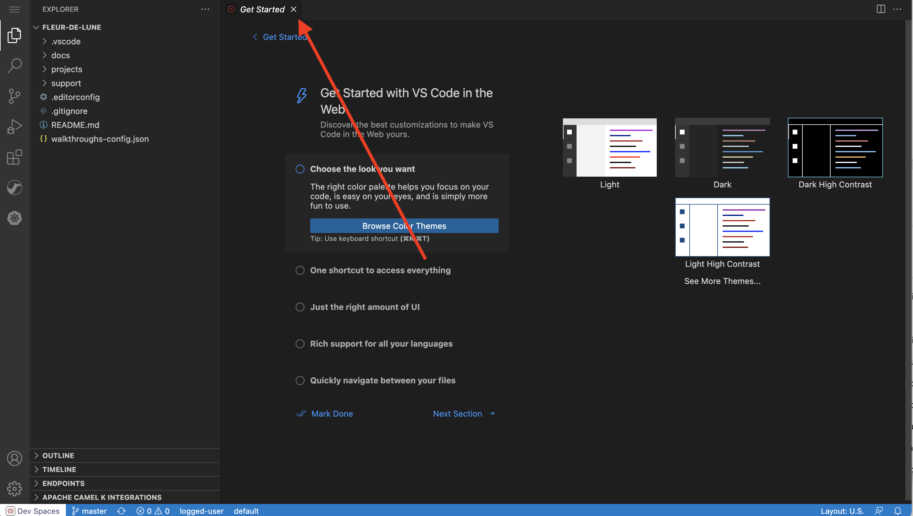

:walkthrough: Event Driven Architecture
:next-lab-url: https://tutorial-web-app-webapp.{openshift-app-host}/tutorial/dayinthelife-streaming.git-citizen-integrator-track-lab01/
:codeready-url: http://che-che.{openshift-app-host}/
:user-password: openshift

ifdef::env-github[]
:next-lab-url: ../lab02/walkthrough.adoc
endif::[]

[id='event-driven-architecture']
= Lab 1 - Event Driven Architecture

Since the acquisition, the International Inc.’s Development team has been pressured to make the transition smooth quickly. They have decided to start with a small notification project where it notifies both internal departments and external partners when an order has been placed. In this lab you will learn how to use Camel K to establish a simple Event Driven call. The old application uses traditional API calls to trigger system modification, your job is to use Camel K to re-write the notification application rather then using pure REST implementation convert it to event driven architecture.

Audience: Enterprise Integrators, System Architects, Developers, Data Integrators

*Overview*

Camel K is a lightweight cloud integration platform based on the Apache Camel framework. It runs natively on Kubernetes and Openshift and it’s specifically designed for serverless and microservice architectures.

AMQ online enable developers to provision messaging when and where they need it through a browser console. The AMQ online component is built on the foundation of Red Hat OpenShift, a container platform for high scalability and availability of cloud-native applications.

*Why Red Hat?*

To respond to business demands quickly and efficiently, you need a way to integrate applications and data spread across your enterprise. Red Hat® AMQ—based on open source communities like Apache ActiveMQ and Apache Kafka—is a flexible messaging platform that delivers information reliably, enabling real-time integration and connecting the Internet of Things (IoT).

AMQ streams component makes Apache Kafka “OpenShift native” through the use of powerful operators that simplify the deployment, configuration, management, and use of Apache Kafka on OpenShift.

*Skipping The Lab*

*Credentials*

VIDEO INSTRUCTIONS FOR REFERENCE 
https://drive.google.com/file/d/1N9iDwWWJGlWKitTtuihDZDfnae3kjO5h/view?usp=sharing

[type=walkthroughResource,serviceName=amqonline]
.Red Hat CodeReady Workspaces
****
* link:{codeready-url}[Console, window="_blank", , id="resources-codeready-url"]
****

:sectnums:

[time=5]
[id="Getting Ready"]
== Getting ready for the labs

You will be using Red Hat CodeReady Workspaces, an online integrated development environment (IDE) based on link:https://www.eclipse.org/che/[Eclipse Che, window="_blank"]. Changes to files are *auto-saved* every few seconds, so you don't need to explicitly save changes.

. To get started go to the link:{codeready-url}[codeready console, window="_blank"] and log in using your username and password credentials.
+
image::images/openshift-login.png[OpenShift Login, role="integr8ly-img-responsive"]

. You will need to _Authorize Access_ to CodeReady to access your permissions and being able to mananage your session. Click on *Allow selected permissions*.
+
image::images/authorize-codeready.png[Authorize Access, role="integr8ly-img-responsive"]

=== Start CodeReady workspace

. Once you have logged in and authorize access to your user account, you will land in your personal CodeReady dashboard. A new workspace should be ready to use. Click on the workspace with the _green_ circle on the left menu bar under *RECENT WORKSPACES*.
+
image::images/codeready-dashboard.png[CodeReady Dashboard, role="integr8ly-img-responsive"]
+
[NOTE]
====
You can also click on the name of the workspace in the center, and then click on the green button that says _Open_ on the top right hand side of the screen.
====

. The workspace will start loading and, the first time, it will git clone the required projects for this workshop. After a minute or two, you’ll be placed in the workspace. Close the welcome screen and click on the Explorer button on the left side bar.
+

+
This IDE is based on Eclipse Che, which is in turn is based on MicroSoft VS Code editor. It will look familiar if you have already used it.

. The projects explorer will show you the *FleurDeLune* folder with the required projects. Expand the folders to reveal the projects we clone from the git repository.
+
TODO UPDATE SCREENSHOT
+
image::images/codeready-projects.png[Workshop projects, role="integr8ly-img-responsive"]

. During the workshop we will need to introduce some commands in the OpenShift and the Camel K Command Line Interfaces (CLI). For that we will need to start a terminal window _inside_ one of the containares from the developer workspace. To open the terminal window click on the _My Workspace_ button on the right side panel and expand the `User Runtimes/tools` folder. Click on *>_ New terminal*.
+
image::images/codeready-new-terminal.png[Open Terminal, role="integr8ly-img-responsive"]

. This will deploy the terminal window in the bottom of the screen. This terminal is attached to the running CodeReady container and so, running on OpenShift. This is the place where you will issue most of the commands from this workshop.
+
image::images/codeready-terminal.png[CodeReady Terminal, role="integr8ly-img-responsive"]

=== Login into the OpenShift cluster

. Finally, you will need to login into the OpenShift CLI to start interacting with the platform. For login issue the following command:
+
[source,bash,subs="attributes+"]
----
oc login -u {user-username} -p {user-password} https://$KUBERNETES_SERVICE_HOST:$KUBERNETES_SERVICE_PORT --insecure-skip-tls-verify=true
----
+
You should see something like the following (the project names may be different):
+
[source,bash,subs="attributes+"]
----
Login successful.

You have access to the following projects and can switch between them with 'oc project <projectname>':

  * shared-db-earth
    shared-kafka-earth
    user1
    user1-che
    user1-dayinthel-0605
    user1-shared-475f

Using project "shared-db-earth".
Welcome! See 'oc help' to get started.
----

Now you are ready to start working on the application services.

[time=5]
[id="Deploy Inventory Service"]
== Deploy Inventory Service

The _Inventory Service_ handles the order and provides information about the availability. In this case, we will just generate an inventory idenfitier and process the result back. Take a look on how the implementation is using *Quarkus* as a Java runtime. 

=== Review the code

. Go to _Explorer:/projects_ in CodeReady Workspaces web IDE and expand the *inventory* folder.
+
image::images/codeready-inventory.png[Inventory Service, role="integr8ly-img-responsive"]
+
Inventory service implements a simple _RESTful API_ using *Quarkus*. 

. Open the `InventoryResource.java` file under `src/main/java/com/redhat/cloudnative` and check the provided code.
+
image::images/inventory-resource.png[InventoryResource.java, role="integr8ly-img-responsive"]
+
The REST service defines a simple _POST_ endpoint `/notify/order` to receive the `Order` notifications as JSON. This service calls the `InventoryNotification` service.

. Open the `InventoryNotification.java` file under `src/main/java/com/redhat/cloudnative` and check the provided code.
+
image::images/inventory-notification.png[InventoryNotification.java, role="integr8ly-img-responsive"]
+
As we mentioned before, it just creates an InventoryNotification with a random `InventoryId` and adds the current _timestamp_.

=== Deploy locally to CodeReady

. Run the inventory application locally using the `maven plugin command` via CodeReady Workspaces Terminal:
+
[source,bash,subs="attributes+"]
----
mvn clean compile quarkus:dev -f $CHE_PROJECTS_ROOT/FleurDeLune/projects/inventory/
----

. Look at the output, it is just maven downloading dependencies that should end like the following:
+
[source,bash,subs="attributes+"]
----
...
Listening for transport dt_socket at address: 5005
2020-03-18 17:33:14,290 INFO  [io.quarkus] (main) inventory 1.0.0-SNAPSHOT (running on Quarkus 1.2.1.Final) started in 1.981s. Listening on: http://0.0.0.0:8080
2020-03-18 17:33:14,294 INFO  [io.quarkus] (main) Profile dev activated. Live Coding activated.
2020-03-18 17:33:14,294 INFO  [io.quarkus] (main) Installed features: [cdi, resteasy, resteasy-jackson]
----

. CodeReady should detect you are running your Quarkus application and is opening the `8080` port. Click on the *Open Link* button to open the CodeReady embedded browser.
+
image::images/inventory-mvn-local.png[Maven Command Local, role="integr8ly-img-responsive"]
+
[NOTE]
====
Dismiss other dialogs that might showup by clicking in the _close_ button on the top right.
====

. Take a look at the _Inventory_ page on the left side. 
+
image::images/inventory-web.png[Inventory Web, role="integr8ly-img-responsive"]
+
This is a default provisioned page from Quarkus. You don't need to worry about this since we will only use the REST API.

. As we are running our service in the current CodeReady Terminal, open a new terminal window from the commands menu on the right side
+
image::images/codeready-new-terminal.png[New Terminal, role="integr8ly-img-responsive"]

. Test the local deployment issuing the following command in the new CodeReady Terminal:
+
[source,bash,subs="attributes+"]
----
curl -s -X POST \
  http://localhost:8080/notify/order \
  -H 'cache-control: no-cache' \
  -H 'content-type: application/json' \
  -d  \
  '{
    "orderId": 978,
    "itemId": 135790,
    "orderItemName": "Mango",
    "quantity": 1,
    "price": 2.50,
    "address": "hello",
    "zipCode": "15555"
  }'
----

. Check the result, you should get someething similar to the following output:
+
[source,bash,subs="attributes+"]
----
{"orderId":978,"itemId":135790,"quantity":1,"department":"inventory","datetime":1584
554071289,"flavor":"Mango","inventoryId":"939699"}
----

. Be sure to terminate the running Quarkus development via kbd:[CTRL+C] (or kbd:[Command+C] on Mac OS).

=== Deploy to OpenShift

. Now that we have seen that the service works, let's deploy the application to OpenShift. Package the application by running the following maven plugin in the CodeReady Workspaces terminal:
+
[source,bash,subs="attributes+"]
----
mvn clean compile package -DskipTests -f $CHE_PROJECTS_ROOT/FleurDeLune/projects/inventory/
----

. Be sure to switch to your working OpenShift project by issuing the following command using the OpenShift CLI:
+
[source,bash,subs="attributes+"]
----
oc project {user-username}
----
+ 
You should get the following output:
+
[source,bash,subs="attributes+"]
----
Now using project "{user-username}" on server "https://172.30.0.1:443".
----

. Create a _Build Configuration_ for your application using the OpenJDK base container image:
+
[source,bash,subs="attributes+"]
----
oc new-build registry.access.redhat.com/redhat-openjdk-18/openjdk18-openshift:1.5 --binary --name=inventory -l app=inventory -n {user-username}
----
+
[NOTE]
====
This build uses the new link:https://access.redhat.com/documentation/en-us/red_hat_jboss_middleware_for_openshift/3/html/red_hat_java_s2i_for_openshift/index[Red Hat OpenJDK Container Image], providing foundational software needed to run Java applications, while staying at a reasonable size.
====

. Start and watch the build, which will take about minutes to complete:
+
[source,bash,subs="attributes+"]
----
oc start-build inventory --from-file $CHE_PROJECTS_ROOT/FleurDeLune/projects/inventory/target/*-runner.jar --follow -n {user-username}
----
+
You should get a `Push succesful` line at the end
+
[source,bash,subs="attributes+"]
----
...
Writing manifest to image destination
Storing signatures
Successfully pushed image-registry.openshift-image-registry.svc:5000/user1/inventory@sha256:a42968c6de63853c87331626f4df02842fddca3c1282aa3a04426b668e348280
Push successful
----

. Once the build is done, deploy the service as an OpenShift application with the CLI:
+
[source,bash,subs="attributes+"]
----
oc new-app inventory; oc expose svc/inventory
----

=== Check the OpenShift Developer Console

. Open the OpenShift Developer Console link:{openshift-host}/topology/ns/{user-username}[Topology View, window=_blank], make sure it's done deploying by waiting for the dark blue circles around the OpenShift logo: 
+
image::images/topology-inventory.png[Topology Inventory, role="integr8ly-img-responsive"]

. Click on *Open URL* icon in the top right side of the `inventory` deployment to open access the service webpage.
+
image::images/inventory-webpage.png[Inventory Web Page, role="integr8ly-img-responsive"]
+
This time the inventory page has its own URL that is publicy accessible outside OpenShift.

. So now Inventory service is deployed to OpenShift. You can see it in the Project Status in the OpenShift Console that it is a single replica running in 1 pod.

[time=25]
[id="Deploy Invoice Service"]
== Deploy Invoice Service

The second element of the architecture is the _Invoice Service_ that handles the payments. In this case, the service is also implemented using *Quarkus* Java framework, the only difference with _Inventory Service_ is that we add a few seconds delay to _mimic_ the time a real payment will have to wait for processing a card payment. Take a look on how the implementation is using *Quarkus* as a Java runtime. 

=== Review the code

. Go to _Explorer:/projects_ in CodeReady Workspaces web IDE and expand the *invoice* folder.
+
image::images/codeready-invoice.png[Invoice Service, role="integr8ly-img-responsive"]

. Open the `InvoiceResource.java` file under `src/main/java/com/redhat/cloudnative` and check the provided code.
+
image::images/invoice-resource.png[InvoiceResource.java, role="integr8ly-img-responsive"]

The REST service defines a simple _POST_ endpoint `/notify/order` as we did with _Inventory_ to receive the `Order` notifications as JSON.  This service calls the `processOrder` method after a `30` seconds delay. As we mentioned before, it just creates a JSON Object with a random `InvoiceId` and adds the current _timestamp_.

=== Deploy to OpenShift

. Package the application by running the following maven plugin in the CodeReady Workspaces terminal:
+
[source,bash,subs="attributes+"]
----
mvn clean compile package -DskipTests -f $CHE_PROJECTS_ROOT/FleurDeLune/projects/invoice/
----
+
[NOTE]
====
For the following commands remember to be sure to switch to your _working_ project.
====

. Create a _Build Configuration_ for your application using the OpenJDK base container image:
+
[source,bash,subs="attributes+"]
----
oc new-build registry.access.redhat.com/redhat-openjdk-18/openjdk18-openshift:1.5 --binary --name=invoice -l app=invoice -n {user-username}
----

. Start and watch the build, which will take about minutes to complete:
+
[source,bash,subs="attributes+"]
----
oc start-build invoice --from-file $CHE_PROJECTS_ROOT/FleurDeLune/projects/invoice/target/*-runner.jar --follow -n {user-username}
----

. Deploy the service as an OpenShift application with the CLI:
+
[source,bash,subs="attributes+"]
----
oc new-app invoice; oc expose svc/invoice
----

=== Check the OpenShift Developer Console

. Open the OpenShift Developer Console link:{openshift-host}/topology/ns/{user-username}[Topology View, window=_blank], make sure it's done deploying by waiting for the dark blue circles around the OpenShift logo: 
+
image::images/topology-invoice.png[Topology Invoice, role="integr8ly-img-responsive"]

. Review the succesful deployment by clicking on the *Open URL* icon on the deployment.

[time=25]
[id="Deploy Order Service"]
== Deploy Order Service

The thrid element of the architecture is the _Order Service_ that works as the first point of access from the frontend and redirects the order to the rest of the backend services. In this case, the service is implemented using *Spring Boot* Java framework. In this theorical implementation we are showing of common microservices pattern that is the service chaining.  

=== Review the code

. Go to _Explorer:/projects_ in CodeReady Workspaces web IDE and expand the *order* folder.
+
image::images/codeready-order.png[Order Service, role="integr8ly-img-responsive"]

. Open the `OrderServiceController.java` file under `src/main/java/com/legacy/ordersservice` and check the provided code.
+
image::images/order-controller.png[OrderServiceController.java, role="integr8ly-img-responsive"]
+
You can see a traditional Spring Boot REST Controller with one endpoint receiveing JSON _POST_ calls to the `/place` path.

. Open the `OrdersRepository.java` file under `src/main/java/com/legacy/ordersservice` and check the provided code.
+
image::images/order-repository.png[OrderRepository.java, role="integr8ly-img-responsive"]
+
[NOTE]
====
As we mentioned before, this service is calling the _Inventory_ and the _Invoice_ service using a `RestTemplate` *one after another*. We will see what this means for the user later in this lab.
====

=== Deploy to OpenShift

. Package the application by running the following maven plugin in the CodeReady Workspaces terminal:
+
[source,bash,subs="attributes+"]
----
mvn clean compile package -DskipTests -f $CHE_PROJECTS_ROOT/FleurDeLune/projects/order/
----
+
[NOTE]
====
For the following commands remember to be sure to switch to your _working_ project.
====

. Create a _Build Configuration_ for your application using the OpenJDK base container image:
+
[source,bash,subs="attributes+"]
----
oc new-build registry.access.redhat.com/redhat-openjdk-18/openjdk18-openshift:1.5 --binary --name=order -l app=order -n {user-username}
----

. Start and watch the build, which will take about minutes to complete:
+
[source,bash,subs="attributes+"]
----
oc start-build order --from-file $CHE_PROJECTS_ROOT/FleurDeLune/projects/order/target/*.jar --follow -n {user-username}
----

. Deploy the service as an OpenShift application with the CLI:
+
[source,bash,subs="attributes+"]
----
oc new-app order; oc expose svc/order
----

=== Check the OpenShift Developer Console

. Open the OpenShift Developer Console link:{openshift-host}/topology/ns/{user-username}[Topology View, window=_blank], make sure it's done deploying by waiting for the dark blue circles around the OpenShift logo: 
+
image::images/topology-order.png[Topology Order, role="integr8ly-img-responsive"]

. Review the succesful deployment by clicking on the *Open URL* icon on the deployment.

. You should get the OpenAPI description from the service:
+
[source,bash,subs="attributes+"]
----
{"openapi":"3.0.1","info":{"title":"OpenAPI definition","version":"v0"},"servers":[{"url":"http://order-user1.apps.cluster-eventing-6fbb.eventing-6fbb.example.opentlc.com","description":"Generated server url"}],"paths":{"/place":{"post":{"tags":["orders-service-controller"],"operationId":"place","requestBody":{"content":{"application/json":{"schema":{"$ref":"#/components/schemas/Order"}}}},"responses":{"200":{"description":"default response","content":{"application/json":{"schema":{"type":"string"}}}}}}}},"components":{"schemas":{"Order":{"type":"object","properties":{"orderId":{"type":"integer","format":"int32"},"itemId":{"type":"integer","format":"int32"},"orderItemName":{"type":"string"},"quantity":{"type":"integer","format":"int32"},"price":{"type":"integer","format":"int32"},"address":{"type":"string"},"zipCode":{"type":"integer","format":"int32"},"datetime":{"type":"string"},"department":{"type":"string"}}}}}}
----

The backend services are ready, now time to deploy the frontend store UI.

[time=10]
[id="Deploy Webapp"]
== Deploy Frontend Application

The last element of the architecture is the _Store App_ this is a normal *NodeJS* runtime application. Is a frontend store page to take the orders from regular customers. It post all the orders to the backend `Order Service` and while showing a _loading_ dialog until it receives the order outcome.

=== Deploy to OpenShift

. Change to the project folder:
+
[source,bash,subs="attributes+"]
----
cd $CHE_PROJECTS_ROOT/FleurDeLune/projects/store-ui/
----
+
[NOTE]
====
For the following commands remember to be sure to switch to your _working_ project.
====

. Package and deploy the application using link:https://github.com/nodeshift/nodeshift#nodeshift-[nodeshift]:
+
[source,bash,subs="attributes+"]
----
npm install --save-dev nodeshift; npm run openshift
----

. Expose the Service as an external route:
+
[source,bash,subs="attributes+"]
----
oc expose svc/www-store
----

. Configure the route time out and tell the gateway this is a long running transaction:
+
[source,bash,subs="attributes+"]
----
oc annotate route www-store --overwrite haproxy.router.openshift.io/timeout=3m
----

=== Check the OpenShift Developer Console

. Open the OpenShift Developer Console link:{openshift-host}/topology/ns/{user-username}[Topology View, window=_blank], make sure it's done deploying by waiting for the dark blue circles around the OpenShift logo: 
+
image::images/topology-store.png[Topology Store, role="integr8ly-img-responsive"]

. Review the succesful deployment by clicking on the *Open URL* icon on the deployment. You should access the online store!
+
image::images/www-store.png[Store Web Page, role="integr8ly-img-responsive"]

[time=10]
[id="Test Webapp"]
== Test the application

We are ready to test our application. We will order some REST flavors and check how the application behaves in case of failure.

=== Order Mango

. With the open application, click on *PLACE ORDER!*
+
image::images/store-place-order.png[Place order, role="integr8ly-img-responsive"]

. This are our ol' time REST Classic flavors. Click on *Order Mango*,
+
image::images/order-mango.png[Order Mango, role="integr8ly-img-responsive"]

. Wait for the transaction to finish. Remember we will need to wait for at least 30 seconds for the payment to be processed.
+
image::images/processing-order.png[Processing Order, role="integr8ly-img-responsive"]

. After a few moments you will be presented with an *Order Success* screen with the details of your transaction. Click on the *Close* button to dismiss this dialog
+
image::images/order-success.png[Order Success, role="integr8ly-img-responsive"]

Congratulations! Your _Mango_ order was sucessful! Everything is fine and sunshise is everywhere. 

=== Take down that service

The application is working correctly, but what happens when a service _fails_? 

. Get back to the OpenShift Developer Console link:{openshift-host}/topology/ns/{user-username}[Topology View, window=_blank]

. Click on the *inventory* service deployment. 
+
image::images/topology-inventory-deployment.png[Inventory Deployment, role="integr8ly-img-responsive"]
+
A side bar will open with an overview of your service resources.

. Click on the *Overview* tab to check the deployment generals. Then click in the _down_ arrow to scale down the deployment replicas to zero. 
+
image::images/scale-down-inventory.png[Scale Down Inventory, role="integr8ly-img-responsive"]
+
This will simulate the _shortage_ of the inventory service. Wait a few seconds for the pod to be deleted.

. Check that the deployment ring is *white* instead of the normal _dark blue_
+
image::images/scaled-zero.png[Scaled To Zero, role="integr8ly-img-responsive"]

. Get back to the web application page and try again to order some *Mango* flavor. What happened? 
+
image::images/couldnot-process.png[Could Not Process Error, role="integr8ly-img-responsive"]
+
[NOTE]
====
The service was not able to fulfill the order was the inventory service was out, we even had to wait some time to get the response back because of timeouts.
====

. Dismiss the error dialog and get back to the OpenShift Developer Console link:{openshift-host}/topology/ns/{user-username}[Topology View, window=_blank]

. Scale back up the service and wait for the pod to come up.
+
image::images/scale-up-inventory.png[Scale Inventory Up, role="integr8ly-img-responsive"]

. Get back to the web application page and try *again*.

Your order should be back again!

[time=10]
[id="Create AMQ Topics"]
=== Create your AMQ Online Topic 

==== Create an Address Space

Let's create an **Address Space** using the AMQ Online Operator. 

. Get back to your OpenShift Developer Console.

. Click *+Add* on the left menu.
+
image::images/openshift-add.png[OpenShift +Add, role="integr8ly-img-responsive"]

. Click on the *From Catalog* option.
+

. Type in `address` in the search box, and click on the *AddressSpace*:
+
image::images/catalog-addressspace.png[AddressSpace, role="integr8ly-img-responsive"]

. Click on *Create*:
+
image::images/online-create.png[Create AddressSpace, role="integr8ly-img-responsive"]

. Replace the content in the YAML editor with the following content:
+
[source,yaml,role="copypaste"]
----
apiVersion: enmasse.io/v1beta1
kind: AddressSpace
metadata:
  name: amq
spec:
  plan: standard-small
  type: standard
  endpoints:
    - name: messaging
      service: messaging
      expose:
        type: route
        routeServicePort: amqps
        routeTlsTermination: passthrough
      exports:
        - kind: ConfigMap
          name: amq-config
  authenticationService:
    name: none-authservice
----

. Click on *Create* to start the deployment
+
image::images/addressspace-detail.png[AddressSpace Definition, role="integr8ly-img-responsive"]

. The AMQ operator will check the new resource and will begin to prepare all required components. Wait for the *Address Space* to deploy the infrastructure until the status change _Active_. 
+
[NOTE]
====
This could take a few minutes to finish, if looks like taking longer refresh the page.
====

. Click in the *amq* link to show the Overview Page.
+
image::images/addressspace-active.png[active, role="integr8ly-img-responsive"]

. Click in the _YAML_ tab to enable the editor and scroll all the way down to the _Status_ sections to retrieve the console *externalHost* hostname value. This is the access to the webconsole to admin your events infrastructure.
+
image::images/addressspace-console.png[console, role="integr8ly-img-responsive"]

. Open a new browser tab and use the hostname like this format *https://{{ externalHost }}* to open the AMQ web console. You will need to login with your username and password. 
+
[NOTE]
====
Note the use of _HTTPS_. You will need to enter your OpenShift console credentials again.
====

. In the main AMQ web console screen, click on the *+ Create* button to start adding the required topics.
+
image::images/topic-create.png[newtopic, role="integr8ly-img-responsive"]

. Fill in the name with *incomingorders* and select the _topic_ type. Click *Next >* to move to the next screen.
+
image::images/topic-name.png[topicname, role="integr8ly-img-responsive"]

. Keep the *Small Topic* plan selected and click *Next >*. 
+
image::images/topic-plan.png[topicplan, role="integr8ly-img-responsive"]

. Finally click *Create* to submit the topic creation.
+
image::images/topic-summary.png[topicsummary, role="integr8ly-img-responsive"]

. AMQ will start the deployment of the required messaging infrastructure to privision your topic.
+
image::images/topic-deploying.png[topicdeploying, role="integr8ly-img-responsive"]

. Next, repeat the last couple steps to provision the second topic. Create the `notifications` topic with the same type and plan than the _incomingorders_ topic. 
+
image::images/topics.png[topics, role="integr8ly-img-responsive"]
+
[NOTE]
====
A green check mark will show that the resources were successfully deployed.
====

*Well done!* You now have a running AMQ with two topics called `incomingorders` and `notifications`.

[time=30]
[id="Fuse Online Services"]
== Develop Fuse Online Services

[time=10]
[id="Develop Events Service"]
== Develop the Events Service

For the new Event-driven store application, we will need to receive the updates on the notifications in near-realtime. For this, we will need to connect to a link:https://en.wikipedia.org/wiki/Server-sent_events[Server-Sent Events] service.

=== Review the code

. Go to the _Explorer:/projects_ in CodeReady Workspaces web IDE and expand the *events* folder.
+

+
Inventory service implements _Server-Side Events_ (SSE) using *Quarkus* and link:https://smallrye.io/smallrye-reactive-messaging/[SmallRye Reactive Messaging]. 

. Open the `EventsResource.java` file under `src/main/java/com/redhat/eventdriven` and check the provided code.
+

+
This will be the base we will use to build our service.

. First we need to _Inject_ a *Channel* that will be mapped to the `notifications` topic. Add the following code below the `/* TODO add notifications Channel */` marker:
+
[source,java,subs="attributes+"]
----
    @Inject
    @Channel("notifications")
    Flowable<String> notifications;
----

. Now we need to add the `/consume` Path to receive the SSE requests. Add the following code below the `/* TODO add consume Path */` marker:
+
[source,java,subs="attributes+"]
----
    @GET
    @Path("/consume")
    @Produces(MediaType.SERVER_SENT_EVENTS)
    public Publisher<String> sendEvents() {
        // Stream notifications as Server-Side Events
        return notifications.map(x -> { 
            log.info(x); 
            return x; 
        });
    }
----
+
[NOTE]
====
Notice that the return type of the method is a *Publisher* and the _MediaType_ is *SERVER_SENT_EVENTS. This will enable an estable connection from the browser.
====

. Most of the configuration is located in a properties file where we can add the MicroProfile connection settings for the message broker. Open `application.properties` file in `src/main/resources/` and add the following configuration:
+
[source,java,subs="attributes+"]
----
# HTTP config
quarkus.http.cors=true

# Incoming stream
mp.messaging.incoming.notifications.connector=smallrye-amqp
mp.messaging.incoming.notifications.durable=false
----
+
The first line is just enabling link:https://en.wikipedia.org/wiki/Cross-origin_resource_sharing[Cross-Origin Resource Sharing] (CORS) for this service. Following is the MicroProfile configuration to use the `smallrye-amqp` component.

=== Deploy to OpenShift

. Package the application by running the following maven plugin in the CodeReady Workspaces terminal:
+
[source,bash,subs="attributes+"]
----
mvn clean compile package -DskipTests -f $CHE_PROJECTS_ROOT/FleurDeLune/projects/events/
----
+
[NOTE]
====
For the following commands remember to be sure to switch to your _working_ project.
====

. Create a _Build Configuration_ for your application using the OpenJDK base container image:
+
[source,bash,subs="attributes+"]
----
oc new-build registry.access.redhat.com/redhat-openjdk-18/openjdk18-openshift:1.5 --binary --name=events -l app=events -n {user-username}
----

. Start and watch the build, which will take about minutes to complete:
+
[source,bash,subs="attributes+"]
----
oc start-build events --from-file $CHE_PROJECTS_ROOT/FleurDeLune/projects/events/target/*-runner.jar --follow -n {user-username}
----

. Deploy the service as an OpenShift application with the CLI:
+
[source,bash,subs="attributes+"]
----
oc new-app events; oc expose svc/events
----

. To follow the external config practice of 12 factor applications we will inject the messaging endpoint `hostname` and `port` using the ConfigMap created by our _AddressSpace_ configuration.
+
[source,sh,role="copypaste"]
----
oc patch dc/events -p '{ "spec": { "template": { "spec": { "containers": [ { "name": "events", "env": [ { "name": "AMQP_HOST", "valueFrom": { "configMapKeyRef": { "name": "amq-config", "key": "service.host" } } }, { "name": "AMQP_PORT", "valueFrom": { "configMapKeyRef": { "name": "amq-config", "key": "service.port.amqp" } } } ] } ] } } } }' 
----

=== Check the OpenShift Developer Console

. Open the OpenShift Developer Console link:{openshift-host}/topology/ns/{user-username}[Topology View, window=_blank], make sure it's done deploying by waiting for the dark blue circles around the OpenShift logo: 
+
image::images/topology-events.png[Topology Events, role="integr8ly-img-responsive"]

. Review the succesful deployment by clicking on the *Open URL* icon on the deployment.

[time=10]
[id="Update Frontend"]
== Update Frontend for Event-driven

##########

+
image::images/inventory-web.png[Inventory Web, role="integr8ly-img-responsive"]
+
[source,bash,subs="attributes+"]
----
oc new-app inventory
----

. Go to link:{codeready-url}[codeready console, window="_blank"]
  login with your ID and PWD {user-username}/{user-password}
. Go to the factories on the top left, choose dilii, it will take you to the factory setting page.
. Click on OPEN on the top right. 
. Wait for the workspace to start
. Click on the manage command on the top, run the following in orders
	1. Download Kamel Binary
	2. Unzip Kamel
	3. Setup apicall
	4. Setup eventdriven
. Close all commends, and go back to project explorer. 

=== Intall your Camel K Operator

. Go to OpenShift Console
. To your user project, user%d
. Go to the Installed Operators and click on Camel K Operator
. Click on the Integration Platform
. Create Integration Platform by clicking on the button, and save
. 

[time=10]
=== Update the Store frontend UI

==== Add the new Async flavors to the UI

. Navigate to the `store-ui` project and open the *product.handlebars* file under `views/`.
+
image::images/store-ui-project.png[Store UI Project, role="integr8ly-img-responsive"]

. Look for line *12* and paste the following code between the `/* TODO: INSERT HERE NEW FLAVORS */` markers:
+
[source,bash,subs="attributes+"]
----
    <ul>
      <li>
        <h1>New Async Special</h1>
        
This website template has been designed by freewebsitetemplates.com for you, for free.

      </li>
      <li>
        
        

          <button onclick="placeOrder('blackberry', 'event')">Order Blackberry &nbsp;<i class="fas fa-cart-plus"></i></button>
        

      </li>
      <li>
        
        

          <button onclick="placeOrder('strawberry', 'event')">Order Strawberry &nbsp;<i class="fas fa-cart-plus"></i></button>
        

      </li>
      <li>
        
        

          <button onclick="placeOrder('blueberry', 'event')">Order Blueberry &nbsp;<i class="fas fa-cart-plus"></i></button>
        

      </li>
    </ul>
----

. Scroll all the way down to line *288* and paste the next lines between `/* TODO: PROCESSS EVENT RESPONSE */`:
+
[source,bash,subs="attributes+"]
----
              else {
                new Noty({
                  layout: 'center',
                  type: 'info',
                  text: json.message
                }).show();
              }
----

. Next, open the *events.handlebars* under `views/partials` and paste the following code between the `/* TODO: START SSE SOURCE & PROCESS INCOMING MESSAGES */` markers:
+
[source,bash,subs="attributes+"]
----
        constructor() {
            this.source = new EventSource("//events-{user-username}.{openshift-app-host}:8080/consume");
            this.source.onopen = (e) => console.log(e);
            this.source.onmessage = ({ data }) => this.updateDoc(data);
        }
        updateDoc(data) {
            console.log("received data= " + data);
            var event = JSON.parse(data);
            if (event.department === 'inventory') {
                new Noty({
                    type: 'info',
                    text: 'Your ' + event.flavor + ' order was successfully processed!'
                }).show();
            }
            if (event.department === 'invoicing') {
                new Noty({
                    type: 'reply',
                    text: 'Your payment of $' + event.amount + ' ' + event.currency + ' is confirmed!'
                }).show();
            }
        }
----

. Finally, get back to the terminal window and start a new build with this changes.
+
[source,bash,subs="attributes+"]
----
npm run openshift
----

[time=10]
=== Create your topic 

==== Setup AMQ Online namespace
. Go to 
 link:https://console-workshop-operators.{openshift-app-host}/[AMQ Online console, window="_blank"]
 and login with your ID and PWD

. Create your AMQ namespace instance 
 - Namespace: {user-username}
 - Name: {user-username}
 - Type: Standard
 - Address Space Plan: standard-small
 - Authentication Service: standard-authentication

==== Create an Topic
. Click on the namespace you just created in the conole, it will take you to your online console.
. Login with your openshift credential. 
. Create a new topic by click on create button on the top
	- Name: incomingorders
	- Type: Topic
. Select Small Topic as plan
. And done

==== Setting authentication and authorization for your topic
. Create your message user to authenticate
. Go to your Openshift console, in your namespace, click on "Installed Operators" on the lefthand side and select AMQ Online
. Find "message user" tab, create new message user
. Update the content, replace the namespace to your {user-username} (your username) and change the authorized address to incomingorders

+
[source,bash,subs="attributes+"]
----
apiVersion: user.enmasse.io/v1beta1
kind: MessagingUser
metadata:
  name: {user-username}.user
  namespace: {user-username}
spec:
  authentication:
    password: ZW5tYXNzZQ==
    type: password
  authorization:
    - addresses:
        - incomingorders
      operations:
        - send
        - recv
  username: user
----
. Click create and your topic is ready

[time=20]
[id="Setup Workspace and Camel K"]
== Event Driven Architecture
. Go back to the codeready env. 
. In your workspace, open StreamingLife/eventdriven/OrderService.java by double clicking on it. 
. Update the BROKER_URL with your new addressspace service url.  You can retrieve your new addresspace service URL by executing the following command:

+
[source,bash,subs="attributes+"]
----
oc get addressspace {user-username} -n {user-username} -o jsonpath='{.status.endpointStatuses[?(@.name == "messaging")].serviceHost}'
----

. In the Camel Route, tell camel where to send the info to by inserting following destination code into to("");

+
[source,bash,subs="attributes+"]
----
amqp:topic:incomingorders?exchangePattern=InOnly&subscriptionDurable=false
----

. Open a new Terminal, login to openshift 
+
[source,bash,subs="attributes+"]
----
oc login https://api.cluster-diyii-YOUR_CLUSTER.YOUR_CLUSTER.open.redhat.com:6443
----

. In the same terminal, under StreamingLife/eventdriven/f
exec the following command to run the Orderservice in OpenShift

+
[source,bash,subs="attributes+"]
----
./kamel run --name=order-event-service -d camel-swagger-java -d camel-jackson -d camel-undertow -d camel-ahc-ws -d camel-amqp  OrderService.java
----

. Look at the various CRs in the Operator menu, and when the integration is running, see the API Standard Doc generated automatically using the following URL
+
[source,bash,subs="attributes+"]
----
http://order-service-event-{user-username}.{openshift-app-host}/
----

. Go back to the codeready env, in your workspace, open InventoryService.java
. Update the BROKER_URL with your addressspace service url (same from previous steps)

. In the Camel Route, tell camel where to recv the info to by inserting following destination code into from("");

+
[source,bash,subs="attributes+"]
----
amqp:topic:incomingorders?subscriptionDurable=false
----

. Open a new Terminal, under StreamingLife/eventdriven
  exec the following command to run the Inventory Service in OpenShift
+
[source,bash,subs="attributes+"]
----
./kamel run --name=inventory-service -d camel-jackson -d camel-ahc-ws -d camel-amqp  InventoryService.java
----

. Check the event notification dashboard, go to 
+
[source,bash,subs="attributes+"]
----
http://dilii-ui-{user-username}.{openshift-app-host}/
----

. Send in the order in Terminal
+
[source,bash,subs="attributes+"]
----
curl -X POST \
  http://order-service-event-{user-username}.{openshift-app-host}/place \
  -H 'cache-control: no-cache' \
  -H 'content-type: application/json' \
  -d '{
	"orderId": 1,
	"itemId": 1,
	"orderItemName": "item",
	"quantity": 1,
	"price": 2,
	"address": "hello",
	"zipCode": 2222
}'
----

. Check the result in event notification dashboard, also check your AMQ Online Console for number of msg out. 
+
[source,bash,subs="attributes+"]
----
http://dilii-ui-{user-username}.{openshift-app-host}/
----

. Go back to the codeready env, in your workspace, open SalesService.java
. Update the BROKER_URL with your addressspace service url (same from previous steps)

. Setup your AMQP endpoint configuration in Camel

+
[source,bash,subs="attributes+"]
----
AMQPConnectionDetails amqpDetail = new AMQPConnectionDetails(BROKER_URL,USERNAME,PWD,false);
getContext().getRegistry().bind("amqpDetail",AMQPConnectionDetails.class,amqpDetail);
----

. In the Camel Route, tell camel where to recv the info to by inserting following destination code into from("");

+
[source,bash,subs="attributes+"]
----
amqp:topic:incomingorders?subscriptionDurable=false
----

. In the Camel Route, tell camel where to send the notification to by inserting following destination code into to("");
in our case, we are sending websocket data to our dashboard

+
[source,bash,subs="attributes+"]
----
ahc-ws://dilii-uiws:8181/echo
----

. Open a new Terminal, under StreamingLife/eventdriven
  exec the following command to run the Inventory Service in OpenShift
+
[source,bash,subs="attributes+"]
----
./kamel run --name=sales-service -d camel-jackson -d camel-ahc-ws -d camel-amqp SalesService.java
----

. Check the event notification dashboard, go to 
+
[source,bash,subs="attributes+"]
----
http://dilii-ui-{user-username}.{openshift-app-host}/
----

. Send in the order in Terminal
+
[source,bash,subs="attributes+"]
----
curl -X POST \
  http://order-service-event-{user-username}.{openshift-app-host}/place \
  -H 'cache-control: no-cache' \
  -H 'content-type: application/json' \
  -d '{
	"orderId": 1,
	"itemId": 1,
	"orderItemName": "item",
	"quantity": 1,
	"price": 2,
	"address": "hello",
	"zipCode": 2222
}'
----

. Go back to the codeready env, in your workspace, open ShippingService.java
. Update the BROKER_URL with your addressspace service url (same from previous steps)
. Setup your AMQP endpoint configuration in Camel

+
[source,bash,subs="attributes+"]
----
AMQPConnectionDetails amqpDetail = new AMQPConnectionDetails(BROKER_URL,USERNAME,PWD,false);
getContext().getRegistry().bind("amqpDetail",AMQPConnectionDetails.class,amqpDetail);
----

. Lets create a camel route that recv from the Topic to websocket;

+
[source,bash,subs="attributes+"]
----

from("amqp:topic:incomingorders?subscriptionDurable=false")
            .unmarshal(jacksonDataFormat)
            .bean(SalesNotification.class, "getSalesNotification(${body['orderId']},${body['price']} )")
            .marshal(salesDataFormat)
            .convertBodyTo(String.class)
            .log("Sales Notified ${body}")
            .to("ahc-ws://dilii-uiws:8181/echo")
            ;
----

. Open a new Terminal, under StreamingLife/eventdriven
  exec the following command to run the Inventory Service in OpenShift
+
[source,bash,subs="attributes+"]
----
./kamel run --name=sales-service -d camel-jackson -d camel-ahc-ws -d camel-amqp SalesService.java
----

. Check the event notification dashboard, go to 
+
[source,bash,subs="attributes+"]
----
http://dilii-ui-{user-username}.{openshift-app-host}/
----

. Send in the order in Terminal
+
[source,bash,subs="attributes+"]
----
curl -X POST \
  http://order-service-event-{user-username}.{openshift-app-host}/place \
  -H 'cache-control: no-cache' \
  -H 'content-type: application/json' \
  -d '{
	"orderId": 1,
	"itemId": 1,
	"orderItemName": "item",
	"quantity": 1,
	"price": 2,
	"address": "hello",
	"zipCode": 2222
}'
----

. Check the result in event notification dashboard, also check your AMQ Online Console for number of msg out. 
+
[source,bash,subs="attributes+"]
----
http://dilii-ui-{user-username}.{openshift-app-host}/
----

[time=10]
=== Challenge, add an International Shipping Dep that listens to the same notification and also display the result in the dashboard
With following payload info
. orderId;
. itemId;
. quantity;
. address;

[time=5]
[id="summary"]
== Summary
In this lab you have created cloud native integration services that listen to events using Camel K. And has setup topics for your event driven system. Now your system is decoupled and modularized in a way that is flexible, and reactive. 

You can now proceed to link:{next-lab-url}[Lab 2].

[time=4]
[id="further-reading"]
== Notes and Further Reading

* https://www.redhat.com/en/technologies/jboss-middleware/amq[Red Hat AMQ]
* https://developers.redhat.com/topics/event-driven/connectors/[Camel & Debezium Connectors]
