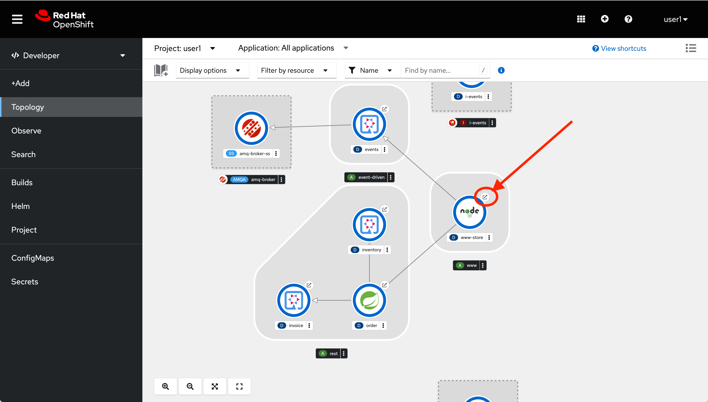
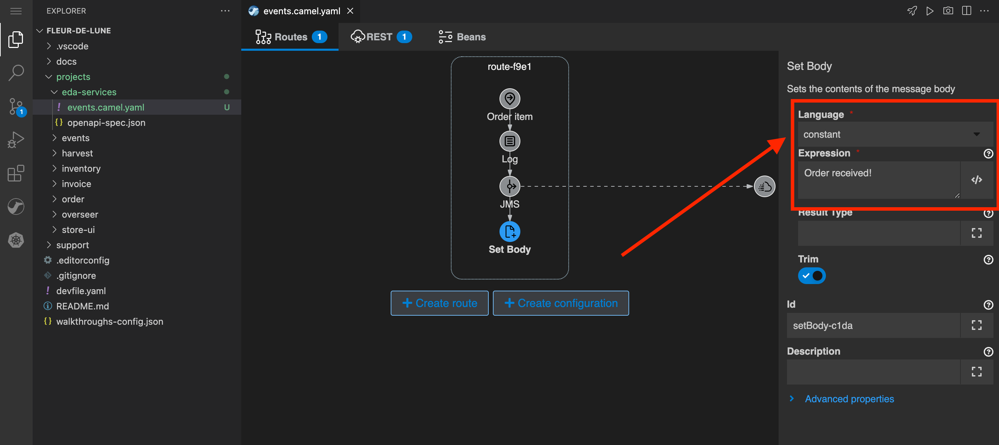

// Attributes
:walkthrough: Event Driven Architecture
:title: Lab 1 - {walkthrough}
:user-password: openshift
:standard-fail-text: Verify that you followed all the steps. If you continue to have issues, contact a workshop assistant.
:namespace: {user-username}

// URLs
:next-lab-url: https://tutorial-web-app-webapp.{openshift-app-host}/tutorial/dayinthelife-streaming.git-labs-02-Change-Data-Capture/
:codeready-url: https://devspaces.{openshift-app-host}/
:fuse-user-url: https://syndesis-fuse-{user-username}.{openshift-app-host}/

ifdef::env-github[]
:next-lab-url: ../02-Change-Data-Capture/walkthrough.adoc
endif::[]

[id='event-driven-architecture']
= {title}

As part of the acquisition, your team at International Inc's is now working with Fleur de Lune's IT department to learn more about Event-Driven Architecture or EDA. By applying event-driven concepts you will help to avoid classic problems derived from coupled synchronous service calls and avoid the need to implement additional infrastructure components.

The first step was to migrate their ecommerce orders website from a legacy SpringBoot stack to the new supersonic subatomic Quarkus-based microservices. However, they have been dealing with a high rate of errors because one of the components is crashing frequently. To overcome this, you will need to create a new event bus using self-service messaging and implement new event-driven services and APIs using a highly productive iPaaS suite. You will then need to wire everything together to showcase to upper management how EDA solves some of the problems that came along pure REST APIs.

*Audience:* Enterprise Integrators, System Architects, Developers, API Designers, Data Integrators

*Overview*

AMQ self-service messaging enables developers to provision messaging when and where they need it via a web-based browser. You will create your own personal space to create events destinations that will be used by your applications with different patterns like queues and topics.

image::images/lab1-overview.png[Overview, role="integr8ly-img-responsive"]

Red Hat Integration includes an integration Platform-as-a-Service (iPaaS) solution that makes it easy for business users to collaborate with integration experts and application developers. It is a full toolchain and runtime, available right from your browser. You will use this tool to design and implement a new API service and to connect with the Event bus provided by AMQ Online.

*Why Red Hat?*

The Red Hat portfolio of middleware products helps you create a unified environment for application development, delivery, integration, and automation. It is comprised of comprehensive frameworks, integration solutions, process automation, runtimes, and programming languages.

To respond to business demands quickly and efficiently, you need a way to integrate applications and data spread across your enterprise. Red Hat AMQ —based on open source communities like Apache ActiveMQ and Apache Kafka— is a flexible messaging platform that delivers information reliably, enabling real-time integration and connecting the Internet of Things (IoT).

AMQ Online is a solution (Operator) to manage multiple components to provide the overall functionality of running self-service (Messaging as a Service) messaging platform on OpenShift. With AMQ online, developers can provision messaging when and where they need it through a browser console. The AMQ online component is built on the foundation of Red Hat OpenShift, a container platform for high scalability and availability of cloud-native applications.

*Credentials*

Use the following credentials to login into the web consoles:

* Your *username* is: `{user-username}`
* Your *password* is: `{user-password}`

[type=walkthroughResource,serviceName=codeready]
.Red Hat OpenShift Dev Spaces
****
* link:{codeready-url}[Console, window="_blank", , id="resources-codeready-url"]
****
[type=walkthroughResource]
.Red Hat OpenShift Developer Console
****
* link:{openshift-host}/topology/ns/{namespace}[Topology View, window="_blank"]
****

:sectnums:

[time=5]
[id="Getting Ready"]
== Getting ready for the labs

[IMPORTANT]
====
Please complete the following instructions to get ready for this lab. *If this is not the first lab you are doing today, and you have already completed this step in any of the previous labs, please skip to next task*.
====

You will be using Red Hat OpenShift Dev Spaces, an online integrated development environment (IDE) based on link:https://www.eclipse.org/che/[Eclipse Che, window="_blank"]. Changes to files are *auto-saved* every few seconds, so you don't need to explicitly save changes.

. To get started go to the link:{codeready-url}[OpenShift Dev Spaces console, window="_blank"] and log in using your username and password credentials.
+
image::images/openshift-login.png[OpenShift DevSpaces Login, role="integr8ly-img-responsive"]

. *If this is your first lab of the day*, you will need to _Authorize Access_ to Dev Spaces to access your permissions and being able to mananage your session. Click on *Allow selected permissions*.
+
image::images/authorize-codeready.png[Authorize Access, role="integr8ly-img-responsive"]

[IMPORTANT]
====
If you have already configured your OpenShift Dev Spaces environment and deployed the services in the _optional_ **Lab A - Cloud Native Applications**, please skip the following steps and scroll down to the end of the page so you can move to *Step 2*.
====

=== Start OpenShift Dev Spaces workspace

. Once you have logged in and authorized access to your user account, you will land in your personal Dev Spaces dashboard.
+
--
A new workspace has been configured with the required tools, plugins and project to start working on this workshop.

Click on the workspace with the name starting with `dayinthelife-workspace` on the left menu bar under *RECENT WORKSPACES*.

image::images/codeready-dashboard.png[CodeReady Dashboard, role="integr8ly-img-responsive"]

[NOTE]
====
You can also click on the link that says _Open_ on the right hand side of the screen.
====
--

. This will start an instance of the workspace. Please wait a few moments while it downloads the required container images and configuration setup.
+
image::images/codeready-loading.png[Loading CodeReady, role="integr8ly-img-responsive"]

. The first time it's run, it will git clone the required projects for this workshop. This will trigger a banner asking to trust the authors. Click in the *Yes, I trust the authors* buttons.
+

. After a minute or two, you’ll be placed in the workspace. Close the initial Get Started tab and any prompt dialog.
+
image::images/codeready-welcome.png[CodeReady Welcome screen, role="integr8ly-img-responsive"]
+
[NOTE]
====
This IDE is based on Microsoft *VS Code* editor. It will look familiar if you have already used it.
====

. The projects explorer will show you the *Fleur-De-Lune* folder with the required projects. Expand the folders to reveal the projects we cloned from the git repository.
+
image::images/codeready-projects.png[Workshop projects, role="integr8ly-img-responsive"]

. During the workshop we will need to introduce commands for both OpenShift and other Command Line Interfaces (CLI) tools. For that we will need to start a terminal window _inside_ one of the containers from the developer workspace. To open the terminal window, click on the _Menu_ hamburger button on the top left side and expand the **Terminal** menu. Click on *New Terminal*.
+

. This will deploy the terminal window in the bottom of the screen. This terminal is attached to the running Dev Spaces container and is also running on OpenShift. This is the place where you will issue most of the commands from this workshop.
+
image::images/codeready-terminal.png[CodeReady Terminal, role="integr8ly-img-responsive"]

=== Login into the OpenShift cluster

. Most of the work will be deploy to your own `{namespace}` project namespace, so be sure to have it as a _working_ project by executing the following command:
+
[source,bash,subs="attributes+"]
----
oc project {namespace}
----

. Now you are ready to start working on the application services.

=== Deploy the synchronous services

. Once you are logged into the OpenShift cluster, you need to deploy the services with the following command:
+
[source,bash,subs="attributes+"]
----
oc apply -n {namespace} -f $PROJECTS_ROOT/fleur-de-lune/support/projects/module-1/eda-dc.yaml
----

. You can check the components were successfully deployed by opening the OpenShift Developer Console link:{openshift-host}/topology/ns/{user-username}[Topology View, window="_blank"]. Don't forget to change the view from *Administrator* to *Developer*.
+
image::images/topology-getting-ready.png[REST Services]

[time=5]
[id="Test Webapp"]
== Review the problematic application

You need to check the problems with the orders web application from Fleur de Lune. In this application, customers select their favorite flavors and place the order online. This application then updates the inventory and processes the payment. The web application is built on NodeJS and the backend service is using the legacy Spring Boot service. The rest of the application components were already migrated to Quarkus.

image::images/lab1-architecture.png[App Architecture, role="integr8ly-img-responsive"]

As we mentioned earlier, the current application has a flaw that is commonly found in synchronous architectures. The backend service is _chaining_ the call to the inventory and the payment services through HTTP calls. This produces the following problems when placing an order:

* First we will need to wait for both services to complete even though they are not related. As the payment service takes longer than the inventory (it needs to process the credit card payment), we have to wait all the way to get inventory feedback too.
* Second, in case of one of the services fail, because there is no correct error handling logic, what we see in the frontend application is that the whole transaction failed and we need to retry again.

image::images/lab1-architecture-fail.png[App Architecture, role="integr8ly-img-responsive"]

We are ready to go over the application to validate the previous statements. We will order some different flavors by calling our RESTful backend services, plus check how the application behaves in case of failure.

=== Check the OpenShift Developer Console

. Open the OpenShift Developer Console link:{openshift-host}/topology/ns/{namespace}[Topology View, window="_blank"], make sure you are in the correct namespace by selecting `{namespace}` from the combobox in the top left:
+
image::images/topology-eda.png[Topology EDA, role="integr8ly-img-responsive"]

. Now that you are in the correct project, click on the *Open URL* icon on the `www-store` deployment.
+

. You should access the online store!
+
image::images/www-store.png[Store Web Page, role="integr8ly-img-responsive"]

=== Order some Mango

. Within the application, click on *PLACE ORDER!*
+
image::images/store-place-order.png[Place order, role="integr8ly-img-responsive"]

. These are our ol' time classic flavors. Click on *Order Mango*,
+
image::images/order-mango.png[Order Mango, role="integr8ly-img-responsive"]

. Wait for the transaction to finish. Remember we will need to wait for at least 30 seconds for the payment to be processed.
+
image::images/processing-order.png[Processing Order, role="integr8ly-img-responsive"]

. After a few moments you will be presented with an *Order Success* screen with the details of your transaction. Click on the *Close* button to dismiss this dialog
+
image::images/order-success.png[Order Success, role="integr8ly-img-responsive"]

Congratulations! Your _Mango_ order was successful! Everything is fine and the sunshine is bright! _But..._

=== Take down that service

The application is working correctly, but what happens when a service _fails_? As we mentioned in the beginning of this lab, there are some problems when one of the services is not available or takes longer than expected to complete. Let's check what happens in that case.

. Go back to the OpenShift Developer Console link:{openshift-host}/topology/ns/{namespace}[Topology View, window="_blank"]

. Click on the *inventory* service deployment.
+
image::images/topology-inventory-deployment.png[Inventory Deployment, role="integr8ly-img-responsive"]
+
A side bar will open with an overview of your service resources.

. Click on the *Details* tab to check the deployment information. Then click in the _down_ arrow to scale down the deployment replicas to zero.
+
image::images/scale-down-inventory.png[Scale Down Inventory, role="integr8ly-img-responsive"]
+
This will simulate the _outage_ of the inventory service. Wait a few seconds for the pod to be deleted.

. Check that the deployment ring is *white* instead of the normal _dark blue_
+
image::images/scaled-zero.png[Scaled To Zero, role="integr8ly-img-responsive"]

. Go back to the web application page and try again to order the *Mango* flavor. What happens?
+
--
image::images/couldnot-process.png[Could Not Process Error, role="integr8ly-img-responsive"]

[NOTE]
====
The service was not able to fulfill the order because the inventory service was offline.  Instead, we  had to wait a little time to get the response back because of the set timeout.
====
--

. Dismiss the error dialog and go back to the OpenShift Developer Console link:{openshift-host}/topology/ns/{namespace}[Topology View, window="_blank"]

. Scale back up the service and wait for the pod to come up.
+
image::images/scale-up-inventory.png[Scale Inventory Up, role="integr8ly-img-responsive"]

. Go back to the web application page and try *again*.
+
Your order should be back again!

[type=verification]
Were you able to successfully scale-down and scale-up your application?

[type=verificationFail]
{standard-fail-text}

[time=15]
[id="Create AMQ Topics"]
== Create your AMQ Broker Topics

In this section of the lab we will move from synchronous HTTP REST calls to event-driven services using an event broker or messaging server.  A broker is an intermediary component in charge of sending and receiving events between distributed systems. It removes technical and runtime coupling between microservices and enables fine-grained scaling.

image::images/lab1-broker.png[Event Broker, role="integr8ly-img-responsive"]

We will use the AMQ Broker operator to create publish/subscribe endpoints to send and receive events. In this way, we can send the order notification to the message bus and then, wait for the inventory and the payment service to return at their time. In the case of one of the services failing, the rest can continue working as none of the calls are blocking.

image::images/lab1-architecture-eda.png[Architecture EDA, role="integr8ly-img-responsive"]

*Red Hat AMQ Broker* operator is an OpenShift-based mechanism for delivering messaging in a declarative way. AMQ Broker is a high-performance messaging implementation based on ActiveMQ Artemis. It uses an asynchronous journal for faster message persistence. AMQ Broker supports multiple languages, protocols, and platforms.

AMQ Broker provides the following features:

- Clustering and high availability options
- Fast, native-IO persistence
- Supports local transactions
- Supports XA transactions when using AMQ Core Protocol JMS and AMQ OpenWire JMS clients
- Written in Java for broad platform support
- Multiple management interfaces: AMQ Management Console, Management APIs, and JMX

=== Create a basic Broker

Let's create a basic **broker** deployment using the AMQ Broker Operator.

. Go back to your OpenShift Developer Console link:{openshift-host}/topology/ns/{namespace}[Topology View, window="_blank"].

. Click *+Add* on the left menu.
+

. Click on the *All services* option under _Development Catalog_.
+
image::images/add-from-catalog.png[OpenShift +Add, role="integr8ly-img-responsive"]

. Type in `broker` in the search box, and click on *AMQ Broker*:
+

. Click on *Create*:
+

. Select *YAML view* and replace the content in the YAML editor with the following content:
+
[source,yaml,subs="attributes+"]
----
apiVersion: broker.amq.io/v1beta1
kind: ActiveMQArtemis
metadata:
  name: amq-broker
  application: amq-broker-app
spec:
  adminPassword: openshift
  adminUser: user
  console:
    expose: true
  deploymentPlan:
    image: placeholder
    size: 1
    requireLogin: false
    persistenceEnabled: true
    journalType: nio
    messageMigration: true
    jolokiaAgentEnabled: false
    managementRBACEnabled: true
  acceptors:
  - name: amqp
    protocols: amqp
    port: 5672
----

. Click on *Create* to start the deployment
+
image::images/broker-detail.png[Broker Definition, role="integr8ly-img-responsive"]

. The AMQ operator will check the new resource and will begin to prepare all required components.

. You will be taken back to the topology view where your broker should now show as part of the current deployments
+

=== Create some Addresses Topics and Queues

Let's create a par of **addresses** that will work as _Topics_ and _Queues_.

. Click *+Add* on the left menu.
+

. Click on the *All services* option under _Development Catalog_.
+
image::images/add-from-catalog.png[OpenShift +Add, role="integr8ly-img-responsive"]

. Type in `address` in the search box, and click on *AMQ Broker Address*:
+

. Click on *Create*:
+

. Select the configure via *Form View* option and type in the following values:
+
- **Name**: `incomingorders`
- **Queue Name**: `incomingorders`
- **Address Name**: `incomingorders`
- **Routing Type**: `multicast`
+

. Scroll all the way down and click the *Create* button.

. Repeat the process but this time create it with the following information:
+
- **Name**: `notifications`
- **Queue Name**: `notifications`
- **Address Name**: `notifications`
- **Routing Type**: `multicast`

// TODO Open AMQ Broker console and check the addresses are created correctly.

*Well done!* You now have a running AMQ with two topics called `incomingorders` and `notifications`.

[type=verification]
Where you able to see the *Broker* deployment in your namespace?

[type=verificationFail]
{standard-fail-text}

[time=30]
[id="camel-services"]
== Develop Apache Camel K Services

*Red Hat build of Apache Camel K* (part of _Red Hat Application Foundations_) is a lightweight integration framework built from link:pass:[https://github.com/apache/camel-k#camel--cloud--apache-camel-k][Apache Camel K, window="_blank"] that runs natively in the cloud on OpenShift. Camel K is specifically designed for serverless and microservice architectures. You can use Camel K to instantly run your integration code written in Camel Domain Specific Language (DSL) directly on OpenShift.

Camel K uses the Kubernetes Operator SDK to automatically deploy integrations in the cloud. For example, this includes automatically creating services and routes on OpenShift. This provides much faster turnaround times when deploying and redeploying integrations in the cloud, such as a few seconds or less instead of minutes.

=== Generate the REST service template

While moving to event driven architecture, we still need the web application to send a REST request to submit new orders. The API team has already provided us with a new OpenAPI 3 document that we will need to implement using Camel K.

1. Navigate to `projects/eda-services` and take a look at the OpenAPI document named `openapi-spec.json`
+

2. Generate the Camel Route using YAML language using the https://github.com/apache/camel-karavan[Apache Camel Karavan, window="_blank"] VS Code Extension by right clicking in the `openapi-spec.json` file and select **Karavan: Generate REST API**.
+

3. Select **Create new Integration** from the options menu.
+

4. Type in `events` for the new integration name and hit 'Enter'.
+

5. Select **Generate REST and routes** from the options menu.
+

+
{blank}
+
This will create a new file in the project called `events.camel.yaml`

6. Get back to the terminal and move the file to the folder where the openapi document is while switching to the folder issuing the following command:
+
[source,bash,subs="attributes+"]
----
mv $PROJECTS_ROOT/fleur-de-lune/events.camel.yaml $PROJECTS_ROOT/fleur-de-lune/projects/eda-services && cd $PROJECTS_ROOT/fleur-de-lune/projects/eda-services
----

=== Implement the Camel route

1. Right click on the file you just created and select **Karavan: open** to enable de visual editor.
+

+
{blank}
+
This is the Karavan visual designer for Camel routes. Here we can use a graphical user interface to avoid handling manually the YAML of our integration.
+

2. Let's add some steps to this flow! Move the mouse over the *Order* node for a *+* icon to appear and click on it.
+

3. In the _Select step_ dialog type in `log` in the search box and click on the *Log* card.
+

+
{blank}
+ We will use the default configuration for this component.

4. Repeat the hover over the last route node to show the *Add step to From* options.
+

5. Now, we want to send the content posted to the REST API to our AMQ Broker. Search for `jms` in the dialog. This time the element we want to use is under the *Components* tab. Click on it, then click on the *JMS* card.
+
image::images/camel-add-step-jms.png[Karavan Add JMS, role="integr8ly-img-responsive"]

6. Time to configure the component. The component configuration bar is on the right side of the editor. There we will set the following _Parameters_
+
=====
. *Destination Type* : `topic`
. *Destination Name* : `incomingorders`
. *Disable Reply To* : `enabled`
=====
+
{blank}
+
You should see the *Uri* changing to `jms:topic:incomingorders`
+

7. Finally add the last step following the previous steps. This time we will search for `set body` under *Transformation*.
+

8. Configure the transformation by changing the *Language* to `constant` and typing the reply `{"response":"Order received!"}` in the *Expression* textbox.
+

9. Switch to the *Beans* view of Karavan to configure the broker url connection. Click on the *+ Create bean* button.
+

10. Add the following configuration to the Bean:
+
====
- *Name*: `connectionFactoryBean`
- *Type*: `#class:org.apache.qpid.jms.JmsConnectionFactory`
====

11. Click the *Add Property* button and add the following: 
+
====
- Field Name: `remoteURI`
- Field Value: `amqp://amq-broker-amqp-0-svc.{namespace}.svc`
====
+
{blank}
+

12. Click on the *JMS* step and update the *Connection Factory* value and select the bean you just created.
+
{blank}
+

=== Run locally using Camel JBang CLI

https://camel.apache.org/manual/camel-jbang.html[Camel JBang] is a Camel CLI (Command Line Interface) to easily install and get started with Apache Camel, in only a few minutes. Camel JBang is excellent for no-code/low-code use-cases and when you need to quickly build a prototype with Camel.

1. Open back the IDE terminal and navigate to the service project:
+
[source,none,subs="attributes+"]
----
cd $PROJECTS_ROOT/fleur-de-lune/projects/eda-services
----

2. Run using `camel`
+
[source,none,subs="attributes+"]
----
camel run * --dev
----
+
{blank}
+ 
You will see the CLI loading the required dependencies and starting the Camel route.

3. Wait until you see the output showing something similar to the following lines:
+
----
2023-06-15 16:58:18.895  INFO 2522 --- [           main] el.impl.engine.AbstractCamelContext : Apache Camel 3.20.5 (events) started in 2s386ms (build:283ms init:1s410ms start:693ms JVM-uptime:7s)
2023-06-15 16:58:18.896  INFO 2522 --- [           main] che.camel.main.http.VertxHttpServer : HTTP endpoints summary
2023-06-15 16:58:18.898  INFO 2522 --- [           main] che.camel.main.http.VertxHttpServer :     http://0.0.0.0:8080/place (POST)
----

{blank}

This integration is now running in the IDE container, giving us the possibility to quicktly iterate and access services running on the OpenShift cluster. This is a great way of Red Hat to improve the developer experience.

[type=verification]
Were you able to successfully execute the Camel route?

[type=verificationFail]
{standard-fail-text}

=== Test the local service

We will be using https://httpie.io/[httpie] for testing the REST API that we just ran.

1. Open a new IDE terminal

2. Call the REST API with the following command:
+
[source,none,subs="attributes+"]
----
http localhost:8080/place \
orderId=978 \
itemId=124590 \
orderItemName=Cherry \
quantity=1 \
price=2 \
address='evergreen terrace 123' \
zipCode='1555'
----

3. If your route is working you should see a similar output like this:
+
----
HTTP/1.1 200 OK
Accept: application/json, */*;q=0.5
Accept-Encoding: gzip, deflate
Content-Type: application/json
User-Agent: HTTPie/3.2.1
transfer-encoding: chunked

{
    "response": "Order received!"
}
----

{blank}

Congratulations! Your service is working!

=== Deploy to OpenShift using Camel K

1. Get back to the terminal where Camel is running and stop the process by pressing `CTRL + C` or by closing the terminal.

2. Check that you are using the correct OpenShift project
+
[source,none,subs="attributes+"]
----
oc project {namespace}
----

3. Using the `kamel` CLI run your integration
+
[source,none,subs="attributes+"]
----
kamel run -n {namespace} --name i-events -d mvn:org.amqphub.quarkus:quarkus-qpid-jms events.camel.yaml
----

4. The CLI will create an *Integration* Kuberntes Custom Resource (CR) in your namespace. The Camel K Operator is watching those resources and will start a build process to deploy your integration using Camel Extensions for Quarkus. You should see an output similar to this:
+
----
Integration "i-events" created
----

5. Check the status of your integration using the following command:
+
[source,none,subs="attributes+"]
----
kamel get -n {namespace}
----

6. Wait until you see the *PHASE* changing to `Running`
+
----
NAME    PHASE   KIT
i-events  Running {namespace}/kit-ci5klksv9bi733la3sg0
----

{blank}

Your integration is now running as a Pod on your OpenShift namespace. Check the link:{openshift-host}/topology/ns/{namespace}[Topology View, window="_blank"] to validate the pod is running.

[type=verification]
In your topology view do you see the new service `i-events` deployed?

[type=verificationFail]
{standard-fail-text}

=== Deploy the inventory and invoice additional event-driven services

. Update the ecommerce web application to point to your new event-driven API by updating the application environment variable:
+
[source,none,subs="attributes+"]
----
oc -n {namespace} set env deployment/www-store ORDERS_EVENT_BASE_URL="http://i-events"
----

. Issue the following command to deploy the _event-driven_ services that will react to the events posted by the `events` service:
+
[source,none,subs="attributes+"]
----
oc -n {namespace} apply -f $PROJECTS_ROOT/fleur-de-lune/support/projects/module-1/eda-services.yaml
----

. The rest of the event-driven components should deploy now.  You can take a look at the topology view to check the deployment progress. Give it a few moments for everything to deploy.
+ 

. Let's test the OpenShift route. In the same OpenShift Dev Spaces terminal issue the following command using `events.{namespace}.svc` now as the hostname:
+
[source,bash,subs="attributes+"]
----
http i-events.{namespace}.svc/place \
orderId=978 \
itemId=124590 \
orderItemName=Cherry \
quantity=1 \
price=2 \
address='evergreen terrace 123' \
zipCode='1555'
----
+
{blank}
+ 
You should see the same output from the localhost test
+
----
HTTP/1.1 200 OK
Accept: application/json, */*;q=0.5
Accept-Encoding: gzip, deflate
Content-Type: application/json
User-Agent: HTTPie/3.2.1
transfer-encoding: chunked

{
    "response": "Order received!"
}
----

{blank}

*Excellent!* This means you are able to _POST_ an Order and it was sent to the _Topic_ using Red Hat build of Apache Camel.

[type=verification]
Were you able to successfully start all 3 integration services?

[type=verificationFail]
{standard-fail-text}

[time=15]
[id="Develop Events Service"]
== Develop the Events Service

For the new event-driven store application, we will need to receive the updates on the notifications in near-realtime. For this, we will need to connect to a link:https://en.wikipedia.org/wiki/Server-sent_events[Server-Sent Events] service.

=== Review the code

. Go to the _Explorer:/projects_ in OpenShift Dev Spaces web IDE and expand the *events* folder.
+
image::images/codeready-events.png[Events Service, role="integr8ly-img-responsive"]
+
The Inventory service implements _Server-Side Events_ (SSE) using *Quarkus* and link:https://smallrye.io/smallrye-reactive-messaging/[SmallRye Reactive Messaging].

. Open the `EventsResource.java` file under `src/main/java/com/redhat/eventdriven` and check the provided code.
+
image::images/events-resource.png[EventsResource.java, role="integr8ly-img-responsive"]
+
This will be the base we will use to build our service.

. First we need to _Inject_ a *Channel* that will be mapped to the `notifications` topic. Add the following code below the `/* TODO add notifications Channel */` marker:
+
[source,java,subs="attributes+"]
----
    @Inject
    @Channel("notifications")
    Multi<Order> notifications;
----

. Now we need to add the `/consume` Path to receive the SSE requests. Add the following code below the `/* TODO add consume Path */` marker:
+
--
[source,java,subs="attributes+"]
----
    @GET
    @Path("/consume")
    @NoCache
    @RestStreamElementType(MediaType.APPLICATION_JSON)
    public Multi<Order> stream() {
        return notifications.map(event -> { log.info("ev= " + event); return event; });
    }
----

[NOTE]
====
Notice that the return type of the method is a *Multi* (from https://smallrye.io/smallrye-mutiny/[Mutiny, window="_blank"]). This is especially useful for streaming text or binary data. By using `@RestStreamElementType`, we don't need to add *@Produces(MediaType.SERVER_SENT_EVENTS)*.
====
--

. Most of the configuration is located in a properties file where we can add the MicroProfile connection settings for the message broker. Open `application.properties` file in `src/main/resources/` and add the following configuration:
+
[source,java,subs="attributes+"]
----
# HTTP config
quarkus.http.cors=true

# Incoming stream
mp.messaging.incoming.notifications.connector=smallrye-amqp
mp.messaging.incoming.notifications.durable=false
----
+
The first line is just enabling link:https://en.wikipedia.org/wiki/Cross-origin_resource_sharing[Cross-Origin Resource Sharing] (CORS) for this service. Following is the MicroProfile configuration to use the `smallrye-amqp` component.

=== Deploy to OpenShift

. Package the application by running the following maven plugin in the OpenShift Dev Spaces terminal:
+
[source,bash,subs="attributes+"]
----
mvn clean compile package -DskipTests -f $PROJECTS_ROOT/fleur-de-lune/projects/events/
----
+
[NOTE]
====
For the following commands remember to be sure to switch to your _working_ project.
====

. Create a _Build Configuration_ for your application using the OpenJDK base container image:
+
[source,bash,subs="attributes+"]
----
oc new-build registry.access.redhat.com/redhat-openjdk-18/openjdk18-openshift:1.5 --binary --name=events -l app=events -n {namespace}
----

. Start and watch the build, which will take about 2 minutes to complete:
+
[source,bash,subs="attributes+"]
----
oc start-build events --from-file $PROJECTS_ROOT/fleur-de-lune/projects/events/target/*-runner.jar --follow -n {namespace}
----

. Deploy the service as an OpenShift application with the CLI:
+
[source,bash,subs="attributes+"]
----
oc new-app -n {namespace} events -l 'app.openshift.io/runtime=quarkus,app.kubernetes.io/part-of=event-driven'; oc expose svc/events -n {namespace}
----

. To follow the external config practice of 12 factor applications we will inject the messaging endpoint `hostname` and `port` using the ConfigMap created by our _AddressSpace_ configuration.
+
[source,bash,subs="attributes+"]
----
oc patch -n {namespace} dc/events -p '{ "metadata" : { "annotations" : { "app.openshift.io/connects-to" : "invoice-events,inventory-events" } }, "spec": { "template": { "spec": { "containers": [ { "name": "events", "env": [ { "name": "AMQP_HOST", "valueFrom": { "configMapKeyRef": { "name": "amq-config", "key": "service.host" } } }, { "name": "AMQP_PORT", "valueFrom": { "configMapKeyRef": { "name": "amq-config", "key": "service.port.amqp" } } } ] } ] } } } }'
----

=== Check the OpenShift Developer Console

. Open the OpenShift Developer Console link:{openshift-host}/topology/ns/{namespace}[Topology View, window="_blank"], and make sure it's done deploying by waiting for the dark blue circles around the Quarkus logo:
+
image::images/topology-events.png[Topology Events, role="integr8ly-img-responsive"]

. Review the successful deployment by clicking on the *Open URL* icon on the deployment.

[type=verification]
Were you able to successfully view the events default webpage?

[type=verificationFail]
{standard-fail-text}

[time=10]
[id="test-eda"]
== Testing the new architecture

Remember what happens when a service is down in our _traditional_ REST architecture? We get an error telling us that we were not able to process the order. Let's check what happens when we introduce microservices to decouple events.

=== Test new flavors

Let's check how the stores looks with the new flavors.

. In the link:{openshift-host}/topology/ns/{namespace}[Topology View, window="_blank"] click the *Open URL* icon for the `www-store` service.
+

. With the open application open, click on the *ASYNC* menu option.
+
image::images/store-order-async.png[Place async order, role="integr8ly-img-responsive"]

. Can you see the new flavors? This time lets order a sweet _event-driven_ strawberry one.
+
image::images/store-strawberry.png[Order Strawberry, role="integr8ly-img-responsive"]

. A notification will show you that your order was received and almost immediately another notification will pop up telling us that our order was already processed. This is the *inventory* service feedback.
+
image::images/www-inventory.png[Order Processed, role="integr8ly-img-responsive"]

. Now, wait a few more seconds and the *invoice* notification should pop up telling us that our payment has been processed.
+
image::images/www-invoice.png[Payment received, role="integr8ly-img-responsive"]

[type=verification]
Were you able to successfully see all 3 notification messages?

[type=verificationFail]
{standard-fail-text}

=== Take down that service

Remember that we need to test what happens when a service is down?

. Go back to the OpenShift Dev Spaces IDE terminal

. Issue the following command to _scale down_ the _invoice_ service to simulate a failing service.
+
[source,bash,subs="attributes+"]
----
oc patch -n {namespace} integration/inventory-events --patch $'spec:\n replicas: 0' --type merge
----
+
[NOTE]
====
This will simulate the _outage_ of the inventory service. Wait a few seconds for the service to stop. You will notice the white circle on the Camel deployment.
====
+

. Go back to the web application page and try again to order the async *Strawberry* flavor. What happens?
+
--
image::images/www-order-received.png[Order Received, role="integr8ly-img-responsive"]

[NOTE]
====
The order was still received by the system, but this time the inventory service has not been processed yet.
====
--

. Wait again a few seconds. What happened now?
+
--
image::images/www-just-invoice.png[Payment Notification, role="integr8ly-img-responsive"]

[IMPORTANT]
====
This time the Invoice service is decoupled from the Inventory call, so it can still work at its own pace. That's why we still receive the _payment_ notification.
====
--

. Let's get the *inventory* service back online. Issue the following command to bring back the *invoice* service.
+
[source,bash,subs="attributes+"]
----
oc patch -n {namespace} integration/inventory-events --patch $'spec:\n replicas: 1' --type merge
----

. Wait a few seconds for the service to get back online.
+
image::images/invoice-events-back.png[Invetory Starting, role="integr8ly-img-responsive"]

. Go back to the web application page and try now to order some *blueberry*.
+
image::images/www-order-back.png[Invetory Starting, role="integr8ly-img-responsive"]

[type=verification]
Did your order reappear and received?

[type=verificationFail]
{standard-fail-text}

[time=5]
[id="summary"]
== Summary

In this lab you successfully helped the development team to move the online ordering site to a new event-driven architecture based on AMQ Online and Quarkus reactive messaging clients. You were able to create a self-provisioning address space to create event destinations for the incoming orders and the notifications. Also you designed a new API using the Red Hat API designer and implemented the service using Fuse Online. Finally you were able to check how decoupling services using event-driven apps help you to avoid disruption on your systems.

You can now proceed to link:{next-lab-url}[Lab 2].

[time=4]
[id="further-reading"]
== Notes and Further Reading

* https://www.redhat.com/en/technologies/jboss-middleware/amq[Red Hat AMQ, window="_blank"]
* https://developers.redhat.com/courses/quarkus[Try Quarkus, window="_blank"]
* https://www.redhat.com/en/technologies/jboss-middleware/fuse-online[Red Hat Fuse Online, window="_blank"]
* https://developers.redhat.com/topics/event-driven/[Event-driven Architecture - Red Hat Developers, window="_blank"]
