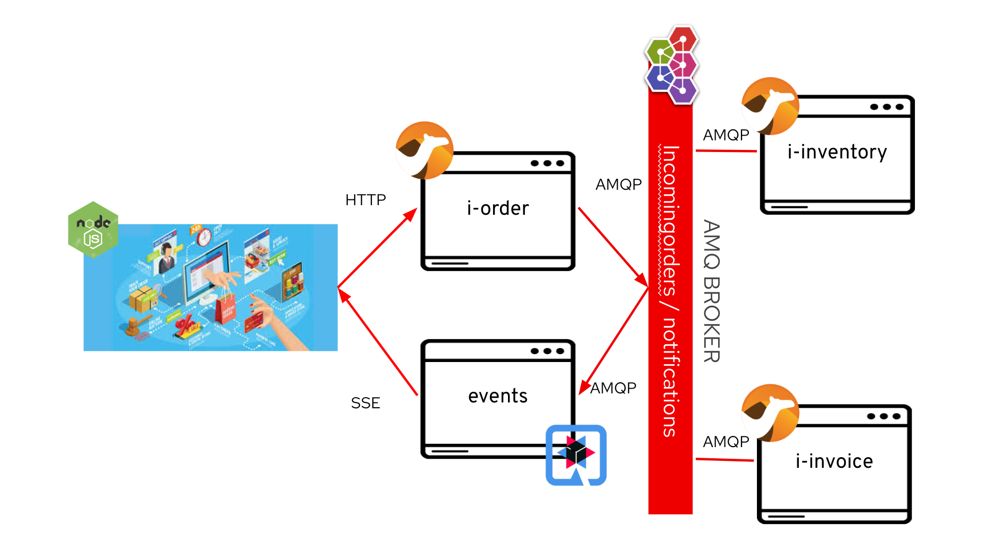
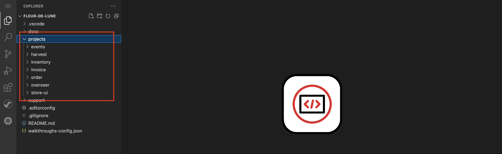
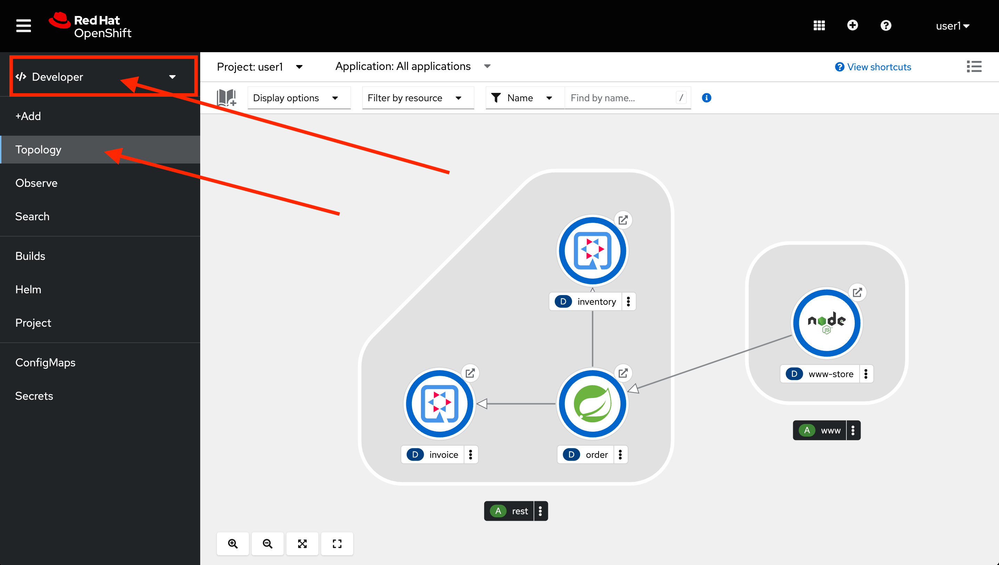

// Attributes
:walkthrough: Event Driven Architecture
:title: Lab 1 - {walkthrough}
:user-password: openshift
:standard-fail-text: Verify that you followed all the steps. If you continue to have issues, contact a workshop assistant.
:namespace: {user-username}

// URLs
:next-lab-url: https://tutorial-web-app-webapp.{openshift-app-host}/tutorial/dayinthelife-streaming.git-labs-02-Change-Data-Capture/
:codeready-url: http://codeready-che.{openshift-app-host}/
:fuse-user-url: https://syndesis-fuse-{user-username}.{openshift-app-host}/

ifdef::env-github[]
:next-lab-url: ../02-Change-Data-Capture/walkthrough.adoc
endif::[]

[id='event-driven-architecture']
= {title}

As part of the acquisition, your team at International Inc's is now working with Fleur de Lune's IT department to learn more about Event-Driven Architecture or EDA. By applying event-driven concepts you will help to avoid classic problems derived from coupled synchronous service calls and avoid the need to implement additional infrastructure components.

The first step was to migrate their ecommerce orders website from a legacy SpringBoot stack to the new supersonic subatomic Quarkus-based microservices. However, they have been dealing with a high rate of errors because one of the components is crashing frequently. To overcome this, you will need to create a new event bus using self-service messaging and implement new event-driven services and APIs using a highly productive iPaaS suite. You will then need to wire everything together to showcase to upper management how EDA solves some of the problems that came along pure REST APIs.

*Audience:* Enterprise Integrators, System Architects, Developers, API Designers, Data Integrators

*Overview*

AMQ self-service messaging enables developers to provision messaging when and where they need it via a web-based browser. You will create your own personal space to create events destinations that will be used by your applications with different patterns like queues and topics.

Red Hat Integration includes an integration Platform-as-a-Service (iPaaS) solution that makes it easy for business users to collaborate with integration experts and application developers. It is a full toolchain and runtime, available right from your browser. You will use this tool to design and implement a new API service and to connect with the Event bus provided by AMQ Online.

*Why Red Hat?*

The Red Hat portfolio of middleware products helps you create a unified environment for application development, delivery, integration, and automation. It is comprised of comprehensive frameworks, integration solutions, process automation, runtimes, and programming languages.

To respond to business demands quickly and efficiently, you need a way to integrate applications and data spread across your enterprise. Red Hat AMQ —based on open source communities like Apache ActiveMQ and Apache Kafka— is a flexible messaging platform that delivers information reliably, enabling real-time integration and connecting the Internet of Things (IoT).

AMQ Online is a solution (Operator) to manage multiple components to provide the overall functionality of running self-service (Messaging as a Service) messaging platform on OpenShift. With AMQ online, developers can provision messaging when and where they need it through a browser console. The AMQ online component is built on the foundation of Red Hat OpenShift, a container platform for high scalability and availability of cloud-native applications.

*Credentials*

Use the following credentials to login into the web consoles:

* Your *username* is: `{user-username}`
* Your *password* is: `{user-password}`

[type=walkthroughResource,serviceName=codeready]
.Red Hat CodeReady Workspaces
****
* link:{codeready-url}[Console, window="_blank", , id="resources-codeready-url"]
****
[type=walkthroughResource]
.Red Hat OpenShift Developer Console
****
* link:{openshift-host}/topology/ns/{namespace}[Topology View, window="_blank"]
****

:sectnums:

[time=5]
[id="Getting Ready"]
== Getting ready for the labs

[IMPORTANT]
====
Please complete the following instructions to get ready for this lab. *If this is not the first lab you are doing today, and you have already completed this step in any of the previous labs, please skip to next task*.
====

You will be using Red Hat CodeReady Workspaces, an online integrated development environment (IDE) based on link:https://www.eclipse.org/che/[Eclipse Che, window="_blank"]. Changes to files are *auto-saved* every few seconds, so you don't need to explicitly save changes.

. To get started go to the link:{codeready-url}[Codeready console, window="_blank"] and log in using your username and password credentials.
+
image::images/openshift-login.png[OpenShift Login, role="integr8ly-img-responsive"]

. *If this is your first lab of the day*, you will need to _Authorize Access_ to CodeReady to access your permissions and being able to mananage your session. Click on *Allow selected permissions*.
+
image::images/authorize-codeready.png[Authorize Access, role="integr8ly-img-responsive"]

[IMPORTANT]
====
If you have already configured your CodeReady Workspaces environment and deployed the services in the _optional_ **Lab A - Cloud Native Applications**, please skip the following steps and scroll down to the end of the page so you can move to *Step 2*.
====

=== Start CodeReady workspace

. Once you have logged in and authorized access to your user account, you will land in your personal CodeReady dashboard.
+
--
A new workspace has been configured with the required tools, plugins and project to start working on this workshop.

Click on the workspace with the name starting with `dil-streaming-` on the left menu bar under *RECENT WORKSPACES*.

image::images/codeready-dashboard.png[CodeReady Dashboard, role="integr8ly-img-responsive"]

[NOTE]
====
You can also click on the name of the workspace in the center, and then click on the green button that says _Open_ on the top right hand side of the screen.
====
--

. This will start an instance of the workspace. Please wait a few moments while it downloads the required container images and configuration setup.
+
image::images/codeready-loading.png[Loading CodeReady, role="integr8ly-img-responsive"]

. The first time it's run, it will git clone the required projects for this workshop. After a minute or two, you’ll be placed in the workspace. Close the initial welcome and Readme tabs then click on the Explorer button on the left side bar.
+
image::images/codeready-welcome.png[CodeReady Welcome screen, role="integr8ly-img-responsive"]
+
[NOTE]
====
This IDE is based on *Eclipse Che*, which is in turn is based on Microsoft VS Code editor. It will look familiar if you have already used it.

You can close the _Problems_ and _Output_ views to clear space.
====

. The projects explorer will show you the *FleurDeLune* folder with the required projects. Expand the folders to reveal the projects we cloned from the git repository.
+

. During the workshop we will need to introduce commands for both the OpenShift and other Command Line Interfaces (CLI) tools. For that we will need to start a terminal window _inside_ one of the containers from the developer workspace. To open the terminal window, click on the _My Workspace_ button on the right side panel and expand the **User Runtimes/tools** folder. Click on *>_ New terminal*.
+
image::images/codeready-new-terminal.png[Open Terminal, role="integr8ly-img-responsive"]

. This will deploy the terminal window in the bottom of the screen. This terminal is attached to the running CodeReady container and is also running on OpenShift. This is the place where you will issue most of the commands from this workshop.
+
image::images/codeready-terminal.png[CodeReady Terminal, role="integr8ly-img-responsive"]

=== Login into the OpenShift cluster

. Finally, you will need to login into the OpenShift CLI to start interacting with the platform. For login, issue the following command:
+
[source,bash,subs="attributes+"]
----
oc login -u {user-username} -p {user-password} https://$KUBERNETES_SERVICE_HOST:$KUBERNETES_SERVICE_PORT --insecure-skip-tls-verify=true
----

. You should see something like the following (the project names may be different):
+
----
Login successful.

You have access to the following projects and can switch between them with 'oc project <projectname>':

    shared-db-earth
    shared-kafka-earth
  * user1
    user1-che
    user1-dayinthel-0605
    user1-shared-475f

Using project "user1".
Welcome! See 'oc help' to get started.
----

. Most of the work will be deploy to your own `{namespace}` project namespace, so be sure to have it as a _working_ project by executing the following command:
+
[source,bash,subs="attributes+"]
----
oc project {namespace}
----

. Now you are ready to start working on the application services.

=== Deploy the synchronous services

. Once you are logged into the OpenShift cluster, you need to deploy the services with the following command:
+
[source,bash,subs="attributes+"]
----
oc apply -n {namespace} -f $CHE_PROJECTS_ROOT/FleurDeLune/support/projects/module-1/eda-dc.yaml
----

. You can check the components were successfully deployed by opening the OpenShift Developer Console link:{openshift-host}/topology/ns/{user-username}[Topology View, window="_blank"]. Don't forget to change the view from *Administrator* to *Developer*.
+

[time=5]
[id="Test Webapp"]
== Review the problematic application

You need to check the problems with the orders web application from Fleur de Lune. In this application, customers select their favorite flavors and place the order online. This application then updates the inventory and processes the payment. The web application is built on NodeJS and the backend service is using the legacy Spring Boot service. The rest of the application components were already migrated to Quarkus.

image::images/lab1-architecture.png[App Architecture, role="integr8ly-img-responsive"]

As we mentioned earlier, the current application has a flaw that is commonly found in synchronous architectures. The backend service is _chaining_ the call to the inventory and the payment services through HTTP calls. This produces the following problems when placing an order:

* First we will need to wait for both services to complete even though they are not related. As the payment service takes longer than the inventory (it needs to process the credit card payment), we have to wait all the way to get inventory feedback too.
* Second, in case of one of the services fail, because there is no correct error handling logic, what we see in the frontend application is that the whole transaction failed and we need to retry again.

image::images/lab1-architecture-fail.png[App Architecture, role="integr8ly-img-responsive"]

We are ready to go over the application to validate the previous statements. We will order some different flavors by calling our RESTful backend services, plus check how the application behaves in case of failure.

=== Check the OpenShift Developer Console

. Open the OpenShift Developer Console link:{openshift-host}/topology/ns/{namespace}[Topology View, window="_blank"], make sure you are in the correct namespace by selecting `{namespace}` from the combobox in the top left:
+
image::images/topology-eda.png[Topology EDA, role="integr8ly-img-responsive"]

. Now that you are in the correct project, click on the *Open URL* icon on the `www-store` deployment.
+
image::images/topology-store.png[Topology Store, role="integr8ly-img-responsive"]

. You should access the online store!
+
image::images/www-store.png[Store Web Page, role="integr8ly-img-responsive"]

=== Order some Mango

. Within the application, click on *PLACE ORDER!*
+
image::images/store-place-order.png[Place order, role="integr8ly-img-responsive"]

. These are our ol' time classic flavors. Click on *Order Mango*,
+
image::images/order-mango.png[Order Mango, role="integr8ly-img-responsive"]

. Wait for the transaction to finish. Remember we will need to wait for at least 30 seconds for the payment to be processed.
+
image::images/processing-order.png[Processing Order, role="integr8ly-img-responsive"]

. After a few moments you will be presented with an *Order Success* screen with the details of your transaction. Click on the *Close* button to dismiss this dialog
+
image::images/order-success.png[Order Success, role="integr8ly-img-responsive"]

Congratulations! Your _Mango_ order was successful! Everything is fine and the sunshine is bright! _But..._

=== Take down that service

The application is working correctly, but what happens when a service _fails_? As we mentioned in the beginning of this lab, there are some problems when one of the services is not available or takes longer than expected to complete. Let's check what happens in that case.

. Go back to the OpenShift Developer Console link:{openshift-host}/topology/ns/{namespace}[Topology View, window="_blank"]

. Click on the *inventory* service deployment.
+
image::images/topology-inventory-deployment.png[Inventory Deployment, role="integr8ly-img-responsive"]
+
A side bar will open with an overview of your service resources.

. Click on the *Details* tab to check the deployment information. Then click in the _down_ arrow to scale down the deployment replicas to zero.
+
image::images/scale-down-inventory.png[Scale Down Inventory, role="integr8ly-img-responsive"]
+
This will simulate the _outage_ of the inventory service. Wait a few seconds for the pod to be deleted.

. Check that the deployment ring is *white* instead of the normal _dark blue_
+
image::images/scaled-zero.png[Scaled To Zero, role="integr8ly-img-responsive"]

. Go back to the web application page and try again to order the *Mango* flavor. What happens?
+
--
image::images/couldnot-process.png[Could Not Process Error, role="integr8ly-img-responsive"]

[NOTE]
====
The service was not able to fulfill the order because the inventory service was offline.  Instead, we  had to wait a little time to get the response back because of the set timeout.
====
--

. Dismiss the error dialog and go back to the OpenShift Developer Console link:{openshift-host}/topology/ns/{namespace}[Topology View, window="_blank"]

. Scale back up the service and wait for the pod to come up.
+
image::images/scale-up-inventory.png[Scale Inventory Up, role="integr8ly-img-responsive"]

. Go back to the web application page and try *again*.
+
Your order should be back again!

[type=verification]
Were you able to successfully scale-down and scale-up your application?

[type=verificationFail]
{standard-fail-text}

[time=15]
[id="Create AMQ Topics"]
== Create your AMQ Online Topics

In this section of the lab we will move from synchronous HTTP REST calls to event-driven services using an event broker or messaging server.  A broker is an intermediary component in charge of sending and receiving events between distributed systems. It removes technical and runtime coupling between microservices and enables fine-grained scaling.

image::images/lab1-broker.png[Event Broker, role="integr8ly-img-responsive"]

We will use AMQ Online to provision an account to create publish/subscribe endpoints to send and receive events. In this way, we can send the order notification to the message bus and then, wait for the inventory and the payment service to return at their time. In the case of one of the services failing, the rest can continue working as none of the calls are blocking.

*Red Hat AMQ Online* is an OpenShift-based mechanism for delivering messaging as a managed service. With Red Hat AMQ Online, administrators can configure a cloud-native, multi-tenant messaging service where developers can provision messaging using a _web console_. Multiple development teams can provision the brokers and queues from the console, *without* requiring each team to _install, configure, deploy, maintain, or patch any software_.

=== Create an Address Space

Let's create an **Address Space** using the AMQ Online Operator.

. Go back to your OpenShift Developer Console link:{openshift-host}/topology/ns/{namespace}[Topology View, window="_blank"].

. Click *+Add* on the left menu.
+
image::images/openshift-add.png[OpenShift +Add, role="integr8ly-img-responsive"]

. Click on the *From Catalog* option.
+
image::images/add-from-catalog.png[OpenShift +Add, role="integr8ly-img-responsive"]

. Type in `address` in the search box, and click on the *AddressSpace*:
+
image::images/catalog-addressspace.png[AddressSpace, role="integr8ly-img-responsive"]

. Click on *Create*:
+
image::images/online-create.png[Create AddressSpace, role="integr8ly-img-responsive"]

. Replace the content in the YAML editor with the following content:
+
[source,yaml,role="copypaste"]
----
apiVersion: enmasse.io/v1beta1
kind: AddressSpace
metadata:
  name: amq
spec:
  plan: standard-small
  type: standard
  endpoints:
    - name: messaging
      service: messaging
      expose:
        type: route
        routeServicePort: amqps
        routeTlsTermination: passthrough
      exports:
        - kind: ConfigMap
          name: amq-config
  authenticationService:
    name: none-authservice
----

. Click on *Create* to start the deployment
+
image::images/addressspace-detail.png[AddressSpace Definition, role="integr8ly-img-responsive"]

. The AMQ operator will check the new resource and will begin to prepare all required components.

. Click on the bricked icon on the top right side of the screen to get the consoles menu. The Messaging Console should now be available there. Open it.
+
image::images/openshift-messaging-console.png[Messaging Console, role="integr8ly-img-responsive"]

. Click on the *Log in with OpenShift* button.
+
image::images/openshift-messaging-login.png[Messaging Login, role="integr8ly-img-responsive"]

. Login using your user credentials.
+
image::images/openshift-login.png[Messaging Login, role="integr8ly-img-responsive"]

. Click in the *amq* link to show the Messaging console Overview Page.
+
image::images/addressspace-active.png[AMQ Address Space, role="integr8ly-img-responsive"]
+
--
[IMPORTANT]
====
Wait for the *Address Space* to deploy the infrastructure until the status changes to _Active_ and shows the *green* checkmark.
====

[NOTE]
====
This could take a few minutes to finish.  If it looks like taking longer, then refresh the page.
====
--

. In the main _address space_ console screen, click on the *Create Address* button to start adding the required topics.
+
image::images/topic-create.png[newtopic, role="integr8ly-img-responsive"]

. Fill in the _Address_ with *incomingorders* and select the *Topic* from the _Type_ combobox and *standard-small-topic* from the _Plan_ menu. Click *Next* to move to the next screen.
+
image::images/topic-name.png[topicname, role="integr8ly-img-responsive"]

. Finally click *Finish* to submit the topic creation.
+
image::images/topic-summary.png[topicsummary, role="integr8ly-img-responsive"]

. AMQ will start the deployment of the required messaging infrastructure to provision your topic.
+
image::images/topic-deploying.png[topicdeploying, role="integr8ly-img-responsive"]

. Next, repeat the last couple of steps to provision the second topic. Create the `notifications` topic with the same type and plan as the _incomingorders_ topic.
+
--
image::images/topics.png[topics, role="integr8ly-img-responsive"]

[NOTE]
====
A green check mark will show that the resources were successfully deployed.
====
--

. Now that our messaging infrastructure is deployed, we need to retrieve the messaging hostname service for our services to connect. Click on the *Endpoints* tab to check the messaging host information.
+
image::images/addressspace-endpoints.png[Address Space Endpoints, role="integr8ly-img-responsive"]

. Copy and write down the *Host* information of the `amq.messsaging.cluster`. As we will be connecting all our services from within OpenShift we can use the internal hostname.
+
image::images/addressspace-hostname.png[Address Space Host, role="integr8ly-img-responsive"]

*Well done!* You now have a running AMQ with two topics called `incomingorders` and `notifications`.

[type=verification]
Did you remember to write down the address space *Host*?

[type=verificationFail]
{standard-fail-text}

[time=30]
[id="fuse-services"]
== Develop Fuse Services

*Red Hat Fuse Online* (part of _Red Hat Fuse_) is an integration Platform-as-a-Service (iPaaS) solution that makes it easy for business users to collaborate with integration experts and application developers. It is a fully cloud-hosted toolchain and runtime, available right from your browser.

[type=taskResource]
.Fuse Online
****
* link:{fuse-user-url}[Fuse Online Console, window="_blank", , id="resources-fuse-user-url"]
****

=== Access Fuse Online

. Access the link:{fuse-user-url}[Fuse Online Console, window="_blank", , id="resources-fuse-user-url"] and login using your credentials.

. Click *Allow selected permissions* to _Authorize Access_ to your account information.
+
image::images/fuse-authorize.png[Authorize Access to Fuse, role="integr8ly-img-responsive"]

. We will need to create the connections to the _topics_ created in the previous task. Click on the *Connections* menu option on the left side.
+
image::images/fuse-connections.png[Fuse Connections Menu, role="integr8ly-img-responsive"]

=== Create connection to AMQ Online

. Click on *Create Connection* button on the right top side.
+
image::images/fuse-create-connection.png[Fuse Create Connection, role="integr8ly-img-responsive"]

. Fuse includes several connectors available to establish connectivity to cloud services. In this case click on the *AMQP Message Broker* one.
+
image::images/fuse-amqp-broker.png[AMQP Message Broker Connector, role="integr8ly-img-responsive"]

. On the following page, add the *Connection URI* for connecting to the AMQ Online _AddressSpace_. You will need to replace the `{your-service.host}` placeholder with the value you save from the previous task.
+
--
[source,none,subs="attributes+"]
----
amqp://{your-service.host}?requestTimeout=1000
----

image::images/fuse-connection-uri.png[AMQP Connection URI, role="integr8ly-img-responsive"]
--

. Scroll down the same page and click on the *Validate* button to check the connection has been established.
+
image::images/fuse-validate.png[Connection Validation, role="integr8ly-img-responsive"]

. You will see a green message back at the top.
+
image::images/fuse-validation-success.png[Connection Validation Success, role="integr8ly-img-responsive"]

. Click on *Next>* button.
+
image::images/fuse-connector-next.png[Connector Next, role="integr8ly-img-responsive"]

. In the next step, replace the *Name* with `AMQ Online` and finally click the *Save* button.
+
image::images/fuse-connection-name.png[Connector Name, role="integr8ly-img-responsive"]

=== Create Place Order API

. Time to begin with the first integration. Click on the *Integration* menu option on the left side.
+
image::images/fuse-integrations.png[Fuse Integrations, role="integr8ly-img-responsive"]

. Click on the *Create Integration* button on the center of the screen or the top right side.
+
image::images/fuse-create-integration.png[Fuse Create Integration, role="integr8ly-img-responsive"]

. Start by clicking the *API Provider* option.
+
image::images/fuse-api-provider.png[Fuse API Provider, role="integr8ly-img-responsive"]

. We will create a _RESTful API_ from scratch. Select the *Create a new OpenAPI 2.x document* option and click on *Next* button.
+
image::images/fuse-create-api.png[Fuse Create API, role="integr8ly-img-responsive"]

. The API editor is based on the link:http://apicurio.com/[Apicurio] community project. Begin adding a _Path_ to your API by clicking on *Add a path*.
+
image::images/fuse-add-path.png[API Add Path, role="integr8ly-img-responsive"]

. Fill in `/place` in the *Path* textbox and click *Add*.
+
image::images/fuse-place-path.png[API /place Path, role="integr8ly-img-responsive"]

. Next we need to define the _data schema_. Click on *Add a data type*.
+
image::images/fuse-data-type.png[API Data Type, role="integr8ly-img-responsive"]

. Fill in `order` in the *Name* field. Fuse can use a JSON example to _bootstrap_ the schema properties. Paste the following code in the *JSON Example* field.
+
[source,json,subs="attributes+"]
----
{
   "username":"jdoe",
   "orderId":"1",
   "itemId":"1",
   "orderItemName":"kiwi",
   "quantity":1,
   "price":2,
   "address":"123 Evergreen Terrace",
   "zipCode":"2222"
}

----
+
image::images/fuse-type-definition.png[API Type Definition, role="integr8ly-img-responsive"]

. Finally click on *Save* button.
+
image::images/fuse-schema-save.png[API Save Type Definition, role="integr8ly-img-responsive"]
+
[NOTE]
====
Notice that the there is _another_ save button in the top right. Beware NOT to click on that one.
====

. Click back on the */place* path on the left side. Scroll down the right panel and click on *Post* operation and then click on *Add Operation* button.
+
image::images/fuse-place-operation.png[API Place Operation, role="integr8ly-img-responsive"]

. This will enable the _Operation info_ panel. Fill in the following data in the corresponding fields:
+
* *Summary*: `API to Event endpoint`
* *Operation ID*: `order`
* *Description*: `Order item`
+
image::images/fuse-operation-info.png[API Operation Info, role="integr8ly-img-responsive"]

. Scroll down and click on *Add a request body* to enable the dropdown *Request Body Type*. Select `order`.
+
image::images/fuse-request-body.png[API Operation Body, role="integr8ly-img-responsive"]
+
[NOTE]
====
Did you notice that the warning icon disappeared?
====

. Now click on *Add a response* under the _RESPONSES_ section. Select `201 Created` from the dropdown menu. Finally click on the *Add* button.
+
image::images/fuse-response-code.png[API Operation Response, role="integr8ly-img-responsive"]

. Type `Order sent` on the response *Description* and select `String` from the both *Response Type* dropdown menus.
+
[NOTE]
====
You can add an example if you are planning to mock this API definition.
====

. Remember to name your API `Place Order`. Finally hit the *Save* button to store your API definition.
+
image::images/fuse-response-type.png[API Response Type, role="integr8ly-img-responsive"]

. Review your API information. If everything is fine click on *Next*.
+
image::images/fuse-review-api.png[Review API, role="integr8ly-img-responsive"]

=== Create Order API Flow

. We are ready to star this _place order_ flow. Click on the *Create flow* button.
+
image::images/fuse-create-flow.png[Create Flow, role="integr8ly-img-responsive"]

. You will be presented with the basics of your integration. Click the *+* button to add a new step to your integration.
+
image::images/fuse-add-to.png[Add To Integration, role="integr8ly-img-responsive"]

. Select *AMQ Online* from the available _connections_.
+
image::images/fuse-connect-amq.png[Add AMQ Online, role="integr8ly-img-responsive"]

. Click the *Select* button next to the *Publish messages* option.
+
image::images/fuse-select-publish.png[Publish Messages, role="integr8ly-img-responsive"]

. Fill in the _topic_ name `incomingorders?exchangePattern=InOnly&disableReplyTo=true` in the *Destination name* textbox and select `Topic` from the *Destination type* combobox. Then, click the *Next* button.
+
image::images/fuse-destination-name.png[Destination Name, role="integr8ly-img-responsive"]

. In this screen, select `JSON Instance` from the *Select Type* menu. Type `order` in the *Data Type Name* field and paste the following code in the *Definition* field:
+
--
[source,json,subs="attributes+"]
----
{
   "username":"jdoe",
   "orderId":"1",
   "itemId":"1",
   "orderItemName":"kiwi",
   "quantity":1,
   "price":2,
   "address":"123 Evergreen Terrace",
   "zipCode":"2222"
}
----

image::images/fuse-message-type.png[Destination Type, role="integr8ly-img-responsive"]
--

. Scroll down and click the *Next* button.

. Click on the _Warning_ icon and then click the *Add a data mapping step* to map between the API and the messaging formats.
+
image::images/fuse-add-mapper.png[Add Mapper, role="integr8ly-img-responsive"]

. This is the _Atlas Mapper_ it allows us to map between API and Messaging schemas. Expand the `body` option on the left side under *1 - Request* and drag and drop each one of the fields from the left _Source_ to right _Target_ side.
+
image::images/fuse-field-mapper.png[Fields Mapper, role="integr8ly-img-responsive"]

. Click on the *+* button between _Publish messages_ and _Provide API Return Path_ to add another mapper for the API return value.
+
image::images/fuse-return-mapper.png[Return Mapper, role="integr8ly-img-responsive"]

. Select the *Data Mapper* option for the connection.
+
image::images/fuse-connection-mapper.png[Connection Mapper, role="integr8ly-img-responsive"]

. Expand the *Constants* section and add a _string_ with the _value_ `Order Received!`. Drag and drop it to the right side under `body`. Then click the *Done* button.
+
image::images/fuse-map-response.png[Map Response, role="integr8ly-img-responsive"]

. Click the *Publish* button.
+
image::images/fuse-publish-api.png[Publish API Integration, role="integr8ly-img-responsive"]

. Type `events` in the *Name* and `Order API to Event` in the *Description* fields. Then click the *Save and Publish* button to deploy your integration.
+
image::images/fuse-save-publish.png[Save and Publish API, role="integr8ly-img-responsive"]

. It will take a moment for Fuse to deploy your integration. It will compile and package an Apache Camel route into a _container_ image that is deployed to OpenShift. Fuse completes these steps automatically, so you don't need to learn how to build and deploy a container on Kubernetes. Wait a few minutes for the process to complete.
+
image::images/fuse-building-integration.png[Building Integration, role="integr8ly-img-responsive"]

=== Deploy inventory and invoice event-driven services

. Go back to the CodeReady Workspaces IDE terminal and update the *application.properties* file under `support/projects/module-1/` so we can create a _config map_ that will provide the AMQ address space for our event-driven services. Update the `quarkus.qpid-jms.url` property with the *hostname* that you wrote down in the previous task.
+
image::images/application-properties-configmap.png[Properties ConfigMap, role="integr8ly-img-responsive"]
+
[IMPORTANT]
====
Replace the placeholder text with your actual hostname. You can always get back to the messaging console to get your endpoint Host.
====

. Create the config map issuing the following command:
+
[source,none,subs="attributes+"]
----
oc -n {namespace} create configmap amqp-properties --from-file $CHE_PROJECTS_ROOT/FleurDeLune/support/projects/module-1/application.properties
----

. Update the ecommerce web application to point to your new event-driven API by updating the application environment variable:
+
[source,none,subs="attributes+"]
----
oc -n {namespace} set env deployment/www-store ORDERS_EVENT_BASE_URL="http://i-events.fuse-{user-username}.svc:8080"
----

. Issue the following command to deploy the _event-driven_ services that will react to the events posted by the `events` service:
+
[source,none,subs="attributes+"]
----
oc -n {namespace} apply -f $CHE_PROJECTS_ROOT/FleurDeLune/support/projects/module-1/eda-services.yaml
----

. The rest of the event-driven components should deploy now.  You can take a look at the topology view to check the deployment progress. Give it a few moments for everything to deploy.

[type=verification]
In your topology view do you see 2 new services deployed: `invoice-events` and `inventory-events`?

[type=verificationFail]
{standard-fail-text}

=== Test the integration

. In the same CodeReady Workspaces terminal issue the following command:
+
[source,bash,subs="attributes+"]
----
curl -v -X POST http://i-events.fuse-{user-username}.svc:8080/place -H 'cache-control: no-cache' -H 'content-type: application/json' -d  '{"orderId":978,"itemId": 135790,"orderItemName": "Mango","quantity": 1,"price": 2.50,"address": "hello","zipCode": "15555"}'
----
+
You should receive a message back similar to the following one:
+
[source,none,subs="attributes+"]
----
...
* upload completely sent off: 162 out of 162 bytes
< HTTP/1.1 201 Created
< Connection: keep-alive
< Content-Type: application/json
< Content-Length: 0
< X-Application-Context: application
< Date: Fri, 20 Mar 2020 15:17:28 GMT
<
* Curl_http_done: called premature == 0
* Connection #0 to host i-events.fuse-{user-username} left intact
Order Received!
----
+
*Excellent!* This means you are able to _POST_ an Order and it was sent to the _Topic_.

[type=verification]
Were you able to successfully start all 3 integration services?

[type=verificationFail]
{standard-fail-text}

[time=15]
[id="Develop Events Service"]
== Develop the Events Service

For the new event-driven store application, we will need to receive the updates on the notifications in near-realtime. For this, we will need to connect to a link:https://en.wikipedia.org/wiki/Server-sent_events[Server-Sent Events] service.

=== Review the code

. Go to the _Explorer:/projects_ in CodeReady Workspaces web IDE and expand the *events* folder.
+
image::images/codeready-events.png[Events Service, role="integr8ly-img-responsive"]
+
The Inventory service implements _Server-Side Events_ (SSE) using *Quarkus* and link:https://smallrye.io/smallrye-reactive-messaging/[SmallRye Reactive Messaging].

. Open the `EventsResource.java` file under `src/main/java/com/redhat/eventdriven` and check the provided code.
+
image::images/events-resource.png[EventsResource.java, role="integr8ly-img-responsive"]
+
This will be the base we will use to build our service.

. First we need to _Inject_ a *Channel* that will be mapped to the `notifications` topic. Add the following code below the `/* TODO add notifications Channel */` marker:
+
[source,java,subs="attributes+"]
----
    @Inject
    @Channel("notifications")
    Flowable<String> notifications;
----

. Now we need to add the `/consume` Path to receive the SSE requests. Add the following code below the `/* TODO add consume Path */` marker:
+
--
[source,java,subs="attributes+"]
----
    @GET
    @Path("/consume")
    @NoCache
    @Produces(MediaType.SERVER_SENT_EVENTS)
    public Publisher<String> sendEvents() {
        // Stream notifications as Server-Side Events
        return Flowable.<String>merge(
            notifications.map(event -> { log.info("ev= " + event); return event; }),
            Flowable.interval(1, TimeUnit.SECONDS).map(x -> "{}"));
    }
----

[NOTE]
====
Notice that the return type of the method is a *Publisher* and the _MediaType_ is *SERVER_SENT_EVENTS*. This will enable a persistent connection from the browser.
====
--

. Most of the configuration is located in a properties file where we can add the MicroProfile connection settings for the message broker. Open `application.properties` file in 'src/main/resources/' and add the following configuration:
+
[source,java,subs="attributes+"]
----
# HTTP config
quarkus.http.cors=true

# Incoming stream
mp.messaging.incoming.notifications.connector=smallrye-amqp
mp.messaging.incoming.notifications.durable=false
----
+
The first line is just enabling link:https://en.wikipedia.org/wiki/Cross-origin_resource_sharing[Cross-Origin Resource Sharing] (CORS) for this service. Following is the MicroProfile configuration to use the `smallrye-amqp` component.

=== Deploy to OpenShift

. Package the application by running the following maven plugin in the CodeReady Workspaces terminal:
+
[source,bash,subs="attributes+"]
----
mvn clean compile package -DskipTests -f $CHE_PROJECTS_ROOT/FleurDeLune/projects/events/
----
+
[NOTE]
====
For the following commands remember to be sure to switch to your _working_ project.
====

. Create a _Build Configuration_ for your application using the OpenJDK base container image:
+
[source,bash,subs="attributes+"]
----
oc new-build registry.access.redhat.com/redhat-openjdk-18/openjdk18-openshift:1.5 --binary --name=events -l app=events -n {namespace}
----

. Start and watch the build, which will take about 2 minutes to complete:
+
[source,bash,subs="attributes+"]
----
oc start-build events --from-file $CHE_PROJECTS_ROOT/FleurDeLune/projects/events/target/*-runner.jar --follow -n {namespace}
----

. Deploy the service as an OpenShift application with the CLI:
+
[source,bash,subs="attributes+"]
----
oc new-app -n {namespace} events -l 'app.openshift.io/runtime=quarkus,app.kubernetes.io/part-of=event-driven'; oc expose svc/events -n {namespace}
----

. To follow the external config practice of 12 factor applications we will inject the messaging endpoint `hostname` and `port` using the ConfigMap created by our _AddressSpace_ configuration.
+
[source,bash,subs="attributes+"]
----
oc patch -n {namespace} dc/events -p '{ "metadata" : { "annotations" : { "app.openshift.io/connects-to" : "invoice-events,inventory-events" } }, "spec": { "template": { "spec": { "containers": [ { "name": "events", "env": [ { "name": "AMQP_HOST", "valueFrom": { "configMapKeyRef": { "name": "amq-config", "key": "service.host" } } }, { "name": "AMQP_PORT", "valueFrom": { "configMapKeyRef": { "name": "amq-config", "key": "service.port.amqp" } } } ] } ] } } } }'
----

=== Check the OpenShift Developer Console

. Open the OpenShift Developer Console link:{openshift-host}/topology/ns/{namespace}[Topology View, window="_blank"], and make sure it's done deploying by waiting for the dark blue circles around the Quarkus logo:
+
image::images/topology-events.png[Topology Events, role="integr8ly-img-responsive"]

. Review the successful deployment by clicking on the *Open URL* icon on the deployment.

[type=verification]
Were you able to successfully view the events default webpage?

[type=verificationFail]
{standard-fail-text}

[time=10]
[id="test-eda"]
== Testing the new architecture

Remember what happens when a service is down in our _traditional_ REST architecture? We get an error telling us that we were not able to process the order. Let's check what happens when we introduce microservices to decouple events.

=== Test new flavors

Let's check how the stores looks with the new flavors.

. In the link:{openshift-host}/topology/ns/{namespace}[Topology View, window="_blank"] click the *Open URL* icon for the `www-store` service.
+
image::images/topology-store.png[Topology Store, role="integr8ly-img-responsive"]

. With the open application open, click on the *ASYNC* menu option.
+
image::images/store-order-async.png[Place async order, role="integr8ly-img-responsive"]

. Can you see the new flavors? This time lets order a sweet _event-driven_ strawberry one.
+
image::images/store-strawberry.png[Order Strawberry, role="integr8ly-img-responsive"]

. A notification will show you that your order was received and almost immediately another notification will pop up telling us that our order was already processed. This is the *inventory* service feedback.
+
image::images/www-inventory.png[Order Processed, role="integr8ly-img-responsive"]

. Now, wait a few more seconds and the *invoice* notification should pop up telling us that our payment has been processed.
+
image::images/www-invoice.png[Payment received, role="integr8ly-img-responsive"]

[type=verification]
Were you able to successfully see all 3 notification messages?

[type=verificationFail]
{standard-fail-text}

=== Take down that service

Remember that we need to test what happens when a service is down?

. Go back to the CodeReady Workspaces IDE terminal

. Issue the following command to _scale down_ the _invoice_ service to simulate a failing service.
+
[source,bash,subs="attributes+"]
----
oc patch -n {namespace} integration/inventory-events --patch $'spec:\n replicas: 0' --type merge
----
+
[NOTE]
====
This will simulate the _outage_ of the inventory service. Wait a few seconds for the service to stop. You will notice the white circle on the Camel deployment.
====
+
image::images/invoice-events-outage.png[Scaled To Zero, role="integr8ly-img-responsive"]

. Go back to the web application page and try again to order the async *Strawberry* flavor. What happens?
+
--
image::images/www-order-received.png[Order Received, role="integr8ly-img-responsive"]

[NOTE]
====
The order was still received by the system, but this time the inventory service has not been processed yet.
====
--

. Wait again a few seconds. What happened now?
+
--
image::images/www-just-invoice.png[Payment Notification, role="integr8ly-img-responsive"]

[IMPORTANT]
====
This time the Invoice service is decoupled from the Inventory call, so it can still work at its own pace. That's why we still receive the _payment_ notification.
====
--

. Let's get the *inventory* service back online. Issue the following command to bring back the *invoice* service.
+
[source,bash,subs="attributes+"]
----
oc patch -n {namespace} integration/inventory-events --patch $'spec:\n replicas: 1' --type merge
----

. Wait a few seconds for the service to get back online.
+

. Go back to the web application page and try now to order some *blueberry*.
+
image::images/www-order-back.png[Invetory Starting, role="integr8ly-img-responsive"]

[type=verification]
Did your order reappear and received?

[type=verificationFail]
{standard-fail-text}

[time=5]
[id="summary"]
== Summary

In this lab you successfully helped the development team to move the online ordering site to a new event-driven architecture based on AMQ Online and Quarkus reactive messaging clients. You were able to create a self-provisioning address space to create event destinations for the incoming orders and the notifications. Also you designed a new API using the Red Hat API designer and implemented the service using Fuse Online. Finally you were able to check how decoupling services using event-driven apps help you to avoid disruption on your systems.

You can now proceed to link:{next-lab-url}[Lab 2].

[time=4]
[id="further-reading"]
== Notes and Further Reading

* https://www.redhat.com/en/technologies/jboss-middleware/amq[Red Hat AMQ, window="_blank"]
* https://developers.redhat.com/courses/quarkus[Try Quarkus, window="_blank"]
* https://www.redhat.com/en/technologies/jboss-middleware/fuse-online[Red Hat Fuse Online, window="_blank"]
* https://developers.redhat.com/topics/event-driven/[Event-driven Architecture - Red Hat Developers, window="_blank"]
