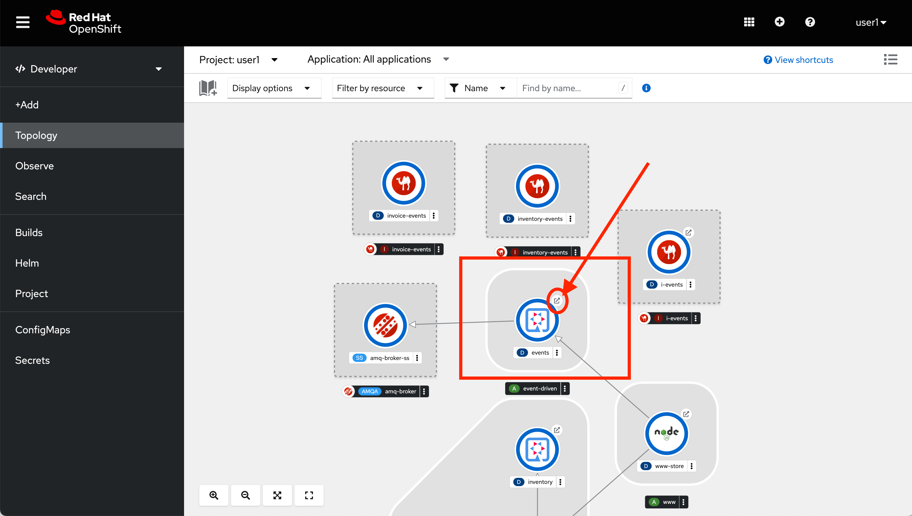

// Attributes
:walkthrough: Event Driven Architecture
:title: Lab 1 - {walkthrough}
:user-password: openshift
:standard-fail-text: Verify that you followed all the steps. If you continue to have issues, contact a workshop assistant.

// URLs
:next-lab-url: https://tutorial-web-app-webapp.{openshift-app-host}/tutorial/dayinthelife-streaming.git-labs-02-Change-Data-Capture/
:codeready-url: http://che-che.{openshift-app-host}/
:fuse-user-url: https://syndesis-fuse-{user-username}.{openshift-app-host}/

ifdef::env-github[]
:next-lab-url: ../lab02/walkthrough.adoc
endif::[]

[id='event-driven-architecture']
= {title}

Since the acquisition, the International Inc.’s Development team have been pressured to make the transition smooth and quickly. They have decided to start with a small notification project where both internal departments and external partners are notified when an order has been placed. In this lab you will learn how to use Camel K to establish a simple Event Driven call. The old application uses traditional API calls to trigger system modification.  Your job is to use Camel K to re-write the notification application rather then using a pure REST implementation to convert the application into an event-driven architecture.

*Audience:* Enterprise Integrators, System Architects, Developers, Data Integrators

*Overview*

Camel K is a lightweight cloud integration platform based on the Apache Camel framework. It runs natively on Kubernetes and Openshift and it’s specifically designed for serverless and microservice architectures.

AMQ Online enable Developers to provision messaging when and where they need it via a web-based browser. The AMQ Online component is built on the foundation of Red Hat OpenShift, a container platform for high scalability and availability of cloud-native applications.

*Why Red Hat?*

To respond to business demands quickly and efficiently, you need a way to integrate applications and data spread across your enterprise. Red Hat® AMQ—based on open source communities like Apache ActiveMQ and Apache Kafka—is a flexible messaging platform that delivers information reliably, enabling real-time integration and connecting the Internet of Things (IoT).

The AMQ streams component makes Apache Kafka “OpenShift-native” through the use of powerful operators that simplify the deployment, configuration, management, and use of Apache Kafka on OpenShift.

*Credentials*

Use the following credentials to login into the web consoles:

* *Username:* `{user-username}`
* *Password:* `{user-password}`

[type=walkthroughResource,serviceName=codeready]
.Red Hat CodeReady Workspaces
****
* link:{codeready-url}[Console, window="_blank", , id="resources-codeready-url"]
****
[type=walkthroughResource]
.Red Hat OpenShift Developer Console
****
* link:{openshift-host}/topology/ns/{user-username}[Topology View, window="_blank"]
****

:sectnums:

[time=5]
[id="Getting Ready"]
== Getting ready for the labs

You will be using Red Hat CodeReady Workspaces, an online integrated development environment (IDE) based on link:https://www.eclipse.org/che/[Eclipse Che, window="_blank"]. Changes to files are *auto-saved* every few seconds, so you don't need to explicitly save changes.

. To get started go to the link:{codeready-url}[Codeready console, window="_blank"] and log in using your username and password credentials.
+

. You will need to _Authorize Access_ to CodeReady to access your permissions and being able to mananage your session. Click on *Allow selected permissions*.
+
image::images/authorize-codeready.png[Authorize Access, role="integr8ly-img-responsive"]

=== Start CodeReady workspace

. Once you have logged in and authorized access to your user account, you will land in your personal CodeReady dashboard. 
+
--
A new workspace has been configured with the required tools, plugins and project to start working on this workshop. 

Click on the workspace with the name starting with `dil-streaming-` on the left menu bar under *RECENT WORKSPACES*.

image::images/codeready-dashboard.png[CodeReady Dashboard, role="integr8ly-img-responsive"]

[NOTE]
====
You can also click on the name of the workspace in the center, and then click on the green button that says _Open_ on the top right hand side of the screen.
====
--

. This will start an instance of the workspace. Please wait a few moments while it downloads the required container images and configuration setup.
+

. The first time it's run, it will git clone the required projects for this workshop. After a minute or two, you’ll be placed in the workspace. Close the the inicial welcome and Readme tabs then click on the Explorer button on the left side bar.
+
image::images/codeready-welcome.png[CodeReady Welcome screen, role="integr8ly-img-responsive"]
+
[NOTE]
====
This IDE is based on *Eclipse Che*, which is in turn is based on MicroSoft VS Code editor. It will look familiar if you have already used it.

You can close the _Problems_ and _Output_ views to clear space.
====

. The projects explorer will show you the *FleurDeLune* folder with the required projects. Expand the folders to reveal the projects we cloned from the git repository.
+
image::images/codeready-projects.png[Workshop projects, role="integr8ly-img-responsive"]

. During the workshop we will need to introduce commands for both the OpenShift and Camel-K Command Line Interfaces (CLI). For that we will need to start a terminal window _inside_ one of the containers from the developer workspace. To open the terminal window, click on the _My Workspace_ button on the right side panel and expand the **User Runtimes/tools** folder. Click on *>_ New terminal*.
+
image::images/codeready-new-terminal.png[Open Terminal, role="integr8ly-img-responsive"]

. This will deploy the terminal window in the bottom of the screen. This terminal is attached to the running CodeReady container and is also running on OpenShift. This is the place where you will issue most of the commands from this workshop.
+

=== Login into the OpenShift cluster

. Finally, you will need to login into the OpenShift CLI to start interacting with the platform. For login, issue the following command:
+
[source,bash,subs="attributes+"]
----
oc login -u {user-username} -p {user-password} https://$KUBERNETES_SERVICE_HOST:$KUBERNETES_SERVICE_PORT --insecure-skip-tls-verify=true
----

. You should see something like the following (the project names may be different):
+
[source,bash,subs="attributes+"]
----
Login successful.

You have access to the following projects and can switch between them with 'oc project <projectname>':

  * shared-db-earth
    shared-kafka-earth
    user1
    user1-che
    user1-dayinthel-0605
    user1-shared-475f

Using project "shared-db-earth".
Welcome! See 'oc help' to get started.
----

. Now you are ready to start working on the application services.

[type=verification]
Were you able to successfully login to Openshift CLI?

[type=verificationFail]
Verify that you followed each step in the procedure above. If you are still having issues, contact your administrator.

[time=5]
[id="Deploy the Inventory Service"]
== Deploy the Inventory Service

The _Inventory Service_ handles the order and provides information about the availability. In this case, we will generate an inventory idenfitier and process the result back. Take a look on how the implementation is using *Quarkus* as a Java runtime.

=== Review the code

. Go to _Explorer:/projects_ in CodeReady Workspaces web IDE and expand the *inventory* folder.
+
image::images/codeready-inventory.png[Inventory Service, role="integr8ly-img-responsive"]
+
The Inventory service implements a simple _RESTful API_ using *Quarkus*.

. Open the `InventoryResource.java` file under `src/main/java/com/redhat/cloudnative` and check the provided code.
+
image::images/inventory-resource.png[InventoryResource.java, role="integr8ly-img-responsive"]
+
The REST service defines a simple _POST_ endpoint `/notify/order` to receive the `Order` notifications as JSON. This service calls the `InventoryNotification` service.

. Open the `InventoryNotification.java` file under `src/main/java/com/redhat/cloudnative` and check the provided code.
+
image::images/inventory-notification.png[InventoryNotification.java, role="integr8ly-img-responsive"]
+
As we mentioned before, it just creates an InventoryNotification with a random `InventoryId` and adds the current _timestamp_.

=== Deploy locally to CodeReady

. Run the inventory application locally using the _Maven plugin command_ via CodeReady Workspaces Terminal:
+
[source,bash,subs="attributes+"]
----
mvn clean compile quarkus:dev -f $CHE_PROJECTS_ROOT/FleurDeLune/projects/inventory/
----

. Look at the output, it is just maven downloading dependencies that should end like the following:
+
--
[source,bash,subs="attributes+"]
----
...
Listening for transport dt_socket at address: 5005
2020-03-18 17:33:14,290 INFO  [io.quarkus] (main) inventory 1.0.0-SNAPSHOT (running on Quarkus 1.2.1.Final) started in 1.981s. Listening on: http://0.0.0.0:8080
2020-03-18 17:33:14,294 INFO  [io.quarkus] (main) Profile dev activated. Live Coding activated.
2020-03-18 17:33:14,294 INFO  [io.quarkus] (main) Installed features: [cdi, resteasy, resteasy-jackson]
----

[NOTE]
====
Don't close the dialog that appears while running the server!

If you did so, stop the process with `ctrl+c` or `cmd + c` and re-run the command again.
====
--

. CodeReady should detect you are running your Quarkus application and is opening the `8080` port. Click on the *Open Link* button to open the CodeReady embedded browser.
+
image::images/inventory-mvn-local.png[Maven Command Local, role="integr8ly-img-responsive"]

. Take a look at the _Inventory_ page on the right side.
+
image::images/inventory-web.png[Inventory Web, role="integr8ly-img-responsive"]
+
This is a default provisioned page from Quarkus. You don't need to worry about this since we will only use the REST API.

. As we are running our service in the current CodeReady Terminal, open a new terminal window from the commands menu on the right side
+
image::images/codeready-new-terminal.png[New Terminal, role="integr8ly-img-responsive"]

. Test the local deployment issuing the following command in the new CodeReady Terminal:
+
[source,bash,subs="attributes+"]
----
curl -s -X POST \
  http://localhost:8080/notify/order \
  -H 'cache-control: no-cache' \
  -H 'content-type: application/json' \
  -d  \
  '{
    "orderId": 978,
    "itemId": 135790,
    "orderItemName": "Mango",
    "quantity": 1,
    "price": 2.50,
    "address": "hello",
    "zipCode": "15555"
  }'
----

. Check the result, you should get someething similar to the following output:
+
[source,bash,subs="attributes+"]
----
{"orderId":978,"itemId":135790,"quantity":1,"department":"inventory","datetime":1584
554071289,"flavor":"Mango","inventoryId":"939699"}
----

. Be sure to terminate the running Quarkus development via kbd:[CTRL+C] (or kbd:[Command+C] on Mac OS).

=== Deploy to OpenShift

. Now that we have seen that the service works, let's deploy the application to OpenShift. Package the application by running the following maven plugin in the CodeReady Workspaces terminal:
+
[source,bash,subs="attributes+"]
----
mvn clean compile package -DskipTests -f $CHE_PROJECTS_ROOT/FleurDeLune/projects/inventory/
----

. Be sure to switch to your working OpenShift project by issuing the following command using the OpenShift CLI:
+
[source,bash,subs="attributes+"]
----
oc project {user-username}
----
+
You should get the following output:
+
[source,bash,subs="attributes+"]
----
Now using project "{user-username}" on server "https://172.30.0.1:443".
----

. Create a _Build Configuration_ for your application using the OpenJDK base container image:
+
--
[source,bash,subs="attributes+"]
----
oc new-build registry.access.redhat.com/redhat-openjdk-18/openjdk18-openshift:1.5 --binary --name=inventory -l app=inventory -n {user-username}
----

[NOTE]
====
This build uses the new link:https://access.redhat.com/documentation/en-us/red_hat_jboss_middleware_for_openshift/3/html/red_hat_java_s2i_for_openshift/index[Red Hat OpenJDK Container Image], providing foundational software needed to run Java applications, while staying at a reasonable size.
====
--

. Start and watch the build, which will take about minutes to complete:
+
[source,bash,subs="attributes+"]
----
oc start-build inventory --from-file $CHE_PROJECTS_ROOT/FleurDeLune/projects/inventory/target/*-runner.jar --follow -n {user-username}
----
+
You should get a _Push succesful_ line at the end
+
[source,bash,subs="attributes+"]
----
...
Writing manifest to image destination
Storing signatures
Successfully pushed image-registry.openshift-image-registry.svc:5000/user1/inventory@sha256:a42968c6de63853c87331626f4df02842fddca3c1282aa3a04426b668e348280
Push successful
----

. Once the build is done, deploy the service as an OpenShift application with the CLI:
+
[source,bash,subs="attributes+"]
----
oc new-app inventory; oc expose svc/inventory
----

=== Check the OpenShift Developer Console

. Open the OpenShift Developer Console link:{openshift-host}/topology/ns/{user-username}[Topology View, window="_blank"], make sure it's done deploying by waiting for the dark blue circles around the OpenShift logo:
+
image::images/topology-inventory.png[Topology Inventory, role="integr8ly-img-responsive"]

. Click on *Open URL* icon in the top right side of the `inventory` deployment to open access the service webpage.
+
image::images/inventory-webpage.png[Inventory Web Page, role="integr8ly-img-responsive"]
+
This time the inventory page has its own URL that is publicy accessible outside OpenShift.

. So now Inventory service is deployed to OpenShift. You can see it in the Project Status in the OpenShift Console that it is a single replica running in 1 pod.

[type=verification]
Were you able to successfully deploy th Inventory service to OpenShift?. You can see it in the Project Status via the OpenShift Console.  Verify that a single replica is running as 1 pod.

[type=verificationFail]
Verify that you followed each step in the procedure above. If you are still having issues, contact your administrator.

[time=25]
[id="Deploy Invoice Service"]
== Deploy Invoice Service

The second element of the architecture is the _Invoice Service_ that handles payments. In this case, the service is implemented using the *Quarkus* Java framework. The only difference with _Inventory Service_ is that we have added a few seconds delay to _mimic_ the time a real payment will have to wait for processing a card payment. Take a look at how the implementation is done using *Quarkus* as a Java runtime.

=== Review the code

. Go to _Explorer:/projects_ in CodeReady Workspaces web IDE and expand the *invoice* folder.
+
image::images/codeready-invoice.png[Invoice Service, role="integr8ly-img-responsive"]

. Open the `InvoiceResource.java` file under `src/main/java/com/redhat/cloudnative` and check the provided code.
+
image::images/invoice-resource.png[InvoiceResource.java, role="integr8ly-img-responsive"]

The REST service defines a simple _POST_ endpoint `/notify/order` as we did with _Inventory_ to receive the `Order` notifications as JSON.  This service calls the `processOrder` method after a `30` seconds delay. As we mentioned before, it just creates a JSON Object with a random `InvoiceId` and adds the current _timestamp_.

=== Deploy to OpenShift

. Package the application by running the following maven plugin in the CodeReady Workspaces terminal:
+
[source,bash,subs="attributes+"]
----
mvn clean compile package -DskipTests -f $CHE_PROJECTS_ROOT/FleurDeLune/projects/invoice/
----
+
[NOTE]
====
For the following commands remember to be sure to switch to your _working_ project.
====

. Create a _Build Configuration_ for your application using the OpenJDK base container image:
+
[source,bash,subs="attributes+"]
----
oc new-build registry.access.redhat.com/redhat-openjdk-18/openjdk18-openshift:1.5 --binary --name=invoice -l app=invoice -n {user-username}
----

. Start and watch the build, which will take about minutes to complete:
+
[source,bash,subs="attributes+"]
----
oc start-build invoice --from-file $CHE_PROJECTS_ROOT/FleurDeLune/projects/invoice/target/*-runner.jar --follow -n {user-username}
----

. Deploy the service as an OpenShift application with the CLI:
+
[source,bash,subs="attributes+"]
----
oc new-app invoice; oc expose svc/invoice
----

=== Check the OpenShift Developer Console

. Open the OpenShift Developer Console link:{openshift-host}/topology/ns/{user-username}[Topology View, window="_blank"], make sure it's done deploying by waiting for the dark blue circles around the OpenShift logo:
+
image::images/topology-invoice.png[Topology Invoice, role="integr8ly-img-responsive"]

. Review the successful deployment by clicking on the *Open URL* icon on the deployment.

[type=verification]
Were you able to successfully open the corresponding default webpage?

[type=verificationFail]
Verify that you followed each step in the procedure above. If you are still having issues, contact your administrator.

[time=25]
[id="Deploy Order Service"]
== Deploy Order Service

The third element of the architecture is the _Order Service_ that works as the first point of access from the frontend and redirects the order to the rest of the backend services. In this case, the service is implemented using the *Spring Boot* Java framework. In this theorical implementation we are demonstrating a common microservices pattern that is called _Service Chaining_.

=== Review the code

. Go to _Explorer:/projects_ in CodeReady Workspaces web IDE and expand the *order* folder.
+
image::images/codeready-order.png[Order Service, role="integr8ly-img-responsive"]

. Open the `OrderServiceController.java` file under `src/main/java/com/legacy/ordersservice` and check the provided code.
+
image::images/order-controller.png[OrderServiceController.java, role="integr8ly-img-responsive"]
+
You can see a traditional Spring Boot REST Controller with one endpoint receiveing JSON _POST_ calls to the `/place` path.

. Open the `OrdersRepository.java` file under `src/main/java/com/legacy/ordersservice` and check the provided code.
+
image::images/order-repository.png[OrderRepository.java, role="integr8ly-img-responsive"]
+
[NOTE]
====
As we mentioned before, this service is calling the _Inventory_ and the _Invoice_ service using a `RestTemplate` *one after another*. We will see what this means for the user later in this lab.
====

=== Deploy to OpenShift

. Package the application by running the following maven plugin in the CodeReady Workspaces terminal:
+
[source,bash,subs="attributes+"]
----
mvn clean compile package -DskipTests -f $CHE_PROJECTS_ROOT/FleurDeLune/projects/order/
----
+
[NOTE]
====
For the following commands remember to be sure to switch to your _working_ project.
====

. Create a _Build Configuration_ for your application using the OpenJDK base container image:
+
[source,bash,subs="attributes+"]
----
oc new-build registry.access.redhat.com/redhat-openjdk-18/openjdk18-openshift:1.5 --binary --name=order -l app=order -n {user-username}
----

. Start and watch the build, which will take about minutes to complete:
+
[source,bash,subs="attributes+"]
----
oc start-build order --from-file $CHE_PROJECTS_ROOT/FleurDeLune/projects/order/target/*.jar --follow -n {user-username}
----

. Deploy the service as an OpenShift application with the CLI:
+
[source,bash,subs="attributes+"]
----
oc new-app order; oc expose svc/order
----

=== Check the OpenShift Developer Console

. Open the OpenShift Developer Console link:{openshift-host}/topology/ns/{user-username}[Topology View, window="_blank"], make sure it's done deploying by waiting for the dark blue circles around the OpenShift logo:
+
image::images/topology-order.png[Topology Order, role="integr8ly-img-responsive"]

. Review the succesful deployment by clicking on the *Open URL* icon on the deployment.

. You should get the OpenAPI description from the service:
+
[source,bash,subs="attributes+"]
----
{"openapi":"3.0.1","info":{"title":"OpenAPI definition","version":"v0"},"servers":[{"url":"http://order-user1.apps.cluster-eventing-6fbb.eventing-6fbb.example.opentlc.com","description":"Generated server url"}],"paths":{"/place":{"post":{"tags":["orders-service-controller"],"operationId":"place","requestBody":{"content":{"application/json":{"schema":{"$ref":"#/components/schemas/Order"}}}},"responses":{"200":{"description":"default response","content":{"application/json":{"schema":{"type":"string"}}}}}}}},"components":{"schemas":{"Order":{"type":"object","properties":{"orderId":{"type":"integer","format":"int32"},"itemId":{"type":"integer","format":"int32"},"orderItemName":{"type":"string"},"quantity":{"type":"integer","format":"int32"},"price":{"type":"integer","format":"int32"},"address":{"type":"string"},"zipCode":{"type":"integer","format":"int32"},"datetime":{"type":"string"},"department":{"type":"string"}}}}}}
----
+
The backend services are now ready, so time to deploy the frontend store UI.

[type=verification]
Were you able to successfully deploy the Orders service and view the OpenAPI spec?

[type=verificationFail]
Verify that you followed each step in the procedure above. If you are still having issues, contact your administrator.

[time=10]
[id="Deploy Webapp"]
== Deploy Frontend Application

The last element of the architecture is the _Store App_, which is a regular *NodeJS* runtime application. It is a frontend store page to take the orders from regular customers. It posts all the orders to the backend _Order Service`_ and while showing a _loading_ dialog until it receives the order outcome.

=== Deploy to OpenShift

. Via the Eclipse Che terminal, change to the project folder:
+
[source,bash,subs="attributes+"]
----
cd $CHE_PROJECTS_ROOT/FleurDeLune/projects/store-ui/
----
+
[NOTE]
====
For the following commands, remember to be sure to switch to your _working_ project.
====
+
. Package and deploy the application using link:https://github.com/nodeshift/nodeshift#nodeshift-[nodeshift].  This command can take 2-5 minutes to run, so please be patient:
+
[source,bash,subs="attributes+"]
----
npm install --save-dev nodeshift; npm run openshift
----

. Expose the Service as an external route:
+
[source,bash,subs="attributes+"]
----
oc expose svc/www-store
----

. Configure the route timeout and let the gateway know that this is a long running transaction:
+
[source,bash,subs="attributes+"]
----
oc annotate route www-store --overwrite haproxy.router.openshift.io/timeout=3m
----

=== Check the OpenShift Developer Console

. Open the OpenShift Developer Console link:{openshift-host}/topology/ns/{user-username}[Topology View, window="_blank"], make sure it's done deploying by waiting for the dark blue circles around the OpenShift logo:
+
image::images/topology-store.png[Topology Store, role="integr8ly-img-responsive"]

. Review the succesful deployment by clicking on the *Open URL* icon on the deployment. You should access the online store!
+
image::images/www-store.png[Store Web Page, role="integr8ly-img-responsive"]

[type=verification]
Can you see those tasty desserts?

[type=verificationFail]
{standard-fail-text}

[time=10]
[id="Test Webapp"]
== Test the application

We are ready to test our application. We will order some different flavors by calling our RESTful backend services, plus check how the application behaves in case of failure.

=== Order Mango

. With the open application, click on *PLACE ORDER!*
+
image::images/store-place-order.png[Place order, role="integr8ly-img-responsive"]

. This are our ol' time classic flavors. Click on *Order Mango*,
+
image::images/order-mango.png[Order Mango, role="integr8ly-img-responsive"]

. Wait for the transaction to finish. Remember we will need to wait for at least 30 seconds for the payment to be processed.
+
image::images/processing-order.png[Processing Order, role="integr8ly-img-responsive"]

. After a few moments you will be presented with an *Order Success* screen with the details of your transaction. Click on the *Close* button to dismiss this dialog
+
image::images/order-success.png[Order Success, role="integr8ly-img-responsive"]

Congratulations! Your _Mango_ order was successful! Everything is fine and the sunshine is bright!

=== Take down that service

The application is working correctly, but what happens when a service _fails_?

. Go back to the OpenShift Developer Console link:{openshift-host}/topology/ns/{user-username}[Topology View, window="_blank"]

. Click on the *inventory* service deployment.
+
image::images/topology-inventory-deployment.png[Inventory Deployment, role="integr8ly-img-responsive"]
+
A side bar will open with an overview of your service resources.

. Click on the *Overview* tab to check the deployment generals. Then click in the _down_ arrow to scale down the deployment replicas to zero.
+
image::images/scale-down-inventory.png[Scale Down Inventory, role="integr8ly-img-responsive"]
+
This will simulate the _outage_ of the inventory service. Wait a few seconds for the pod to be deleted.

. Check that the deployment ring is *white* instead of the normal _dark blue_
+
image::images/scaled-zero.png[Scaled To Zero, role="integr8ly-img-responsive"]

. Go back to the web application page and try again to order the *Mango* flavor. What happens?
+
image::images/couldnot-process.png[Could Not Process Error, role="integr8ly-img-responsive"]
+
[NOTE]
====
The service was not able to fulfill the order because the inventory service was offline.  Instead, we  had to wait a little time to get the response back because of the set timeout.
====

. Dismiss the error dialog and go back to the OpenShift Developer Console link:{openshift-host}/topology/ns/{user-username}[Topology View, window="_blank"]

. Scale back up the service and wait for the pod to come up.
+
image::images/scale-up-inventory.png[Scale Inventory Up, role="integr8ly-img-responsive"]

. Go back to the web application page and try *again*.
+
Your order should be back again!

[type=verification]
Were you able to successfully scale-down and scale-up your application?

[type=verificationFail]
Verify that you followed each step in the procedure above. If you are still having issues, contact your administrator.

[time=10]
[id="Create AMQ Topics"]
== Create your AMQ Online Topic

*Red Hat AMQ Online* is an OpenShift-based mechanism for delivering messaging as a managed service. With Red Hat AMQ Online, administrators can configure a cloud-native, multi-tenant messaging service where developers can provision messaging using a _web console_. Multiple development teams can provision the brokers and queues from the console, *without* requiring each team to _install, configure, deploy, maintain, or patch any software_.

=== Create an Address Space

Let's create an **Address Space** using the AMQ Online Operator.

. Go back to your OpenShift Developer Console.

. Click *+Add* on the left menu.
+
image::images/openshift-add.png[OpenShift +Add, role="integr8ly-img-responsive"]

. Click on the *From Catalog* option.
+
image::images/add-from-catalog.png[OpenShift +Add, role="integr8ly-img-responsive"]

. Type in `address` in the search box, and click on the *AddressSpace*:
+
image::images/catalog-addressspace.png[AddressSpace, role="integr8ly-img-responsive"]

. Click on *Create*:
+
image::images/online-create.png[Create AddressSpace, role="integr8ly-img-responsive"]

. Replace the content in the YAML editor with the following content:
+
[source,yaml,role="copypaste"]
----
apiVersion: enmasse.io/v1beta1
kind: AddressSpace
metadata:
  name: amq
spec:
  plan: standard-small
  type: standard
  endpoints:
    - name: messaging
      service: messaging
      expose:
        type: route
        routeServicePort: amqps
        routeTlsTermination: passthrough
      exports:
        - kind: ConfigMap
          name: amq-config
  authenticationService:
    name: none-authservice
----

. Click on *Create* to start the deployment
+
image::images/addressspace-detail.png[AddressSpace Definition, role="integr8ly-img-responsive"]

. The AMQ operator will check the new resource and will begin to prepare all required components.
+
--
[IMPORTANT]
====
Wait for the *Address Space* to deploy the infrastructure until the status change to _Active_ and shows the *green* checkmark.
====

[NOTE]
====
This could take a few minutes to finish.  If it looks like taking longer, then refresh the page.
====
--

. Click on the bricked icon on the top right side of the screen to get the consoles menu. The Messaging Console should now be available there.
+
image::images/openshift-messaging-console.png[Messaging Console, role="integr8ly-img-responsive"]

. Click on the *Log in with OpenShift* button.
+
image::images/openshift-messaging-login.png[Messaging Login, role="integr8ly-img-responsive"]

. Login using your user credentials.
+

. Click in the *amq* link to show the Messaging console Overview Page.
+
image::images/addressspace-active.png[AMQ Address Space, role="integr8ly-img-responsive"]

. In the main _address space_ console screen, click on the *+ Create* button to start adding the required topics.
+
image::images/topic-create.png[newtopic, role="integr8ly-img-responsive"]

. Fill in the _Address_ with *incomingorders* and select the *Topic* from the _Type_ combobox and *standard-small-topic* from the _Plan_ menu. Click *Next* to move to the next screen.
+
image::images/topic-name.png[topicname, role="integr8ly-img-responsive"]

. Finally click *Finish* to submit the topic creation.
+
image::images/topic-summary.png[topicsummary, role="integr8ly-img-responsive"]

. AMQ will start the deployment of the required messaging infrastructure to provision your topic.
+
image::images/topic-deploying.png[topicdeploying, role="integr8ly-img-responsive"]

. Next, repeat the last couple of steps to provision the second topic. Create the `notifications` topic with the same type and plan than the _incomingorders_ topic.
+
--
image::images/topics.png[topics, role="integr8ly-img-responsive"]

[NOTE]
====
A green check mark will show that the resources were successfully deployed.
====
--

. Now that our messaging infrastructure is deployed, we need to retrieve the messaging hostname service for our services to connect. Go back to the OpenShift console with the _AddressSpaces_ lists and click in the *amq* link.
+
image::images/addressspaces-list.png[topics, role="integr8ly-img-responsive"]

. Then, click the *Resources* tab. In that tab, click the *amq-config* link.
+
--
image::images/addressspace-configmap.png[topics, role="integr8ly-img-responsive"]

[NOTE]
====
When we created the Address Space, we configure it to _export_ the connection configuration using a *ConfigMap*. This configuration is available for our microservices to inject the connecting details so we don't need to hardcode them in the code.
====
--

. Scroll down the page to reveal the _configmap_ details.  For this workshop, as we will run all our services withing the OpenShift cluster, copy and write down only the `service.host` information.
+
--
image::images/addressspace-service-host.png[topics, role="integr8ly-img-responsive"]

[TIP]
====
You will also be able to see the _certificate_ information for connecting using the TLS endpoint under `external.host`. This is required for connections from _outside_ the OpenShift cluster.
====
--

*Well done!* You now have a running AMQ with two topics called `incomingorders` and `notifications`.

[type=verification]
Did you remember to write down the address space `service.host`?

[type=verificationFail]
{standard-fail-text}

[time=30]
[id="Fuse Online Services"]
== Develop Fuse Online Services

*Red Hat Fuse Online* (part of _Red Hat Fuse_) is an integration Platform-as-a-Service (iPaaS) solution that makes it easy for business users to collaborate with integration experts and application developers. It is a fully cloud-hosted toolchain and runtime, available right from your browser.

[type=taskResource]
.Fuse Online
****
* link:{fuse-user-url}[Fuse Online Console, window="_blank", , id="resources-fuse-user-url"]
****

=== Access Fuse Online

. Access the link:{fuse-user-url}[Fuse Online Console, window="_blank", , id="resources-fuse-user-url"] and login using your credentials.

. Click *Allow selected permissions* to _Authorize Access_ to your account information.
+
image::images/fuse-authorize.png[Authorize Access to Fuse, role="integr8ly-img-responsive"]

. We will need to create the connections to the _topics_ created in the previous task. Click on the *Connections* menu option on the left side.
+
image::images/fuse-connections.png[Fuse Connections Menu, role="integr8ly-img-responsive"]

=== Create connection to AMQ Online

. Click on *Create Connection* button on the right top side.
+
image::images/fuse-create-connection.png[Fuse Create Connection, role="integr8ly-img-responsive"]

. Fuse includes several connectors available to establish connectivity to cloud services. In this case click on the *AMQP Message Broker* one.
+
image::images/fuse-amqp-broker.png[AMQP Message Broker Connector, role="integr8ly-img-responsive"]

. On the following page, add the *Connection URI* for connecting to the AMQ Online _AddressSpace_. You will need to replace the `{your-identifier}` with the value you save from the previous task.
+
--
[source,none,subs="attributes+"]
----
amqp://messaging-{your-identifier}.workshop-operators.svc?requestTimeout=1000
----

image::images/fuse-connection-uri.png[AMQP Connection URI, role="integr8ly-img-responsive"]
--

. Scroll down the same page and click on the *Validate* button to check the connections was been established.
+
image::images/fuse-validate.png[Connection Validation, role="integr8ly-img-responsive"]

. You will see a green message back in the top.
+
image::images/fuse-validation-success.png[Connection Validation Success, role="integr8ly-img-responsive"]

. Click on *Next>* button.
+
image::images/fuse-connector-next.png[Connector Next, role="integr8ly-img-responsive"]

. In the next step, replace the *Name* with `AMQ Online` and finally click the *Save* button.
+
image::images/fuse-connection-name.png[Connector Name, role="integr8ly-img-responsive"]

=== Create Place Order API

. Time to begin with the first integration. Click on the *Integration* menu option on the left side.
+
image::images/fuse-integrations.png[Fuse Integrations, role="integr8ly-img-responsive"]

. Click on the *Create Integration* button on the center of the screen or the top right side.
+
image::images/fuse-create-integration.png[Fuse Create Integration, role="integr8ly-img-responsive"]

. Start by clicking the *API Provider* option.
+
image::images/fuse-api-provider.png[Fuse API Provider, role="integr8ly-img-responsive"]

. We will create a _RESTful API_ from scratch. Select the *Create* option and click on *Next* button.
+
image::images/fuse-create-api.png[Fuse Create API, role="integr8ly-img-responsive"]

. The API editor is based on the link:http://apicurio.com/[Apicurio] community project. Begin adding a _Path_ to your API by clicking on *Add a path*.
+
image::images/fuse-add-path.png[API Add Path, role="integr8ly-img-responsive"]

. Fill in `/place` in the *Path* textbox and click *Add*.
+
image::images/fuse-place-path.png[API /place Path, role="integr8ly-img-responsive"]

. Next we need to define the _data schema_. Click on *Add a data type*.
+
image::images/fuse-data-type.png[API Data Type, role="integr8ly-img-responsive"]

. Fill in `order` in the *Name* field. Fuse can use a JSON example to _bootstrap_ the schema properties. Paste the following code in the *JSON Example* field.
+
[source,json,subs="attributes+"]
----
{
   "username":"jdoe",
   "orderId":"1",
   "itemId":"1",
   "orderItemName":"kiwi",
   "quantity":1,
   "price":2,
   "address":"123 Evergreen Terrace",
   "zipCode":"2222"
}

----
+
image::images/fuse-type-definition.png[API Type Definition, role="integr8ly-img-responsive"]

. Finally click on *Save* button.
+
image::images/fuse-schema-save.png[API Save Type Definition, role="integr8ly-img-responsive"]
+
[NOTE]
====
Notice that the there is _another_ save button in the top right. Beware NOT to click on that one.
====

. Click back on the */place* path on the left side. Scroll down the right panel and click on *Post* operation and then click on *Add Operation* button.
+
image::images/fuse-place-operation.png[API Place Operation, role="integr8ly-img-responsive"]

. This will enable the _Operation info_ panel. Fill in the following data in the corresponding fields:
+
* *Summary*: `API to Event endpoint`
* *Operation ID*: `order`
* *Description*: `Order item`
+
image::images/fuse-operation-info.png[API Operation Info, role="integr8ly-img-responsive"]

. Scroll down and click on *Add a request body* to enable the dropdown *Request Body Type*. Select `order`.
+
image::images/fuse-request-body.png[API Operation Body, role="integr8ly-img-responsive"]
+
[NOTE]
====
Did you notice that the warning icon disapeared?
====

. Now click on *Add a response* under the _RESPONSES_ section. Select `201 Created` from the dropdown menu. Finally click on the *Save* button.
+
image::images/fuse-response-code.png[API Operation Response, role="integr8ly-img-responsive"]

. Type `Order sent` on the response *Description* and select `String` from the both *Response Type* dropdown menus.
+
[NOTE]
====
You can add an example if you are planning to mock this API defintion.
====

. Remember to name your API `Place Orders`. Finally hit the *Save* button to store your API definition.
+
image::images/fuse-response-type.png[API Response Type, role="integr8ly-img-responsive"]

. Review your API information. If everything is fine click on *Next*.
+
image::images/fuse-review-api.png[Review API, role="integr8ly-img-responsive"]

=== Create Order API Flow

. We are ready to star this _place order_ flow. Click on the *Create flow* button.
+
image::images/fuse-create-flow.png[Create Flow, role="integr8ly-img-responsive"]

. You will be presented with the basics of your integration. Click the *+* button to add a new step to your integration.
+
image::images/fuse-add-to.png[Add To Integration, role="integr8ly-img-responsive"]

. Select *AMQ Online* from the available _connections_.
+
image::images/fuse-connect-amq.png[Add AMQ Online, role="integr8ly-img-responsive"]

. Click the *Select* button next to the *Publish messages* option.
+
image::images/fuse-select-publish.png[Publish Messages, role="integr8ly-img-responsive"]

. Fill in the _topic_ name `incomingorders` in the *Destination name* textbox and select `Topic` from the *Destination type* combobox. Then, click the *Next* button.
+
image::images/fuse-destination-name.png[Destination Name, role="integr8ly-img-responsive"]

. In this screen, select `JSON Instance` from the *Select Type* menu. Type `order` in the *Data Type Name* field and paste the following code in the *Definition* field:
+
[source,json,subs="attributes+"]
----
{
   "username":"jdoe",
   "orderId":"1",
   "itemId":"1",
   "orderItemName":"kiwi",
   "quantity":1,
   "price":2,
   "address":"123 Evergreen Terrace",
   "zipCode":"2222"
}
----
+
image::images/fuse-message-type.png[Destination Type, role="integr8ly-img-responsive"]

. Scroll down and click the *Next* button.

. Click on the _Warning_ icon and then click the *Add a data mapping step* to map between the API and the messaging formats.
+
image::images/fuse-add-mapper.png[Add Mapper, role="integr8ly-img-responsive"]

. This is the _Atlas Mapper_ it allows us to map between API and Messaging schemas. Expand the `body` option on the left side under *1 - Request* and drag and drop each one of the fields from the left _Source_ to right _Target_ side.
+
image::images/fuse-field-mapper.png[Fields Mapper, role="integr8ly-img-responsive"]

. Click on the *+* button between _Publish messages_ and _Provide API Return Path_ to add another mapper for the API return value.
+
image::images/fuse-return-mapper.png[Return Mapper, role="integr8ly-img-responsive"]

. Select the *Data Mapper* option for the connection.
+
image::images/fuse-connection-mapper.png[Connection Mapper, role="integr8ly-img-responsive"]

. Expand the *Constants* section and add a _string_ with the _value_ `Order Received!`. Drag and drop it to the right side under `body`. Then click the *Done* button.
+
image::images/fuse-map-response.png[Map Response, role="integr8ly-img-responsive"]

. Click the *Publish* button.
+
image::images/fuse-publish-api.png[Publish API Integration, role="integr8ly-img-responsive"]

. Type `events` in the *Name* and `Order API to Event` in the *Description* fields. Then click the *Save and Publish* button to deploy your integration.
+
image::images/fuse-save-publish.png[Save and Publish API, role="integr8ly-img-responsive"]

. It will take a moment for Fuse to deploy your integration. It will compile and package an Apache Camel route into a _container_ image that is deployed to OpenShift. Fuse completes these steps automatically, so you don't need to learn how to build and deploy a container on Kubernetes. Wait a few minutes for the process to complete.
+
image::images/fuse-building-integration.png[Building Integration, role="integr8ly-img-responsive"]

. Test your integration. Go back to the CodeReady Workspaces IDE and issue the following command via the terminal window:
+
[source,bash,subs="attributes+"]
----
curl -v -X POST \
  http://i-events.fuse-{user-username}.svc:8080/place \
  -H 'cache-control: no-cache' \
  -H 'content-type: application/json' \
  -d  \
  '{
    "orderId": 978,
    "itemId": 135790,
    "orderItemName": "Mango",
    "quantity": 1,
    "price": 2.50,
    "address": "hello",
    "zipCode": "15555"
  }'
----
+
You should receive a message back similar to the following one:
+
[source,none,subs="attributes+"]
----
...
* upload completely sent off: 162 out of 162 bytes
< HTTP/1.1 201 Created
< Connection: keep-alive
< Content-Type: application/json
< Content-Length: 0
< X-Application-Context: application
< Date: Fri, 20 Mar 2020 15:17:28 GMT
<
* Curl_http_done: called premature == 0
* Connection #0 to host i-events.fuse-{user-username} left intact
----
+
*Excellent!* This means your are able to _POST_ an Order and sent it to the _Topic_.

=== Add Extensions

Fuse offers several connectors and components out of the box, but advanced users can also create new ones to enhance the power of the console. In this scenario, we have created some extensions to deliver _custom_ identifiers and timestamps.

. Expand the *Customizations* menu and select the *Extensions* menu option on the left side.
+
image::images/fuse-extensions.png[Extension Customizations, role="integr8ly-img-responsive"]

. Click on *Import Extension* button in the center of the screen.
+
image::images/fuse-import-extension.png[Import Extension, role="integr8ly-img-responsive"]

. Download the link:https://github.com/RedHatWorkshops/dayinthelife-streaming/raw/master/support/projects/module-1/syndesis-extension-custom-1.0.0.jar[Syndesis Custom Extension]  and the link:https://github.com/RedHatWorkshops/dayinthelife-streaming/raw/master/support/projects/module-1/syndesis-extension-delay-1.0.0.jar[Syndesis Delay Extension] from the company's github repository. Save them to your local system.

. Click in the _dotted border_ rectangle and select the `syndesis-extension-custom-1.0.0.jar` file from your *Downloads* folder.
+
image::images/fuse-import-jar.png[Import Extension Jar, role="integr8ly-img-responsive"]

. Click on the *Import Extension* button.
+
image::images/fuse-extension-import.png[Import Extension Review, role="integr8ly-img-responsive"]

. Repeat again the last tasks and this time select the `syndesis-extension-delay-1.0.0.jar` file from your *Downloads* folder.

Your extensions should now be listed in the *Extensions* page.

image::images/fuse-extensions-list.png[Extension Page, role="integr8ly-img-responsive"]

=== Create Inventory Flow

. Time to create a new integration. Click on the *Integration* menu on the left side menu.
+
image::images/fuse-new-inventory.png[Create Inventory, role="integr8ly-img-responsive"]

. Click on *Create Integration*.
+
image::images/fuse-create-inventory.png[Create Inventory Integration, role="integr8ly-img-responsive"]

. We will start to read from the AMQ _topic_. Click on *AMQ Online*.
+
image::images/fuse-start-amq.png[Start AMQ Online, role="integr8ly-img-responsive"]

. You need to _subscribe for messages_. Click on the *Select* button.
+
image::images/fuse-start-subscribe.png[Subscribe For Messages, role="integr8ly-img-responsive"]

. Fill in `incomingorders` in the *Destination name* field and select `Topic` from the *Destination Type* combobox. Then, click *Next* button.
+
image::images/fuse-incoming-topic.png[AMQP Destination, role="integr8ly-img-responsive"]

. In the next step select `JSON Instance` from the *Select Type* combobox, enter `order` at the _Data Type Name_ and paste the following code in the *Definition*:
+
[source,json,subs="attributes+"]
----
{
   "username":"jdoe",
   "orderId":"1",
   "itemId":"1",
   "orderItemName":"kiwi",
   "quantity":1,
   "price":2,
   "address":"123 Evergreen Terrace",
   "zipCode":"2222"
}
----
+
image::images/fuse-start-datatype.png[Output Data Type, role="integr8ly-img-responsive"]

. Click the *Next* button.

. In the next screen, click on *AMQ Online* again, as we are going to publish a message back to AMQ.
+
image::images/fuse-finish-amq.png[Finish AMQ Online, role="integr8ly-img-responsive"]

. Click on the *Select* button from the _Publish message_ option.
+
image::images/fuse-finish-publish.png[Publish Message, role="integr8ly-img-responsive"]

. In this screen, fill in `notifications` in the *Destination name* and select `Topic` as the *type*.
+
image::images/fuse-topic-notifications.png[Publish Destination, role="integr8ly-img-responsive"]

. Select the data type of the publish message. Select `JSON Instance` from the *Select Type* combobox and paste the following code on the *Definiton*. Then `inventorystatus` in the *Data Type Name*.
+
[source,json,subs="attributes+"]
----
{
   "orderId":"C1234",
   "itemId":"C2312312",
   "department":"inventory",
   "datetime":"2019-01-01",
   "quantity":3,
   "flavor":"kiwi",
   "inventoryId":"338927483"
}
----
+
image::images/fuse-inventorystatus-schema.png[Destination Schema, role="integr8ly-img-responsive"]

. Click *Next* to proceed to the flow.

. Click the *+* button to add the _custom_ generators.
+
image::images/fuse-connection-assignuuid.png[Inventory Add AssignUUID, role="integr8ly-img-responsive"]

. Click *Next* to get back to the flow.

. Time to add a mapper to assign the values of the output message. Click the *+* button between *AssignUUID* and *Publish messages*.
+
image::images/fuse-inventory-mapper.png[Inventory Add Mapper, role="integr8ly-img-responsive"]

. Click on *Data Mapper*.
+
image::images/fuse-type-mapper.png[Add Type Mapper, role="integr8ly-img-responsive"]

. Create a *Constants* by clicking the *+* icon and fill in the value  `inventory` and type _String_.
+
image::images/fuse-add-constant.png[Add Constant Mapper, role="integr8ly-img-responsive"]

. Then click *Save*.
+
image::images/fuse-inventory-constant.png[Iventory Constant, role="integr8ly-img-responsive"]

. Now, expand the *Constants*, *Order* and *FleurDeLuneID* sections and _drag and drop_ the fields from left to right to the corresponding mapping in the target schema. When ready, click the *Done* button.
+
image::images/fuse-inventory-mapping.png[Iventory Mapping, role="integr8ly-img-responsive"]

. Click on the *Publish* button.
+
image::images/fuse-inventory-publish.png[Iventory Publish, role="integr8ly-img-responsive"]

. Fill in the information for saving this integration. Type `inventory` in the *Name* and `Inventory status` for *Description*. Finally click *Save and publish* button.
+
image::images/fuse-inventory-save.png[Iventory Publish, role="integr8ly-img-responsive"]

. The service will start assembling and deploying to OpenShift. Wait a few moments for the flow to deploy.
+
image::images/fuse-inventory-deploying.png[Iventory Deployment, role="integr8ly-img-responsive"]

=== Create Invoice Flow

. Let's create our next integration. Click on the *Integration* menu on the left side menu.
+
image::images/fuse-new-invoice.png[Create Invoice, role="integr8ly-img-responsive"]

. Click on *Create Integration*.
+
image::images/fuse-create-invoice.png[Create Invoice, role="integr8ly-img-responsive"]

. We will start to read from the AMQ _topic_. Click on *AMQ Online*.
+
image::images/fuse-start-amq.png[Start AMQ Online, role="integr8ly-img-responsive"]

. You need to _subscribe for messages_. Click on the *Select* button.
+
image::images/fuse-start-subscribe.png[Subscribe For Messages, role="integr8ly-img-responsive"]

. Fill in `incomingorders` in the *Destination name* field and select `Topic` from the *Destination Type* combobox. Then, click *Next* button.
+
image::images/fuse-incoming-topic.png[AMQP Destination, role="integr8ly-img-responsive"]

. In the next step select `JSON Instance` from the *Select Type* combobox and paste the following code in the *Definition*. Then type `order` in the *Data Type Name* field.
+
--
[source,json,subs="attributes+"]
----
{
   "username":"jdoe",
   "orderId":"1",
   "itemId":"1",
   "orderItemName":"kiwi",
   "quantity":1,
   "price":2,
   "address":"123 Evergreen Terrace",
   "zipCode":"2222"
}
----

image::images/fuse-start-datatype.png[Output Data Type, role="integr8ly-img-responsive"]
--

. Click the *Next* button.

. In the next screen, click on *AMQ Online* again, as we are going to publish a message back to AMQ.
+
image::images/fuse-finish-amq.png[Finish AMQ Online, role="integr8ly-img-responsive"]

. Click on the *Select* button from the _Publish message_ option.
+
image::images/fuse-finish-publish.png[Publish Message, role="integr8ly-img-responsive"]

. In this screen, fill in `notifications` in the *Destination name* and select `Topic` as the *type*.
+
image::images/fuse-topic-notifications.png[Publish Destination, role="integr8ly-img-responsive"]

. Select the data type of the publish message. Select `JSON Instance` from the *Select Type* combobox and paste the following _Invoice Status_ code on the *Definiton*. Then `invoicestatus` in the *Data Type Name*.
+
[source,json,subs="attributes+"]
----
{
   "itemId":"C2312312",
   "department":"invoicing",
   "datetime":"2019-01-01",
   "amount":32,
   "currency":"USD",
   "invoiceId":"B-0338927483"
}
----
+
image::images/fuse-invoicestatus-schema.png[Destination Schema, role="integr8ly-img-responsive"]

. Scroll down and click *Next* to proceed to the flow.

. Click the *+* button to add the _custom_ generators.
+
image::images/fuse-connection-assignuuid.png[Invoice Add AssignUUID, role="integr8ly-img-responsive"]

. Click *Next* to get back to the flow.

. Click the *+* button to add a delay step in the service between the _Subscribe for messages_ and the _AssignUUID_.
+
image::images/fuse-add-step.png[Invoice Add Step, role="integr8ly-img-responsive"]

. Scroll down and select *Delay* from the connection options.
+
image::images/fuse-connection-delay.png[Invoice Add Delay, role="integr8ly-img-responsive"]

. Type in `30000` in the delay time to mimic the payment processing time for the service. Then click *Next* to return to the service flow.
+
image::images/fuse-delay-time.png[Invoice Delay Time, role="integr8ly-img-responsive"]

. Time to add a mapper to assign the values of the output message. Click the *+* button between *AssignUUID* and *Publish messages*.
+
image::images/fuse-invoice-mapper.png[Invoice Add Mapper, role="integr8ly-img-responsive"]

. Click on *Data Mapper*.
+
image::images/fuse-type-mapper.png[Add Type Mapper, role="integr8ly-img-responsive"]

. Create a *Constants* by clicking the *+* icon and fill in the value  `invoicing` and type _String_.
+
image::images/fuse-add-constant.png[Add Constant Mapper, role="integr8ly-img-responsive"]

. Then click *Save*.
+
image::images/fuse-invoice-constant.png[Invoice Constant, role="integr8ly-img-responsive"]

. Repeat last two steps to create the `USD` *Constant* of _String_ type.
+
image::images/fuse-currency-constant.png[Currency Constant, role="integr8ly-img-responsive"]

. Now, expand the *Constants*, *Order* and *FleurDeLuneID* sections. Select both `quantity` and `price` using the `ctrl` or `cmd` key and then map to the `amount` field in the right _target_ fields by dragging and dropping the field. Then select *Multiply* from the combobox in the right _options_ panel.
+
image::images/fuse-amount-mapping.png[Amount Mapping, role="integr8ly-img-responsive"]

. Complete the rest of the fields _drag and drop_ from left to right to the corresponding mapping in the target schema. When ready, click the *Done* button.
+
image::images/fuse-invoice-mapping.png[Invoice Mapping, role="integr8ly-img-responsive"]

. Click on the *Publish* button.
+
image::images/fuse-invoice-publish.png[Invoice Publish, role="integr8ly-img-responsive"]

. Fill in the information for saving this integration. Type `invoice` in the *Name* and `Invoice status` for *Description*. Finally click *Save and publish* button.
+
image::images/fuse-invoice-save.png[Invoice Save, role="integr8ly-img-responsive"]

. The service should start to assembly and deploy. It will take a few moments to complete.
+
image::images/fuse-invoice-deploy.png[Invoice Deploy, role="integr8ly-img-responsive"]

[type=verification]
Were you able to successfully start all 3 integration services?

[type=verificationFail]
Verify that you followed each step in the procedure above. If you are still having issues, contact your administrator.

[time=10]
[id="Develop Events Service"]
== Develop the Events Service

For the new event-driven store application, we will need to receive the updates on the notifications in near-realtime. For this, we will need to connect to a link:https://en.wikipedia.org/wiki/Server-sent_events[Server-Sent Events] service.

=== Review the code

. Go to the _Explorer:/projects_ in CodeReady Workspaces web IDE and expand the *events* folder.
+
image::images/codeready-events.png[Events Service, role="integr8ly-img-responsive"]
+
The Inventory service implements _Server-Side Events_ (SSE) using *Quarkus* and link:https://smallrye.io/smallrye-reactive-messaging/[SmallRye Reactive Messaging].

. Open the `EventsResource.java` file under 'src/main/java/com/redhat/eventdriven' and check the provided code.
+
image::images/events-resource.png[EventsResource.java, role="integr8ly-img-responsive"]
+
This will be the base we will use to build our service.

. First we need to _Inject_ a *Channel* that will be mapped to the `notifications` topic. Add the following code below the `/* TODO add notifications Channel */` marker:
+
[source,java,subs="attributes+"]
----
    @Inject
    @Channel("notifications")
    Flowable<String> notifications;
----

. Now we need to add the `/consume` Path to receive the SSE requests. Add the following code below the `/* TODO add consume Path */` marker:
+
--
[source,java,subs="attributes+"]
----
    @GET
    @Path("/consume")
    @NoCache
    @Produces(MediaType.SERVER_SENT_EVENTS)
    public Publisher<String> sendEvents() {
        // Stream notifications as Server-Side Events
        return Flowable.<String>merge(
            notifications.map(event -> { log.info("ev= " + event); return event; }),
            Flowable.interval(1, TimeUnit.SECONDS).map(x -> "{}"));
    }
----

[NOTE]
====
Notice that the return type of the method is a *Publisher* and the _MediaType_ is *SERVER_SENT_EVENTS*. This will enable an estable connection from the browser.
====
--

. Most of the configuration is located in a properties file where we can add the MicroProfile connection settings for the message broker. Open `application.properties` file in 'src/main/resources/' and add the following configuration:
+
[source,java,subs="attributes+"]
----
# HTTP config
quarkus.http.cors=true

# Incoming stream
mp.messaging.incoming.notifications.connector=smallrye-amqp
mp.messaging.incoming.notifications.durable=false
----
+
The first line is just enabling link:https://en.wikipedia.org/wiki/Cross-origin_resource_sharing[Cross-Origin Resource Sharing] (CORS) for this service. Following is the MicroProfile configuration to use the `smallrye-amqp` component.

=== Deploy to OpenShift

. Package the application by running the following maven plugin in the CodeReady Workspaces terminal:
+
[source,bash,subs="attributes+"]
----
mvn clean compile package -DskipTests -f $CHE_PROJECTS_ROOT/FleurDeLune/projects/events/
----
+
[NOTE]
====
For the following commands remember to be sure to switch to your _working_ project.
====

. Create a _Build Configuration_ for your application using the OpenJDK base container image:
+
[source,bash,subs="attributes+"]
----
oc new-build registry.access.redhat.com/redhat-openjdk-18/openjdk18-openshift:1.5 --binary --name=events -l app=events -n {user-username}
----

. Start and watch the build, which will take about minutes to complete:
+
[source,bash,subs="attributes+"]
----
oc start-build events --from-file $CHE_PROJECTS_ROOT/FleurDeLune/projects/events/target/*-runner.jar --follow -n {user-username}
----

. Deploy the service as an OpenShift application with the CLI:
+
[source,bash,subs="attributes+"]
----
oc new-app events; oc expose svc/events
----

. To follow the external config practice of 12 factor applications we will inject the messaging endpoint `hostname` and `port` using the ConfigMap created by our _AddressSpace_ configuration.
+
[source,sh,role="copypaste"]
----
oc patch dc/events -p '{ "spec": { "template": { "spec": { "containers": [ { "name": "events", "env": [ { "name": "AMQP_HOST", "valueFrom": { "configMapKeyRef": { "name": "amq-config", "key": "service.host" } } }, { "name": "AMQP_PORT", "valueFrom": { "configMapKeyRef": { "name": "amq-config", "key": "service.port.amqp" } } } ] } ] } } } }'
----

=== Check the OpenShift Developer Console

. Open the OpenShift Developer Console link:{openshift-host}/topology/ns/{user-username}[Topology View, window="_blank"], make sure it's done deploying by waiting for the dark blue circles around the OpenShift logo:
+

. Review the successful deployment by clicking on the *Open URL* icon on the deployment.

[type=verification]
Were you able to successfully view the events default webpage?

[type=verificationFail]
Verify that you followed each step in the procedure above. If you are still having issues, contact your administrator.

[time=10]
[id="Update Frontend"]
== Update Frontend UI for Event-driven

The current _store frontend application_ is currently handling only the *REST API* flavors. We will need to add the call to our new *EDA* options. Follow the next tasks to _add the HTML_ for the new flavors, _receive and display_ the async notifications and to correctly post the orders in the _eventing flow_.

=== Add the new Async flavors to the UI

. Navigate to the `store-ui` project and open the *product.handlebars* file under `views/`.
+
image::images/store-product.png[Store UI Product File, role="integr8ly-img-responsive"]

. Look for line *12* and paste the following code between the `/* TODO: INSERT HERE NEW FLAVORS */` markers:
+
[source,html,subs="attributes+"]
----
    <ul>
      <li>
        <h1>New Async Special</h1>
        
This website template has been designed by freewebsitetemplates.com for you, for free.

      </li>
      <li>
        
        

          <button onclick="placeOrder('blackberry', 'event')">Order Blackberry &nbsp;<i class="fas fa-cart-plus"></i></button>
        

      </li>
      <li>
        
        

          <button onclick="placeOrder('strawberry', 'event')">Order Strawberry &nbsp;<i class="fas fa-cart-plus"></i></button>
        

      </li>
      <li>
        
        

          <button onclick="placeOrder('blueberry', 'event')">Order Blueberry &nbsp;<i class="fas fa-cart-plus"></i></button>
        

      </li>
    </ul>
----

. Scroll all the way down to line *310* and paste the next lines between `/* TODO: PROCESSS EVENT RESPONSE */`:
+
[source,javascript,subs="attributes+"]
----
              else {
                new Noty({
                  layout: 'center',
                  type: 'info',
                  text: "Your order for " + order.orderItemName + " was posted!"
                }).show();
              }
----

. Next, open the *events.handlebars* under `views/partials` folder.
+
image::images/store-events.png[Store UI Events File, role="integr8ly-img-responsive"]

. Paste the following code between the `/* TODO: START SSE SOURCE & PROCESS INCOMING MESSAGES */` markers:
+
[source,javascript,subs="attributes+"]
----
        constructor() {
            this.source = new EventSource("//events-{user-username}.{openshift-app-host}/consume");
            this.source.onopen = (e) => console.log(e);
            this.source.onmessage = ({ data }) => this.updateDoc(data);
        }
        updateDoc(data) {
            console.log("received data= " + data);
            var event = JSON.parse(data);
            if (event.department === 'inventory') {
                new Noty({
                    type: 'info',
                    text: 'Your ' + event.flavor + ' order was successfully processed!'
                }).show();
            }
            if (event.department === 'invoicing') {
                new Noty({
                    type: 'reply',
                    text: 'Your payment of $' + event.amount + ' ' + event.currency + ' is confirmed!'
                }).show();
            }
        }
----
+
[NOTE]
====
The link:https://developer.mozilla.org/en-US/docs/Web/API/EventSource[EventSource] interface is web content's interface to server-sent events. An EventSource instance opens a persistent connection to an HTTP server, which sends events in text/event-stream format.

Unlike link:https://developer.mozilla.org/en-US/docs/Web/API/WebSockets_API[WebSockets], server-sent events are unidirectional; that is, data messages are delivered in one direction, from the server to the clients browser.
====

. Now, open the *index.js* file at the top level.
+
image::images/codeready-store-index.png[Store UI Index File, role="integr8ly-img-responsive"]

. Navigte to Line *88* and paste the following code between the `/* TODO add POST/EVENT method handling */` markers:
+
[source,javascript,subs="attributes+"]
----
app.post('/order/event', json(), async (req, res, next) => {
  log.info('placing order with body: %j', req.body)
  try {
    const response = await http.post(new URL('/place', ORDERS_EVENT_BASE_URL ? ORDERS_EVENT_BASE_URL : "http://i-events.fuse-{user-username}.svc:8080"), {
      json: true,
      body: req.body
    })

    if (!req.session.orders) {
      req.session.orders = []
    }

    // Store the order result in the user session
    // Can be used to render order history or similar
    req.session.orders.push(response.body)

    res.json(response.body)
  } catch (e) {
    next(boom.internal('error placing order', e))
  }
})
----

. Finally, go back to the terminal window and start a new build with these changes.
+
[source,bash,subs="attributes+"]
----
cd /projects/FleurDeLune/projects/store-ui/
npm run openshift
----
+
[NOTE]
====
Be sure to switch to your _working_ `user1` project and the correct _store-ui_ folder.
====

. Check the deployment was successful by opening the OpenShift Developer Console link:{openshift-host}/topology/ns/{user-username}[Topology View, window="_blank"]. Make sure the are dark blue circles around the OpenShift logo:
+
image::images/topology-store.png[Topology Store, role="integr8ly-img-responsive"]

[type=verification]
Were you able to successfully see the www-store pods running?

[type=verificationFail]
Verify that you followed each step in the procedure above. If you are still having issues, contact your administrator.

[time=5]
[id="test-eda"]
== Testing the new architecture

Remember what happens when a service is down in our _traditional_ REST architecture? We get an error telling us that we were not able to process the order. Let's check what happens when we introduce microservices to decouple events.

=== Test new flavors

Let's check how the stores looks like now with the new flavors.

. In the link:{openshift-host}/topology/ns/{user-username}[Topology View, window="_blank"] click the *Open URL* icon for the `www-store` service.
+
image::images/topology-store.png[Topology Store, role="integr8ly-img-responsive"]

. With the open application, click on *PLACE ORDER!*
+
image::images/store-place-order.png[Place order, role="integr8ly-img-responsive"]

. Can you see the new flavors we added? This time order a sweet _event-driven_ strawberry one.
+
image::images/store-strawberry.png[Order Strawberry, role="integr8ly-img-responsive"]

. A notification will show you that your order was received and a almost immediately another notificaction will pop up telling us that our order was already proceseed. This is the *inventory* service feedback.
+
image::images/www-inventory.png[Order Processed, role="integr8ly-img-responsive"]

. Now, wait a few more seconds and the *invoice* notification should pop up telling us that our payment has been processed.
+
image::images/www-invoice.png[Payment received, role="integr8ly-img-responsive"]

[type=verification]
Were you able to successfully see all 3 notification messages?

[type=verificationFail]
Verify that you followed each step in the procedure above. If you are still having issues, contact your administrator.

=== Take down that service

Remember that we need to test what happens when a service is down? Go back to _Fuse Online_ so we can take down the inventory service.

. Go back to the link:{fuse-user-url}[Fuse Online Console, window="_blank", , id="resources-fuse-user-url"]

. Click on the *Integration* menu option on the left bar. Then click on the three dots menu of the *inventory* service to display the emergent menu. Then click on *Stop*.
+
image::images/fuse-stop.png[Inventory Deployment, role="integr8ly-img-responsive"]

. Click on *Stop* in the pop up dialog.
+
--
image::images/fuse-stop-accept.png[Scale Down Inventory, role="integr8ly-img-responsive"]

[TIP]
====
This will simulate the _outage_ of the inventory service. Wait a few seconds for the service to stop.
====

image::images/fuse-stopped.png[Scaled To Zero, role="integr8ly-img-responsive"]
--

. Go back to the web application page and try again to order the async *Strawberry* flavor. What happens?
+
--
image::images/www-order-received.png[Order Received, role="integr8ly-img-responsive"]

[NOTE]
====
The order was still received by the system, but this time the inventory service has not been processed yet.
====
--

. Wait again a few seconds. What happened now?
+
--
image::images/www-just-invoice.png[Payment Notification, role="integr8ly-img-responsive"]

[IMPORTANT]
====
This time the Invoice service is decoupled of the Inventory call, so it can still work at its own pace. That's why we still receive the _payment_ notification.
====
--

. Let's get the *inventory* service back online. Go back to the link:{fuse-user-url}[Fuse Online Console, window="_blank", , id="resources-fuse-user-url"]

. Click again in the *inventory* service three dot menu and select *start* from the pop up menu.
+
image::images/fuse-inventory-start.png[Scale Inventory Up, role="integr8ly-img-responsive"]

. Click the *start* button on the next dialog.
+
image::images/fuse-inventory-restart.png[Confirm Start, role="integr8ly-img-responsive"]

. Wait a few seconds for the service to get back online.
+
image::images/fuse-inventory-restarting.png[Invetory Starting, role="integr8ly-img-responsive"]

. Go back to the web application page and try now to order some *blueberry*.
+
image::images/www-order-back.png[Invetory Starting, role="integr8ly-img-responsive"]

[type=verification]
Did your order reappear and received?

[type=verificationFail]
Verify that you followed each step in the procedure above. If you are still having issues, contact your administrator.

[time=5]
[id="summary"]
== Summary
In this lab you  created cloud native integration services which listen to events using Camel K. You also setup topics for your event driven system. Now your system is decoupled and modularized in a way that is flexible and reactive.

You can now proceed to link:{next-lab-url}[Lab 2].

[time=4]
[id="further-reading"]
== Notes and Further Reading

* https://www.redhat.com/en/technologies/jboss-middleware/amq[Red Hat AMQ]
* https://developers.redhat.com/topics/event-driven/connectors/[Camel & Debezium Connectors]
