// Attributes
:walkthrough: Change Data Capture
:title: Lab 2 - Change Data Capture and Apache Kafka
:user-password: openshift
:standard-fail-text: Verify that you followed all the steps. If you continue to have issues, contact a workshop assistant.
:namespace: {user-username}

// URLs
:next-lab-url: https://tutorial-web-app-webapp.{openshift-app-host}/tutorial/dayinthelife-streaming.git-labs-03-Cloud-Native-Integration/
:codeready-url: http://codeready-che.{openshift-app-host}/

ifdef::env-github[]
:next-lab-url: ../lab03/walkthrough.adoc
endif::[]

[id='change-data-capture']
= {title}

One of the challenges of acquisitions is the integration between systems. You are now part of the team that needs to integrate the enterprise systems of International Inc, with the cloud native infrastructure of Fleur de Lune. You will use the Debezium Change Data Capture connector to emit events from a legacy application to replicate orders data to the new Apache Kafka clusters.

In the first part of this lab you will use the already enabled Change Data Capture (CDC) for a legacy application that loads the customer orders from a comma separated value (CSV) file. This old PHP application can’t be modified so there is no way to modernize it without risks. You will use CDC on the SQL server database where the orders are stored and the connector deployed on the Kafka Connect cluster using AMQ streams to emit data change events.

*Audience:* Enterprise Integrators, System Architects, Developers, Data Integrators

*Overview*

Apache Kafka is the de facto standard for asynchronous event propagation between microservices. Things get challenging, though, when adding a service’s database to the picture: how can you avoid inconsistencies between Kafka and the database?

Enter Change Data Capture (CDC) and Debezium.

image::images/debezium-cdc.png[Debezium CDC]

By capturing changes from the log files of the database, Debezium gives you both reliable and consistent inter-service messaging via Kafka and instant read-your-own-write semantics for services themselves.

*Why Red Hat?*

To respond to business demands quickly and efficiently, you need a way to integrate applications and data spread across your enterprise. Red Hat® AMQ—based on open source communities like Apache ActiveMQ and Apache Kafka—is a flexible messaging platform that delivers information reliably, enabling real-time integration and connecting the Internet of Things (IoT).

AMQ streams component makes Apache Kafka “OpenShift native” through the use of powerful operators that simplify the deployment, configuration, management, and use of Apache Kafka on OpenShift.

*Credentials*

Use the following credentials to login into the web consoles:

* Your *username* is: `{user-username}` +
* Your *password* is: `{user-password}`

[type=walkthroughResource,serviceName=codeready]
.Red Hat OpenShift Dev Spaces
****
* link:{codeready-url}[Console, window="_blank", , id="resources-codeready-url"]
****
[type=walkthroughResource]
.Red Hat OpenShift Developer Console
****
* link:{openshift-host}/topology/ns/{namespace}[Topology View, window="_blank"]
****

:sectnums:

[time=5]
[id="Getting Ready"]
== Getting ready for the labs

[IMPORTANT]
====
Please complete the following instructions to get ready for this lab. *If this is not the first lab you are doing today, and you have already completed this step in any of the previous labs, please skip to next task*.
====

You will be using Red Hat OpenShift Dev Spaces, an online integrated development environment (IDE) based on link:https://www.eclipse.org/che/[Eclipse Che, window="_blank"]. Changes to files are *auto-saved* every few seconds, so you don't need to explicitly save changes.

. To get started go to the link:{codeready-url}[Dev Spaces console, window="_blank"] and log in using your username and password credentials.
+
image::images/openshift-login.png[OpenShift Login, role="integr8ly-img-responsive"]

. *If this is your first lab of the day*, you will need to _Authorize Access_ to Dev Spaces to access your permissions and being able to mananage your session. Click on *Allow selected permissions*.
+
image::images/authorize-codeready.png[Authorize Access, role="integr8ly-img-responsive"]

[IMPORTANT]
====
If you have already configured your OpenShift Dev Spaces environment and deployed the services in the _optional_ **Lab A - Cloud Native Applications**, please skip the following steps and scroll down to the end of the page so you can move to *Step 2*.
====

=== Start OpenShift Dev Spaces workspace

. Once you have logged in and authorized access to your user account, you will land in your personal Dev Spaces dashboard.
+
--
A new workspace has been configured with the required tools, plugins and project to start working on this workshop.

Click on the workspace with the name starting with `dayinthelife-workspace` on the left menu bar under *RECENT WORKSPACES*.

[NOTE]
====
You can also click on the name of the workspace in the center, and then click on the green button that says _Open_ on the top right hand side of the screen.
====
--

. This will start an instance of the workspace. Please wait a few moments while it downloads the required container images and configuration setup.
+
image::images/codeready-loading.png[Loading CodeReady, role="integr8ly-img-responsive"]

. The first time it's run, it will git clone the required projects for this workshop. After a minute or two, you’ll be placed in the workspace. Close the initial Get Started tab and any prompt dialog.
+
image::images/codeready-welcome.png[Dev Spaces Welcome screen, role="integr8ly-img-responsive"]
+
[NOTE]
====
This IDE is based on Microsoft *VS Code* editor. It will look familiar if you have already used it.
====

. The projects explorer will show you the *Fleur-De-Lune* folder with the required projects. Expand the folders to reveal the projects we cloned from the git repository.
+
image::images/codeready-projects.png[Workshop projects, role="integr8ly-img-responsive"]

. During the workshop we will need to introduce commands for both OpenShift and other Command Line Interfaces (CLI) tools. For that we will need to start a terminal window _inside_ one of the containers from the developer workspace. To open the terminal window, click on the _Menu_ hamburger button on the top left side and expand the **Terminal** menu. Click on *New Terminal*.
+
image::images/codeready-new-terminal.png[Open Terminal, role="integr8ly-img-responsive"]

. This will deploy the terminal window in the bottom of the screen. This terminal is attached to the running Dev Spaces container and is also running on OpenShift. This is the place where you will issue most of the commands from this workshop.
+
image::images/codeready-terminal.png[CodeReady Terminal, role="integr8ly-img-responsive"]

=== Login into the OpenShift cluster

. If this is your first lab, you will need to login into the OpenShift CLI to start interacting with the platform. For login, issue the following command:
+
[source,bash,subs="attributes+"]
----
oc login -u {user-username} -p {user-password} https://$KUBERNETES_SERVICE_HOST:$KUBERNETES_SERVICE_PORT --insecure-skip-tls-verify=true
----

. You should see something like the following (the project names may be different):
+
----
Login successful.

You have access to the following projects and can switch between them with 'oc project <projectname>':

    shared-db-earth
    shared-kafka-earth
  * user1
    user1-che
    user1-dayinthel-0605
    user1-shared-475f

Using project "user1".
Welcome! See 'oc help' to get started.
----

. Most of the work will be deploy to your own `{namespace}` project namespace, so be sure to have it as a _working_ project by executing the following command:
+
[source,bash,subs="attributes+"]
----
oc project {namespace}
----

. Now you are ready to start working on the next tasks.

[time=5]
[id="configure-cdc-connectors"]
== Configure CDC connectors for Kafka Connect

There is already a legacy Kafka deployment running in the cluster. We will deploy a KafkaConnect CDC connector to connect to that cluster so we can extract the data from the SQL Server Database.

=== Deploy KafkaConnect CDC Connector

. Go back, or Open a new tab with the OpenShift Developer Console link:{openshift-host}/topology/ns/{namespace}[Topology View, window="_blank"].
+
[IMPORTANT]
====
Don't forget to change the view from *Administrator* to *Developer*. Be sure to be in the _{namespace}_ project.
====

. Click *+Add* on the left menu.
+
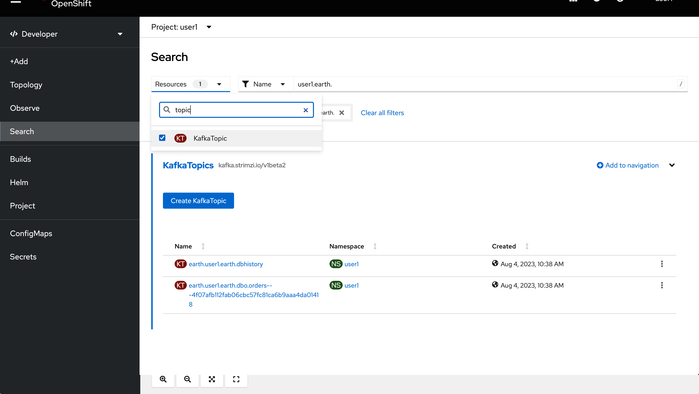

. Click on the *All services* option under _Development Catalog_.
+
image::images/add-from-catalog.png[OpenShift +Add, role="integr8ly-img-responsive"]

. Type in `kafka` in the search text field and then click on *KafkaConnect*.
+
image::images/openshift-kafkaconnect.png[OpenShift KafkaConnect, role="integr8ly-img-responsive"]

. Click on *Create* button.
+

. Create a `KafkaConnect` Kubernetes Custom Resource to define your connector. Replace the _YAML_ editor with the following code:
+
[source,yaml,subs="attributes+"]
----
apiVersion: kafka.strimzi.io/v1beta2
kind: KafkaConnect
metadata:
  name: debezium
  annotations:
    strimzi.io/use-connector-resources: "true"
spec:
  bootstrapServers: 'earth-cluster-kafka-bootstrap.shared-kafka-earth.svc:9092'
  image: 'quay.io/redhatintegration/rhi-cdc-connect:2022-Q4'
  replicas: 1
  resources:
    requests:
      memory: 2Gi
    limits:
      memory: 2Gi
  jvmOptions:
    gcLoggingEnabled: false
  config:
    group.id: {user-username}-debezium-cluster
    offset.storage.topic: {user-username}-debezium-cluster-offsets
    config.storage.topic: {user-username}-debezium-cluster-configs
    status.storage.topic: {user-username}-debezium-cluster-status
----

. Click on *Create* button.
+
image::images/openshift-kafkaconnect-detail.png[OpenShift Kafka Resource, role="integr8ly-img-responsive"]

=== Configure KafkaConnect CDC Connector

When you have created a container image for your connector plug-in, you need to create a connector instance in your Kafka Connect cluster. You can then configure, monitor, and manage a running connector instance.

AMQ Streams provides two APIs for creating and managing connectors:

* KafkaConnector resources (referred to as KafkaConnectors)
* Kafka Connect REST API

*KafkaConnectors* allow you to create and manage connector instances for Kafka Connect in an OpenShift-native way, so an HTTP client such as cURL is not required. Like other Kafka resources, you declare a connector’s desired state in a *KafkaConnector* _YAML_ file that is deployed to your OpenShift cluster to create the connector instance.

. In the topology view, click *+Add* on the left menu.

. Click on the *From Catalog* option.

. Type in `kafka` in the search text field and then click on *Kafka connector*.
+
--

[IMPORTANT]
====
Double check that you are selecting *KafkaConnector* and not _KafkaConnect_. Notice the *or* at the end.
====
--

. Click on Create button.
+

. Replace the contents of the YAML editor with the following code:
+
[source,yaml,subs="attributes+"]
----
apiVersion: kafka.strimzi.io/v1beta2
kind: KafkaConnector
metadata:
  name: orders-connector
  labels:
    strimzi.io/cluster: debezium
spec:
  class: io.debezium.connector.sqlserver.SqlServerConnector
  tasksMax: 1
  config:
    connector.class: "io.debezium.connector.sqlserver.SqlServerConnector"
    database.hostname: "mssql-server-linux.shared-db-earth.svc"
    database.port: "1433"
    database.user: "sa"
    database.password: "Password!"
    database.dbname: "InternationalDB"
    database.server.name: "{user-username}.earth"
    table.whitelist: "dbo.Orders"
    database.history.kafka.bootstrap.servers: "earth-cluster-kafka-bootstrap.shared-kafka-earth.svc:9092"
    database.history.kafka.topic: "{user-username}.earth.dbhistory"
----

. Click the *Create* button to submit the configuration.
+
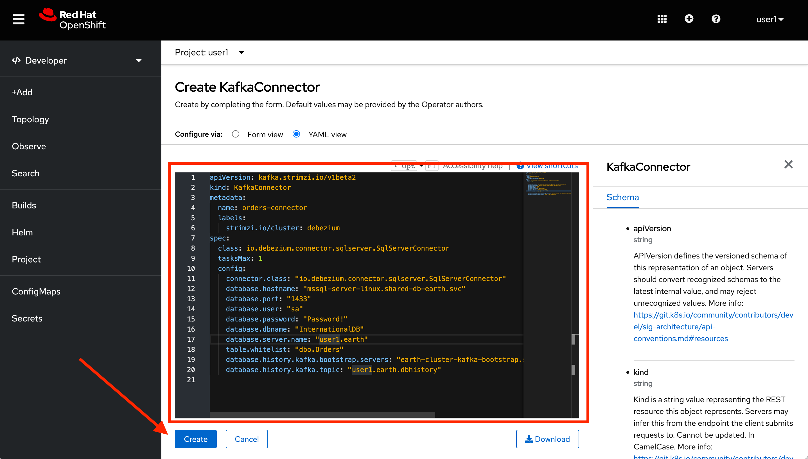

. Check the log in the *debezium-cluster* deployment.
+
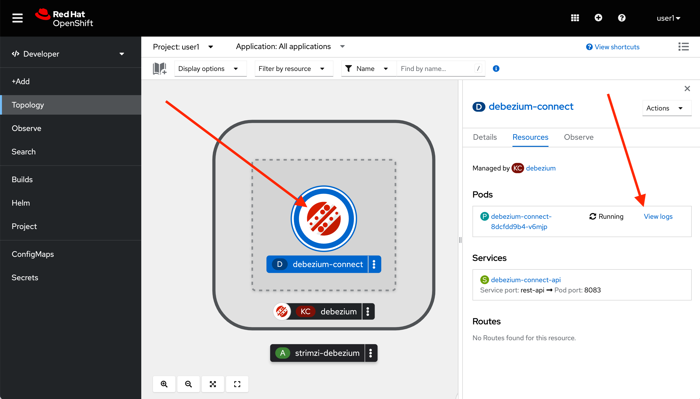

. You should see something similar to the following.
+
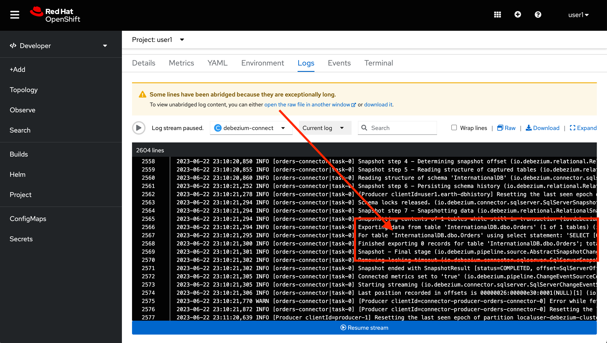

[type=verification]
Did the connector started correctly and is now reading the database transaction log?
[type=verificationFail]
{standard-fail-text}

[time=15]
[id="loading-earth-orders"]
== Loading Earth Orders

It's now time to test the Change Data Capture integration.

- We will first load the CSV data into MSSQL using a PHP app
- Debezium will populate data from MSSQL into the Earth Kafka topic

Let's get started!

=== Loading Orders File

. Download to your local system the link:https://raw.githubusercontent.com/RedHatWorkshops/dayinthelife-streaming/master/support/module-2/earth-orders.csv[Earth Orders File, window="_blank"].

. Navigate to the legacy PHP link:http://www-shared-app-earth.{openshift-app-host}/#{user-username}[Enterprise System, window="_blank"] in a new browser tab.
+
[IMPORTANT]
====
Make sure that /#{user-username} is added at the end of the URL. You won't be able to load the file if your are missing this part.
====
+
image:images/www-main.png[PHP System]

. Click on the *Choose File* button to load the _orders_ file.
+
image:images/www-choose-file.png[Choose File]

. Load the _CSV_ file you just downloaded. Click on *Open* button.
+
image:images/www-orders-file.png[Orders File]

. Now, click the *Load File* button. This will load the file orders and insert them in the database.
+
image:images/www-load-file.png[Load File]

.  Wait a few seconds for the information to load. If this is successfully completed, you will see the CSV data on the *Imported Orders* page.
+
image::images/www-imported-orders.png[Imported Orders]

=== Check Database Records

After loading the file into the system, the orders data should be stored in the MSSQL Server database. Let's check to make sure that's the case.

. Go back to your IDE terminal window and issue the following command to query the first 5 records in the database:
+
[source,bash,subs="attributes+"]
----
sqlcmd -S mssql-server-linux.shared-db-earth.svc \
  -U sa -P Password! -d InternationalDB \
  -Q "select top 5 * from dbo.Orders where OrderUser='{user-username}'"
----

. You should see an output similar to the following:
+
----
OrderId     OrderType OrderItemName                                      Quantity    Price                                              ShipmentAddress                                                                                      ZipCode    OrderUser 
----------- --------- -------------------------------------------------- ----------- -------------------------------------------------- ---------------------------------------------------------------------------------------------------- ---------- ----------
          1 E         Lime                                                       100 3.69                                               541-428 Nulla Avenue                                                                                 4286       user1     
          2 E         Lemon Bar                                                   17 0.09                                               Ap #249-5876 Magna. Rd.                                                                              I9E 0JN    user1     
          3 E         Fruit Punch                                                 16 7.76                                               525-8975 Urna. Street                                                                                13965      user1     
          4 E         Bubble Gum                                                 185 5.77                                               473-8850 Tellus Street                                                                               657101     user1     
          5 E         Green Onion                                                 84 5.17                                               Ap #535-7695 Fringilla Street                                                                        70060      user1     

(5 rows affected)
----

[type=verification]
Were you able to see that your Change Data Capture connector has access to Kafka?

[type=verificationFail]
{standard-fail-text}

=== Check Apache Kafka Records

We checked that the database had the _orders_ data. Is now time to check that the Change Data Capture connector was able to query the transaction log and generate the Apache Kafka events to the cluster.

. Go back to the topology view of the OpenShift Developer console. Change the project to the `shared-kafka-earth`.
+
image:images/openshift-project-sharedkafka.png[Change Project]

. Validate that the *KafkaTopics* were created.
+
====
- Click on *Search* to load the _resources_ search page.
- Click on the _Resources_ field and type 'topic'.
- Finally check *KafkaTopic*.
====
+
{blank}
+
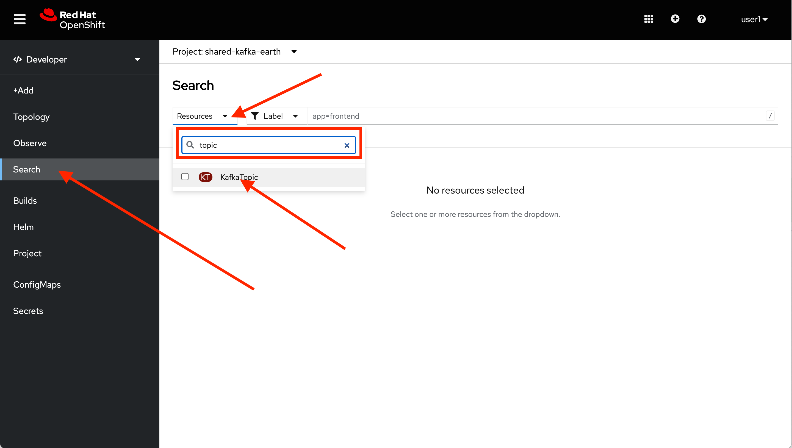

. Filter the results for your username by selecting `Name` and then typing `{user-username}` in the text field
+
image::images/openshift-search-filter.png[Search KafkaTopics]

. This will display the topics on the *Earth* _Kafka cluster_. You should be able to locate your `{user-username}-debezium-cluster*` as well as the `{user-username}.earth.dbo.orders--*` _KafkaTopics_.
+

=== Inspect Kafka records

Time to check what information is flowing into Apache Kafka.

. Go back to the IDE Terminal. We will use https://github.com/edenhill/kcat[kcat, window="_blank"] CLI tool to access the information in the Kafka cluster and https://jqlang.github.io/jq/[jq] to pretty format the JSON output.

. Execute the following command to retrieve the last 5 records from the `Orders` topic.
+
[source,bash,subs="attributes+"]
----
kcat -b earth-cluster-kafka-bootstrap.shared-kafka-earth.svc -t {user-username}.earth.dbo.Orders -o 995 -e | jq
----
+
[NOTE]
====
We are using the `-o 995` to indicate that we want to retrieve from this offset number. You can remove it and execute it again to retrieve all the 1000 records we inserted. 
====

. You should see the json output of the messages. Something like this:
+
[source,bash,subs="attributes+"]
----
...
  "payload": {
    "before": null,
    "after": {
      "OrderId": 1000,
      "OrderType": "E",
      "OrderItemName": "Mocha Irish Cream",
      "Quantity": 168,
      "Price": "4.30",
      "ShipmentAddress": "P.O. Box 511, 4483 Ornare Rd.",
      "ZipCode": "C5X 6L8",
      "OrderUser": "user1"
    },
    "source": {
      "version": "1.9.7.Final-redhat-00003",
      "connector": "sqlserver",
      "name": "user1.earth",
      "ts_ms": 1687476213463,
      "snapshot": "false",
      "db": "InternationalDB",
      "sequence": null,
      "schema": "dbo",
      "table": "Orders",
      "change_lsn": "00000027:000022f0:0002",
      "commit_lsn": "00000027:000022f0:0003",
      "event_serial_no": 1
    },
    "op": "c",
    "ts_ms": 1687476214879,
    "transaction": null
  }
}
----

[type=verification]
Were you able to capture the changes in the MSSQL server database and generate Apache Kafka events using Change Data Capture?

[type=verificationFail]
{standard-fail-text}

[time=5]
[id="deploying-apache-kafka"]
== Deploying Apache Kafka on OpenShift

The AMQ Streams component uses powerful operators that simplify the deployment, configuration, management, and use of Apache Kafka on Red Hat OpenShift® Container Platform.

In this section you will learn how to start a local Kafka cluster that will represent the startup _Moon_ deployment.

. Go back to the OpenShift Developer console.

. Change back to the `{user-username}` project and click on *+Add* menu on the left side bar.
+
image:images/openshift-kafka-add.png[Add From Topology]
+
[IMPORTANT]
====
Be sure to switch back to your working `{user-username}` project
====

. Click on the *From Catalog* option.
+
image::images/add-from-catalog.png[OpenShift From Catalog, role="integr8ly-img-responsive"]

. Type in `kafka` in the search text field and then click on *Kafka*.
+

. Click on *Create* button.
+

. Create a `Kafka` Kubernetes Resource to define your Apache Kafka Cluster. Replace the _YAML_ editor with the following code:
+
[source,yaml,subs="attributes+"]
----
apiVersion: kafka.strimzi.io/v1beta2
kind: Kafka
metadata:
  name: moon
spec:
  entityOperator:
    topicOperator: {}
    userOperator: {}
  kafka:
    listeners:
      - name: plain
        port: 9092
        type: internal
        tls: false
      - name: tls
        port: 9093
        type: internal
        tls: true
      - name: external
        port: 9094
        type: route
        tls: true
    replicas: 3
    storage:
      type: ephemeral
  zookeeper:
    replicas: 3
    storage:
      type: ephemeral
----

. Click on *Create* button.
+
image::images/openshift-kafka-resource.png[OpenShift Kafka Resource, role="integr8ly-img-responsive"]

. Wait for the cluster to start. It can take a few minutes as the operator will deploy your Kafka cluster infrastructure and related operators to manage it.
+
image:images/openshift-kafka-topology.png[Kafka Topology]

[type=verification]
Did all 3 Kafka resources (Kafka brokers, Zookeeper and Operator) startup OK?

[type=verificationFail]
{standard-fail-text}

[time=15]
[id="replicating-to-other-kafka-clusters"]
== Replicating to other Kafka clusters

We refer to the process of replicating data between Kafka clusters as "mirroring" to avoid confusion with the replication that happens amongst the nodes in a single cluster. Kafka comes with a tool for mirroring data between Kafka clusters.

The Cluster Operator deploys one or more Kafka Mirror Maker 2 replicas to replicate data between Kafka clusters. The Mirror Maker consumes messages from the source cluster and republishes those messages to the target cluster. A common use case for this kind of mirroring is to provide a replica in another datacenter.

=== Deploy Mirror Maker 2

. Deploy the mirror maker cluster to _mirror_ the data from _Earth_ to _Moon_. (We mean from the Earth Kafka cluster to the Moon Kafka cluster)

. Go back to the OpenShift Developer console and click on *+Add* menu on the left side bar.
+
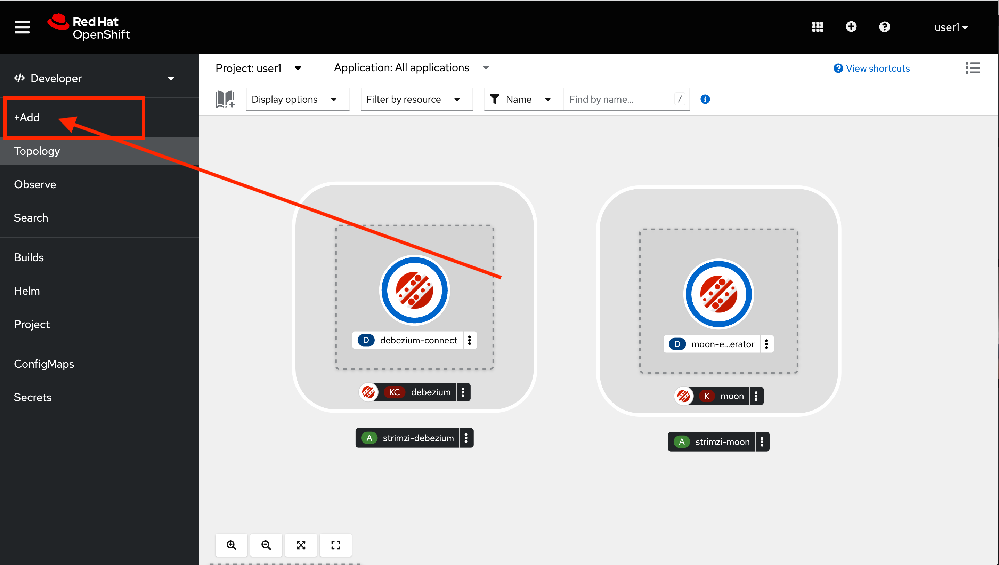

. Click on the *From Catalog* option.
+
image::images/add-from-catalog.png[OpenShift From Catalog, role="integr8ly-img-responsive"]

. Type in `mirror` in the search text field and then click on *Kafka MirrorMaker*.
+
image::images/openshift-mirrormaker-catalog.png[OpenShift Mirror Maker, role="integr8ly-img-responsive"]

. Click on *Create* button.
+

. Create a `KafkaMirrorMaker2` Kubernetes Resource to define your Mirror Maker Cluster. Replace the _YAML_ editor with the following code:
+
[source,yaml,subs="attributes+"]
----
kind: KafkaMirrorMaker2
apiVersion: kafka.strimzi.io/v1beta2
metadata:
  name: earth-moon
spec:
  version: 3.4.0
  replicas: 1
  connectCluster: moon
  clusters:
    - alias: earth
      bootstrapServers: 'earth-cluster-kafka-bootstrap.shared-kafka-earth.svc:9092'
    - alias: moon
      bootstrapServers: 'moon-kafka-bootstrap.{user-username}.svc:9092'
      config:
        config.storage.replication.factor: -1
        offset.storage.replication.factor: -1
        status.storage.replication.factor: -1
  mirrors:
    - sourceCluster: earth
      targetCluster: moon
      sourceConnector:
        config:
          replication.factor: -1
          offset-syncs.topic.replication.factor: -1
          sync.topic.acls.enabled: 'false'
      checkpointConnector:
        config:
          checkpoints.topic.replication.factor: -1
      topicsPattern: {user-username}.earth.*
      groupsPattern: .*
----

. Click on *Create* button.
+
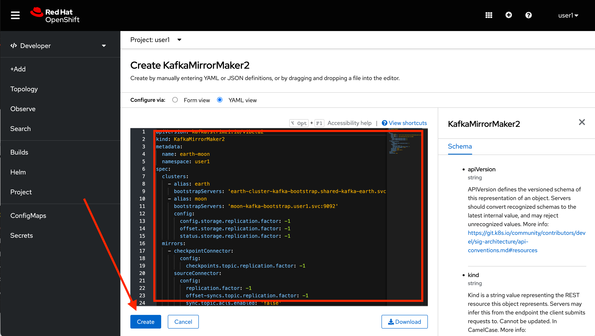

. Wait for cluster to start.  It can take a few minutes as the operator will deploy your Kafka cluster infrastructure and related operators to manage it.
+
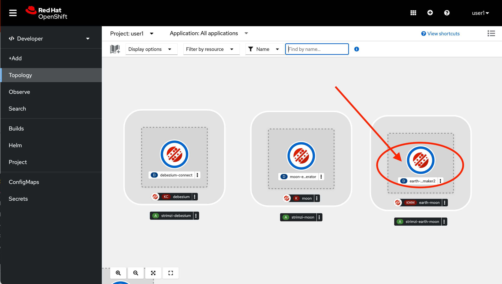

=== Review Mirrored Records

. Validate that the *KafkaTopics* were created.
+
--
. Expand the *More* menu on the left menu bar.

. Click on *Search* to load the _resources_ search page.

. Click on the _Resource Type_ field and type 'topic'.

. Finally check *KafkaTopic*.
--
+
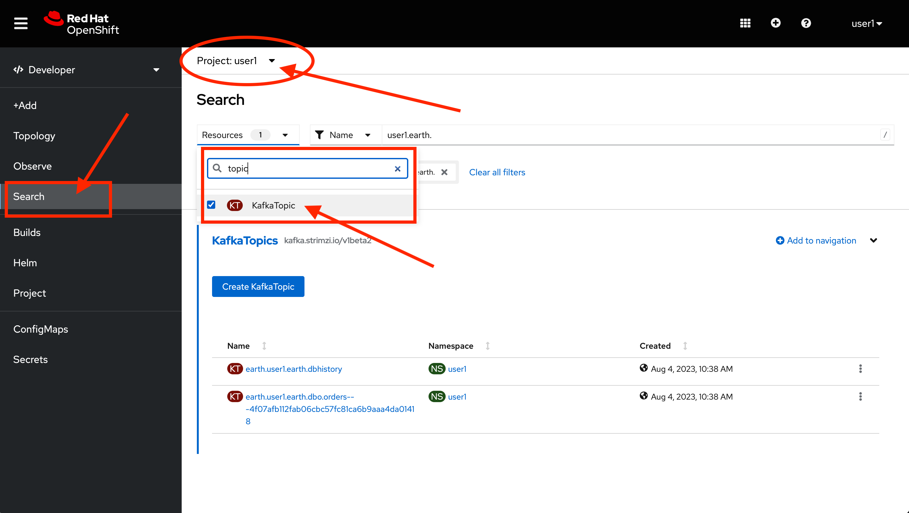

. This will display the topics on the *Moon* _Kafka cluster_. You should be able to locate your `{user-username}.earth.dbo.orders--*` _KafkaTopic_.
+
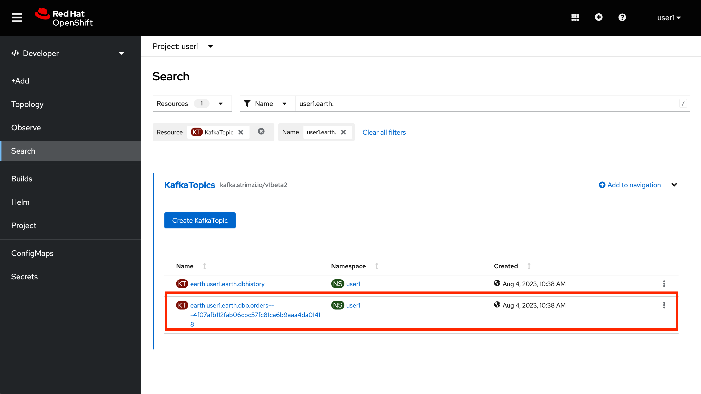
+
[NOTE]
====
This time there is no need to filter the topics, as this _moon_ cluster is only yours.
====

[type=verification]
Were you able to verify the Kafka Topic?  Good, this means that Mirror Maker was able to mirror the data from the _earth_ cluster to the *Moon*.

[type=verificationFail]
{standard-fail-text}

[time=15]
[id="enabling-http-access"]
== Enabling HTTP access to Kafka

Apache Kafka uses a custom protocol on top of TCP/IP for communication between applications and the cluster. There are many client implementations for different programming languages, from Java to Golang, from Python to C# and many more.

However, there are scenarios where it is not possible to use the clients, or indeed the native protocol. Communicating with an Apache Kafka cluster using a standard protocol like HTTP/1.1 eases development in these scenarios.

=== Deploy the HTTP Bridge Proxy

. Go back to the OpenShift Developer console and click on *+Add* menu on the left side bar.
+

. Click on the *From Catalog* option.
+
image::images/add-from-catalog.png[OpenShift From Catalog, role="integr8ly-img-responsive"]

. Type in `kafka` in the search text field and then click on *Kafka Bridge*.
+
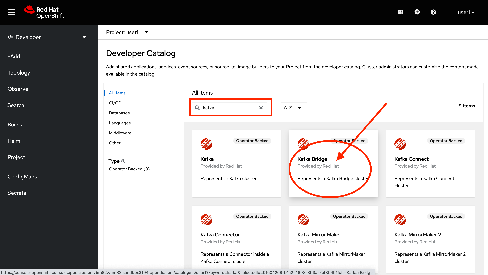

. Click on *Create* button.
+

. Create a `KafkaBridge` Kubernetes Resource to define your HTTP Bridge proxy. Replace the _YAML_ editor with the following code:
+
[source,yaml,subs="attributes+"]
----
apiVersion: kafka.strimzi.io/v1beta2
kind: KafkaBridge
metadata:
  name: http
spec:
  bootstrapServers: 'moon-kafka-bootstrap.{user-username}.svc:9092'
  http:
    port: 8080
  replicas: 1
----

. Click on *Create* button.
+
image::images/openshift-bridge-details.png[OpenShift Kafka Resource, role="integr8ly-img-responsive"]

. Wait for the bridge to start.
+

. From the Dev Spaces terminal, expose the bridge HTTP REST API service as a route for external access.
+
[source,bash,subs="attributes+"]
----
oc expose service http-bridge-service --name kafka-bridge -n {namespace}
----

=== Test the HTTP Bridge

. Create a consumer to test the connection to your topic. Issue the following command from the terminal:
+
[source,bash,subs="attributes+"]
----
http http-bridge-service.{user-username}.svc:8080/consumers/{user-username}-http-group \
  'content-type: application/vnd.kafka.v2+json' \
  name=user1 \
  format=json \
  'auto.offset.reset'=earliest \
  'enable.auto.commit':=false \
  'fetch.min.bytes':=1024 \
  'consumer.request.timeout.ms':=30000
----

. Notice the return json `base_uri`, it represents the REST resource for your consumer.
+
[source,bash,subs="attributes+"]
----
HTTP/1.1 200 OK
content-length: 121
content-type: application/vnd.kafka.v2+json

{
    "base_uri": "http://http-bridge-service.{user-username}.svc:8080/consumers/{user-username}-http-group/instances/{user-username}",
    "instance_id": "{user-username}"
}
----

. Use the previous **base_uri** to request subscription to the topics.
+
[source,bash,subs="attributes+"]
----
http http-bridge-service.{user-username}.svc:8080/consumers/{user-username}-http-group/instances/{user-namespace}/subscription \
  'content-type: application/vnd.kafka.v2+json' \
  topics[]='earth.{user-username}.earth.dbo.Orders'
----

. Now you can start to consume some records. Notice that you need to send `json` as the accept type.
+
[source,bash,subs="attributes+"]
----
http http-bridge-service.{user-username}.svc:8080/consumers/{user-username}-http-group/instances/{user-username}/records 'accept: application/vnd.kafka.json.v2+json'
----
+
[NOTE]
====
The first call to the service will return an empty string as it just created the consumer and subscribed to the topic.
====

. Call the command again, it will start to retrieve batchs of records. Keep repeating until there is no more records to read.
+
[TIP]
====
You can take notice of the `offset` returned in the records to know how many messages have been read.
====

[type=verification]
Were you able to successfully retrieve CDC data over HTTP?  *Congratulations!* You just finished capturing data from a MSSQL database into Kafka, then replicate that information to a different Kafka cluster. Finally you were able to retrieve the information using an HTTP interface.

[type=verificationFail]
{standard-fail-text}

[time=5]
[id="summary"]
== Summary

In this lab you used Debezium CDC connectors to react to change events from SQL Server and send them to Apache Kafka running on OpenShift through Red Hat AMQ streams.

Open source connectors enable integrations with your local systems landscape. Explore Kafka, Camel, and Debezium connectors to connect APIs and services for event-driven application architectures (EDA). Red Hat offers supported versions of these connectors via AMQ Streams and Fuse.

You can now proceed to link:{next-lab-url}[Lab 3].

[time=4]
[id="further-reading"]
== Notes and Further Reading

* https://www.redhat.com/en/products/application-foundations[Red Hat Application Foundations]
* https://developers.redhat.com/topics/event-driven[Event-driven architecture for microservices]
* https://developers.redhat.com/topics/stream-processing[Stream processing resources]
