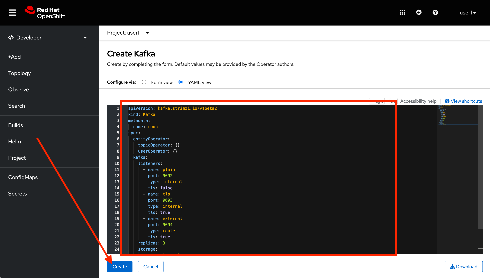
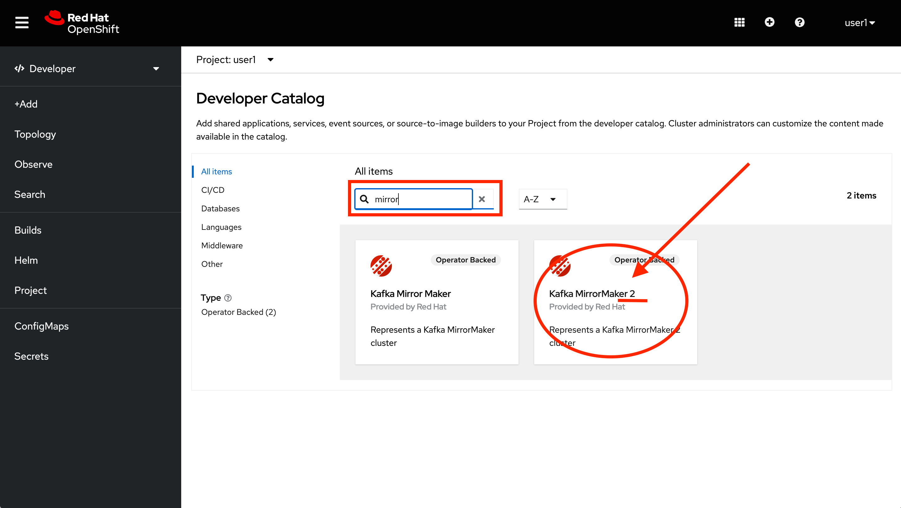
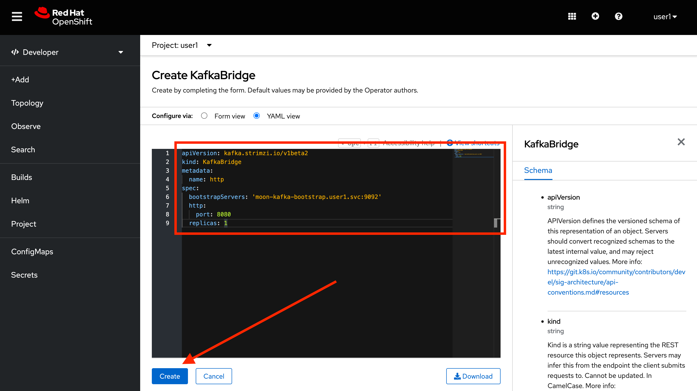

:walkthrough: Stream change events from your database
:che-url: http://che-che.{openshift-app-host}/
:terminal-url: https://terminal-terminal.{openshift-app-host}/hub/user/{user-username}
:next-lab-url: https://tutorial-web-app-webapp.{openshift-app-host}/tutorial/dayinthelife-streaming.git-labs-03-Cloud-Native-Integration/
:user-password: openshift

ifdef::env-github[]
:next-lab-url: ../lab03/walkthrough.adoc
endif::[]

[id='change-data-capture']
= Lab 2 - Change Data Capture

In this lab you will enable Change Data Capture (CDC) for a legacy application that loads the customer orders from a comman separated value (CSV) file. This old PHP application can't be modified so there is no way to modernize it without risks. You will enable CDC on the SQL server database where the orders are stored and create a Kafka Connect deployment using AMQ streams to emit data change events to the Earth Apache Kafka cluster.

*Audience:* Enterprise Integrators, System Architects, Developers, Data Integrators

*Overview*

Apache Kafka is the de facto standard for asynchronous event propagation between microservices. Things get challenging, though, when adding a service’s database to the picture: how can you avoid inconsistencies between Kafka and the database?

Enter Change Data Capture (CDC) and Debezium. By capturing changes from the log files of the database, Debezium gives you both reliable and consistent inter-service messaging via Kafka and instant read-your-own-write semantics for services themselves.

*Why Red Hat?*

To respond to business demands quickly and efficiently, you need a way to integrate applications and data spread across your enterprise. Red Hat® AMQ—based on open source communities like Apache ActiveMQ and Apache Kafka—is a flexible messaging platform that delivers information reliably, enabling real-time integration and connecting the Internet of Things (IoT).

AMQ streams component makes Apache Kafka “OpenShift native” through the use of powerful operators that simplify the deployment, configuration, management, and use of Apache Kafka on OpenShift.

*Credentials*

Use the following credentials to login into the web consoles:

Your username is: `{user-username}` +
Your password is: `{user-password}`

[type=walkthroughResource,serviceName=codeready]
.Red Hat CodeReady Workspaces
****
* link:{che-url}[Console, window="_blank", , id="resources-codeready-url"]
****
[type=walkthroughResource]
.Red Hat OpenShift Developer Console
****
* link:{openshift-host}/topology/ns/{user-username}[Topology View, window="_blank"]
****

:sectnums:

[time=10]
[id="configure-cdc-connectors"]
== Configure CDC connectors for Kafka Connect

There is already a legacy Kafka deployment running. We will then deploy a KafkaConnect CDC connector to connect to that cluster while we extract the data from the SQL Server Database.

=== Deploy KafkaConnect CDC Connector

. Go back, or Open a new tab with the OpenShift Developer Console link:{openshift-host}/topology/ns/{user-username}[Topology View, window="_blank"].
+
[IMPORTANT]
====
Be sure to be in your _{user-username}_ project
====

. Click *+Add* on the left menu.
+
image::images/topology-add.png[Topology Add, role="integr8ly-img-responsive"]

. Click on the *From Catalog* option.
+
image::images/add-from-catalog.png[OpenShift From Catalog, role="integr8ly-img-responsive"]

. Type in `kakfa` in the search text field and then click on *KafkaConnect*.
+

. Click on *Create* button.
+
image::images/openshift-create-kafkaconnect.png[OpenShift KafkaConnect, role="integr8ly-img-responsive"]

. Create a `KafkaConnect` Kubernetes Custom Resource to define your connector. Replace the _YAML_ editor with the following code:
+
[source,yaml,subs="attributes+"]
----
apiVersion: kafka.strimzi.io/v1beta1
kind: KafkaConnect
metadata:
  name: debezium
spec:
  bootstrapServers: 'earth-cluster-kafka-bootstrap.shared-kafka-earth.svc:9092'
  image: 'quay.io/hguerreroo/debezium-connect:0.10.0-sqlsrv'
  replicas: 1
  jvmOptions:
    gcLoggingEnabled: false
  config:
    group.id: {user-username}-connect-cluster
    offset.storage.topic: {user-username}-connect-cluster-offsets
    config.storage.topic: {user-username}-connect-cluster-configs
    status.storage.topic: {user-username}-connect-cluster-status
----

. Click on *Create* button.
+
image::images/openshift-kafkaconnect-detail.png[OpenShift Kafka Resource, role="integr8ly-img-responsive"]

=== Configure KafkaConnect CDC Connector

. Go back to the CodeReady IDE and expose the Kafka Connect REST API by running this command on the *Terminal* window.
+
[source,bash,subs="attributes+"]
----
oc expose service debezium-connect-api --name kafka-connect -n {user-username}
----
+
[IMPORTANT]
====
Remember to be logged into OpenShift and be in the correct _working_ project.
====

. Go back to the OpenShift developer console and open the topology view by clicking *Topology* in the left side menu
+
image:images/openshift-kafkaconnect-resource.png[Back To Topology]

. Wait for the default deployment to finish and deploy the required pod. Remember to wait for the dark blue circles.
+
image:images/topology-kafkaconnect.png[KakfaConnect Topology]

. Check that everything deployed correctly by clicking the *Open URL* icon.

. You should be able to see the information of the Kafka cluster version like the following:
+
[source,json,subs="attributes+"]
----
{"version":"2.2.1.redhat-00002","commit":"c330425647372ca2","kafka_cluster_id":"g0lUt2NARWSPxFn1Aq3uTw"}
----

. Now that we know that the Kafka Connect cluster is running, let's create a new connector config to react to changes in the `Orders` table. Issue the following command in the CodeReady Terminal window:
+
[source,bash,subs="attributes+"]
----
cat << EOF | curl -X POST -H "Accept:application/json" -H "Content-Type:application/json" http://kafka-connect-{user-username}.{openshift-app-host}/connectors -d @-
{
  "name": "orders-connector",
  "config": {
    "connector.class": "io.debezium.connector.sqlserver.SqlServerConnector",
    "database.hostname": "mssql-server-linux.shared-db-earth.svc",
    "database.port": "1433",
    "database.user": "sa",
    "database.password": "Password!",
    "database.dbname": "InternationalDB",
    "database.server.name": "{user-username}.earth",
    "table.whitelist": "dbo.Orders",
    "database.history.kafka.bootstrap.servers": "earth-cluster-kafka-bootstrap.shared-kafka-earth.svc:9092",
    "database.history.kafka.topic": "{user-username}.earth.dbhistory"
  }
}
EOF
----

. If the last command was successful. you should get the following output as return:
+
[source,json,subs="attributes+"]
----
{"name":"orders-connector","config":{"connector.class":"io.debezium.connector.sqlserver.SqlServerConnector","database.hostname":"mssql-server-linux.shared-db-earth.svc","database.port":"1433","database.user":"sa","database.password":"Password!","database.dbname":"InternationalDB","database.server.name":"{user-username}.earth","table.whitelist":"dbo.Orders","database.history.kafka.bootstrap.servers":"earth-cluster-kafka-bootstrap.shared-kafka-earth.svc:9092","database.history.kafka.topic":"{user-username}.earth.dbhistory","name":"orders-connector"},"tasks":[],"type":"source"}
----

[type=verification]
Did you receive the orders-connector response from the SqlServerConnector?
[type=verificationFail]
Verify that you followed each step in the procedure above. If you are still having issues, contact your administrator.

[time=10]
[id="loading-earth-orders"]
== Loading Earth Orders

It's now time to test the Change Data Capture integration.

- We will first load the CSV data into MSSQL using a PHP app
- Debezium will populate data from MSSQL into the Earth Kafka topic

Let's get started!

=== Loading Orders File

. Download to your local system the link:https://raw.githubusercontent.com/RedHatWorkshops/dayinthelife-streaming/master/support/module-1/earth-orders.csv[Earth Orders File, window="_blank"].

. Navigate to the legacy PHP link:http://www-shared-app-earth.{openshift-app-host}/#{user-username}[Enterprise System, window="_blank"] in a new browser tab.
+
[IMPORTANT]
====
Make sure that /#{user-username} is added at the end of the URL. You won't be able to load the file if your are missing this part.
====
+
image:images/www-main.png[PHP System]

. Click on the *Choose File* button to load the _orders_ file.
+
image:images/www-choose-file.png[Choose File]

. Load the _CSV_ file you just downloaded. Click on *Open* button.
+
image:images/www-orders-file.png[Orders File]

. Now, click the *Load File* button. This will load the file orders and insert them in the database.
+
image:images/www-load-file.png[Load File]

.  Wait a few seconds for the information to load. If this is successfully completed, you will see the CSV data on the *Imported Orders* page.
+
image::images/www-imported-orders.png[Imported Orders]

=== Check Database Records

After loading the file into the system, the orders data  should be storee in the MSSQL Server database. Let's check to make sure that's the case.

. Go back to the topology view of the OpenShift Developer console. Change the project to the `shared-db-earth`.
+
image:images/openshift-change-project.png[Change Project]

. Click on the database deployment to open the overview page. Then click on the *Resources* tab and next the _Pod_ name.
+
image:images/openshift-db-overview.png[Access Pod]

. Now, click on the *Terminal* tab to access the pod's shell.
+
image:images/openshift-db-terminal.png[Pod Terminal]
+
[TIP]
====
If you feel comfortable, you can also use the OpenShift CLI command `oc rsh` to access the database pod as well.
====

. Run the following command to access the database:
+
[source,bash,subs="attributes+"]
----
/opt/mssql-tools/bin/sqlcmd -S mssql-server-linux -U sa -P Password! -d InternationalDB -Q "select top 5 * from dbo.Orders where OrderUser='{user-username}'"
----

. Check the results, should look like this:
+
image::images/openshift-sqlcommand.png[Query]

=== Check Apache Kafka Records

We checked that the database had the _orders_ data. Is now time to check that the Change Data Capture connector was able to query the transaction log and generate the Apache Kafka events to the cluster.

. Go back to the topology view of the OpenShift Developer console. Change the project to the `shared-kafka-earth`.
+

. Validate that the *KafkaTopics* were created.
+
- Expand the *Advanced* menu on the left menu bar.
- Click on *Search* to load the _resources_ search page.
- Click on the _Resource Type_ field and type 'topic'.
- Finally select *KafkaTopic*.
+
image::images/openshift-search-kafkatopics.png[Search KafkaTopics]

. This will display the topics on the *Earth* _Kafka cluster_. You should be able to locate your `{user-username}-connect-cluster*` as well as the `{user-username}.earth.dbo.orders--*` _KafkaTopics_.
+
image::images/openshift-cdc-topics.png[CDC KafkaTopics]
+
[TIP]
====
You can narrow the results by adding `{user-username}` to the search filter.
====

[type=verification]
Were you able to see that your Change Data Capture connector has access to Kafka?

[type=verificationFail]
Verify that you followed each step in the procedure above. If you are still having issues, contact your administrator.

=== Inspect Kafka records

Time to check what information is flowing into Apache Kafka.

. Go back to the topology view. We will access one of the Kafka brokers.

. Click on the `earth-cluster kafka` _stateful set_.

. Click on the *Resources* tab.

. Click on the `earth-cluster-kafka-0` pod to access the details.
+
image::images/openshift-kafka-deployment.png[Kafka Pods]

. Click on the *Terminal* tab to access this pod's shell.
+
image::images/openshift-kafka-terminal.png[Kafka Pods]
+
[IMPORTANT]
====
Red Hat provides its own complete Apache Kakfa distribution container images. We will use the `kafka-console-consumer.sh` script to query the topics.
====

. Issue the following command to read *all* the events in the `orders` topic:
+
[source,bash,subs="attributes+"]
----
bin/kafka-console-consumer.sh --bootstrap-server localhost:9092 --topic {user-username}.earth.dbo.Orders --from-beginning
----

. You should see the json output of the messages. Something like this:
+
[source,bash,subs="attributes+"]
----
...
{"type":"string","optional":true,"field":"change_lsn"},{"type":"string","optional":true,"field":"commit_lsn"}],"optional":false,"name":"io.debezium.connector.sqlserver.Source","field":"source"},{"type":"string","optional":false,"field":"op"},{"type":"int64","optional":true,"field":"ts_ms"}],"optional":false,"name":"user1.earth.dbo.Orders.Envelope"},"payload":{"before":null,"after":{"OrderId":1000,"OrderType":"E","OrderItemName":"Mocha Irish Cream","Quantity":168,"Price":"4.30","ShipmentAddress":"P.O. Box 511, 4483 Ornare Rd.","ZipCode":"C5X 6L8","OrderUser":"user1"},"source":{"version":"0.10.0.Beta2-redhat-00001","connector":"sqlserver","name":"user1.earth","ts_ms":1584993092410,"snapshot":"false","db":"InternationalDB","schema":"dbo","table":"Orders","change_lsn":"00000027:00000038:0002","commit_lsn":"00000027:00000038:0003"},"op":"c","ts_ms":1584993096494}}
----

[type=verification]
Were you able to capture the changes in the MSSQL server database and generate Apache Kafka events using Change Data Capture?

[type=verificationFail]
Verify that you followed each step in the procedure above. If you are still having issues, contact your administrator.

[time=5]
[id="deploying-apache-kafka"]
== Deploying Apache Kafka on OpenShift

The AMQ Streams component uses powerful operators that simplify the deployment, configuration, management, and use of Apache Kafka on Red Hat OpenShift® Container Platform.

In this section you will learn how to start a local Kafka cluster that will represent the startup _Moon_ deployment.

. Go back to the OpenShift Developer console.

. Change back to the `{user-username}` project and click on *+Add* menu on the left side bar.
+

+
[IMPORTANT]
====
Be sure to switch back to your working `{user-username}` project
====

. Click on the *From Catalog* option.
+
image::images/add-from-catalog.png[OpenShift From Catalog, role="integr8ly-img-responsive"]

. Type in `kakfa` in the search text field and then click on *Kafka*.
+
image::images/openshift-catalog-kafka.png[OpenShift Kafka, role="integr8ly-img-responsive"]

. Click on *Create* button.
+
image::images/openshift-create-kafka.png[OpenShift Kafka, role="integr8ly-img-responsive"]

. Create a `Kafka` Kubernetes Resource to define your Apache Kafka Cluster. Replace the _YAML_ editor with the following code:
+
[source,yaml,subs="attributes+"]
----
apiVersion: kafka.strimzi.io/v1beta1
kind: Kafka
metadata:
  name: moon
spec:
  entityOperator:
    topicOperator: {}
    userOperator: {}
  kafka:
    listeners:
      external:
        type: route
      plain: {}
      tls: {}
    replicas: 3
    storage:
      type: ephemeral
  zookeeper:
    replicas: 3
    storage:
      type: ephemeral
----

. Click on *Create* button.
+

. Go back to the topology view by clicking *Topology* in the left side menu
+
image:images/openshift-kafkas-list.png[Back To Topology]

. Wait for cluster to start it can take a few minutes as the operator will deploy your Kafka cluster infrastructure and related operators to manage it.
+

[type=verification]
Did all 3 Kafka resources (Kafka brokers, Zookeeper and Operator) startup OK?

[type=verificationFail]
Verify that you followed each step in the procedure above. If you are still having issues, contact your administrator.

[time=10]
[id="replicating-to-other-kafka-clusters"]
== Replicating to other Kafka clusters

We refer to the process of replicating data between Kafka clusters "mirroring" to avoid confusion with the replication that happens amongst the nodes in a single cluster. Kafka comes with a tool for mirroring data between Kafka clusters.

The Cluster Operator deploys one or more Kafka Mirror Maker replicas to replicate data between Kafka clusters. The Mirror Maker consumes messages from the source cluster and republishes those messages to the target cluster. A common use case for this kind of mirroring is to provide a replica in another datacenter.

=== Deploy Mirror Maker

. Deploy the mirror maker cluster to _mirror_ the data from _Earth_ to _Moon_. (We do mean from the Earth Kafka cluster to the Moon Kakfa cluster)

. Go back to the OpenShift Developer console and click on *+Add* menu on the left side bar.
+
image:images/openshift-mirrormaker-add.png[Add From Topology]

. Click on the *From Catalog* option.
+
image::images/add-from-catalog.png[OpenShift From Catalog, role="integr8ly-img-responsive"]

. Type in `mirror` in the search text field and then click on *Kafka MirrorMaker*.
+

. Click on *Create* button.
+
image::images/openshift-mirrormaker-create.png[OpenShift Mirror Maker, role="integr8ly-img-responsive"]

. Create a `KafkaMirrorMaker` Kubernetes Resource to define your Mirror Maker Cluster. Replace the _YAML_ editor with the following code:
+
[source,yaml,subs="attributes+"]
----
apiVersion: kafka.strimzi.io/v1beta1
kind: KafkaMirrorMaker
metadata:
  name: earth-moon
spec:
  replicas: 1
  consumer:
    bootstrapServers: 'earth-cluster-kafka-bootstrap.shared-kafka-earth.svc:9092'
    groupId: mirror-maker-{user-username}
    config:
      auto.offset.reset: earliest
  producer:
    bootstrapServers: 'moon-kafka-bootstrap.{user-username}.svc:9092'
  whitelist: {user-username}.earth.*
----

. Click on *Create* button.
+
image::images/openshift-mirromaker-detail.png[OpenShift Kafka Resource, role="integr8ly-img-responsive"]

. Go back to the topology view by clicking *Topology* in the left side menu
+
image:images/openshift-mirrormakers-list.png[Back To Topology]

. Wait for cluster to start.  It can take a few minutes as the operator will deploy your Kafka cluster infrastructure and related operators to manage it.
+
image:images/openshift-mirrormaker-topology.png[Mirror Maker Topology]

=== Review Mirrored Records

. Validate that the *KafkaTopics* were created.
+
--
. Expand the *Advanced* menu on the left menu bar.

. Click on *Search* to load the _resources_ search page.

. Click on the _Resource Type_ field and type 'topic'.

. Finally select *KafkaTopic*.
--
+
image::images/openshift-moon-kafkatopics.png[Search KafkaTopics]

. This will display the topics on the *Moon* _Kafka cluster_. You should be able to locate your `{user-username}.earth.dbo.orders--*` _KafkaTopic_.
+
image::images/openshift-moon-topics.png[CDC KafkaTopics]
+
[NOTE]
====
This time there is no need to filter the topics, as this _moon_ cluster is only yours.
====

[type=verification]
Were you able to verify the Kafka Topic?  Good, this means that Mirror Maker was able to mirror the data from the _earth_ cluster to the *Moon*.

[type=verificationFail]
Verify that you followed each step in the procedure above. If you are still having issues, contact your administrator.

[time=10]
[id="enabling-http-access"]
== Enabling HTTP access to Kafka

Apache Kafka uses a custom protocol on top of TCP/IP for communication between applications and the cluster. There are many client implementations for different programming languages, from Java to Golang, from Python to C# and many more.

However, there are scenarios where it is not possible to use the clients, or indeed the native protocol. Communicating with an Apache Kafka cluster using a standard protocol like HTTP/1.1 eases development in these scenarios.

=== Deploy the HTTP Bridge Proxy

. Go back to the OpenShift Developer console and click on *+Add* menu on the left side bar.
+
image:images/openshift-mirrormaker-add.png[Add From Topology]

. Click on the *From Catalog* option.
+
image::images/add-from-catalog.png[OpenShift From Catalog, role="integr8ly-img-responsive"]

. Type in `kafka` in the search text field and then click on *Kafka Bridge*.
+
image::images/openshift-bridge-catalog.png[OpenShift HTTP Bridge, role="integr8ly-img-responsive"]

. Click on *Create* button.
+
image::images/openshift-bridge-create.png[OpenShift HTTP Bridge, role="integr8ly-img-responsive"]

. Create a `KafkaBridge` Kubernetes Resource to define your HTTP Bridge proxy. Replace the _YAML_ editor with the following code:
+
[source,yaml,subs="attributes+"]
----
apiVersion: kafka.strimzi.io/v1alpha1
kind: KafkaBridge
metadata:
  name: http
spec:
  bootstrapServers: 'moon-kafka-bootstrap.{user-username}.svc:9092'
  http:
    port: 8080
  replicas: 1
----

. Click on *Create* button.
+

. Go back to the topology view by clicking *Topology* in the left side menu
+
image:images/openshift-bridge-list.png[Back To Topology]

. Wait for the bridge to start.
+
image:images/openshift-bridge-topology.png[Mirror Maker Topology]

. From the CodeReady terminal, expose the bridge HTTP REST API service as a route for external access.
+
[source,bash,subs="attributes+"]
----
oc expose service http-bridge-service --name kafka-bridge -n {user-username}
----

=== Test the HTTP Bridge

. Create a consumer to test the connection to your topic. Issue the following command from the terminal:
+
[source,bash,subs="attributes+"]
----
cat << EOF | curl -X POST http://kafka-bridge-{user-username}.{openshift-app-host}/consumers/{user-username}-http-group -H 'content-type: application/vnd.kafka.v2+json' -d @-
{
    "name": "{user-username}",
    "format": "json",
    "auto.offset.reset": "earliest",
    "enable.auto.commit": false,
    "fetch.min.bytes": 1024,
    "consumer.request.timeout.ms": 30000
}
EOF
----

. Notice the return json `base_uri`, it represents the REST resource for your customer.
+
[source,bash,subs="attributes+"]
----
{"instance_id":"user1","base_uri":"http://kafka-bridge-{user-username}.apps.cluster-eventing-6fbb.eventing-6fbb.example.
opentlc.com:80/consumers/{user-username}-http-group/instances/{user-username}"}
----

. Use the previous **base_uri** to request subscription to the topics.
+
[source,bash,subs="attributes+"]
----
curl -X POST http://kafka-bridge-{user-username}.{openshift-app-host}/consumers/{user-username}-http-group/instances/{user-username}/subscription -H 'content-type: application/vnd.kafka.v2+json' -d '{"topics": ["{user-username}.earth.dbo.Orders"]}'
----

. Now you can start to consume some records. Notice that you need to send `json` as the accept type.
+
[source,bash,subs="attributes+"]
----
curl http://kafka-bridge-{user-username}.{openshift-app-host}/consumers/{user-username}-http-group/instances/{user-username}/records -H 'accept: application/vnd.kafka.json.v2+json'
----
+
[NOTE]
====
The first call to the service will return an empty string as it just created the consumer and subscribed to the topic.
====

. Call the comand again, it will start to retrieve batchs of records. Keep repeating until there is no more records to read.
+
[TIP]
====
You can take notice of the `offset` returned in the records to know how many messages have been read.
====

[type=verification]
Were you able to successfully retrieve CDC data over HTTP?  *Congratulations!* You just finished capturing data from a MSSQL database into Kafka, then replicate that information to a different Kafka cluster. Finally you were able to retrieve the information using an HTTP interface.

[type=verificationFail]
Verify that you followed each step in the procedure above. If you are still having issues, contact your administrator.

[time=5]
[id="summary"]
== Summary

In this lab you used Debezium CDC connectors to react to change events from SQL Server and send them to Apache Kafka running on OpenShift through Red Hat AMQ streams.

Open source connectors enable integrations with your local systems landscape. Explore Kafka, Camel, and Debezium connectors to connect APIs and services for event-driven application architectures (EDA). Red Hat offers supported versions of these connectors via AMQ Streams and Fuse.

You can now proceed to link:{next-lab-url}[Lab 3].

[time=4]
[id="further-reading"]
== Notes and Further Reading

* https://www.redhat.com/en/technologies/jboss-middleware/amq[Red Hat AMQ]
* https://developers.redhat.com/topics/event-driven/connectors/[Camel & Debezium Connectors]
