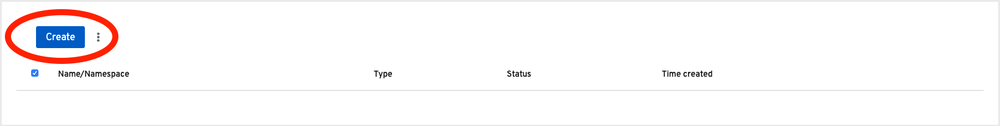
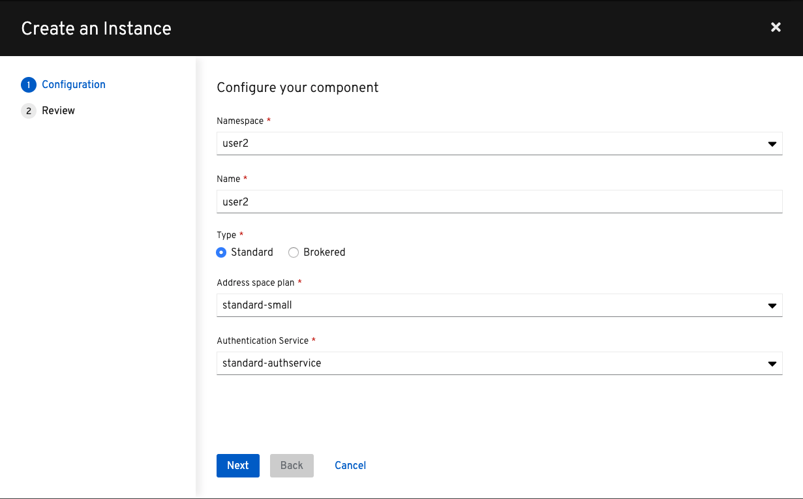
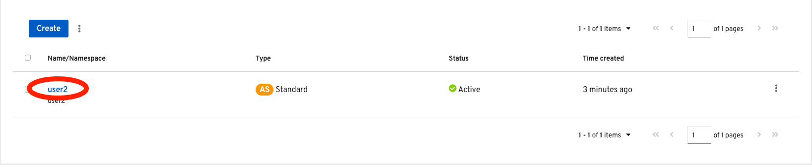
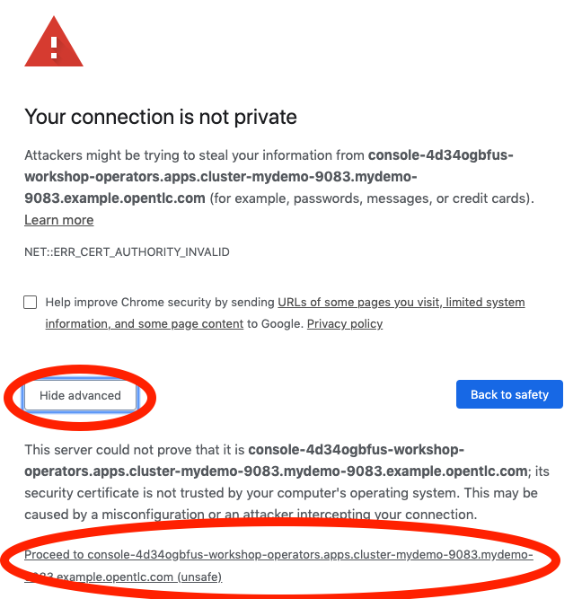

:walkthrough: Cloud-Native Integration with EIPs
:terminal-url: https://terminal-terminal.{openshift-app-host}/hub/user/{user-username}
:amqonline-url: https://console-workshop-operators.{openshift-app-host}/
:che-url: http://che-che.{openshift-app-host}/
:next-lab-url: https://tutorial-web-app-webapp.{openshift-app-host}/tutorial/dayinthelife-streaming.git-labs-04/
:user-password: openshift

ifdef::env-github[]
:next-lab-url: ../lab04/walkthrough.adoc
endif::[]

[id='cloud-native-integration']
= Lab 3 - Cloud-Native Integration with EIPs

In this lab you will stream events from an AMQ Online topic, use Enterprise Integration Patterns (EIPs) in Camel-K to split and route messages to a Datalake, in addition to streaming the messages to a Standard and Premium Shipping topic on Kafka.

Audience: Enterprise Integrators, System Architects, Developers, Data Integrators

*Overview*

Apache Kafka is the de facto standard for asynchronous event propagation between microservices. Things get challenging, though, when adding a service’s database to the picture: how can you avoid inconsistencies between Kafka and the database?

Enter change data capture (CDC) and Debezium. By capturing changes from the log files of the database, Debezium gives you both reliable and consistent inter-service messaging via Kafka and instant read-your-own-write semantics for services themselves.

*Why Red Hat?*

To respond to business demands quickly and efficiently, you need a way to integrate applications and data spread across your enterprise. Red Hat® AMQ—based on open source communities like Apache ActiveMQ and Apache Kafka—is a flexible messaging platform that delivers information reliably, enabling real-time integration and connecting the Internet of Things (IoT).

AMQ streams component makes Apache Kafka “OpenShift native” through the use of powerful operators that simplify the deployment, configuration, management, and use of Apache Kafka on OpenShift.

*Skipping The Lab*

*Credentials*

Your username is: `{user-username}` +
Your password is: `{user-password}`

[type=walkthroughResource]
.Che
****
* link:{che-url}/[Open Eclipse Che, window="_blank"]
****

[type=walkthroughResource]
.AMQ
****
* link:{amqonline-url}/[Open AMQ Online, window="_blank"]
****

[type=walkthroughResource,serviceName=openshift]
.Openshift
****
* link:{openshift-host}/[Open Console, window="_blank"]
****

[type=walkthroughResource]
.Terminal
****
* link:{terminal-url}/[Open Terminal, window="_blank"]
****

[time=5]
[id="provision-amq-topic"]
== Provision AMQ Topic.

. Navigate to the AMQ console: {amqonline-url}[AMQ Online, window="_blank", id="{context}-3"].  Click *Log in with OpenShift*.
+
image::images/1.1.1-login.png[1.1.1-login, role="integr8ly-img-responsive"]

. Login to AMQ Online using your credentials (`{user-username}` and `{user-password}`). Click *Log In*.
+
image::images/1.1.2-login.png[1.1.2-login, role="integr8ly-img-responsive"]

. Click the *Create* button.
+

. Create an Address Space using the following details, then click *Next* and finally *Finish*:

** Namespace: *`{user-username}`*
** Name: *`{user-username}`*
** Type: *`Standard`*
** Address space plan: *`standard-small`*
** Authentication Service: *`standard-authservice`*
+

. Wait a few minutes for the Address Space to provision in your OpenShift namespace. Once the *Status* turns to `Active`, click on the *{user-username}* link.
+

. If you receive a certificate warning, click *Hide advanced* then *Proceed...*
+

. Click the *+ Create* button to create the topic.
+
image::images/1.1.7-create-topic.png[1.1.7-create-topic, role="integr8ly-img-responsive"]

. Enter the following details, then click *Next*:
** Name: *`mytopic`*
** Type: *topic*
+
image::images/1.1.8-topic-details.png[1.1.8-topic-details, role="integr8ly-img-responsive"]

. Choose `Small Topic` then click *Next* and finally *Create*.
+
image::images/1.1.9-topic-details.png[1.1.9-topic-details, role="integr8ly-img-responsive"]

. Please wait a few minutes for the topic to provision.  Once the queue is provisioned, the topic name (`mytopic`) should have a green checkmark next to it.
+
image::images/1.1.10-topic-provisioned.png[1.1.10-topic-provisioned, role="integr8ly-img-responsive"]

[type=verification]
Were you able to successfully provision the topic in AMQ Online?

[type=verificationFail]
Verify that you followed each step in the procedure above. If you are still having issues, contact your administrator.

[time=15]
[id="startup-che-workspace"]
== Provision Eclipse Che Workspace

. Navigate to Eclipse Che console: {che-url}[Eclipse Che, window="_blank", id="{context}-3"]
. Login to Che, see workspace.
. Get the AMQ Online address for userX. Update the config Map Create the config map.
+
[source,bash,subs="attributes+"]
----
oc create configmap edge-config  --from-file=edge.properties
camel.component.amqp.configuration.connection-factory.remoteURI=amqp://messaging-yez4fz7xkj.workshop-operators.svc:5672?amqp.saslMechanisms=PLAIN
----

. Start the simulator
+
[source,bash,subs="attributes+"]
----
kamel run --name edge-simulator EdgeSimulator.java  -d camel-jackson -d camel-bean  --configmap edge-config
----

[time=5]
[id="summary"]
== Summary

In this lab you used Debezium CDC connectors to react to change events from SQL Server and send them to Apache Kafka running on OpenShift through Red Hat AMQ streams.

Open source connectors enable integrations with your local systems landscape. Explore Kafka, Camel, and Debezium connectors to connect APIs and services for event-driven application architectures (EDA). Red Hat offers supported versions of these connectors via AMQ Streams and Fuse.

You can now proceed to link:{next-lab-url}[Lab 3].

[time=4]
[id="further-reading"]
== Notes and Further Reading

* https://www.redhat.com/en/technologies/jboss-middleware/amq[Red Hat AMQ]
* https://developers.redhat.com/topics/event-driven/connectors/[Camel & Debezium Connectors]
