:walkthrough: Cloud-Native Integration with EIPs
:che-url: http://che-che.{openshift-app-host}/
:amqoneline-url: https://console-workshop-operators.{openshift-app-host}/
:next-lab-url: https://tutorial-web-app-webapp.{openshift-app-host}/tutorial/dayinthelife-streaming.git-labs-04-CEP-and-Event-Sourcing/
:user-password: openshift
:namespace: {user-username}

ifdef::env-github[]
:next-lab-url: ../lab04/walkthrough.adoc
endif::[]

[id='cloud-native-integration']
= Lab 3 - Cloud-Native Integration with EIPs

Your IT journey on International Inc has taken you to the Moon. Is now time to apply all your knowledge around Enterprise Integration to the IoT-based farming from Fleur de Lune. You will create a couple of microservices to help them get information regarding the harvest size, quality and shipping using the cloud-native framework of Apache Camel K.

*Audience:* Enterprise Integrators, System Architects, Developers, Data Integrators

*Overview*

Enterprise Integration Patterns (EIPs) have been used in technology for 40+ years.  But are they still relevant when we attempt Cloud-Native integration?

Patterns like the Splitter, Content-Based Routing (CBR) and WireTap are still very useful when it comes to managing and integrating our data in the cloud.  Using Camel K, we are able to enhance existing streaming technologies like Kafka to help route and mediate our data through various channels.

AMQ self-service messaging enables Developers to provision messaging when and where they need it via a web-based browser. The AMQ Online component is built on the foundation of Red Hat OpenShift, a container platform for high scalability and availability of cloud-native applications.

To provide a better customer experience, you will be closely monitoring the harvest from marshmallows farms on the moon. You will also be adding a harvest batch shipping schedule to allow Fleur de lune to be more proactive along with faster response to any emergency that may impact their business.

In this lab you will consume IoT events from an AMQ Online topic, use Enterprise Integration Patterns (EIPs) in Camel-K to split and route messages to a Datalake.  Lastly, you'll stream the messages to a Standard and Premium Shipping topic on Kafka.

image::images/1.0.0-overview.png[1.0.0-overview, role="integr8ly-img-responsive"]

*Why Red Hat?*

To solve complex cloud-native integration challenges, we need to apply EIPs to manage our data and messaging needs. Apache Camel K gives us a Kubernetes native EIP solution for tackling EIPs in the cloud.

By using Camel-K, we can enhance data streaming and apply traditional EIPs to solve cloud-native integration.

*Credentials*

Your username is: `{user-username}` +
Your password is: `{user-password}`

[type=walkthroughResource]
.Che
****
* link:{che-url}/[Open Eclipse Che, window="_blank"]
****

[type=walkthroughResource]
.AmqOnline
****
* link:{amqoneline-url}/[Open AMQ Online Console, window="_blank"]
****

[type=walkthroughResource,serviceName=openshift]
.Openshift
****
* link:{openshift-host}/[Open Console, window="_blank"]
****

[time=5]
[id="real-time-harvest-gathering"]
== Real time harvest information gathering

=== Eclipse Che Workspace and Setup the environment
You are setting up a topic in AMQ Online to receive event signals from Edge devices.
In this task, you'll provision a messaging topic using Red Hat's Messaging as a Service platform on OpenShift (AMQ Online).

image::images/1.1.0-diagram-1.png[1.1.0-diagram, role="integr8ly-img-responsive"]

. To provision Eclipse Che Workspace, navigate to Eclipse Che console: {che-url}[Eclipse Che, window="_blank", id="{context}-3"]

. Login to Che using your credentials (`{user-username}` and `{user-password}`).
+
image::images/1.1.2-login.png[1.1.2-login, role="integr8ly-img-responsive"]

. Click the **Play** button to open your workspace.  Give it a few minutes to provision and open.
+
image::images/2.1.3-open-workspace.png[2.1.3-open-workspace, role="integr8ly-img-responsive"]

. You’ll be placed in the workspace. Close the initial welcome and Readme tabs then click on the Explorer button on the left side bar.

. Click the **Workspace** button and open the `FleurDeLune/projects/harvest/simulator` folder.
+
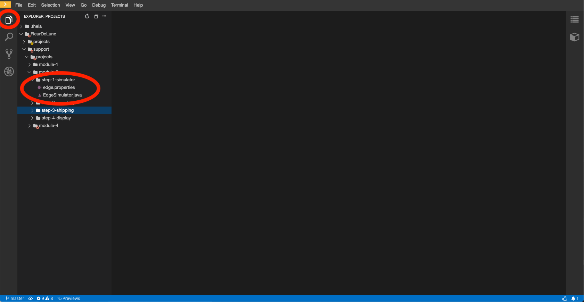

. Select **Terminal > Open Terminal in specific container** and select the container that begins with `dil-` (followed by a 5-digit alphanumeric code).  Click it and a terminal window should open.
+
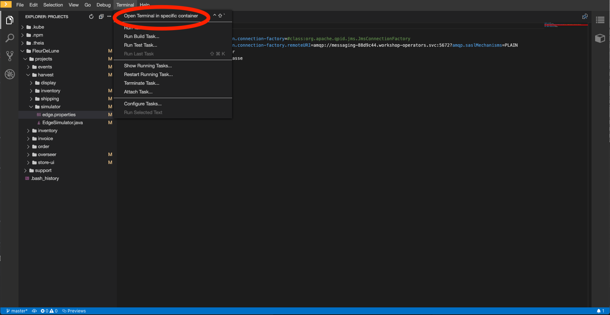

=== Login into the OpenShift cluster

. Finally, you will need to login into the OpenShift CLI to start interacting with the platform. For login, issue the following command:
+
[source,bash,subs="attributes+"]
----
oc login -u {user-username} -p {user-password} https://$KUBERNETES_SERVICE_HOST:$KUBERNETES_SERVICE_PORT --insecure-skip-tls-verify=true
----

. You should see something like the following (the project names may be different):
+
----
Login successful.

You have access to the following projects and can switch between them with 'oc project <projectname>':

    shared-db-earth
    shared-kafka-earth
  * user1
    user1-che
    user1-dayinthel-0605
    user1-shared-475f

Using project "user1".
Welcome! See 'oc help' to get started.
----

. Most of the work will be deploy to your own `{namespace}` project namespace, so be sure to have it as a _working_ project by executing the following command:
+
[source,bash,subs="attributes+"]
----
oc project {namespace}
----

. Once you've logged into OpenShift via the CLI, run the following commands to setup this lab. (Setup AddressSpace and Kafka Cluster)
+
[source,bash,subs="attributes+"]
----
oc -n {user-username} apply -f $CHE_PROJECTS_ROOT/FleurDeLune/projects/harvest/simulator/config/prereq.yaml
----

. Navigate to the {openshift-host}[OpenShift Developer Console, window="_blank", id="{context}-3"] and login with your OpenShift credentials (`{user-username}` and `{user-password}`).

. Click on the the Topology view (left side menu)
+
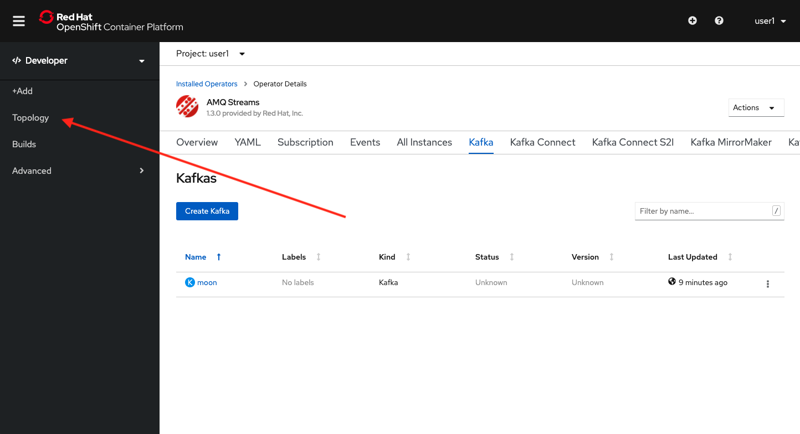

. Wait for the Kafka cluster to start. It can take a few minutes as the operator will deploy your Kafka cluster infrastructure and related operators to manage it.
+
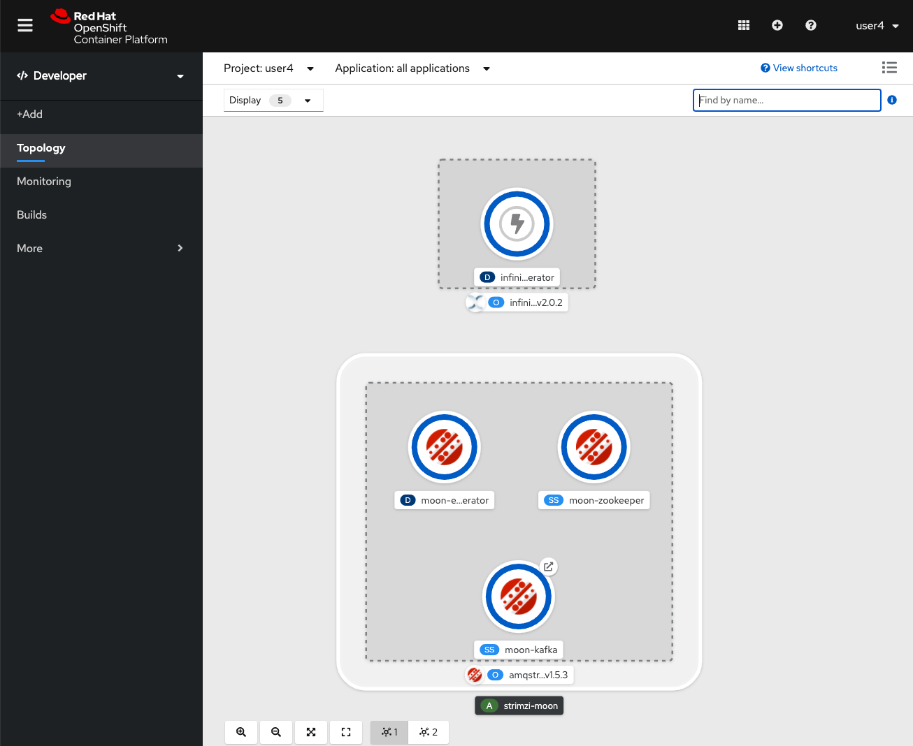

. Navigate to the {amqoneline-url}[AMQ Online Console, window="_blank", id="{context}-3"]

. Login to using your credentials (`{user-username}` and `{user-password}`).

. Make sure the AMQ AddressSpace *amq* is listed on the page
+
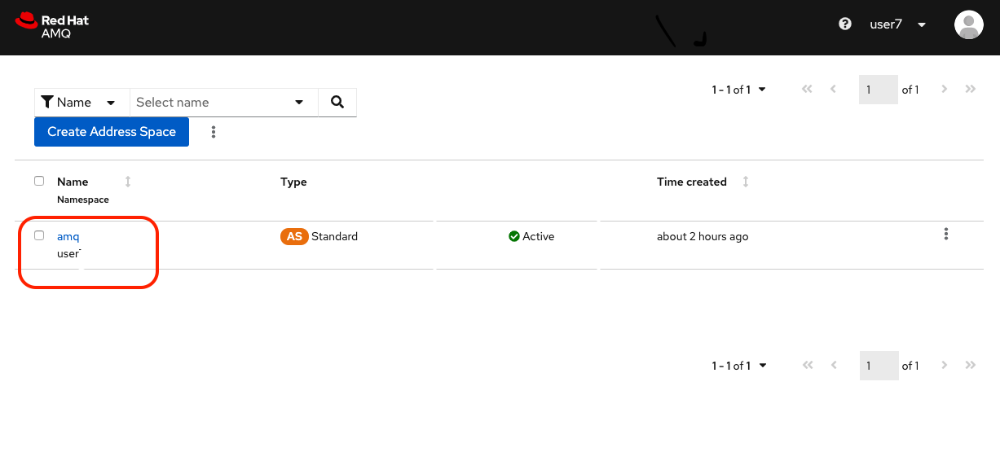

[type=verification]
Were you able to successfully provision the AMQ Online Address Space and Kafka Cluster?

[type=verificationFail]
Verify that you followed each step in the procedure above. If you are still having issues, contact your administrator.

=== Create a Topic
*Red Hat AMQ Online* is an OpenShift-based mechanism for delivering messaging as a managed service. With Red Hat AMQ Online, administrators can configure a cloud-native, multi-tenant messaging service where developers can provision messaging using a _web console_. Multiple development teams can provision the brokers and queues from the console, *without* requiring each team to _install, configure, deploy, maintain, or patch any software_.

. In your {amqoneline-url}[AMQ Online Console, window="_blank", id="{context}-3"].a Click *amq* listed on the page this will take you to the
+

. Click the *Create Address* button to create the topic.
+
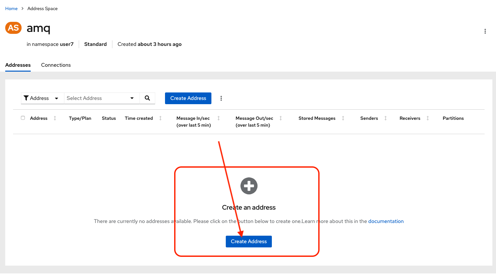

. Enter the following details, then click *Next*:
** Name: *`mytopic`*
** Type: *topic*
** Plan: *Small Topic*
+
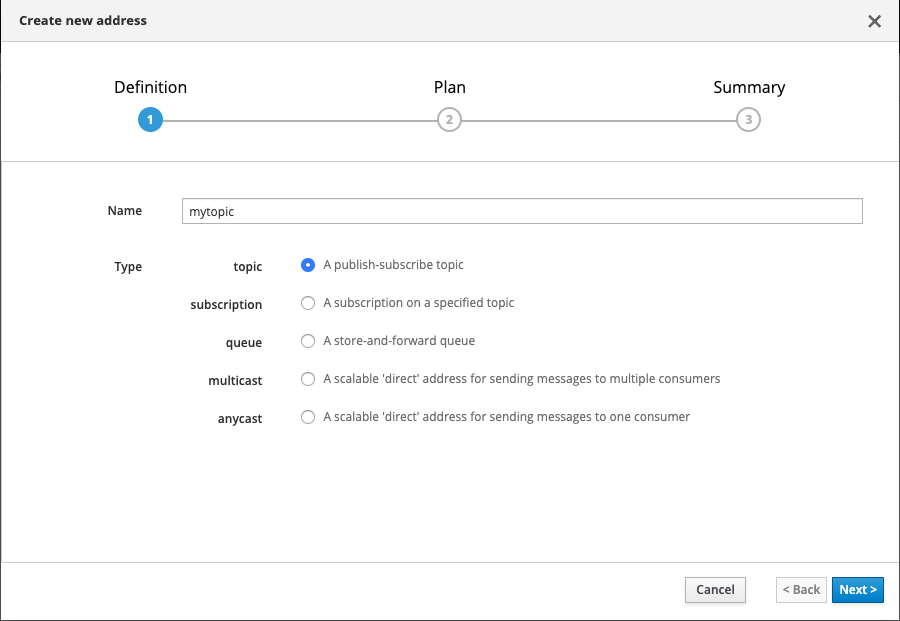

. Review your configuration and click on Finish
+
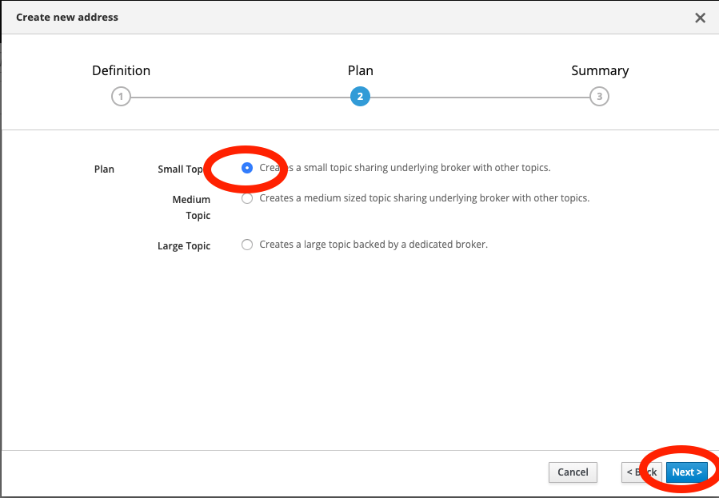

. Please wait a few minutes for the topic to provision.  Once the queue is provisioned, the topic name (`mytopic`) should have a green checkmark next to it.
+
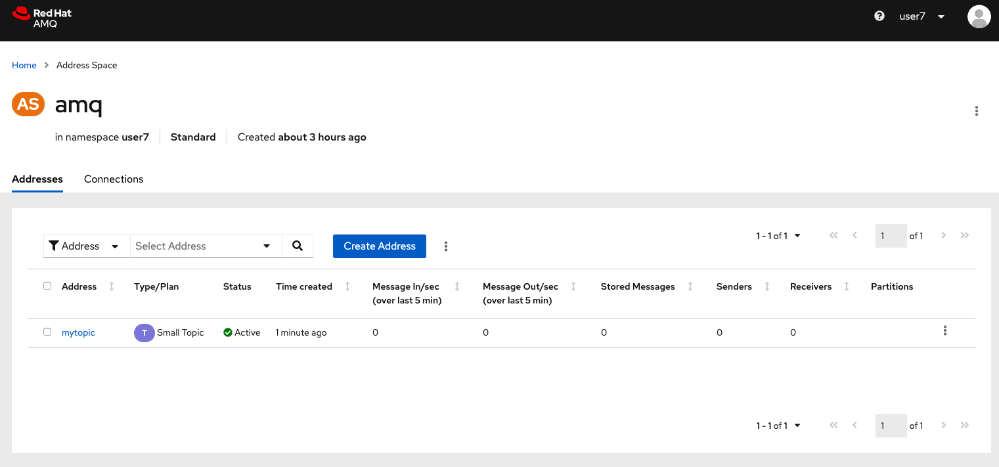

. Now that our messaging infrastructure is deployed, we need to retrieve the messaging hostname service for our services to connect. Click on the *Endpoints* tab to check the messaging host information.
+
image::images/addressspace-endpoints.png[Address Space Endpoints, role="integr8ly-img-responsive"]

. Copy and write down the *Host* information of the `amq.messsaging.cluster`. As we will be connecting all our services from within OpenShift we can use the internal hostname.
+
image::images/addressspace-hostname.png[Address Space Host, role="integr8ly-img-responsive"]

[type=verification]
Were you able to successfully provision the topic in AMQ Online?

[type=verificationFail]
Verify that you followed each step in the procedure above. If you are still having issues, contact your administrator.

[time=15]
[id="startup-che-workspace"]
== Create the Simulator
. Since we can't really set up a real edge device for you on the moon, you will need to create a simulator that simulates the edge device that sends randomly generated harvest data.
+
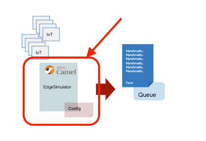

. In the Che workspace open the `FleurDeLune/projects/harvest/simulator` folder.
+

. Open the `edge.properties` file.  This is the *application.properties* file where all credentials are stored.  We need to update `remoteURI` for the **AMQP** endpoint.  Copy and paste the `serviceHost` you copied earlier (into a text editor) and update the `amqp://` endpoint with the correct service hostname.
+
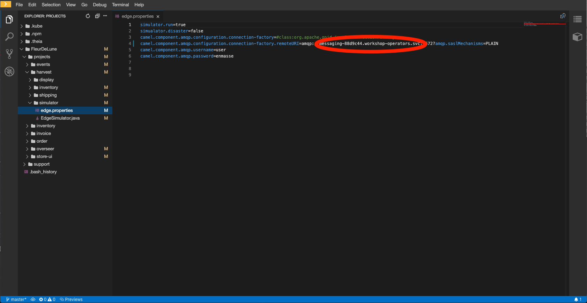

. Go to the `dil-` terminal that was opened in the previous task (followed by a 5-digit alphanumeric code).
. Run the following commands to update `edge-config` configmap.
+
[source,bash,subs="attributes+"]
----
oc project {namespace}
cd /projects/FleurDeLune/projects/harvest/simulator
oc create configmap edge-config  --from-file=edge.properties
----

. Open the `EdgeSimulator.java` file located in the same folder.  We want to create a Camel Route that fires a timer every 5 seconds, retrieves some random data, marshalls it to JSON and sends it via AMQP to your AMQ Online **mytopic**.  Copy and paste the following Camel route to your EdgeSimulator.java file:
+
[source,java,subs="attributes+"]
----
from("timer:tick?fixedRate=true&period=5000")
.choice()
    .when(simple("{{simulator.run}}"))
        .setBody(method(this, "genRandomIoTData()"))
        .marshal().json()
        .log("${body}")
        .to("amqp:topic:mytopic?subscriptionDurable=false&exchangePattern=InOnly")
    .otherwise()
        .log("Nothing send ")
;
----
+
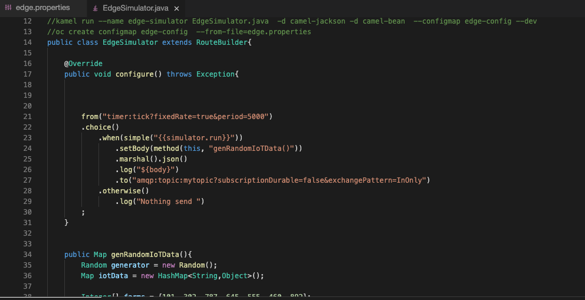

. Try deploying and running the *EdgeSimulator* Camel-K route by executing the following command
+
[source,bash,subs="attributes+"]
----
kamel run EdgeSimulator.java
----

. Give the deployment 2-5 minutes to run. To see the log, run the following command, and type ctrl-C/cmd-C to exit the log
+
[source,bash,subs="attributes+"]
----
kamel log edge-simulator
----

+
image::images/2.1.10-kamel-log.png[2.1.11-verify-edge-simulator, role="integr8ly-img-responsive"]

. Or you can also navigate back to the *OpenShift Developer Console* link:{openshift-host}/topology/ns/{namespace}[OpenShift Developer Console, window="_blank"] and verify the **edge-simulator** pod deployed correctly.  You can verify this by checking the Camel **timer** is firing every 5 seconds and there are no errors.

+
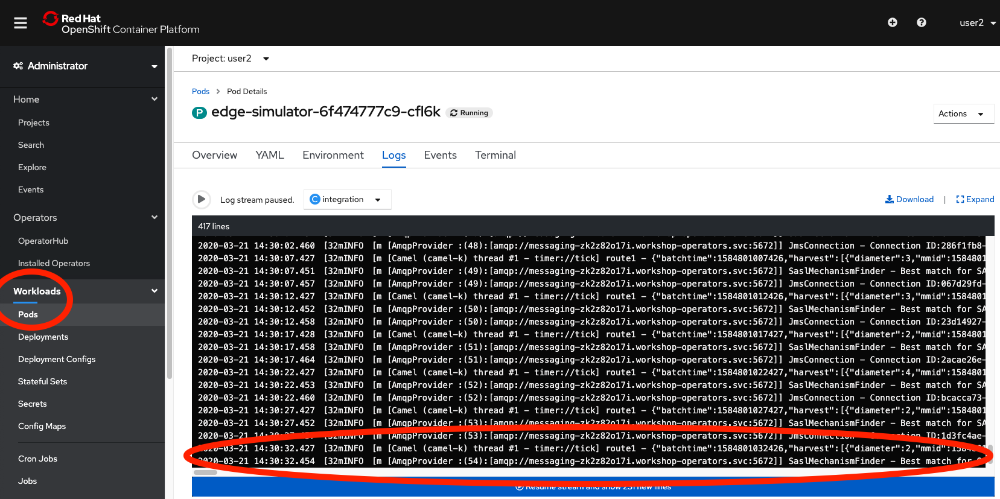

+
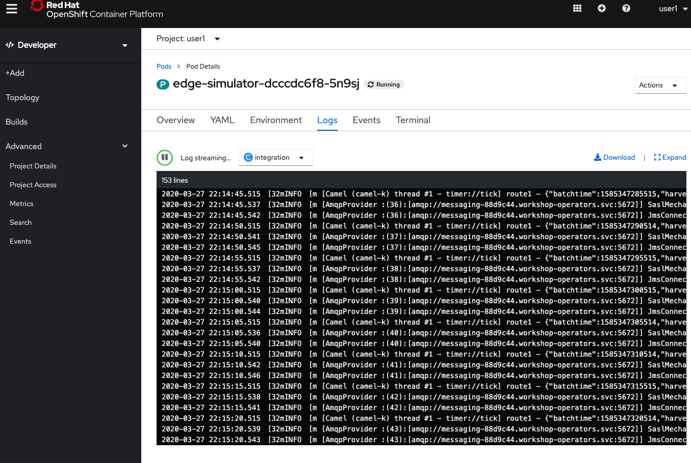

[type=verification]
Were you able to successfully deploy the Camel-K **Edge Simulator** to OpenShift?

[type=verificationFail]
Verify that you followed each step in the procedure above. If you are still having issues, contact your administrator.

[time=15]
[id="setup-order-inventory"]
== Setup Order Inventory with AMQ Streams
Now that the harvest data is now streaming into the topic, we will need to grade the marshmallows according to their sizes. First we will store all the updated grading information in a relational database. It will also stream separately to the shipping departments.

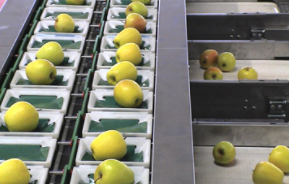 

image::images/3.0.0-diagram.png[3.0.0-diagram, role="integr8ly-img-responsive"]

. Navigate to the {openshift-host}[OpenShift Developer Console, window="_blank", id="{context}-3"]

. Login to OpenShift Developer Console using your credentials (`{user-username}` and `{user-password}`).

. Select the *Developer* drop-down, then select *Project: {namespace}*, *+Add* and click on the `From Catalog` link.
+
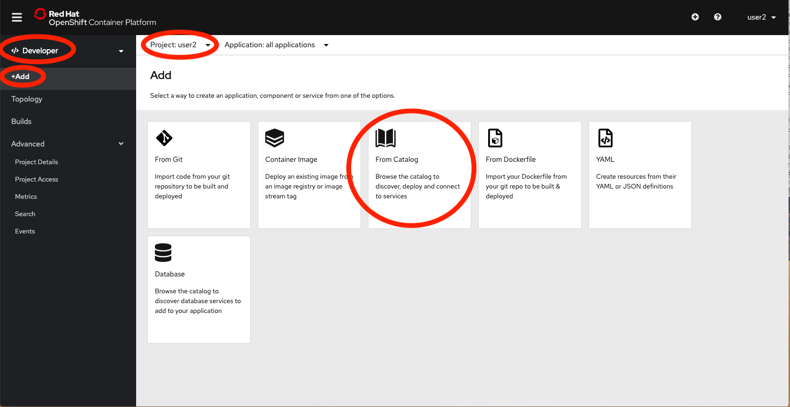

. In the *Filter by keyword...* box, enter `Postgresql`. You may also need to un-check the *Operator Backed* checkbox on the left-hand side. Select the **PostgreSQL (Ephemeral)** template.  Click the **Instantiate Template** button.
+
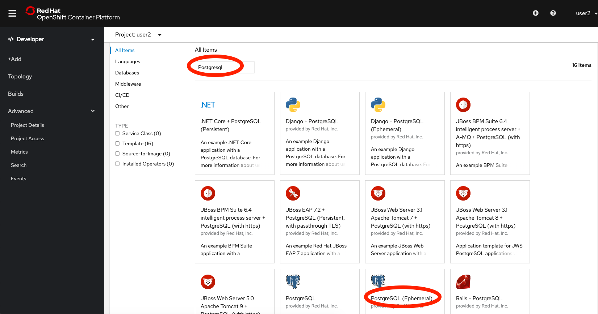

. Update the following template details leaving the remaining default values untouched, then click **Create**:
** PostgreSQL Connection Username: *`user`*
** PostgreSQL Connection Password: *`password`*
+
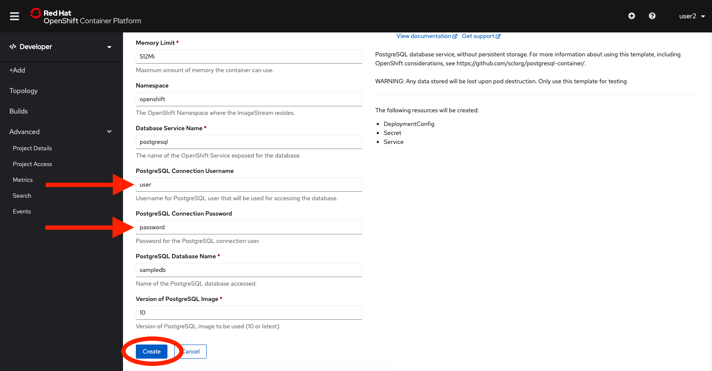

. Wait for the pod to deploy (30 seconds - 1 minute).  Click on *Topology* then click the `postgresql` pod.
+
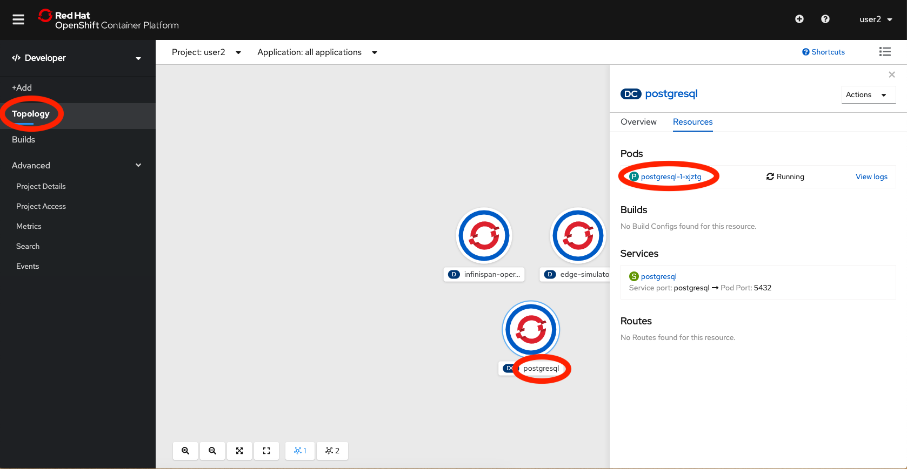

. Click on the *Terminal* tab and enter the following:
+
[source,bash,subs="attributes+"]
----
psql -d sampledb -U user
----

+
[source,bash,subs="attributes+"]
----
CREATE TABLE premium (
	mmid bigint NOT NULL,
	diameter integer NOT NULL,
    weight decimal NOT NULL,
	created_at TIMESTAMP NOT NULL DEFAULT NOW()
);
----

+
[source,bash,subs="attributes+"]
----
CREATE TABLE standard (
	weight decimal NOT NULL,
	created_at TIMESTAMP NOT NULL DEFAULT NOW()
);
----

+
[source,bash,subs="attributes+"]
----

INSERT INTO premium(mmid,diameter, weight) VALUES (4567845678456, 4, 2.3);
INSERT INTO premium(mmid,diameter, weight) VALUES (4567845678456, 4, 2.3);
INSERT INTO premium(mmid,diameter, weight) VALUES (4567845678456, 4, 2.3);
INSERT INTO premium(mmid,diameter, weight) VALUES (4567845678456, 4, 2.3);
INSERT INTO premium(mmid,diameter, weight) VALUES (4567845678456, 4, 2.3);
INSERT INTO premium(mmid,diameter, weight) VALUES (4567845678456, 4, 2.3);
INSERT INTO premium(mmid,diameter, weight) VALUES (4567845678456, 4, 2.3);
----

. Now that we've populated the database table with records, navigate back to the *Eclipse Che* window and open the `FleurDeLune/projects/harvest/inventory` project.  Examine the `Inventory.java` file.  At this point we need to create 3 Camel routes.  A route to:
+
** Consume harvest JSON messages from AMQ Online, and using Content-based routing determine whether they are standard, premium or utility marshmallows.
** Insert premium marshmallow dimensions into the PREMIUM database table
** Insert standard marshmallow dimensions into the STANDARD database table

. Copy & paste the following Camel routes to the `Inventory.java` file:
+
[source,java,subs="attributes+"]
----
from("amqp:topic:mytopic?subscriptionDurable=false")
.split().jsonpath("$.harvest[*]")
    .choice()
        .when().jsonpath("$[?(@.diameter > 4 )]" )
            .log("Premium ${body}")
            .wireTap("direct:premiumDB")
                .newExchangeHeader("quality", constant("Premium"))
                .newExchangeHeader("diameter",jsonpath("$.diameter"))
                .newExchangeHeader("weight",jsonpath("$.weight"))
                .newExchangeHeader("mmid",jsonpath("$.mmid"))
            .end()
            .marshal().json()
            .to("kafka:{user-username}-premium?groupId=sender")
        .when().jsonpath("$[?(@.diameter > 1 )]")
            .log("Standard ${body}")
            .wireTap("direct:standardDB")
                .newExchangeHeader("quality", constant("Standard"))
                .newExchangeHeader("weight",jsonpath("$.weight"))
            .end()
            .marshal().json()
            .to("kafka:{user-username}-standard?groupId=sender")
        .otherwise()
            .log("Utility ${body}")
            .marshal().json()
            .to("kafka:{user-username}-utility?groupId=sender")
        .end()
;

from("direct:premiumDB")
    .log("inventoryDa stored ${headers.quality} diameter ${headers.diameter}")
    .setBody(simple("insert into premium (mmid,diameter,weight) VALUES (${headers.mmid},${headers.diameter},${headers.weight} )"))
    .to("jdbc:dataSource");

from("direct:standardDB")
    .log("inventoryDa stored ${headers.quality}")
    .setBody(simple("insert into standard (weight) VALUES (${headers.weight})"))
    .to("jdbc:dataSource");
----
+
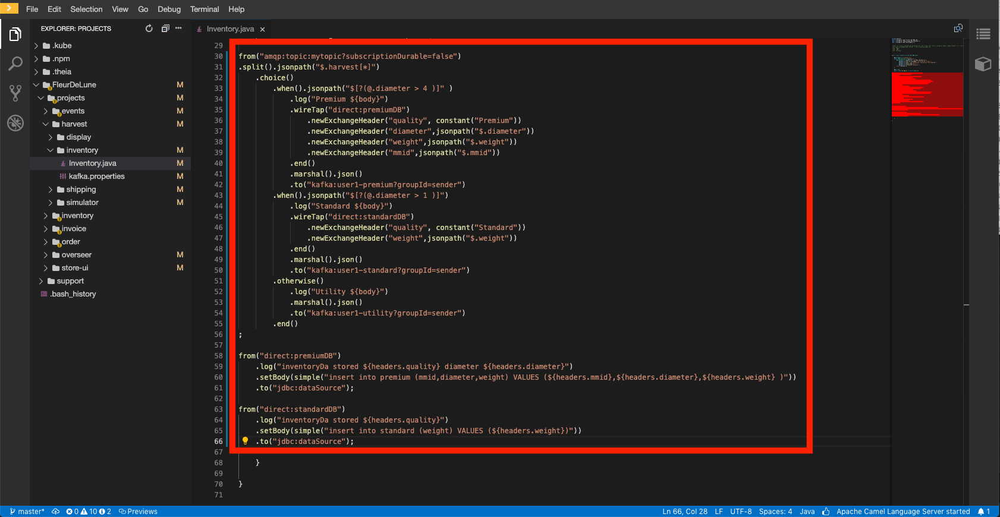

. Return to the OpenShift Developer console, click **+Add** then click **From Catalog** link.
+

. In the filter box type `topic` then select **Kafka topic**.  Click **Create**.  Replace the name `my-topic` with our topic name `{user-username}-premium`, and update the cluster name to `moon`.  Click **Create**.
+
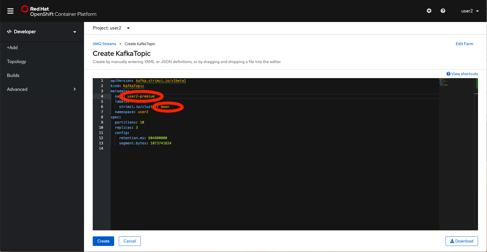

. Repleat the previous step to create `{user-username}-standard` and `{user-username}-utility` topics.

. Return to the Eclipse Che IDE and open the `kafka.properties` file located in the **FleurDeLune/projects/harvest/inventory** folder.  Update the **remoteURI** for AMQP with the same one entered in edge.properties.  Additionally, update the **kafka.brokers** URL to be `moon-kafka-bootstrap.{user-username}.svc:9092`.
+
image::images/3.1.10-update-kafka-properties.png[3.1.10-update-kafka-properties, role="integr8ly-img-responsive"]

. Return to the *dil-* terminal and execute the following commands:
+
[source,bash,subs="attributes+"]
----
oc project {namespace}
cd /projects/FleurDeLune/projects/harvest/inventory
oc create configmap sender-config  --from-file=kafka.properties
kamel run Inventory.java --name=inventory-lab3
----

. After the Camel-K command has finished deploying, it should run via the terminal without errors.  You should see **Integration Created**.
+
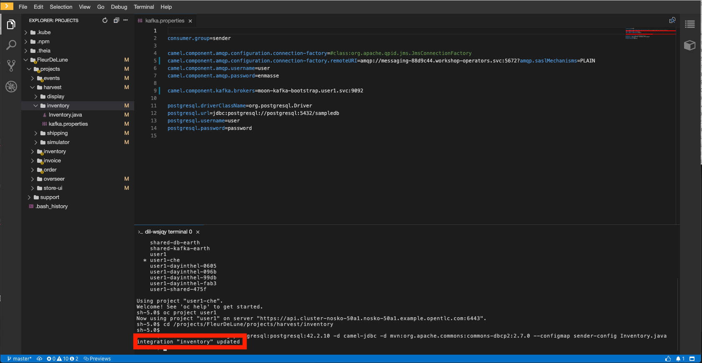

. We can verify that orders are inserted into the database tables (premium and standard), by returning to the OpenShift Developer Console, selecting postgresql and clicking the running pod.
+

. Click on the *Terminal* tab and enter the following:
+
[source,bash,subs="attributes+"]
----
psql -d sampledb -U user
----
+
[source,bash,subs="attributes+"]
----
select * from standard;
----

. If the Inventory simulator worked correctly, you should see new rows inserted into the **standard** table.

[type=verification]
Were you able to successfully view records in the **standard** database table?

[type=verificationFail]
Verify that you followed each step in the procedure above. If you are still having issues, contact your administrator.

[time=10]
[id="setup-data-lake"]
== Setup Data Lake with caching for Big Data analysis
. Due to the high inter-planet shipping costs, “Fleur de lune” is introducing a new AI system for more efficient shipping. The shipping department is now responsible for preparing all data into a in-memory data lake for the AI system.

+
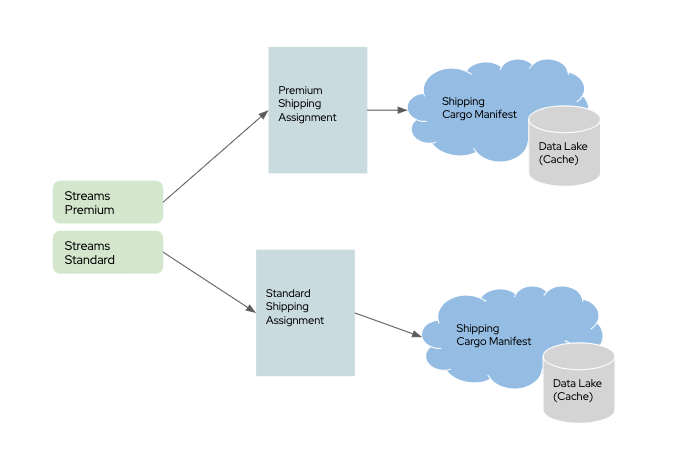

. Navigate back to the Eclipse Che console, and open `connect-secret.yaml` and `jdg-cluster.yaml` located in `/projects/harvest/shipping`.  Take a  look and notice this will be the identity secret required to setup our Infinispan cluster.
+
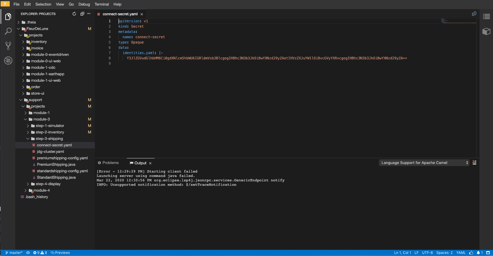

. Lets go ahead and install both the secret and Infinispan cluster (the operator is already running for us).  Via the terminal console, execute the following commands:
+
[source,bash,subs="attributes+"]
----
cd /projects/FleurDeLune/projects/harvest/shipping
oc project {namespace}
oc create -f connect-secret.yaml
oc create -f jdg-cluster.yaml
----

. Navigate back to the OpenShift Developer console, select *Topology*, then click on the `example-infinispan` container.  Verify the pod has started and is running.
+
image::images/4.1.2-check-infinispan.png[4.1.2-check-infinispan, role="integr8ly-img-responsive"]

. Via the Eclipse Che IDE, open the `premiumshipping-config.yaml` file.  Update the `camel.component.kafka.brokers` to be `moon-kafka-bootstrap.{user-username}.svc:9092` and `camel.component.infinispan-configuration.hosts` URL to be `example-infinispan.{user-username}.svc:11222`.
+
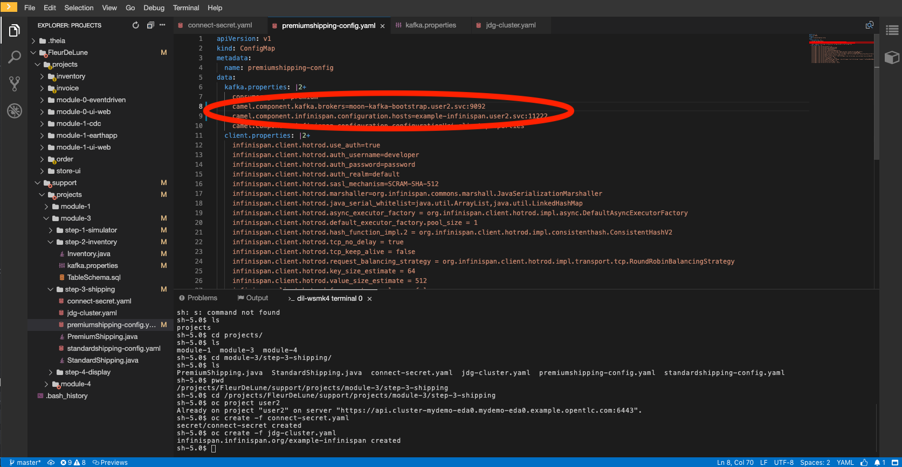

. Via the terminal, execute the following command to deploy the config map:
+
[source,bash,subs="attributes+"]
----
oc apply -f premiumshipping-config.yaml
----

. Now that we have the config map deployed, let's take a look at `PremiumShipping.java`.  This class contains a Camel route which consumes messages from Kafka and populates the Infinispan cache with premium shipments. Let's insert our Camel routes into this class:
*MAKE SURE to replace the Kafka Topic to `{user-username}`*
+
[source,java,subs="attributes+"]
----
from("timer:cleanup?repeatCount=1")
.setHeader(InfinispanConstants.OPERATION).constant(InfinispanOperation.CLEAR)
.setHeader(InfinispanConstants.KEY).constant("premium")
.to("infinispan:default")
;

from("kafka:user1-premium?groupId=premium-shipping")
.streamCaching()
    .unmarshal(new JacksonDataFormat(Map.class))
    .log("Input --> ${body}")
    .setHeader("marshmallow").simple("${body}")
    .setHeader(InfinispanConstants.OPERATION).constant(InfinispanOperation.GET)
    .setHeader(InfinispanConstants.KEY).constant("premium")
    .to("infinispan:default")
    .setHeader(InfinispanConstants.OPERATION).constant(InfinispanOperation.PUT)
    .setHeader(InfinispanConstants.KEY).constant("premium")
    .setHeader(InfinispanConstants.VALUE).method(this, "assignShipment(${body}, ${header.marshmallow})")
    .log("${body}")
    .to("infinispan:default")

;
----
+
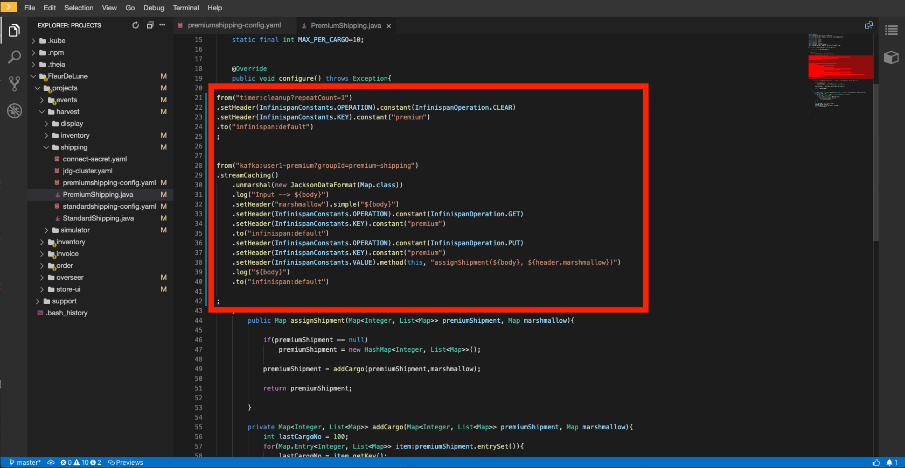

. We need to update the standard shipping config map.  Open up `standardshipping-config.yaml` file and update both the `camel.component.kafka.brokers` and `camel.component.infinispan.configuration.hosts` URLs.  You can reuse the URLs you used in the premium shipping config map.
+
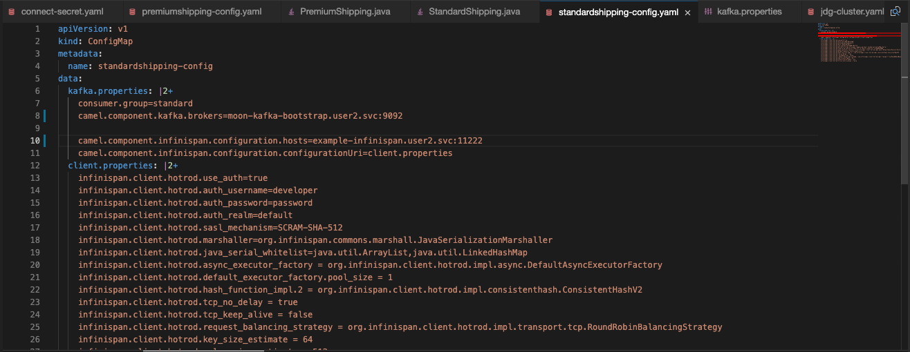

. Via the terminal, execute the following command to deploy the config map:
+
[source,bash,subs="attributes+"]
----
oc apply -f standardshipping-config.yaml
----

. Now that we have the config map deployed, let's take a look at `StandardShipping.java`.  This Class contains a Camel route which consumes messages from Kafka and populates the Infinispan cache with standard shipments. Update the kafka topic name to `{user-username}-standard`.
+
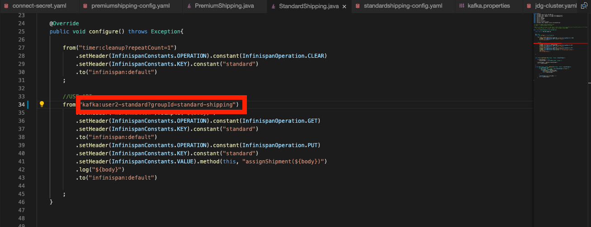

. Now that we have updated all the config files and code, we need to test our Camel-K routes.  Return to the *dil-* terminal and execute the following command:
+
[source,bash,subs="attributes+"]
----
kamel run PremiumShipping.java
----

. Ensure that the Camel-K command ran without error and connections to Infinispan and Kafka were successful.  You can verify the deployment via the OpenShift Developer topology screen.  Repeat the same for the StandardShipping flow:
+
[source,bash,subs="attributes+"]
----
kamel run StandardShipping.java
----

[type=verification]
Were you able to successfully execute and deploy both the Standard and Premium shipping Camel-K routes without error?

[type=verificationFail]
Verify that you followed each step in the procedure above. If you are still having issues, contact your administrator.

[time=5]
[id="setup-supply-console"]
== Create a Shipping Console

.  Now that we have our backend services running, we can focus on creating a Shipping Console UI.
+
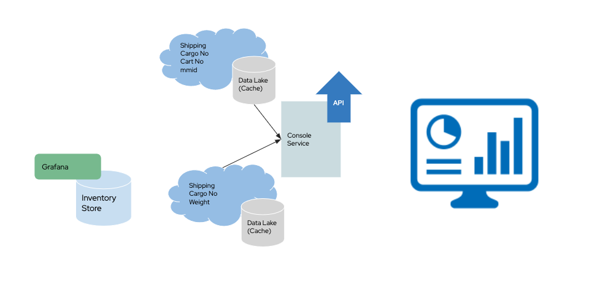

=== Deploy RESTful Interface

.  First step is to update the `/projects/harvest/display/shippingconsole-config.yaml` config map with the correct InfiniSpan hostname.  Find  **camel.component.infinispan.configuration.hosts** and update the service to: `example-infinispan.{user-username}.svc:11222`.
+
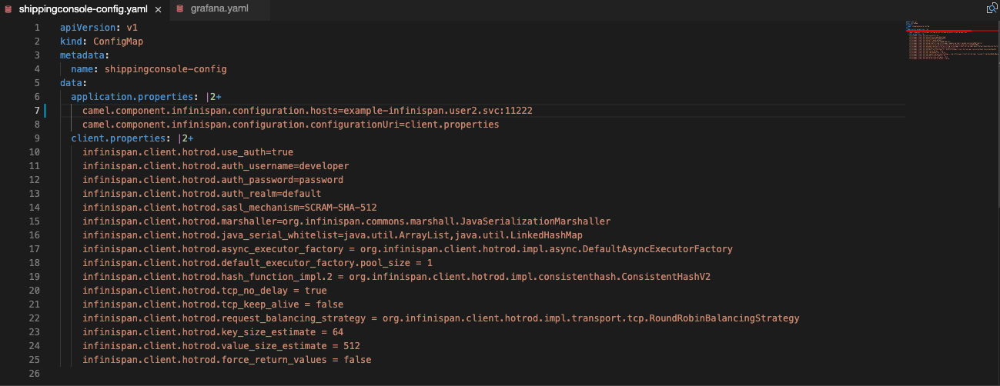

. Add the config map to OpenShift using the following command (via the terminal):
+
[source,bash,subs="attributes+"]
----
cd /projects/FleurDeLune/projects/harvest/display/
oc project {namespace}
oc apply -f shippingconsole-config.yaml
----

. Now that we have the configmap updated, take a look at **ConsoleService.java**.  Notice that we use Camel RESTDsl to expose a bunch of RESTFul queries around our infinispan cache.  Let's try running this interface using the following command:
+
[source,bash,subs="attributes+"]
----
kamel run ConsoleService.java --dev
----

. Now that we have the Camel-K interface running, we can view the content in our Data Lake.  First, navigate here (in a new tab) to see the Standard shipments: `http://console-service-{user-username}.{openshift-app-host}/standard`. If successful, you should see output similar to the following:
+
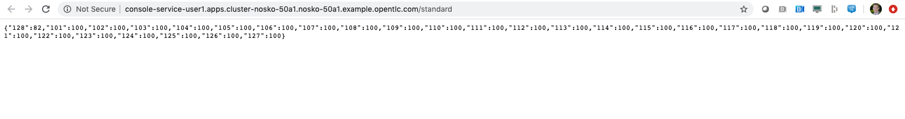

. Click here (in another tab) to verify our Premium shipments cache: `http://console-service-{user-username}.{openshift-app-host}/premium`.  You should see the following output:
+
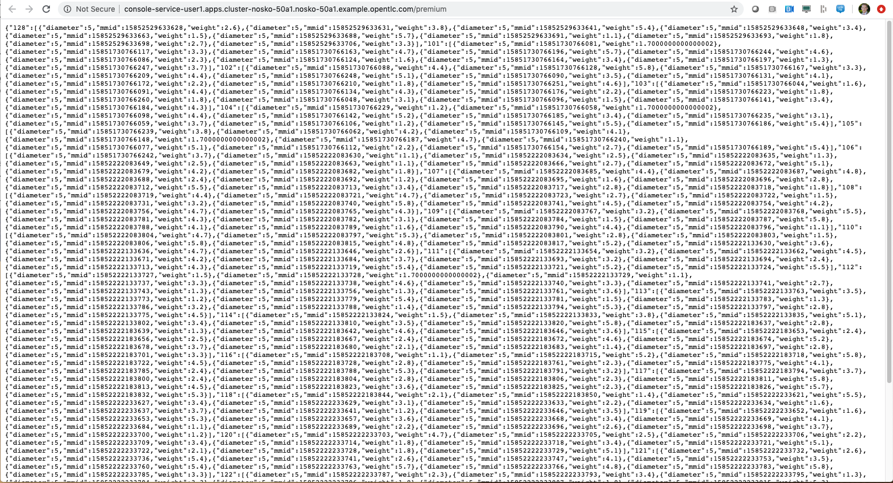

[type=verification]
Were you able to successfully see output from both Standard and Premium datacache?

[type=verificationFail]
Verify that you followed each step in the procedure above. If you are still having issues, contact your administrator.

[time=10]
[id="grafana"]
== Setup Grafana Dashboard

. First of all, we need to deploy the Grafana template to our namespace.  Execute the following command via the CLI *dil-* terminal:
+
[source,bash,subs="attributes+"]
----
cd /projects/FleurDeLune/projects/harvest/display

oc apply -f grafana.yaml
----
+
[source,bash,subs="attributes+"]
----
oc expose svc grafana
----

. Now that we have Grafana running, navigate back to the OpenShift Developer console and Click on grafana in the topology.  Find *Grafana* route.
+
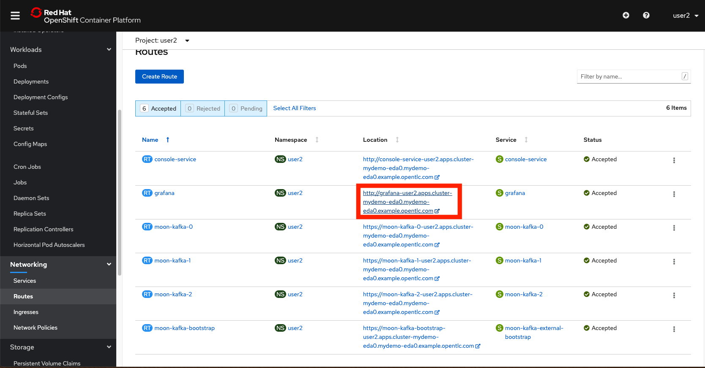

. Login to Grafana using the credentials `admin/admin`.  If prompted to change your password, set it back to `admin` again.

. Now that you are logged into Grafana, we need to create a datasource. Click the `Add data source` link, then select **PostgreSQL**.
+
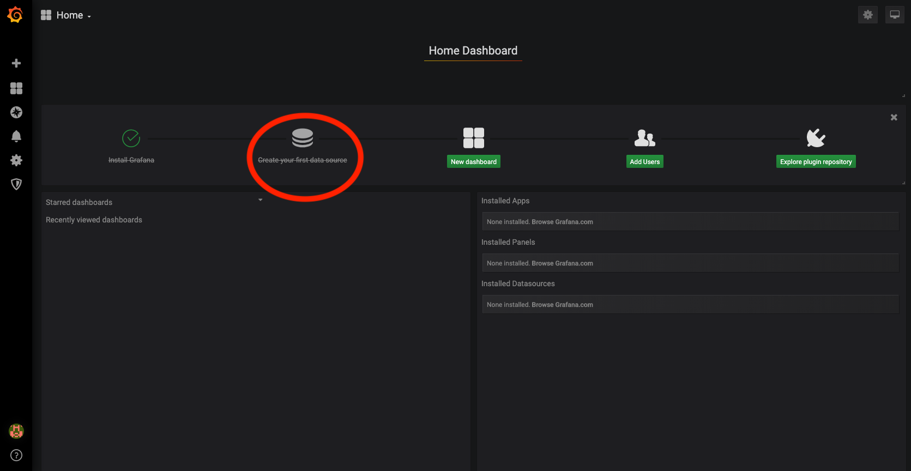

. In the DataSource entry screen, enter the following:
** Name: *`SampleDB`*
** Host: *`postgresql:5432`*
** Database: *`sampledb`*
** User: *`user`*
** Password: *`password`*
** SSL Mode: *`disable`*

. Click **Save & Test**
+
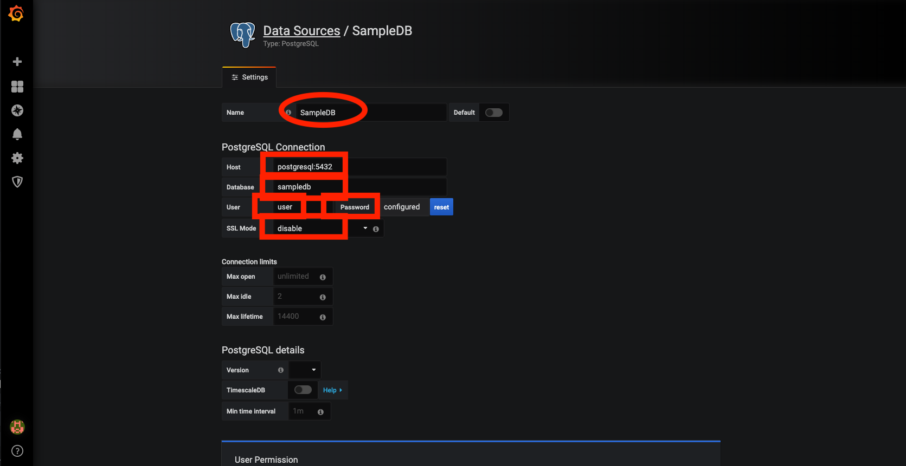

. Click the **+** symbol then click **Import**.  Give the dashboard a name of `FleurDeLune`.  Navigate back to Eclipse Che and copy the content from `/projects/harvest/display/FleurDeLune-Dashboard.json`.  Paste the content into the Grafana JSON window then click **Import**.
+
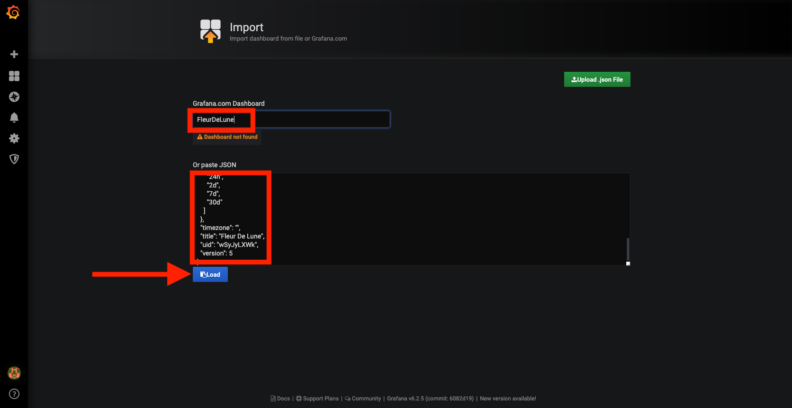

. If everything has been running correctly, you should see some Marshmallow distribution and weight metrics displayed on your graph.
+
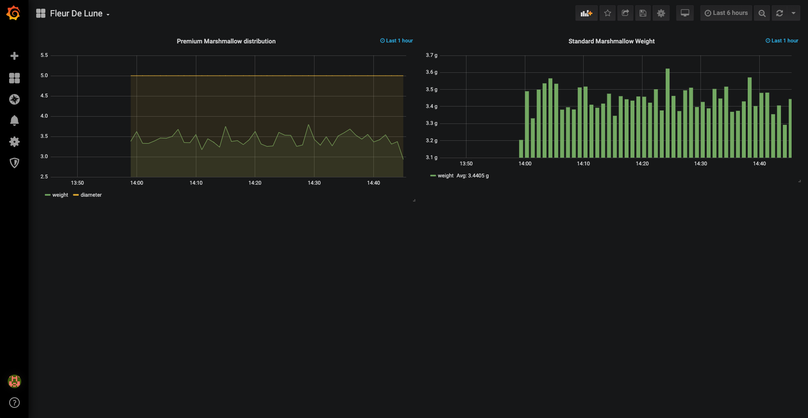

[type=verification]
Were you able to successfully view the FleurDeLune metrics?

[type=verificationFail]
Verify that you followed each step in the procedure above. If you are still having issues, contact your administrator.

[time=5]
[id="summary"]
== Summary

In this lab you exposed inventory data via RestDSL, cached data from a Data Lake using InfiniSpan, then graphed the results using live data metrics in Grafana.

Open source connectors enable integrations with your local systems landscape. Explore InfiniSpan, Camel-K, and Grafana to connect APIs and services for event-driven application architectures (EDA). Red Hat offers supported versions of these connectors via Fuse and DataGrid.

You can now proceed to link:{next-lab-url}[Lab 4].

[time=4]
[id="further-reading"]
== Notes and Further Reading

* https://www.redhat.com/en/technologies/jboss-middleware/amq[Red Hat AMQ]
* https://developers.redhat.com/topics/event-driven/connectors/[Camel & Debezium Connectors]
