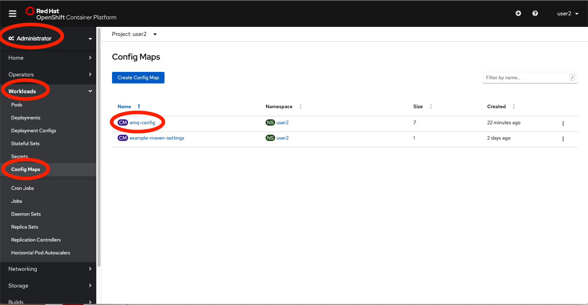
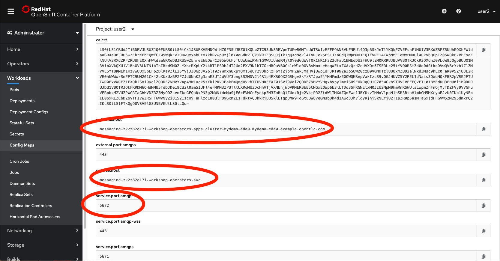
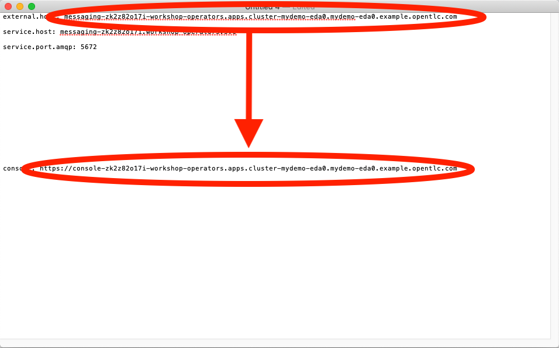
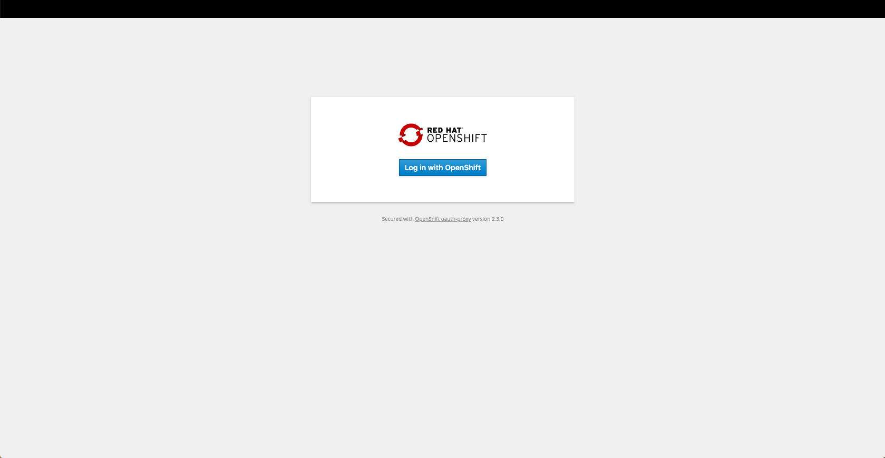

:walkthrough: Cloud-Native Integration with EIPs
:che-url: http://che-che.{openshift-app-host}/
:next-lab-url: https://tutorial-web-app-webapp.{openshift-app-host}/tutorial/dayinthelife-streaming.git-labs-04/
:user-password: openshift

ifdef::env-github[]
:next-lab-url: ../lab04/walkthrough.adoc
endif::[]

[id='cloud-native-integration']
= Lab 3 - Cloud-Native Integration with EIPs

In this lab you will stream events from an AMQ Online topic, use Enterprise Integration Patterns (EIPs) in Camel-K to split and route messages to a Datalake, in addition to streaming the messages to a Standard and Premium Shipping topic on Kafka.

Audience: Enterprise Integrators, System Architects, Developers, Data Integrators

*Overview*

Apache Kafka is the de facto standard for asynchronous event propagation between microservices. Things get challenging, though, when adding a service’s database to the picture: how can you avoid inconsistencies between Kafka and the database?

Enter change data capture (CDC) and Debezium. By capturing changes from the log files of the database, Debezium gives you both reliable and consistent inter-service messaging via Kafka and instant read-your-own-write semantics for services themselves.

*Why Red Hat?*

To respond to business demands quickly and efficiently, you need a way to integrate applications and data spread across your enterprise. Red Hat® AMQ—based on open source communities like Apache ActiveMQ and Apache Kafka—is a flexible messaging platform that delivers information reliably, enabling real-time integration and connecting the Internet of Things (IoT).

AMQ streams component makes Apache Kafka “OpenShift native” through the use of powerful operators that simplify the deployment, configuration, management, and use of Apache Kafka on OpenShift.

*Prerequisites*

This lab assumes you have successfully completed Lab 1.

*Credentials*

Your username is: `{user-username}` +
Your password is: `{user-password}`

[type=walkthroughResource]
.Che
****
* link:{che-url}/[Open Eclipse Che, window="_blank"]
****

[type=walkthroughResource,serviceName=openshift]
.Openshift
****
* link:{openshift-host}/[Open Console, window="_blank"]
****

[time=5]
[id="provision-amq-topic"]
== Provision AMQ Topic

In this task, you'll provision a messaging topic using Red Hat's Messaging as a Service platform on OpenShift (AMQ Online).

. Navigate to the {openshift-host}[OpenShift Admin Console, window="_blank", id="{context}-3"]

. Login to OpenShift Admin Console using your credentials (`{user-username}` and `{user-password}`).

. Select the *Administrator* drop-down, then select *Workloads*, *Config Maps* and click on the `amq-config` link.
+

. Scroll down towards the bottom of the page.  Copy/paste the `external.host`, `service.host` and `service.port.amqp` values to a text editor.  These are the messaging credentials created in Lab 1.  You will need these shortly.
+

. In your text editor, copy the `external.host` value and replace the word `messaging` with `https://console`.  This will becoming your *AMQ Online Console URL*.
+

. Copy the *AMQ Online Console URL* from the previous step to a new tab.  Click *Log in with OpenShift*.
+

. Login to AMQ Online using your credentials (`{user-username}` and `{user-password}`). Click *Log In*.
+
image::images/1.1.2-login.png[1.1.2-login, role="integr8ly-img-responsive"]

. Click the *+ Create* button to create the topic.
+
image::images/1.1.7-create-topic.png[1.1.7-create-topic, role="integr8ly-img-responsive"]

. Enter the following details, then click *Next*:
** Name: *`mytopic`*
** Type: *topic*
+
image::images/1.1.8-topic-details.png[1.1.8-topic-details, role="integr8ly-img-responsive"]

. Choose `Small Topic` then click *Next* and finally *Create*.
+
image::images/1.1.9-topic-details.png[1.1.9-topic-details, role="integr8ly-img-responsive"]

. Please wait a few minutes for the topic to provision.  Once the queue is provisioned, the topic name (`mytopic`) should have a green checkmark next to it.
+
image::images/1.1.10-topic-provisioned.png[1.1.10-topic-provisioned, role="integr8ly-img-responsive"]

[type=verification]
Were you able to successfully provision the topic in AMQ Online?

[type=verificationFail]
Verify that you followed each step in the procedure above. If you are still having issues, contact your administrator.

[time=15]
[id="startup-che-workspace"]
== Provision Eclipse Che Workspace

. Navigate to Eclipse Che console: {che-url}[Eclipse Che, window="_blank", id="{context}-3"]

. Login to Che using your credentials (`{user-username}` and `{user-password}`).
+
image::images/1.1.2-login.png[1.1.2-login, role="integr8ly-img-responsive"]

. Click the **Play** button to open your workspace.  Give it a few minutes to provision and open.
+
image::images/2.1.3-open-workspace.png[2.1.3-open-workspace, role="integr8ly-img-responsive"]

. Once the workspace provisions, click the **Workspace** button and open the `FleurDeLune/projects/module-3/step1-simulator` folder.
+
image::images/2.1.4-che-workspace-folder.png[2.1.4-che-workspace-folder, role="integr8ly-img-responsive"]

. Open the `edge.properties` file.  This is the *application.properties* file where all credentials are stored.  We need to update `remoteURI` for the **AMQP** endpoint.  Copy and paste the `service.host` you copied earlier (into a text editor) and update the `amqp://` endpoint with the correct service hostname.
+
image::images/2.1.5-edge-properties.png[2.1.5-edge-properties, role="integr8ly-img-responsive"]

. Select **Terminal > Open Terminal** in specific container** and select the container that begins with `dil-` (followed by a 5-digit alphanumeric code).  Click it and a terminal window should open.
+
image::images/2.1.6-terminal.png[2.1.6-terminal, role="integr8ly-img-responsive"]

. Navigate back to your OpenShift Admin console and click on your username in the top right-hand corner.  Click **Copy login command**, login with your credentials, then click **Display Token**. Copy the `oc login` command from this page and paste it in your terminal window.  Hit enter to login.
+
image::images/2.1.7-oc.png[2.1.7-oc, role="integr8ly-img-responsive"]

. Once you've logged into OpenShift via the CLI, run the following commands to update `edge-config` configmap.
+
[source,bash,subs="attributes+"]
----
oc project user2
cd /projects/FleurDeLune/support/projects/module-3/step-1-simulator
oc create configmap edge-config  --from-file=edge.properties
----

. Open the `EdgeSimulator.java` file located in the *step-1-simulator* folder.  Notice that this simple simulator fires every 5 seconds, creates a JSON object and sends it via AMQP to your AMQ Online **mytopic**.
+
image::images/2.1.9-edgesim.png[2.1.9-edgesim, role="integr8ly-img-responsive"]

. Try deploying and running the *EdgeSimulator* Camel-K route by executing the following command
+
[source,bash,subs="attributes+"]
----
kamel run --name edge-simulator EdgeSimulator.java  -d camel-jackson -d camel-bean  --configmap edge-config
----

. Give the deployment 2-5 minutes to run.  Navigate back to the *OpenShift Administrator Console* and verify the **edge-simulator** pod deployed correctly.  You can verify this by checking the Camel **timer** is firing every 5 seconds and there are no errors.
+
image::images/2.1.11-verify-edge-simulator.png[2.1.11-verify-edge-simulator, role="integr8ly-img-responsive"]

[type=verification]
Were you able to successfully deploy the Camel-K **Edge Simulator** to OpenShift?

[type=verificationFail]
Verify that you followed each step in the procedure above. If you are still having issues, contact your administrator.

[time=15]
[id="setup-order-inventory"]
== Setup Order Inventory with AMQ Streams

. Navigate to the {openshift-host}[OpenShift Developer Console, window="_blank", id="{context}-3"]

. Login to OpenShift Developer Console using your credentials (`{user-username}` and `{user-password}`).

. Select the *Developer* drop-down, then select *Project: user2*, *+Add* and click on the `From Catalog` link.
+
image::images/3.1.3-add-from-catalog.png[3.1.3-add-from-catalog, role="integr8ly-img-responsive"]

. In the *Filter by keyword...* box, enter `Postgresql`, then select the **PostgreSQL (Ephemeral)** template.  Click the **Instantiate Template** button.
+
image::images/3.1.5-postgres-template.png[3.1.5-postgres-template, role="integr8ly-img-responsive"]

. Update the following template details leaving the remaining default values untouched, then click **Create**:
** PostgreSQL Connection Username: *`user`*
** PostgreSQL Connection Password: *`password`*
+
image::images/3.1.6-postgres-details.png[3.1.6-postgres-details, role="integr8ly-img-responsive"]

. Wait for the pod to deploy (30 seconds - 1 minute).  Click on *Topology* then click the `postgresql` pod.
+
image::images/3.1.7-pod-details.png[3.1.7-pod-details, role="integr8ly-img-responsive"]

. Click on the *Terminal* tab and enter the following:
+
[source,bash,subs="attributes+"]
----
psql -d sampledb -U user

CREATE TABLE premium (
	mmid bigint NOT NULL,
	diameter integer NOT NULL,
    weight decimal NOT NULL,
	created_at TIMESTAMPTZ NOT NULL DEFAULT NOW()
);

CREATE TABLE standard (
	weight decimal NOT NULL,
	created_at TIMESTAMPTZ NOT NULL DEFAULT NOW()
);

INSERT INTO premium(mmid,diameter, weight) VALUES (4567845678456, 4, 2.3);
INSERT INTO premium(mmid,diameter, weight) VALUES (4567845678456, 4, 2.3);
INSERT INTO premium(mmid,diameter, weight) VALUES (4567845678456, 4, 2.3);
INSERT INTO premium(mmid,diameter, weight) VALUES (4567845678456, 4, 2.3);
INSERT INTO premium(mmid,diameter, weight) VALUES (4567845678456, 4, 2.3);
INSERT INTO premium(mmid,diameter, weight) VALUES (4567845678456, 4, 2.3);
INSERT INTO premium(mmid,diameter, weight) VALUES (4567845678456, 4, 2.3);
----

. Now that we've populated the database table with records, navigate back to the *Eclipse Che* window and open the `step-2-inventory` project.  Examine the `Inventory.java` file and notice that we have 3 kafka topics that we need to setup.  Update those kafka endpoints with your correct username:
+
** `{user-username}-premium`
** `{user-username}-standard`
** `{user-username}-utility`
+
image::images/3.1.8-update-inventory-java.png[3.1.8-update-inventory-java, role="integr8ly-img-responsive"]

. Return to the OpenShift Developer console, click **+Add** then click **From Catalog** link.
+
image::images/3.1.3-add-from-catalog.png[3.1.3-add-from-catalog, role="integr8ly-img-responsive"]

. In the filter box type `topic` then select **Kafka topic**.  Click **Create**.  Replace the name `my-topic` with our topic name `{user-username}-premium`, and update the cluster name to `moon`.  Click **Create**.
+
image::images/3.1.9-create-kafka-topic.png[3.1.9-create-kafka-topic, role="integr8ly-img-responsive"]

. Repleat the previous step to create `{user-username}-standard` and `{user-username}-utility` topics.

. Return to the Eclipse Che IDE and open the `kafka.properties` file located in the **step-2-inventory** folder.  Update the **remoteURI** for AMQP with the same one entered in edge.properties.  Additionally, update the **kafka.brokers** URL to be `moon-kafka-bootstrap.{user-username}.svc:9092`.
+
image::images/3.1.10-update-kafka-properties.png[3.1.10-update-kafka-properties, role="integr8ly-img-responsive"]

. Return to the terminal and execute the following commands:
+
[source,bash,subs="attributes+"]
----
oc project user2
cd /projects/FleurDeLune/support/projects/module-3/step-2-inventory
oc create configmap sender-config  --from-file=kafka.properties
kamel run -d mvn:org.postgresql:postgresql:42.2.10 -d camel-jdbc -d mvn:org.apache.commons:commons-dbcp2:2.7.0 --configmap sender-config Inventory.java --dev
----

. After the Camel-K command has finished deploying, it should run via the terminal without errors.
+
image::images/3.1.11-camel-k-inventory.png[3.1.11-camel-k-inventory, role="integr8ly-img-responsive"]

. We can verify that orders are inserted into the database tables (premium and standard), by returning to the OpenShift Developer Console, selecting postgresql and clicking the running pod.
+
image::images/3.1.7-pod-details.png[3.1.7-pod-details, role="integr8ly-img-responsive"]

. Click on the *Terminal* tab and enter the following:
+
[source,bash,subs="attributes+"]
----
psql -d sampledb -U user
select * from standard;
----

. If the Inventory simulator worked correctly, you should see new rows inserted into the **standard** table.

[type=verification]
Were you able to successfully view records in the **standard** database table?

[type=verificationFail]
Verify that you followed each step in the procedure above. If you are still having issues, contact your administrator.

[time=5]
[id="summary"]
== Summary

In this lab you used Debezium CDC connectors to react to change events from SQL Server and send them to Apache Kafka running on OpenShift through Red Hat AMQ streams.

Open source connectors enable integrations with your local systems landscape. Explore Kafka, Camel, and Debezium connectors to connect APIs and services for event-driven application architectures (EDA). Red Hat offers supported versions of these connectors via AMQ Streams and Fuse.

You can now proceed to link:{next-lab-url}[Lab 3].

[time=4]
[id="further-reading"]
== Notes and Further Reading

* https://www.redhat.com/en/technologies/jboss-middleware/amq[Red Hat AMQ]
* https://developers.redhat.com/topics/event-driven/connectors/[Camel & Debezium Connectors]
