:walkthrough: Complex Event Processing
:codeready-url: http://devspaces.{openshift-app-host}/
:next-lab-url: https://tutorial-web-app-webapp.{openshift-app-host}/tutorial/dayinthelife-streaming.git-labs-05/
:user-password: openshift
:lab-path: FleurDeLune/projects
:lab-4-path: overseer
:namespace: {user-username}
:amqoneline-url: https://console-workshop-operators.{openshift-app-host}/

ifdef::env-github[]
:next-lab-url: ../lab05/walkthrough.adoc
endif::[]

[id='cep-event-sourcing']
= Lab 4 - Complex Event Processing and Event Sourcing

In this lab you will be applying two common scenarios to processing events: Event Sourcing and Complex Event Processing (CEP). First replaying the harvest data to estimate possible costs to operate farms on the moon. You will use Kafka Streams API for real-time events processing and extracting information from event streams as they arrive.

*Audience:* System Architects, Developers, Data Integrators

*Overview*

Event Sourcing is used to handle the sequence of imperative events. Events in AMQ Streams are stored and persisted sequentially, each representing change of state. This allows applications to replay history and experiment with what-if scenarios.

Complex Event Processing (CEP) is an event processing concept, with the goal of identifying the meaningful events within the event cloud.

*Why Red Hat?*

To respond to business demands quickly and efficiently, you need a way to integrate applications and data spread across your enterprise. Red Hat® AMQ—based on open source communities like Apache ActiveMQ and Apache Kafka—is a flexible messaging platform that delivers information reliably, enabling real-time integration and connecting the Internet of Things (IoT).

Red Hat Kafka Streams API is a client library for building applications and microservices, where the input and output data are stored in Kafka clusters. It combines the simplicity of writing and deploying standard Java and Scala applications on the client side with the benefits of Kafka's server-side cluster technology.

Kogito is the open source Quarkus extension that allows developers to implement core logic in a more business-driven way. It brings concepts and maturity from 15+ years of experience of production-tested projects like jBPM and Drools.

*Prerequisites*

This lab assumes you have successfully completed Labs 1 to 3.

*Credentials*

Your username is: `{user-username}` +
Your password is: `{user-password}`

[type=walkthroughResource]
.Che
****
* link:{codeready-url}/[Open OpenShfit Dev Spaces, window="_blank"]
****

[type=walkthroughResource,serviceName=openshift]
.Openshift
****
* link:{openshift-host}/[Open Console, window="_blank"]
****

[time=10]
[id="AMQ-Online-Topic"]
== Provision Simulator and AMQ Online Topic

=== Real time harvest information gathering
(Skip this task if you have already done so in other labs and go directly to the next Task)

You are setting up a topic in AMQ Online to receive event signals from Edge devices. In this task, you'll provision a messaging topic using Red Hat's Messaging as a Service platform on OpenShift (AMQ Online).

+
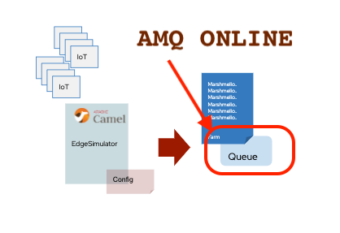

*Red Hat AMQ Online* is an OpenShift-based mechanism for delivering messaging as a managed service. With Red Hat AMQ Online, administrators can configure a cloud-native, multi-tenant messaging service where developers can provision messaging using a _web console_. Multiple development teams can provision the brokers and queues from the console, *without* requiring each team to _install, configure, deploy, maintain, or patch any software_.
[time=10]
[id="pre-req"]
=== OpenShfit Dev Spaces Workspace and Setup the environment
You are setting up a topic in AMQ Online to receive event signals from Edge devices.  In this task, you'll provision a messaging topic using Red Hat's Messaging as a Service platform on OpenShift (AMQ Online).

+

. To provision OpenShfit Dev Spaces Workspace, navigate to OpenShfit Dev Spaces console: {codeready-url}[OpenShfit Dev Spaces, window="_blank", id="{context}-3"]

. Login to Che using your credentials (`{user-username}` and `{user-password}`).
+
image::images/1.1.2-login.png[1.1.2-login, role="integr8ly-img-responsive"]

. Click the **Play** button to open your workspace.  Give it a few minutes to provision and open.
+
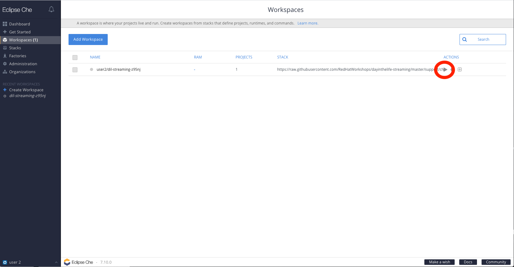

. You’ll be placed in the workspace. Close the initial welcome and Readme tabs then click on the Explorer button on the left side bar.

. Click the **Workspace** button and open the `FleurDeLune/projects/overseer` folder.
+
image::images/2.1.4-che-workspace-folder.png[2.1.4-che-workspace-folder, role="integr8ly-img-responsive"]

. Select **Terminal > Open Terminal in specific container** and select the container that begins with `dil-` (followed by a 5-digit alphanumeric code).  Click it and a terminal window should open.
+
image::images/2.1.6-terminal.png[2.1.6-terminal, role="integr8ly-img-responsive"]

. Navigate to the {openshift-host}[OpenShift Developer Console, window="_blank", id="{context}-3"] and login with your OpenShift credentials (Your username is: `{user-username}` Your password is: `{user-password}`)

. Click on your username in the top right-hand corner.  Click **Copy login command**, login with your credentials, then click **Display Token**. Copy the `oc login` command from this page and paste it in your terminal window.  Hit enter to login.
+
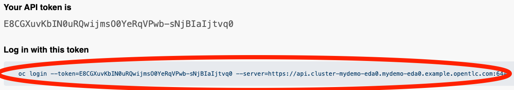

. Once you've logged into OpenShift via the CLI, run the following commands to setup this lab. (Setup AddressSpace and Kafka Cluster)
+
[source,bash,subs="attributes+"]
----
oc project {namespace}
cd /projects/FleurDeLune/projects/overseer
oc apply -f config/prereq.yaml
----

. Click on the the Topology view (left side menu)
+
image:images/openshift-kafkas-list.png[Back To Topology]

. Wait for the Kafka cluster to start. It can take a few minutes as the operator will deploy your Kafka cluster infrastructure and related operators to manage it.
+
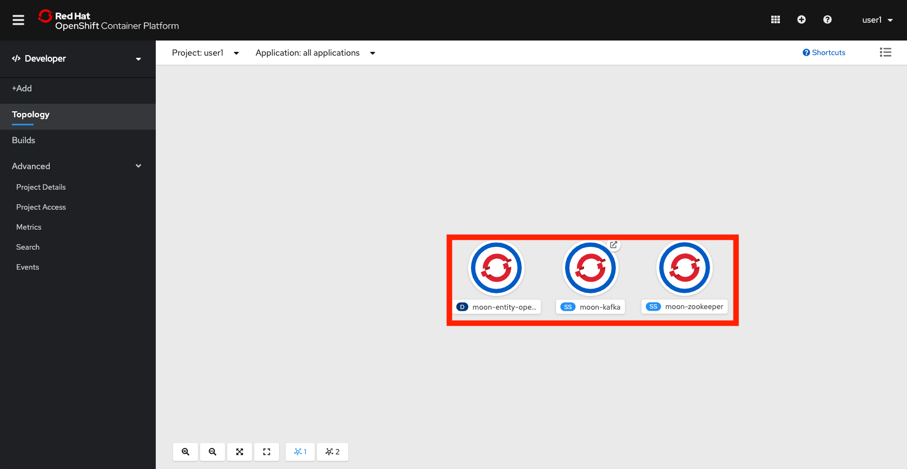

. Navigate to the {amqoneline-url}[AMQ Online Console, window="_blank", id="{context}-3"]

. Login to using your credentials (`{user-username}` and `{user-password}`).

. Make sure the AMQ AddressSpace *amq* is listed on the page and the Topic is active
+
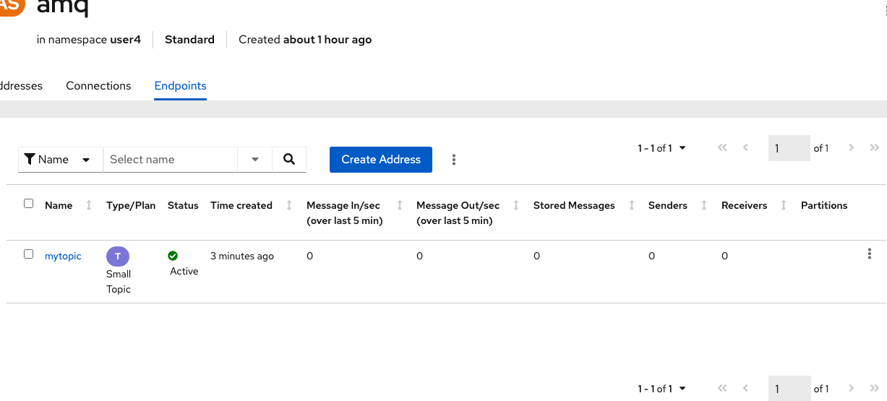
+
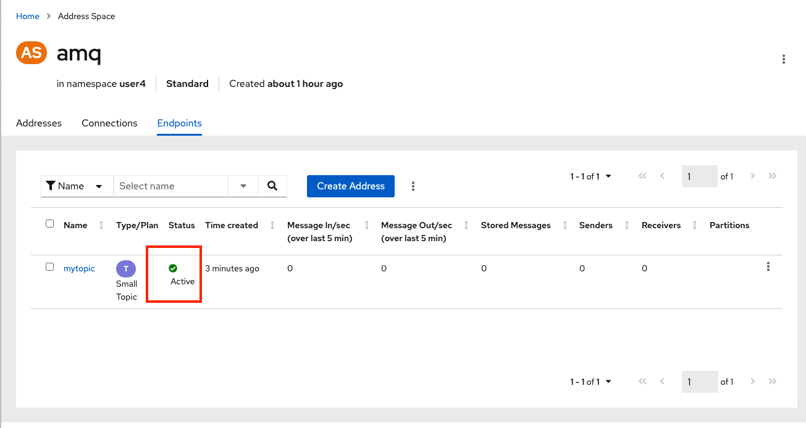

. Run to following script to start the Simulator that streams the harvest data into the broker.
+
[source,bash,subs="attributes+"]
----
oc project {namespace}
cd /projects/FleurDeLune/projects/overseer/config/
bash prereq.sh
----

. Make note of the output, this is going to be your *AMQP* endpoint for the next task
+
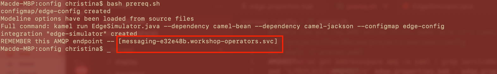

. Navigate to the {openshift-host}[OpenShift Developer Console, window="_blank", id="{context}-3"] and click on the  *Topology view*. You should be able to see the simulator running.
+
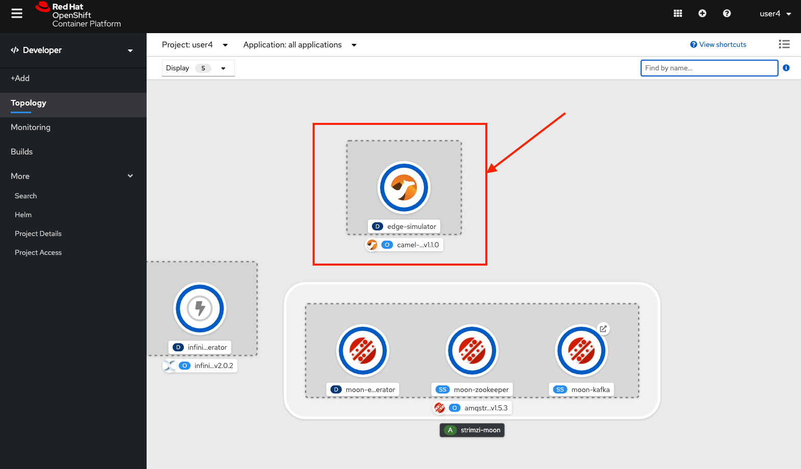

[type=verification]
Were you able to successfully provision the AMQ Online Address Space and Kafka Cluster?

[type=verificationFail]
Verify that you followed each step in the procedure above. If you are still having issues, contact your administrator.

[time=10]
[id="harvest-from-amq-topic"]
== Stream Harvest data to a Kafka Topic

. In this lab, you'll collect data from a Broker Topic and extract the batch count.  This will avoid an unnecessary large data transfer.  Lastly, you'll stream the data to a cost center topic in AMQ Streams.
+

+
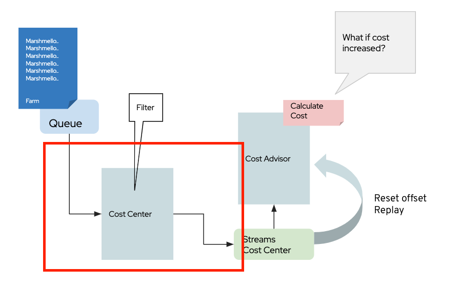

=== Steps
. In {openshift-host}[OpenShift Developer Console, window="_blank", id="{context}-3"], click **+Add** then click **From Catalog** link.
+
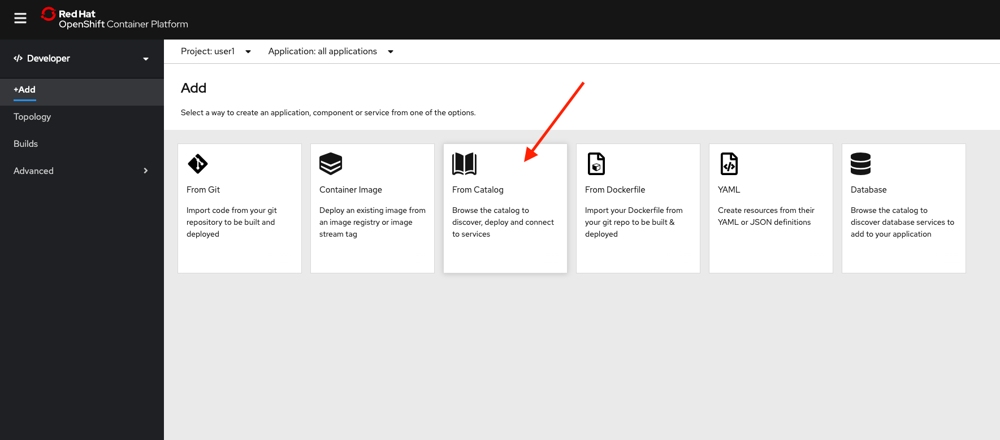

. In the filter box type `topic` then select **Kafka topic**.  Click **Create**.
+
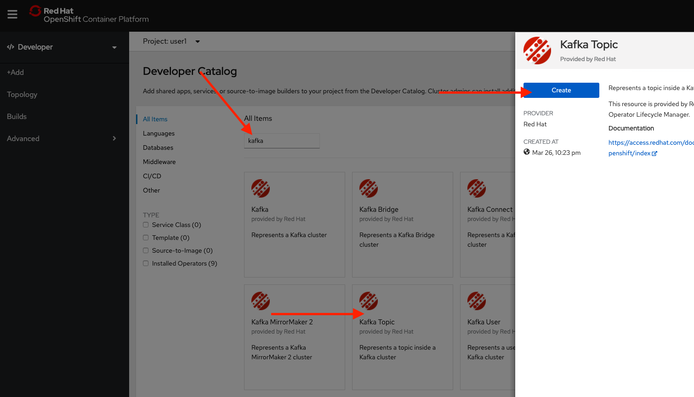

. Replace the name `my-topic` with our topic name `costcenter`, and update the cluster name to `moon`.  Click **Create**.
+
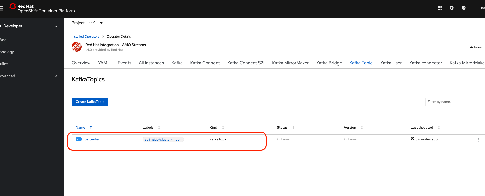

. Navigate back to the OpenShfit Dev Spaces console: {codeready-url}[OpenShfit Dev Spaces, window="_blank", id="{context}-3"]

. Login to Che using your credentials (`{user-username}` and `{user-password}`).
+
image::images/1.1.2-login.png[1.1.2-login, role="integr8ly-img-responsive"]

. Find the `{lab-path}/{lab-4-path}/cost-center` folder.
+
image::images/2.1.4-che-workspace-folder.png[2.1.4-che-workspace-folder, role="integr8ly-img-responsive"]

. Open the *costcenter.yaml* file.  This is the *Configuration Map* file where all credentials and configurations are stored.  We need to update `quarkus.qpid-jms.url` for the **AMQP** endpoint.  Copy and paste the `service.host` you copied earlier (into a text editor) and update the `amqp://` endpoint with the correct service hostname. Additionally, update the **camel.component.kafka.brokers** URL to be `moon-kafka-bootstrap.{user-username}.svc:9092`
+
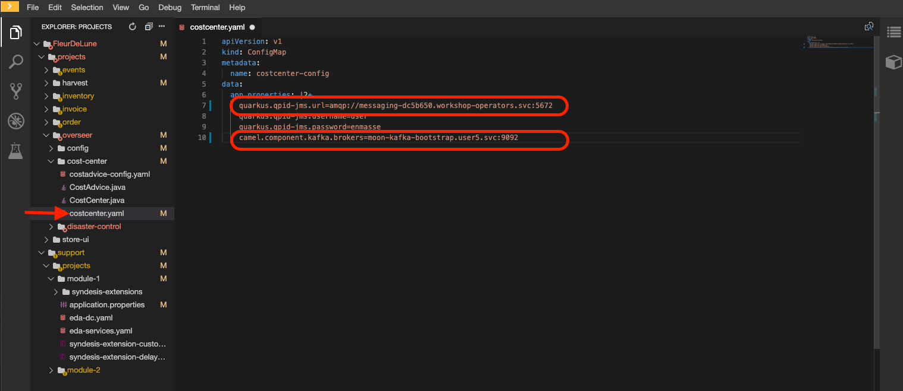

. Select **Terminal > Open Terminal** in a specific container and select the container that begins with `dil-` (followed by a 5-digit alphanumeric code).  Click it and a terminal window should open.
+
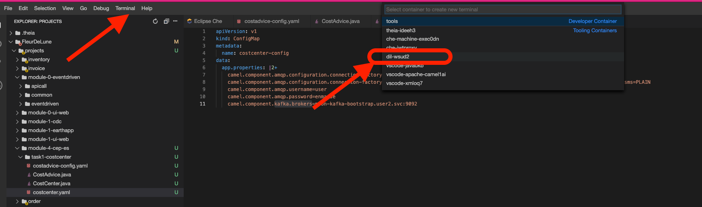

. Navigate back to your OpenShift Admin console and click on your username in the top right-hand corner.  Click **Copy login command**, login with your credentials, then click **Display Token**. Copy the `oc login` command from this page and paste it in your terminal window.  Hit enter to login.
+
image::images/1.1.4-oc.png[1.1.4-oc-oc, role="integr8ly-img-responsive"]

. Once you've logged into OpenShift via the CLI, run the following commands to creat `costcenter-config` configmap.
+
[source,bash,subs="attributes+"]
----
oc project {namespace}

cd $CHE_PROJECTS_ROOT/{lab-path}/{lab-4-path}/cost-center/

oc apply -f costcenter.yaml
----

. Open the *CostCenter.java* file located in the *cost-center* folder.  This simple application simply re-routes harvest events (from AMQ Online **mytopic**) to an AMQ Streams Topic.

. Try deploying and running the *CostCenter* Camel-K route by executing the following command
+
[source,bash,subs="attributes+"]
----
kamel run CostCenter.java
----

. Navigate back to the *OpenShift Developer Console* and verify the **cost-center** pod deployed correctly.  You can verify this by checking the Harvest events are coming in and there are no errors.

+
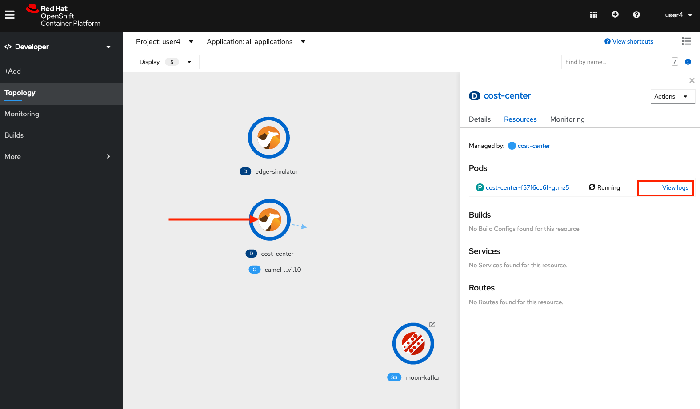

+
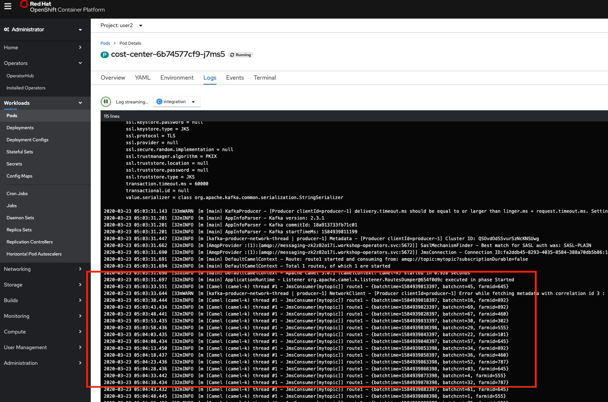

[type=verification]
Were you able to successfully deploy the Camel-K **Cost Center** to OpenShift?

[type=verificationFail]
Verify that you followed each step in the procedure above. If you are still having issues, contact your administrator.

[time=10]
[id="cost-advise"]
== Calculate real time cost per farm

. In this example, you will calculate the cost for each farm using real-time input.

+
image::images/2.0.0-overview.png[2.0.0-overview, role="integr8ly-img-responsive"]

. Open the `costadvice-config.yaml` file.  This is the *Configuration Map* file where all credentials and configurations are stored.  We need to update it for the **Kafka** endpoint. Update the **camel.component.kafka.brokers** URL to be `moon-kafka-bootstrap.{user-username}.svc:9092`
+
image::images/2.1.1-advice-config-update.png[2.1.1-advice-config-update, role="integr8ly-img-responsive"]

. In the terminal from the previous task, run the following commands to create `costadvice-config` configmap.
+
[source,bash,subs="attributes+"]
----
oc project {namespace}

cd $CHE_PROJECTS_ROOT/{lab-path}/{lab-4-path}/cost-center/

oc apply -f costadvice-config.yaml
----

. Open the `CostAdvice.java` file located in the *cost-center* folder.  This cost advisory solution, provides a simple cost estimation of each farm.

. Try deploying and running the *CostAdvice* Camel-K route by executing the following command
+
[source,bash,subs="attributes+"]
----
kamel run CostAdvice.java
----

. Navigate back to the *OpenShift Developer Console* and verify the **cost-advice** pod deployed correctly.
+
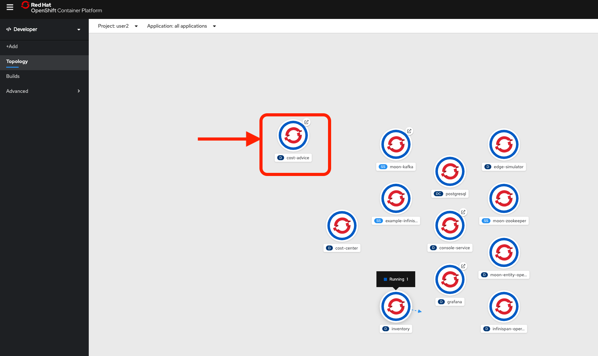

. In the *OpenShift Developer Console* find the route to access the cost advice result
+
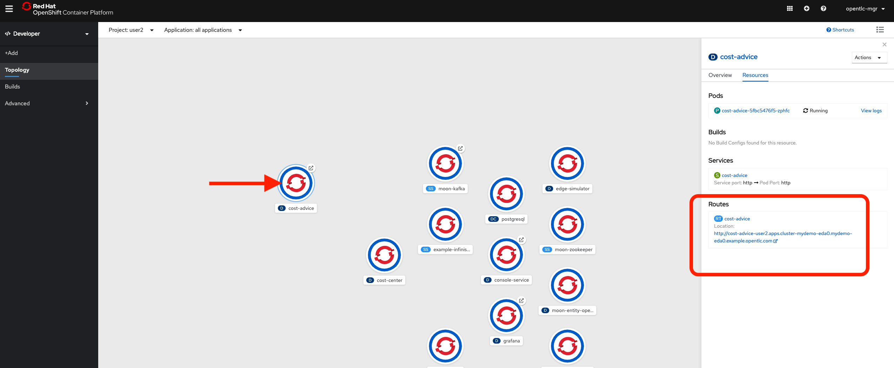

. In the browser, paste the URL with path `/costadvice`, you should be able to see the result in JSON format.
+
image::images/2.1.8-cost-advice-result.png[2.1.8-cost-advice-route, role="integr8ly-img-responsive"]

. Your URL should look like the following: `http://cost-advice-{user-username}.{openshift-app-host}/costadvice`.

[type=verification]
Were you able to successfully deploy the Camel-K **Cost Advice** to OpenShift?

[type=verificationFail]
Verify that you followed each step in the procedure above. If you are still having issues, contact your administrator.

[time=15]
[id="event-sourcing"]
== Event Sourcing: what if the cost is higher then expected!

. In this task, we'll increase the cost of each farm and replay the real-time cost.
+
image::images/3.2.0-diagram.png[3.2.0-diagram, role="integr8ly-img-responsive"]

. In the Terminal, list all the Camel-K application, run the following commands. You should see at least two, `cost-center` and `cost-advice`
+
[source,bash,subs="attributes+"]
----
kamel get
----
+
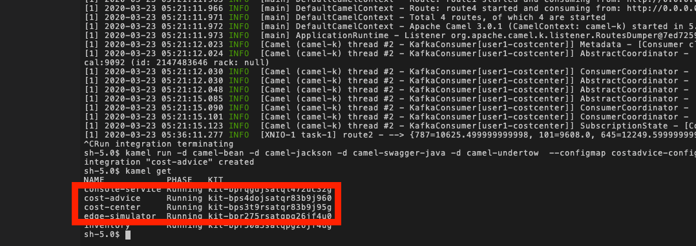

. In the Terminal, stop the previous applications
+
[source,bash,subs="attributes+"]
----
kamel delete cost-advice
----
+
[source,bash,subs="attributes+"]
----
kamel delete cost-center
----

. Navigate back to the *OpenShift Developer Console* , find moon-kafka in the topology, and click on one of the three pod (any of one of the three)
+
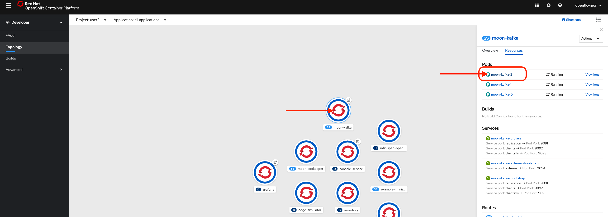

. Click on the Terminal tab.
+
image::images/3.1.5-terminal.png[3.1.5-terminal, role="integr8ly-img-responsive"]

. Run following command to list the topic that the *costadvisor* groups subscribe to. You should see it is subscribed to *costcenter*.
+
[source,bash,subs="attributes+"]
----
./bin/kafka-consumer-groups.sh --bootstrap-server moon-kafka-bootstrap.{user-username}.svc:9092 --group costadvisor --describe
----

. Reset the consumer offset for the `costadvisor` groups. You should see NEW-OFFSET is now back to **0**
+
[source,bash,subs="attributes+"]
----
./bin/kafka-consumer-groups.sh --bootstrap-server moon-kafka-bootstrap.{user-username}.svc:9092 --group costadvisor --topic costcenter --reset-offsets --to-earliest --execute
----

. Open the *CostAdvice.java* file located in the *cost-center* folder.  Change the cost for each farm.
+
[source,bash,subs="attributes+"]
----

COST_FACTOR.put(101, 10.0);
COST_FACTOR.put(302, 20.0);
COST_FACTOR.put(787, 10.0);
COST_FACTOR.put(645, 15.0);
COST_FACTOR.put(555, 10.0);
COST_FACTOR.put(460, 10.0);
COST_FACTOR.put(892, 10.0);

----
+
image::images/3.1.6-change-cost.png[3.1.6-change-cost, role="integr8ly-img-responsive"]

. Try deploying and running the *CostAdvice* Camel-K route again by executing the following command
+
[source,bash,subs="attributes+"]
----
kamel run CostAdvice.java
----

. Navigate back to the *OpenShift Developer Console* and verify the **cost-advice** pod deployed correctly.
+

. In the *OpenShift Developer Console* find the route to access the cost advice result
+

. In the browser, paste the URL with the path `/costadvice`. You should be able to see the new updated result in JSON format.
+
image::images/3.1.8-cost-advice-result.png[3.1.8-cost-advice-route, role="integr8ly-img-responsive"]
+
. Your URL should look like the following: `http://cost-advice-{user-username}.{openshift-app-host}/costadvice`.

[type=verification]
Were you able to successfully deploy the Camel-K **Cost Advice** to OpenShift? Did you get the what if results? Try replay with a couple of different costs!

[type=verificationFail]
Verify that you followed each step in the procedure above. If you are still having issues, contact your administrator.

[time=15]
[id="cep-drools-quarkus-app"]
== Create complex event processing application

. This example creates an application, collects and sorts the events based on a 10 second time window then determines if disaster has struck.
+

+
image::images/4.0.0-overview.png[4.0.0-overview, role="integr8ly-img-responsive"]

. Navigate back to OpenShfit Dev Spaces console: {codeready-url}[OpenShfit Dev Spaces, window="_blank", id="{context}-3"]

. Find the `{lab-path}/{lab-4-path}/disaster-control/src/main/java/com/redhat/workshop/dil` folder.

. Open the `DisasterTopology.java` file.  This is the the file that will take care of how stream of events are aggregated. Place the following code under **//Build Topology to get harvest Info//**

+
[source,bash,subs="attributes+"]
----
StreamsBuilder builder = new StreamsBuilder();

        KStream<Windowed<Long>, Integer> windowedharvestcnt = builder.stream(
            HARVEST_EVENT_TOPIC, /* input topic */
            Consumed.with(
                Serdes.String(), /* key serde */
                harvestEventSerde   /* value serde */
            )
        )
        .peek((key, value) -> System.out.println("Before key=" + key + ", value=" + value))
        .map((key, value) -> KeyValue.pair(value.getBatchtime(), value.getBatchcnt()))
        .groupByKey(
            Grouped.with(
                Serdes.Long(), /* key */
                Serdes.Integer() /* value */
            )
        )
        .windowedBy(TimeWindows.of(Duration.ofSeconds(DISASTER_HARVEST_INTERVAL)))
        .aggregate(
            () -> 0, /* initializer */
            (aggKey, newValue, aggValue) -> aggValue + newValue,
            Materialized.with(Serdes.Long(), Serdes.Integer())
        )
        .toStream()
        .peek((key, value) -> System.out.println("After key=" + key + ", value=" + value))
        ;

----

+
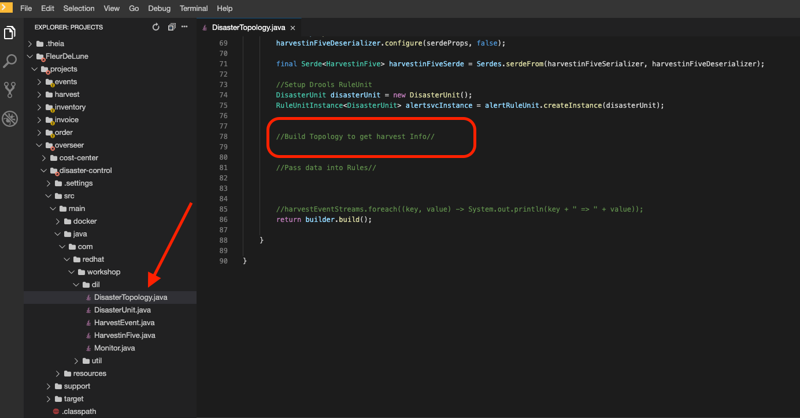

. Open the `harvestevent.drl` file.  under `{lab-path}/projects/overseer/disaster-control/src/main/resources/META-INF/resources/com/redhat/workshop/dil`. Add the RULES to determine if it's disaster or a good harvest day!
+
[source,bash,subs="attributes+"]
----
package com.redhat.workshop.dil
unit DisasterUnit

import com.redhat.workshop.dil.HarvestinFive;

rule "Beautiful Day" when
    $p : /eventStream[totalCnt >= 150]
then
    System.out.println("Beautiful day for marshmallow picking! Total harvest amount: "+ $p.totalCnt);
end

rule "Disaster Strikes " when
    $p : /eventStream[totalCnt <= 150]
then
    System.out.println( "Disaster Strikes " + $p.totalCnt);
    $p.setDisaster(true);
end
----

. Back to the `DisasterTopology.java` file.  Let's send the aggregated data to Kogito Rules. Add the following code snippet under **//Pass data into Rules//**
+
[source,bash,subs="attributes+"]
----
windowedharvestcnt.map(
                (key, value) -> {
                    HarvestinFive hin5 = new HarvestinFive();
                    hin5.setTotalCnt(value);
                    disasterUnit.getEventStream().append(hin5);
                    alertsvcInstance.fire();
                    return new KeyValue<>(key.key(),hin5);
                }
        )
        .peek((key, value) -> System.out.println("Result key=" + key + ", value=" + value))
        .to(DISASTER_EVENT_TOPIC, Produced.with(Serdes.Long(), harvestinFiveSerde));

----

. Select **Terminal > Open Terminal** in specific container** and select the container that begins with `tools`.  Click it and a terminal window should open.
+
image::images/4.1.2-tools-terminal.png[4.1.2-tools-terminal, role="integr8ly-img-responsive"]

. Navigate back to your OpenShift Admin console and click on your username in the top right-hand corner.  Click **Copy login command**, login with your credentials, then click **Display Token**. Copy the `oc login` command from this page and paste it in your terminal window.  Hit enter to login.
+
image::images/1.1.4-oc.png[1.1.4-oc-oc, role="integr8ly-img-responsive"]

. Once you've logged into OpenShift via the CLI, run the following commands to build the application.
+
[source,bash,subs="attributes+"]
----
oc project {namespace}

cd $CHE_PROJECTS_ROOT/{lab-path}/{lab-4-path}/disaster-control/

mvn clean compile package -DskipTests

oc new-build --binary --name=cep-kogito -l app=cep-kogito

oc patch bc/cep-kogito -p "{\"spec\":{\"strategy\":{\"dockerStrategy\":{\"dockerfilePath\":\"src/main/docker/Dockerfile.jvm\"}}}}"

oc start-build cep-kogito --from-dir=. --follow
----
+
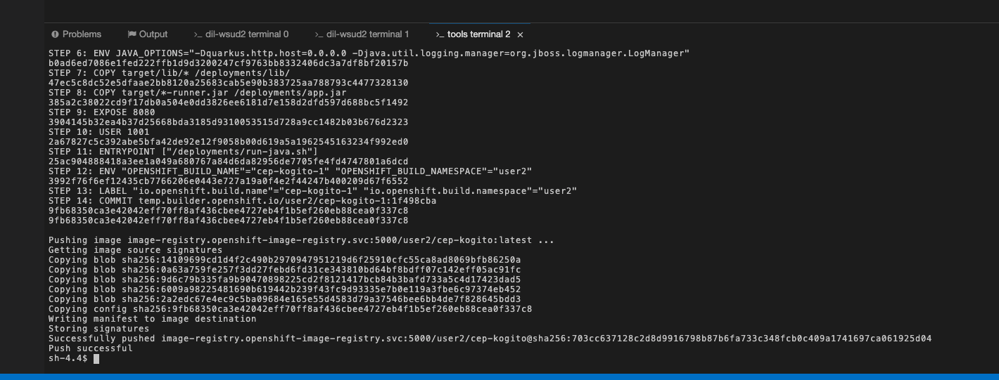

. Once you've logged into OpenShift via the CLI, run the following commands to start the application.
+
[source,bash,subs="attributes+"]
----
oc new-app --image-stream=cep-kogito \
 -e quarkus.kafka-streams.bootstrap-servers=moon-kafka-bootstrap.{user-username}.svc:9092 \
 -e quarkus.kafka-streams.application-server=moon-kafka-bootstrap.{user-username}.svc:9092
----
+
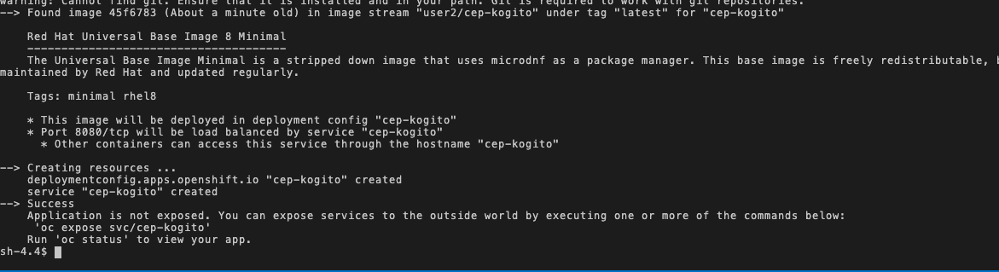

. Navigate back to the *OpenShift Developer Console* and verify the **cep-kogito** pod deployed correctly.  You can verify this by checking the Harvest events are coming in and there are no errors.

+
image::images/4.2.1-developer-kogito.png[4.2.1-developer-kogito, role="integr8ly-img-responsive"]

+
image::images/4.2.2-log-kogito.png[4.2.2-log-kogito, role="integr8ly-img-responsive"]

[type=verification]
Were you able to successfully deploy the **CEP-KOGITO** application to OpenShift?

[type=verificationFail]
Verify that you followed each step in the procedure above. If you are still having issues, contact your administrator.

[time=10]
[id="cep-result"]
== See Disaster Alert

. Restart the simulator with problem harvest and see if disaster alerts kicked off.

+
image::images/4.2.0-overview.png[4.2.0-overview, role="integr8ly-img-responsive"]

. Back in the OpenShift Dev Spaces IDE, switch to the `dilwsXXX` terminal

. Deploying and run the *CostCenter* Camel-K route by executing the following command again to send harvest data again!
+
[source,bash,subs="attributes+"]
----
cd $CHE_PROJECTS_ROOT/{lab-path}/{lab-4-path}/cost-center/
kamel delete cost-advice

kamel run CostCenter.java
----

. Stop the the *simlulator* Camel-K route by executing the following command again to send harvest data again!
+
[source,bash,subs="attributes+"]
----
kamel delete edge-simulator
----

. Go to the *FleurDeLune/projects/overseer/config* folder, find *EdgeSimulator.java* and update the  MIN from 150 to 1;
+
[source,bash,subs="attributes+"]
----

public static final int MIN = 1;
----
+
image::images/4.2.3-update-min.png[4.2.3-update-min, role="integr8ly-img-responsive"]

. Run the *Updates Simulator* executing the following command again to send harvest data again!
+
[source,bash,subs="attributes+"]
----
cd $CHE_PROJECTS_ROOT/{lab-path}/overseer/config

kamel run EdgeSimulator.java
----

. Navigate back to the *OpenShift Developer Console* view the new processed result
+
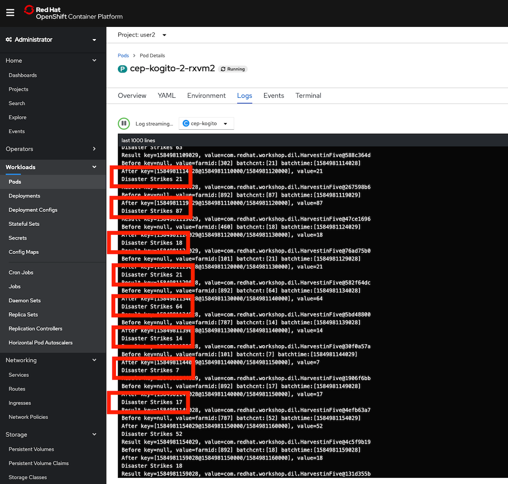

+

. Navigate back to the *OpenShift Developer Console* , find moon-kafka in the topology, and click on one of the three pod (any of one of the three)
+

. Click on the Terminal tab.
+
image::images/3.1.5-terminal.png[3.1.5-terminal, role="integr8ly-img-responsive"]

. Run following command see the incoming alert for  `disaster` topic.
+
[source,bash,subs="attributes+"]
----

./bin/kafka-console-consumer.sh --bootstrap-server moon-kafka-bootstrap.{user-username}.svc:9092 --topic disaster
----
+
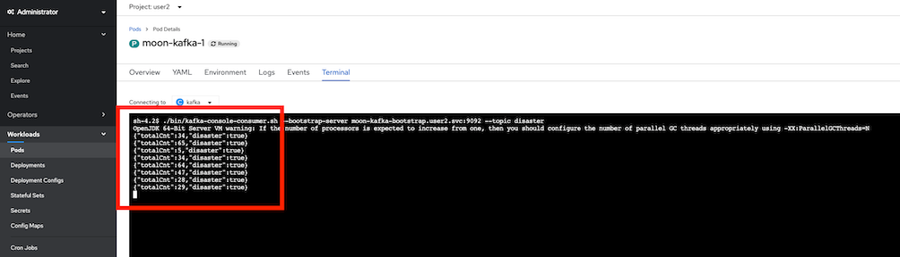

[type=verification]
Were you able to successfully see disasters occurring?

[type=verificationFail]
Verify that you followed each step in the procedure above. If you are still having issues, contact your administrator.

[time=3]
[id="summary"]
== Summary

In this lab you replayed streams of events to see the possible analytical result of farm costs in order to better predict revenue. This is a common event streaming technique called Event sourcing. You have been introduced how to implement with ease using Camel-K and Red Hat AMQ Streams.

Event driven is also the foundation for real time behavior detection. You used Kafka Streams in conjunction with Kogito to build real time complex event processing app to detect if disaster strikes base on the harvest data.

[time=2]
[id="further-reading"]
== Notes and Further Reading

* https://www.redhat.com/en/technologies/jboss-middleware/amq[Red Hat AMQ]
* https://camel.apache.org/camel-k/latest/index.html[Camel K]
* https://kogito.kie.org/[Kogito]
