:walkthrough: Complex Event Processing
:che-url: http://che-che.{openshift-app-host}/
:next-lab-url: https://tutorial-web-app-webapp.{openshift-app-host}/tutorial/dayinthelife-streaming.git-labs-05/
:user-password: openshift
:lab-path: FleurDeLune/projects
:lab-4-path: overseer

ifdef::env-github[]
:next-lab-url: ../lab05/walkthrough.adoc
endif::[]

[id='cep-event-sourcing']
= Lab 4 - Complex Event Processing and Event Sourcing

In this lab you will be processing the streamed events. There are two common secnarios, Event Sourcing and Complex Event Processing. You will be receiving harvest event from topics on Kafka, and replay the event. Using Kafka Streams to real-time events and extracting information from event streams as they arrive.

Audience: System Architects, Developers, Data Integrators

*Overview*

The Event Sourcing is use to handle operations which are driven by a sequence of imperative events. Events in AMQ Streams are stored and presist sequentially, each represents change of the state. This allows applications can now replay history and play what-if scenarios.  

Complex Event Processing, or CEP, is primarily an event processing concept that deals with the task of processing events with the goal of identifying the meaningful events within the event cloud.

*Why Red Hat?*

To respond to business demands quickly and efficiently, you need a way to integrate applications and data spread across your enterprise. Red Hat® AMQ—based on open source communities like Apache ActiveMQ and Apache Kafka—is a flexible messaging platform that delivers information reliably, enabling real-time integration and connecting the Internet of Things (IoT).

Red Hat Kafka Streams is a client library for building applications and microservices, where the input and output data are stored in Kafka clusters. It combines the simplicity of writing and deploying standard Java and Scala applications on the client side with the benefits of Kafka's server-side cluster technology.

Kogito is the open source Quarkus extension that allows developers to implement core logic in a more business-driven way. It brings concepts and maturity from 15+ years of experience of production-tested projects like jBPM and Drools.

*Prerequisites*

This lab assumes you have successfully completed Lab 1 to 3.

*Credentials*

Your username is: `{user-username}` +
Your password is: `{user-password}`

[type=walkthroughResource]
.Che
****
* link:{che-url}/[Open Eclipse Che, window="_blank"]
****

[type=walkthroughResource,serviceName=openshift]
.Openshift
****
* link:{openshift-host}/[Open Console, window="_blank"]
****

[time=10]
[id="harvest-from-amq-topic"]
== Collect Harvest data to Kafka Topic

. Navigate back to Eclipse Che console: {che-url}[Eclipse Che, window="_blank", id="{context}-3"]

. Login to Che using your credentials (`{user-username}` and `{user-password}`).
+
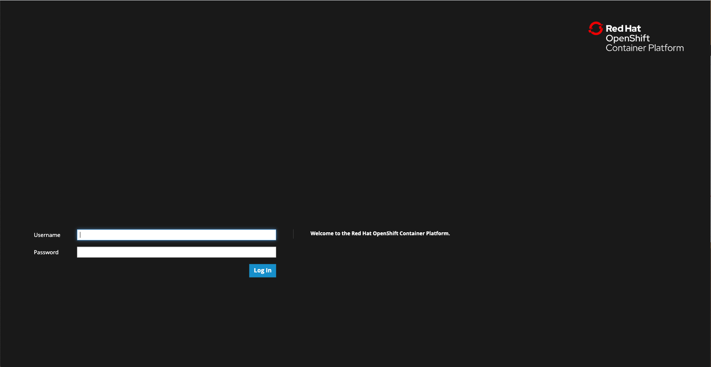

. Find the `{lab-path}/{lab-4-path}/cost-center` folder.
+
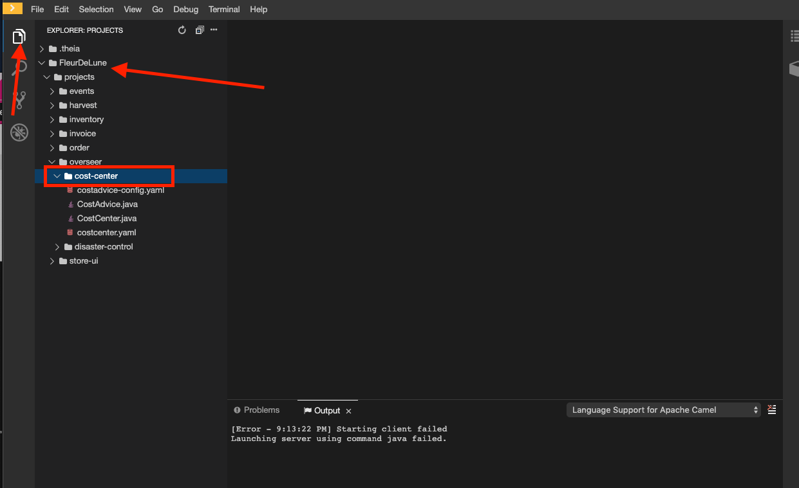

. Open the `costcenter.yaml` file.  This is the *Configureation Map* file where all credentials and configurations are stored.  We need to update `remoteURI` for the **AMQP** endpoint.  Copy and paste the `service.host` you copied earlier (into a text editor) and update the `amqp://` endpoint with the correct service hostname. Additionally, update the **kafka.brokers** URL to be `moon-kafka-bootstrap.{user-username}.svc:9092`
+
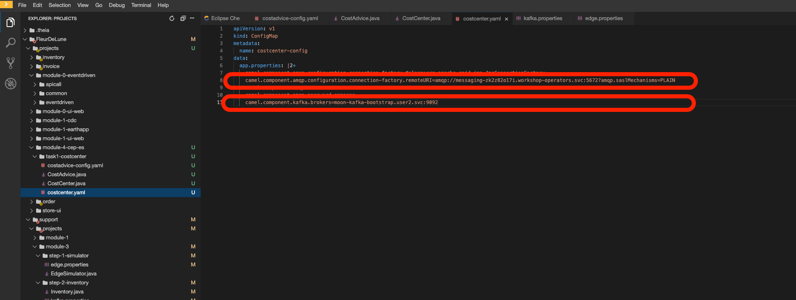

. Select **Terminal > Open Terminal** in specific container** and select the container that begins with `dil-` (followed by a 5-digit alphanumeric code).  Click it and a terminal window should open.
+
image::images/1.1.3-terminal.png[1.1.3-terminal, role="integr8ly-img-responsive"]

. Navigate back to your OpenShift Admin console and click on your username in the top right-hand corner.  Click **Copy login command**, login with your credentials, then click **Display Token**. Copy the `oc login` command from this page and paste it in your terminal window.  Hit enter to login.
+
image::images/1.1.4-oc.png[1.1.4-oc-oc, role="integr8ly-img-responsive"]

. Once you've logged into OpenShift via the CLI, run the following commands to creat `costcenter-config` configmap.
+
[source,bash,subs="attributes+"]
----
oc project `{user-username}`
cd `$CHE_PROJECTS_ROOT/{lab-path}/{lab-4-path}/cost-center/`
oc apply -f costcenter.yaml
----

. Open the ` CostCenter.java` file located in the *cost-center* folder.  This simple application collects harvest data from the edge device from each farm in AMQ Online **mytopic**. And simply re-route the evenst to an Kafka Topic. 

. Try deploying and running the *CostCenter* Camel-K route by executing the following command
+
[source,bash,subs="attributes+"]
----
kamel run -d camel-jackson --configmap costcenter-config CostCenter.java
----

. Navigate back to the *OpenShift Developer Console* and verify the **cost-center** pod deployed correctly.  You can verify this by checking the Harvest events are coming in and there are no errors.

+
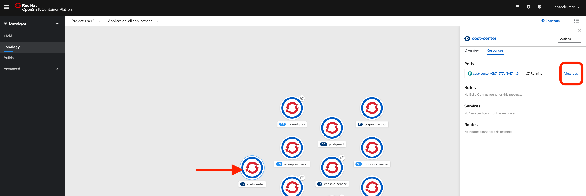

+
image::images/1.1.8-verify-cost-center.png[1.1.8-verify-cost-center, role="integr8ly-img-responsive"]

[type=verification]
Were you able to successfully deploy the Camel-K **Cost Center** to OpenShift?

[type=verificationFail]
Verify that you followed each step in the procedure above. If you are still having issues, contact your administrator.

[time=10]
[id="cost-advise"]
== Calculate real time cost per farm

. Open the `costadvice-config.yaml` file.  This is the *Configureation Map* file where all credentials and configurations are stored.  We need to update `remoteURI` for the **Kafka** endpoint. Update the **kafka.brokers** URL to be `moon-kafka-bootstrap.{user-username}.svc:9092`
+
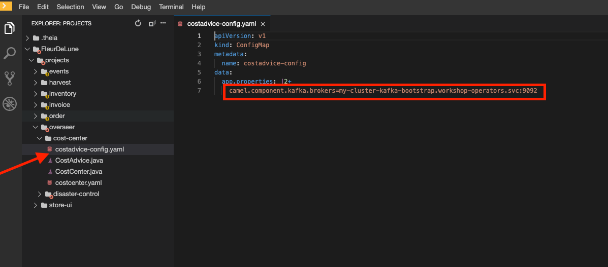

. In the terminal from the previous task, run the following commands to creat `costadvice-config` configmap.
+
[source,bash,subs="attributes+"]
----
oc project `{user-username}`
cd `$CHE_PROJECTS_ROOT/{lab-path}/{lab-4-path}/cost-center/`
oc apply -f costadvice-config.yaml
----

. Open the `CostAdvice.java` file located in the *cost-center* folder.  This cost advisory solution, provides a simple cost estimation of each farm. 

. Try deploying and running the *CostAdvice* Camel-K route by executing the following command
+
[source,bash,subs="attributes+"]
----
kamel run -d camel-bean -d camel-jackson -d camel-swagger-java -d camel-undertow  --configmap costadvice-config CostAdvice.java
----

. Navigate back to the *OpenShift Developer Console* and verify the **cost-advice** pod deployed correctly.  
+
image::images/2.1.6-cost-advice.png[2.1.6-cost-advice, role="integr8ly-img-responsive"]

. In the *OpenShift Developer Console* find the route to access the cost advice result  
+
image::images/2.1.7-cost-advice-route.png[2.1.7-cost-advice-route, role="integr8ly-img-responsive"]

. In the browser, paste the URL with path `/costadvice`, you should be able to see the result in JSON format.
+
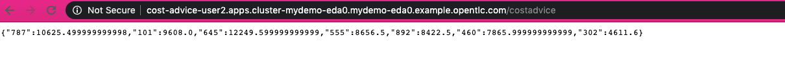
http://cost-advice-user2.apps.cluster-mydemo-eda0.mydemo-eda0.example.opentlc.com/costadvice

[type=verification]
Were you able to successfully deploy the Camel-K **Cost Advice** to OpenShift?

[type=verificationFail]
Verify that you followed each step in the procedure above. If you are still having issues, contact your administrator.

[time=15]
[id="event-sourcing"]
== Event Souring, what if cost is higher then expected!

. In the Terminal, list all the Camel-K application, run the following commands. You should see at least two, `cost-center` and `cost-advice`
+
[source,bash,subs="attributes+"]
----
kamel get
----
+
image::images/3.1.2-kamel-get.png[3.1.2-kamel-get, role="integr8ly-img-responsive"]

. In the Terminal, stop the previous applications
+
[source,bash,subs="attributes+"]
----
kamel delete cost-advice 
kamel delete cost-center 
----

. Navigate back to the *OpenShift Developer Console* , find moon-kafka in the topology, and click on one of the three pod (any of one of the three)  
+
image::images/3.1.4-kafka-pod.png[3.1.4-kafka-pod, role="integr8ly-img-responsive"]

. Click on the Terminal tab.  
+
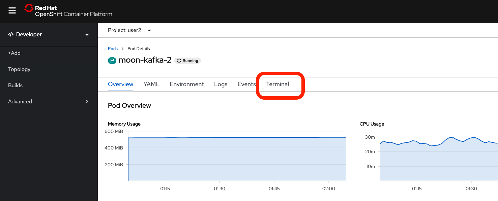

. Run following command to list the topics `costadvisor` groups subscribe to. you should see it's subscribe to `{user-username}-costcenter`
+
[source,bash,subs="attributes+"]
----
./bin/kafka-consumer-groups.sh --bootstrap-server moon-kafka-bootstrap.`{user-username}`.svc:9092 --group costadvisor --describe
----

. Reset the consumer offset to `costadvisor` groups. You shout see NEW-OFFSET is now back to **0**       
+
[source,bash,subs="attributes+"]
----
./bin/kafka-consumer-groups.sh --bootstrap-server moon-kafka-bootstrap.`{user-username}`.svc:9092 --group costadvisor --topic `{user-username}-costcenter` --reset-offsets --to-earliest --execute
----

. Open the `CostAdvice.java` file located in the *cost-center* folder.  Change the cost for each farm. 
+
[source,bash,subs="attributes+"]
----
COST_FACTOR.put(101, 10.0);
COST_FACTOR.put(302, 20.0);
COST_FACTOR.put(787, 10.0);
COST_FACTOR.put(645, 15.0);
COST_FACTOR.put(555, 10.0);
COST_FACTOR.put(460, 10.0);
COST_FACTOR.put(892, 10.0);
----
+
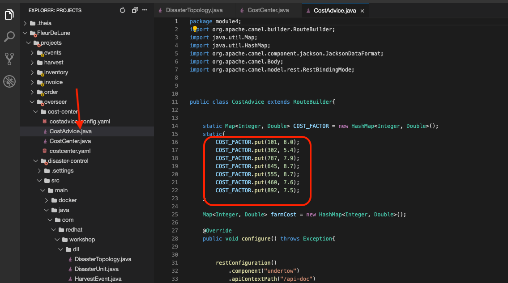

. Try deploying and running the *CostAdvice* Camel-K route again by executing the following command
+
[source,bash,subs="attributes+"]
----
kamel run -d camel-bean -d camel-jackson -d camel-swagger-java -d camel-undertow  --configmap costadvice-config CostAdvice.java
----

. Navigate back to the *OpenShift Developer Console* and verify the **cost-advice** pod deployed correctly.  
+
image::images/2.1.6-cost-advice.png[2.1.6-cost-advice, role="integr8ly-img-responsive"]

. In the *OpenShift Developer Console* find the route to access the cost advice result  
+
image::images/2.1.7-cost-advice-route.png[2.1.7-cost-advice-route, role="integr8ly-img-responsive"]

. In the browser, paste the URL with path `/costadvice`, you should be able to see the new updated result in JSON format.
+
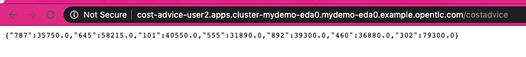
http://cost-advice-user2.apps.cluster-mydemo-eda0.mydemo-eda0.example.opentlc.com/costadvice

[type=verification]
Were you able to successfully deploy the Camel-K **Cost Advice** to OpenShift? Did you get the what if result? try play with couple of different cost!

[type=verificationFail]
Verify that you followed each step in the procedure above. If you are still having issues, contact your administrator.

[time=15]
[id="cep-drools-quarkus-app"]
== Create complex event processing application

. Navigate back to Eclipse Che console: {che-url}[Eclipse Che, window="_blank", id="{context}-3"]

. Find the `{lab-path}/{lab-4-path}/disaster-control/src/main/java/com/redhat/workshop/dil` folder.

. Open the `DisasterTopology.java` file.  This is the the file that will take care of how stream of events are aggregated. Place the following code under **//Build Topology to get harvest Info//**

+
[source,bash,subs="attributes+"]
----
StreamsBuilder builder = new StreamsBuilder();

        KStream<Windowed<Long>, Integer> windowedharvestcnt = builder.stream(
            HARVEST_EVENT_TOPIC, /* input topic */
            Consumed.with(
                Serdes.String(), /* key serde */
                harvestEventSerde   /* value serde */
            )
        )
        .peek((key, value) -> System.out.println("Before key=" + key + ", value=" + value))
        .map((key, value) -> KeyValue.pair(value.getBatchtime(), value.getBatchcnt()))
        .groupByKey(
            Grouped.with( 
                Serdes.Long(), /* key */
                Serdes.Integer() /* value */
            )     
        )
        .windowedBy(TimeWindows.of(Duration.ofSeconds(DISASTER_HARVEST_INTERVAL)))
        .aggregate(
            () -> 0, /* initializer */
            (aggKey, newValue, aggValue) -> aggValue + newValue,
            Materialized.with(Serdes.Long(), Serdes.Integer())
        )
        .toStream()
        .peek((key, value) -> System.out.println("After key=" + key + ", value=" + value))
        ;

----

+
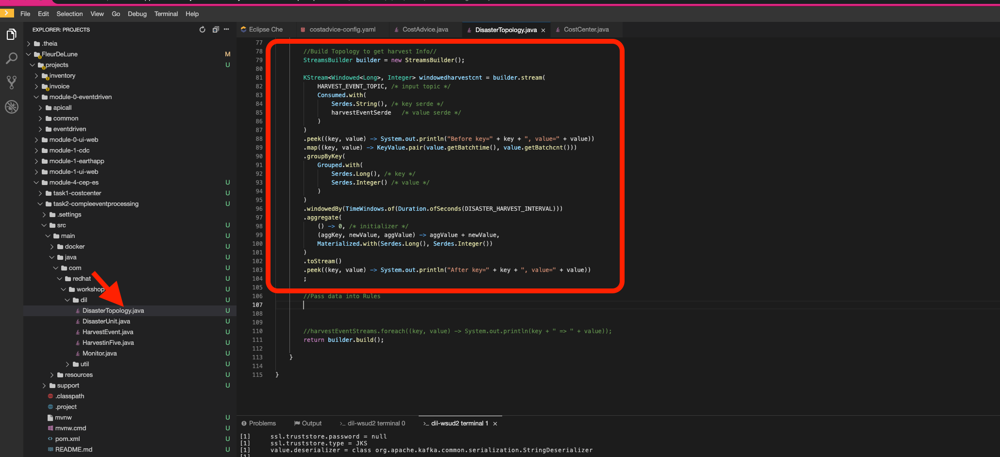

. Open the `harvestevent.drl` file.  under {lab-path}/module-4-cep-es/disaster-control/src/main/resources/META-INF/resources/com/redhat/workshop/dil. Add the RULES to determine if it's disaster or good harvest day!
+
[source,bash,subs="attributes+"]
----
package com.redhat.workshop.dil
unit DisasterUnit

import com.redhat.workshop.dil.HarvestinFive;

rule "Beautiful Day" when
    $p : /eventStream[totalCnt >= 150]
then
    System.out.println("Beautiful day for marshmallow picking! Total harvest amount: "+ $p.totalCnt);
end

rule "Disaster Strikes " when
    $p : /eventStream[totalCnt <= 150]
then
    System.out.println( "Disaster Strikes " + $p.totalCnt);
    $p.setDisaster(true);
end
----

. Back to the `DisasterTopology.java` file.  Let's send the aggregated data to Kogito Rules. Add the following code snippet under **//Pass data into Rules//**
+
[source,bash,subs="attributes+"]
----
windowedharvestcnt.map(
                (key, value) -> {
                    HarvestinFive hin5 = new HarvestinFive();
                    hin5.setTotalCnt(value);
                    disasterUnit.getEventStream().append(hin5);
                    alertsvcInstance.fire();
                    return new KeyValue<>(key.key(),hin5);
                }
        )
        .peek((key, value) -> System.out.println("Result key=" + key + ", value=" + value))
        .to(DISASTER_EVENT_TOPIC, Produced.with(Serdes.Long(), harvestinFiveSerde));
        
----

. Select **Terminal > Open Terminal** in specific container** and select the container that begins with `tools`.  Click it and a terminal window should open.
+
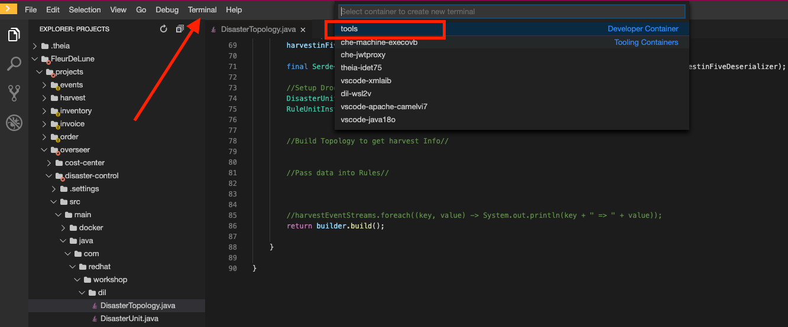

. Navigate back to your OpenShift Admin console and click on your username in the top right-hand corner.  Click **Copy login command**, login with your credentials, then click **Display Token**. Copy the `oc login` command from this page and paste it in your terminal window.  Hit enter to login.
+
image::images/1.1.4-oc.png[1.1.4-oc-oc, role="integr8ly-img-responsive"]

. Once you've logged into OpenShift via the CLI, run the following commands to build the application.
+
[source,bash,subs="attributes+"]
----
oc project `{user-username}`

mvn clean compile package -DskipTests -f $CHE_PROJECTS_ROOT/{lab-path}/{{lab-4-path}}/disaster-control

oc new-build --binary --name=cep-kogito -l app=cep-kogito

oc patch bc/cep-kogito -p "{\"spec\":{\"strategy\":{\"dockerStrategy\":{\"dockerfilePath\":\"src/main/docker/Dockerfile.jvm\"}}}}"

oc start-build cep-kogito  --from-file $CHE_PROJECTS_ROOT/`{lab-path}`/`{lab-4-path}`/disaster-control/target/*-runner.jar --follow 
----
+
image::images/4.1.8-start-build.png[4.1.8-start-build, role="integr8ly-img-responsive"]

. Once you've logged into OpenShift via the CLI, run the following commands to start the application.
+
----
oc new-app --image-stream=cep-kogito \
 -e quarkus.kafka-streams.bootstrap-servers=`moon-kafka-bootstrap.{user-username}.svc:9092` \
 -e quarkus.kafka-streams.application-server=`moon-kafka-bootstrap.{user-username}.svc:9092`
----
+
image::images/4.1.9-new-app.png[4.1.9-new-app, role="integr8ly-img-responsive"]

 
. Navigate back to the *OpenShift Developer Console* and verify the **cep-kogito** pod deployed correctly.  You can verify this by checking the Harvest events are coming in and there are no errors.

+
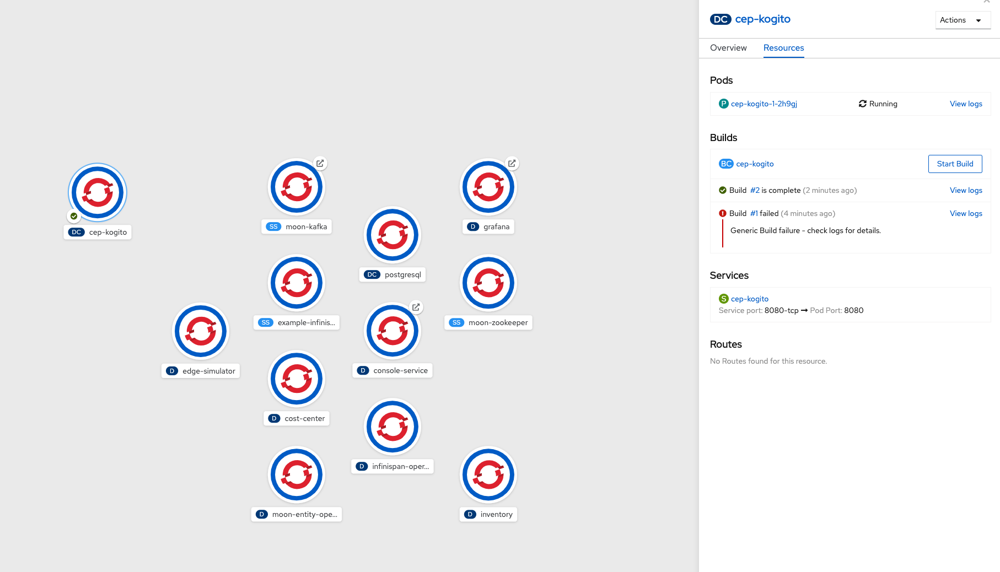

+
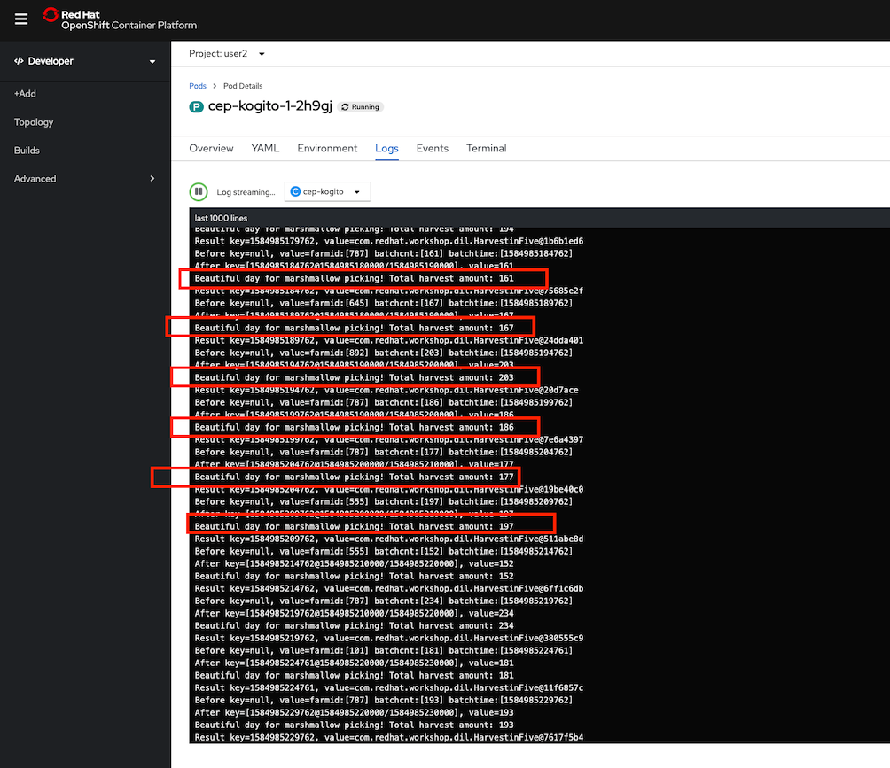

[type=verification]
Were you able to successfully deploy the **CEP-KOGITO** application to OpenShift? 

[type=verificationFail]
Verify that you followed each step in the procedure above. If you are still having issues, contact your administrator.

[time=10]
[id="cep-result"]
== See Disaster Alert
. Switch to the `dilwsXXX` terminal

. Deploying and run the *CostCenter* Camel-K route by executing the following command again to send harvest data again!
+
[source,bash,subs="attributes+"]
----
cd `$CHE_PROJECTS_ROOT/{lab-path}/{lab-4-path}/cost-center/`
kamel delete cost-advice

kamel run -d camel-jackson --configmap costcenter-config CostCenter.java
----

. Stop the the *simlulator* Camel-K route by executing the following command again to send harvest data again!
+
[source,bash,subs="attributes+"]
----
kamel delete edge-simulator 
----

. Go to harvest/simulator, find *EdgeSimulator.java* and update the  MIN from 150 to 1;
+
[source,bash,subs="attributes+"]
----

public static final int MIN = 1;
----
+
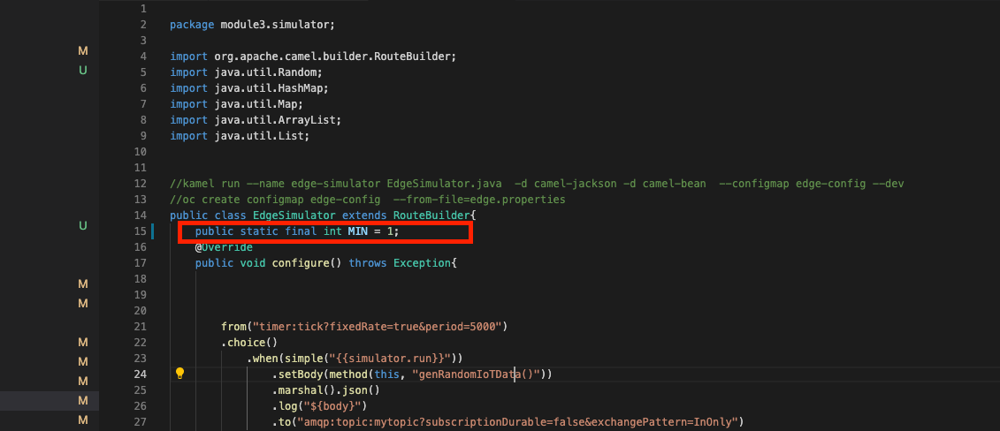

. Run the *Updates Simulator* executing the following command again to send harvest data again!
+
[source,bash,subs="attributes+"]
----
cd `$CHE_PROJECTS_ROOT/{lab-path}/{lab-4-path}/cost-center/`

kamel run --name edge-simulator EdgeSimulator.java  -d camel-jackson -d camel-bean  --configmap edge-config
----

. Navigate back to the *OpenShift Developer Console* view the new processed result
+
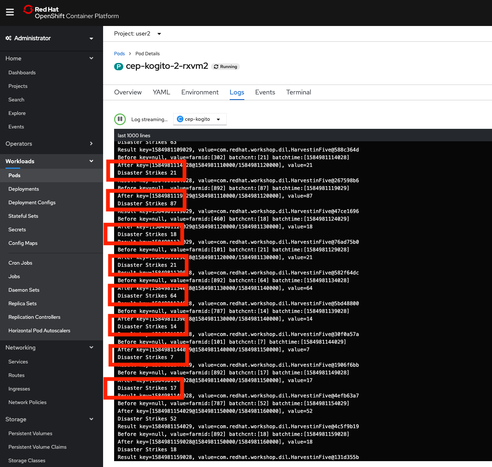

+
image::images/1.1.8-verify-cost-center.png[1.1.8-verify-cost-center, role="integr8ly-img-responsive"]

. Navigate back to the *OpenShift Developer Console* , find moon-kafka in the topology, and click on one of the three pod (any of one of the three)  
+

. Click on the Terminal tab.  
+

. Run following command see the incoming alert for  `disaster` topic.
+
[source,bash,subs="attributes+"]
----

./bin/kafka-console-consumer.sh --bootstrap-server moon-kafka-bootstrap.`{user-username}`.svc:9092 --topic disaster
----
+
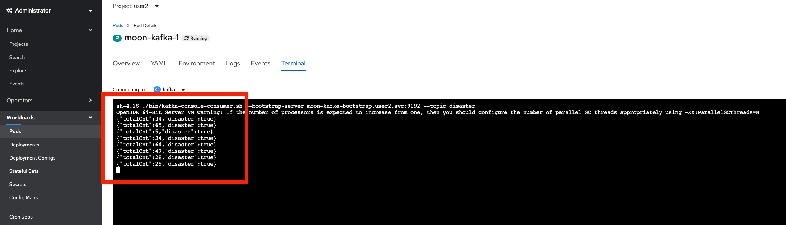

[type=verification]
Were you able to successfully deploy the **CEP-KOGITO** application to OpenShift? Did you get the what if result? try play with couple of different cost!

[type=verificationFail]
Verify that you followed each step in the procedure above. If you are still having issues, contact your administrator.

[time=3]
[id="summary"]
== Summary

In this lab you replay streams of event to see the possible analytical result of farm costs in order to better predict revenue. This is a common appoarch as one of event streaming technique-- Event sourcing. You have been introduced to implement with ease using Camel-K and Red Hat Streams. 

Event driven is also the fundation for real time behaviour detection. You used Kafka Streams in conjuction with Kogito to build real time complex event processing to detect if disaster strikes base on the harvest data. 

You can now proceed to link:{next-lab-url}[Lab 5].

[time=2]
[id="further-reading"]
== Notes and Further Reading

* https://www.redhat.com/en/technologies/jboss-middleware/amq[Red Hat AMQ]
* https://camel.apache.org/camel-k/latest/index.html[Camel K]
* https://kogito.kie.org/[Kogito]