// Attributes
:walkthrough: Cloud Native Applications (Optional)
:title: Lab A - {walkthrough}
:user-password: openshift
:standard-fail-text: Verify that you followed all the steps. If you continue to have issues, contact a workshop assistant.

// URLs
:next-lab-url: https://tutorial-web-app-webapp.{openshift-app-host}/tutorial/dayinthelife-streaming.git-labs-01-Event-Driven-Architecture/
:codeready-url: http://codeready-che.{openshift-app-host}/
:fuse-user-url: https://syndesis-fuse-{user-username}.{openshift-app-host}/

ifdef::env-github[]
:next-lab-url: ../01-Event-Driven-Architecture/walkthrough.adoc
endif::[]

[id='cloud-native-applications']
= {title}

Fleur de Lune IT has selected OpenShift as their default enterprise Kubernetes platform. To get better benefit of the container platform they also started to migrate their legacy services from Spring Boot to Quarkus. You are part of the new team that will work on the new ecommerce apps to make them cloud native. 

Check the easy of reusing all your Java EE knowledge while coding with Quarkus and make your apps available in OpenShift while testing them on the cloud using Code Ready Workspaces and deploying them using OpenShift builds.

*Audience:* System Architects, Developers, DevOps Engineers

*Overview*

In this lab you will be introduced to Code Ready Workspaces a cloud native IDE for developers. You will be using the IDE to check the new Quarkus code, see how it runs locally in your environment and how to test it. You will interact with the OpenShift CLI to deploy this new and legacy applications as builds using the OpenShift source-to-image build tooling.

You will deploy the backend services build on Quarkus to manage the inventory and process the payments and invoicing for the frontend web app that handles the online orders. A legacy SpringBoot application is the mediator between the web application and the backend services. 

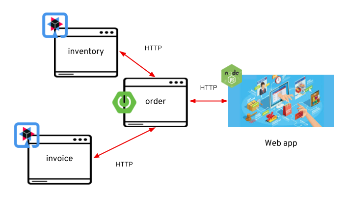

At the end of the lab, you should be able to order online from the nodejs application and see how your order is processed by the inventory and invoice service.

*Why Red Hat?*

Built on the open Eclipse Che project, Red Hat CodeReady Workspaces uses Kubernetes and containers to provide any member of the development or IT team with a consistent, secure, and zero-configuration development environment. The user experience is as fast and familiar as an integrated development environment (IDE) on their laptop.

Development environments are containerized and running on the OpenShift Kubernetes platform. Developers can run code updates in an OpenShift container without needing to understand all the details of managing a Kubernetes cluster. 

Quarkus is a Kubernetes-native Java stack for microservices and serverless development due to its fast startup times, low memory footprint, and small application size.

It works out of the box with popular Java standards, frameworks, and libraries. Developers familiar with these will feel at home with Quarkus, which streamlines code for 80% of common use cases while providing the flexibility to cover the remaining 20%. 

*Credentials*

Use the following credentials to login into the web consoles:

* *Username:* `{user-username}`
* *Password:* `{user-password}`

[type=walkthroughResource,serviceName=codeready]
.Red Hat CodeReady Workspaces
****
* link:{codeready-url}[Console, window="_blank", , id="resources-codeready-url"]
****
[type=walkthroughResource]
.Red Hat OpenShift Developer Console
****
* link:{openshift-host}/topology/ns/{namespace}[Topology View, window="_blank"]
****

:sectnums:

[time=5]
[id="Getting Ready"]
== Getting ready for the labs

You will be using Red Hat CodeReady Workspaces, an online integrated development environment (IDE) based on link:https://www.eclipse.org/che/[Eclipse Che, window="_blank"]. Changes to files are *auto-saved* every few seconds, so you don't need to explicitly save changes.

. To get started go to the link:{codeready-url}[Codeready console, window="_blank"] and log in using your username and password credentials.
+
image::images/openshift-login.png[OpenShift Login, role="integr8ly-img-responsive"]

. You will need to _Authorize Access_ to CodeReady to access your permissions and being able to mananage your session. Click on *Allow selected permissions*.
+
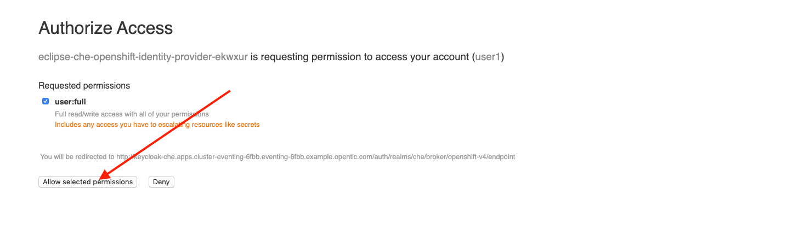

=== Start CodeReady workspace

. Once you have logged in and authorized access to your user account, you will land in your personal CodeReady dashboard. 
+
--
A new workspace has been configured with the required tools, plugins and project to start working on this workshop. 

Click on the workspace with the name starting with `dil-streaming-` on the left menu bar under *RECENT WORKSPACES*.

image::images/codeready-dashboard.png[CodeReady Dashboard, role="integr8ly-img-responsive"]

[NOTE]
====
You can also click on the name of the workspace in the center, and then click on the green button that says _Open_ on the top right hand side of the screen.
====
--

. This will start an instance of the workspace. Please wait a few moments while it downloads the required container images and configuration setup.
+
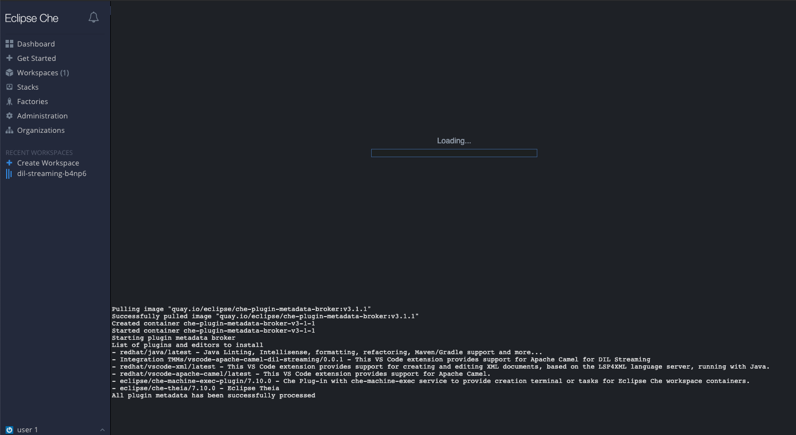

. The first time it's run, it will git clone the required projects for this workshop. After a minute or two, you’ll be placed in the workspace. Close the initial welcome and Readme tabs then click on the Explorer button on the left side bar.
+
image::images/codeready-welcome.png[CodeReady Welcome screen, role="integr8ly-img-responsive"]
+
[NOTE]
====
This IDE is based on *Eclipse Che*, which is in turn is based on MicroSoft VS Code editor. It will look familiar if you have already used it.

You can close the _Problems_ and _Output_ views to clear space.
====

. The projects explorer will show you the *FleurDeLune* folder with the required projects. Expand the folders to reveal the projects we cloned from the git repository.
+
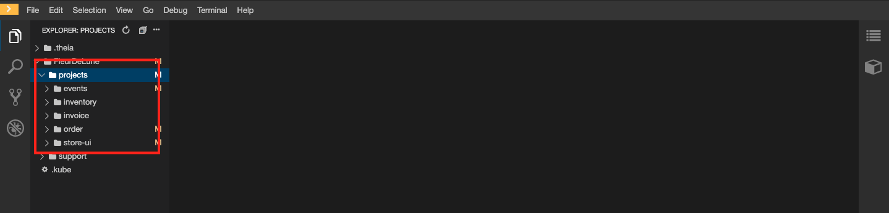

. During the workshop we will need to introduce commands for both the OpenShift and Camel-K Command Line Interfaces (CLI). For that we will need to start a terminal window _inside_ one of the containers from the developer workspace. To open the terminal window, click on the _My Workspace_ button on the right side panel and expand the **User Runtimes/tools** folder. Click on *>_ New terminal*.
+
image::images/codeready-new-terminal.png[Open Terminal, role="integr8ly-img-responsive"]

. This will deploy the terminal window in the bottom of the screen. This terminal is attached to the running CodeReady container and is also running on OpenShift. This is the place where you will issue most of the commands from this workshop.
+
image::images/codeready-terminal.png[CodeReady Terminal, role="integr8ly-img-responsive"]

=== Login into the OpenShift cluster

. Finally, you will need to login into the OpenShift CLI to start interacting with the platform. For login, issue the following command:
+
[source,bash,subs="attributes+"]
----
oc login -u {user-username} -p {user-password} https://$KUBERNETES_SERVICE_HOST:$KUBERNETES_SERVICE_PORT --insecure-skip-tls-verify=true
----

. You should see something like the following (the project names may be different):
+
[source,bash,subs="attributes+"]
----
Login successful.

You have access to the following projects and can switch between them with 'oc project <projectname>':

  * shared-db-earth
    shared-kafka-earth
    user1
    user1-che
    user1-dayinthel-0605
    user1-shared-475f

Using project "shared-db-earth".
Welcome! See 'oc help' to get started.
----

. Most of the work will be deploy to your own `{namespace}` project namespace, so be sure to have it as a _working_ project by executing the following command:
+
[source,bash,subs="attributes+"]
----
oc project {namespace}
----

. Now you are ready to start working on the application services.

[type=verification]
Were you able to successfully login to Openshift CLI?

[type=verificationFail]
Verify that you followed each step in the procedure above. If you are still having issues, contact your administrator.

[time=15]
[id="Deploy the Inventory Service"]
== Deploy the Inventory Service

The _Inventory Service_ handles the order and provides information about the availability. In this case, we will generate an inventory idenfitier and process the result back. Take a look on how the implementation is using *Quarkus* as a Java runtime.

=== Review the code

. Go to _Explorer:/projects_ in CodeReady Workspaces web IDE and expand the *inventory* folder.
+
image::images/codeready-inventory.png[Inventory Service, role="integr8ly-img-responsive"]
+
The Inventory service implements a simple _RESTful API_ using *Quarkus*.

. Open the `InventoryResource.java` file under `src/main/java/com/redhat/cloudnative` and check the provided code.
+
image::images/inventory-resource.png[InventoryResource.java, role="integr8ly-img-responsive"]
+
The REST service defines a simple _POST_ endpoint `/notify/order` to receive the `Order` notifications as JSON. This service calls the `InventoryNotification` service.

. Open the `InventoryNotification.java` file under `src/main/java/com/redhat/cloudnative` and check the provided code.
+
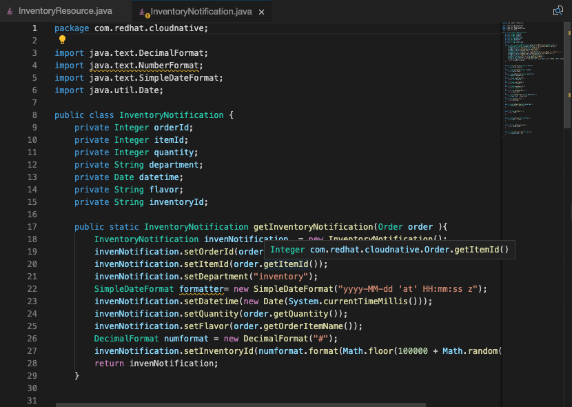
+
As we mentioned before, it just creates an InventoryNotification with a random `InventoryId` and adds the current _timestamp_.

=== Deploy locally to CodeReady

. Run the inventory application locally using the _Maven plugin command_ via CodeReady Workspaces Terminal:
+
[source,bash,subs="attributes+"]
----
mvn clean compile quarkus:dev -f $CHE_PROJECTS_ROOT/FleurDeLune/projects/inventory/
----

. Look at the output, it is just maven downloading dependencies that should end like the following:
+
--
[source,bash,subs="attributes+"]
----
...
Listening for transport dt_socket at address: 5005
2020-03-18 17:33:14,290 INFO  [io.quarkus] (main) inventory 1.0.0-SNAPSHOT (running on Quarkus 1.2.1.Final) started in 1.981s. Listening on: http://0.0.0.0:8080
2020-03-18 17:33:14,294 INFO  [io.quarkus] (main) Profile dev activated. Live Coding activated.
2020-03-18 17:33:14,294 INFO  [io.quarkus] (main) Installed features: [cdi, resteasy, resteasy-jackson]
----

[NOTE]
====
Don't close the dialog that appears while running the server!

If you did so, stop the process with `ctrl+c` or `cmd + c` and re-run the command again.
====
--

. CodeReady should detect you are running your Quarkus application and is opening the `8080` port. Click on the *Open Link* button to open the CodeReady embedded browser.
+
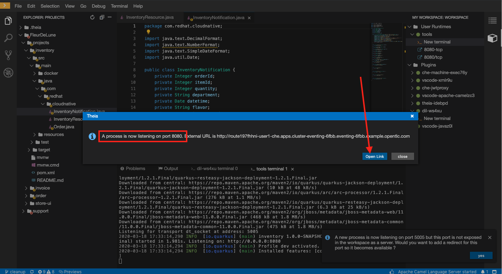

. Take a look at the _Inventory_ page on the right side.
+
image::images/inventory-web.png[Inventory Web, role="integr8ly-img-responsive"]
+
This is a default provisioned page from Quarkus. You don't need to worry about this since we will only use the REST API.

. As we are running our service in the current CodeReady Terminal, open a new terminal window from the commands menu on the right side
+
image::images/codeready-new-terminal.png[New Terminal, role="integr8ly-img-responsive"]

. Test the local deployment issuing the following command in the new CodeReady Terminal:
+
[source,bash,subs="attributes+"]
----
curl -s -X POST \
  http://localhost:8080/notify/order \
  -H 'cache-control: no-cache' \
  -H 'content-type: application/json' \
  -d  \
  '{
    "orderId": 978,
    "itemId": 135790,
    "orderItemName": "Mango",
    "quantity": 1,
    "price": 2.50,
    "address": "hello",
    "zipCode": "15555"
  }'
----

. Check the result, you should get someething similar to the following output:
+
[source,bash,subs="attributes+"]
----
{"orderId":978,"itemId":135790,"quantity":1,"department":"inventory","datetime":1584
554071289,"flavor":"Mango","inventoryId":"939699"}
----

. Be sure to terminate the running Quarkus development via kbd:[CTRL+C] (or kbd:[Command+C] on Mac OS).

=== Deploy to OpenShift

. Now that we have seen that the service works, let's deploy the application to OpenShift. Package the application by running the following maven plugin in the CodeReady Workspaces terminal:
+
[source,bash,subs="attributes+"]
----
mvn clean compile package -DskipTests -f $CHE_PROJECTS_ROOT/FleurDeLune/projects/inventory/
----

. Be sure to switch to your working OpenShift project by issuing the following command using the OpenShift CLI:
+
[source,bash,subs="attributes+"]
----
oc project {namespace}
----
+
You should get the following output:
+
[source,bash,subs="attributes+"]
----
Now using project "{namespace}" on server "https://172.30.0.1:443".
----

. Create a _Build Configuration_ for your application using the OpenJDK base container image:
+
--
[source,bash,subs="attributes+"]
----
oc new-build registry.access.redhat.com/redhat-openjdk-18/openjdk18-openshift:1.5 --binary --name=inventory -l app=inventory {namespace}
----

[NOTE]
====
This build uses the new link:https://access.redhat.com/documentation/en-us/red_hat_jboss_middleware_for_openshift/3/html/red_hat_java_s2i_for_openshift/index[Red Hat OpenJDK Container Image], providing foundational software needed to run Java applications, while staying at a reasonable size.
====
--

. Start and watch the build, which will take about a minute to complete:
+
[source,bash,subs="attributes+"]
----
oc start-build inventory --from-file $CHE_PROJECTS_ROOT/FleurDeLune/projects/inventory/target/*-runner.jar --follow {namespace}
----
+
You should get a _Push succesful_ line at the end
+
[source,bash,subs="attributes+"]
----
...
Writing manifest to image destination
Storing signatures
Successfully pushed image-registry.openshift-image-registry.svc:5000/user1/inventory@sha256:a42968c6de63853c87331626f4df02842fddca3c1282aa3a04426b668e348280
Push successful
----

. Once the build is done, deploy the service as an OpenShift application with the CLI:
+
[source,bash,subs="attributes+"]
----
oc new-app inventory -l 'app.openshift.io/runtime=quarkus,app.kubernetes.io/part-of=rest'; oc expose svc/inventory
----

=== Check the OpenShift Developer Console

. Open the OpenShift Developer Console link:{openshift-host}/topology/ns/{namespace}[Topology View, window="_blank"], make sure it's done deploying by waiting for the dark blue circles around the OpenShift logo:
+
image::images/topology-inventory.png[Topology Inventory, role="integr8ly-img-responsive"]

. Click on *Open URL* icon in the top right side of the `inventory` deployment to open access the service webpage.
+
--
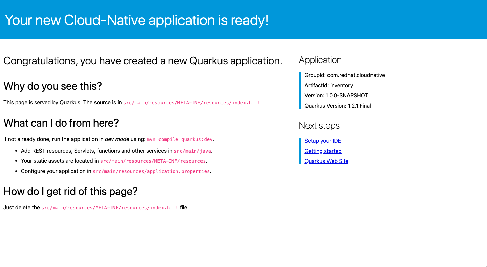

This time the inventory page has its own URL that is publicy accessible outside OpenShift.
--

. So now Inventory service is deployed to OpenShift. You can see it in the Project Status in the OpenShift Console that it is a single replica running in 1 pod.

[type=verification]
Were you able to successfully deploy the Inventory service to OpenShift?. You can see it in the Project Status via the OpenShift Console.  Verify that a single replica is running as 1 pod.

[type=verificationFail]
Verify that you followed each step in the procedure above. If you are still having issues, contact your administrator.

[time=5]
[id="Deploy Invoice Service"]
== Deploy Invoice Service

The second element of the architecture is the _Invoice Service_ that handles payments. In this case, the service is implemented using the *Quarkus* Java framework. The only difference with _Inventory Service_ is that we have added a few seconds delay to _mimic_ the time a real payment will have to wait for processing a card payment. Take a look at how the implementation is done using *Quarkus* as a Java runtime.

=== Review the code

. Go to _Explorer:/projects_ in CodeReady Workspaces web IDE and expand the *invoice* folder.
+
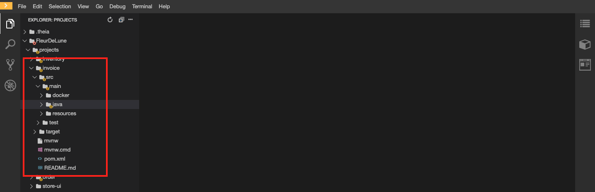

. Open the `InvoiceResource.java` file under `src/main/java/com/redhat/cloudnative` and check the provided code.
+
image::images/invoice-resource.png[InvoiceResource.java, role="integr8ly-img-responsive"]

The REST service defines a simple _POST_ endpoint `/notify/order` as we did with _Inventory_ to receive the `Order` notifications as JSON.  This service calls the `processOrder` method after a `30` seconds delay. As we mentioned before, it just creates a JSON Object with a random `InvoiceId` and adds the current _timestamp_.

=== Deploy to OpenShift

. Package the application by running the following maven plugin in the CodeReady Workspaces terminal:
+
[source,bash,subs="attributes+"]
----
mvn clean compile package -DskipTests -f $CHE_PROJECTS_ROOT/FleurDeLune/projects/invoice/
----
+
[NOTE]
====
For the following commands remember to be sure to switch to your _working_ project.
====

. Create a _Build Configuration_ for your application using the OpenJDK base container image:
+
[source,bash,subs="attributes+"]
----
oc new-build registry.access.redhat.com/redhat-openjdk-18/openjdk18-openshift:1.5 --binary --name=invoice -l app=invoice {namespace}
----

. Start and watch the build, which will take about minutes to complete:
+
[source,bash,subs="attributes+"]
----
oc start-build invoice --from-file $CHE_PROJECTS_ROOT/FleurDeLune/projects/invoice/target/*-runner.jar --follow {namespace}
----

. Deploy the service as an OpenShift application with the CLI:
+
[source,bash,subs="attributes+"]
----
oc new-app invoice -l 'app.openshift.io/runtime=quarkus,app.kubernetes.io/part-of=rest'; oc expose svc/invoice
----

=== Check the OpenShift Developer Console

. Open the OpenShift Developer Console link:{openshift-host}/topology/ns/{namespace}[Topology View, window="_blank"], make sure it's done deploying by waiting for the dark blue circles around the OpenShift logo:
+
image::images/topology-invoice.png[Topology Invoice, role="integr8ly-img-responsive"]

. Review the successful deployment by clicking on the *Open URL* icon on the deployment.

[type=verification]
Were you able to successfully open the corresponding default webpage?

[type=verificationFail]
Verify that you followed each step in the procedure above. If you are still having issues, contact your administrator.

[time=10]
[id="Deploy Order Service"]
== Deploy Order Service

The third element of the architecture is the _Order Service_ that works as the first point of access from the frontend and redirects the order to the rest of the backend services. In this case, the service is implemented using the *Spring Boot* Java framework. In this theorical implementation we are demonstrating a common microservices pattern that is called _Service Chaining_.

=== Review the code

. Go to _Explorer:/projects_ in CodeReady Workspaces web IDE and expand the *order* folder.
+
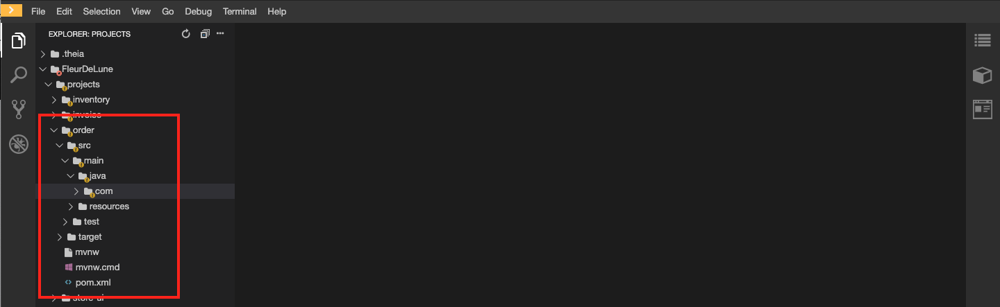

. Open the `OrderServiceController.java` file under `src/main/java/com/legacy/ordersservice` and check the provided code.
+
image::images/order-controller.png[OrderServiceController.java, role="integr8ly-img-responsive"]
+
You can see a traditional Spring Boot REST Controller with one endpoint receiving JSON _POST_ calls to the `/place` path.

. Open the `OrdersRepository.java` file under `src/main/java/com/legacy/ordersservice` and check the provided code.
+
image::images/order-repository.png[OrderRepository.java, role="integr8ly-img-responsive"]
+
[NOTE]
====
As we mentioned before, this service is calling the _Inventory_ and the _Invoice_ service using a `RestTemplate` *one after another*. We will see what this means for the user later in this lab.
====

=== Deploy to OpenShift

. Package the application by running the following maven plugin in the CodeReady Workspaces terminal:
+
[source,bash,subs="attributes+"]
----
mvn clean compile package -DskipTests -f $CHE_PROJECTS_ROOT/FleurDeLune/projects/order/
----
+
[NOTE]
====
For the following commands remember to be sure to switch to your _working_ project.
====

. Create a _Build Configuration_ for your application using the OpenJDK base container image:
+
[source,bash,subs="attributes+"]
----
oc new-build registry.access.redhat.com/redhat-openjdk-18/openjdk18-openshift:1.5 --binary --name=order -l app=order {namespace}
----

. Start and watch the build, which will take about minutes to complete:
+
[source,bash,subs="attributes+"]
----
oc start-build order --from-file $CHE_PROJECTS_ROOT/FleurDeLune/projects/order/target/*.jar --follow {namespace}
----

. Deploy the service as an OpenShift application with the CLI:
+
[source,bash,subs="attributes+"]
----
oc new-app order -l 'app.openshift.io/runtime=spring,app.kubernetes.io/part-of=rest'; oc expose svc/order
----

. Add the `connects-to` annotation to get a better _topology view_:
+
[source,bash,subs="attributes+"]
----
oc annotate dc/order app.openshift.io/connects-to=invoice,inventory
----

=== Check the OpenShift Developer Console

. Open the OpenShift Developer Console link:{openshift-host}/topology/ns/{namespace}[Topology View, window="_blank"], make sure it's done deploying by waiting for the dark blue circles around the OpenShift logo:
+
image::images/topology-order.png[Topology Order, role="integr8ly-img-responsive"]

. Review the successful deployment by clicking on the *Open URL* icon on the deployment.

. You should get the OpenAPI description from the service:
+
[source,bash,subs="attributes+"]
----
{"openapi":"3.0.1","info":{"title":"OpenAPI definition","version":"v0"},"servers":[{"url":"http://order-user1.apps.cluster-eventing-6fbb.eventing-6fbb.example.opentlc.com","description":"Generated server url"}],"paths":{"/place":{"post":{"tags":["orders-service-controller"],"operationId":"place","requestBody":{"content":{"application/json":{"schema":{"$ref":"#/components/schemas/Order"}}}},"responses":{"200":{"description":"default response","content":{"application/json":{"schema":{"type":"string"}}}}}}}},"components":{"schemas":{"Order":{"type":"object","properties":{"orderId":{"type":"integer","format":"int32"},"itemId":{"type":"integer","format":"int32"},"orderItemName":{"type":"string"},"quantity":{"type":"integer","format":"int32"},"price":{"type":"integer","format":"int32"},"address":{"type":"string"},"zipCode":{"type":"integer","format":"int32"},"datetime":{"type":"string"},"department":{"type":"string"}}}}}}
----
+
The backend services are now ready, so time to deploy the frontend store UI.

[type=verification]
Were you able to successfully deploy the Orders service and view the OpenAPI spec?

[type=verificationFail]
Verify that you followed each step in the procedure above. If you are still having issues, contact your administrator.

[time=5]
[id="Deploy Webapp"]
== Deploy Frontend Application

The last element of the architecture is the _Store App_, which is a regular *NodeJS* runtime application. It is a frontend store page to take the orders from regular customers. It posts all the orders to the backend _Order Service`_ and while showing a _loading_ dialog until it receives the order outcome.

=== Deploy to OpenShift

. Via the Eclipse Che terminal, change to the project folder:
+
[source,bash,subs="attributes+"]
----
cd $CHE_PROJECTS_ROOT/FleurDeLune/projects/store-ui/
----
+
[NOTE]
====
For the following commands, remember to be sure to switch to your _working_ project.
====
+
. Package and deploy the application using link:https://github.com/nodeshift/nodeshift#nodeshift-[nodeshift].  This command can take 2-5 minutes to run, so please be patient:
+
[source,bash,subs="attributes+"]
----
npm install --save-dev nodeshift; npm run openshift
----

. Configure the route timeout and let the gateway know that this is a long running transaction:
+
[source,bash,subs="attributes+"]
----
oc annotate route www-store --overwrite haproxy.router.openshift.io/timeout=3m
----

=== Check the OpenShift Developer Console

. Open the OpenShift Developer Console link:{openshift-host}/topology/ns/{namespace}[Topology View, window="_blank"], make sure it's done deploying by waiting for the dark blue circles around the OpenShift logo:
+
image::images/topology-store.png[Topology Store, role="integr8ly-img-responsive"]

. Review the succesful deployment by clicking on the *Open URL* icon on the deployment. You should access the online store!
+

[type=verification]
Can you see those tasty desserts?

[type=verificationFail]
{standard-fail-text}

[time=5]
[id="Test Webapp"]
== Test the application

We are ready to test our application. We will order some different flavors by calling our RESTful backend services, plus check how the application behaves in case of failure.

=== Order Mango

. With the open application, click on *PLACE ORDER!*
+
image::images/store-place-order.png[Place order, role="integr8ly-img-responsive"]

. This are our ol' time classic flavors. Click on *Order Mango*,
+
image::images/order-mango.png[Order Mango, role="integr8ly-img-responsive"]

. Wait for the transaction to finish. Remember we will need to wait for at least 30 seconds for the payment to be processed.
+
image::images/processing-order.png[Processing Order, role="integr8ly-img-responsive"]

. After a few moments you will be presented with an *Order Success* screen with the details of your transaction. Click on the *Close* button to dismiss this dialog
+
image::images/order-success.png[Order Success, role="integr8ly-img-responsive"]

Congratulations! Your _Mango_ order was successful! Everything is fine and the sunshine is bright!

=== Take down that service

The application is working correctly, but what happens when a service _fails_?

. Go back to the OpenShift Developer Console link:{openshift-host}/topology/ns/{namespace}[Topology View, window="_blank"]

. Click on the *inventory* service deployment.
+
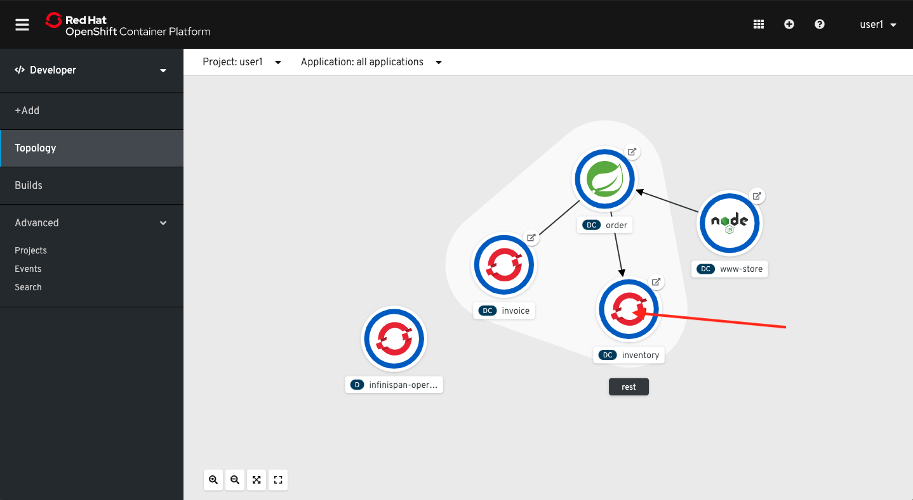
+
A side bar will open with an overview of your service resources.

. Click on the *Overview* tab to check the deployment generals. Then click in the _down_ arrow to scale down the deployment replicas to zero.
+
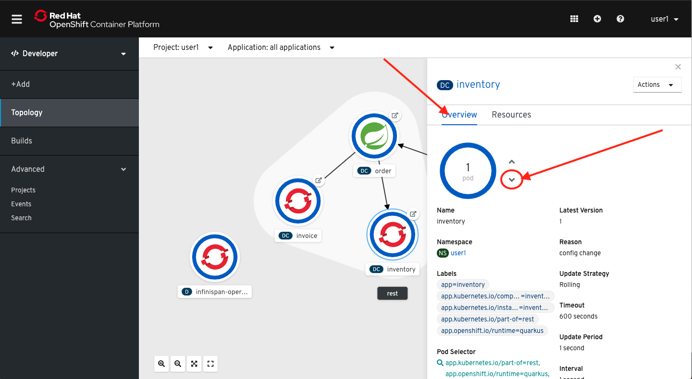
+
This will simulate the _outage_ of the inventory service. Wait a few seconds for the pod to be deleted.

. Check that the deployment ring is *white* instead of the normal _dark blue_
+
image::images/scaled-zero.png[Scaled To Zero, role="integr8ly-img-responsive"]

. Go back to the web application page and try again to order the *Mango* flavor. What happens?
+
--
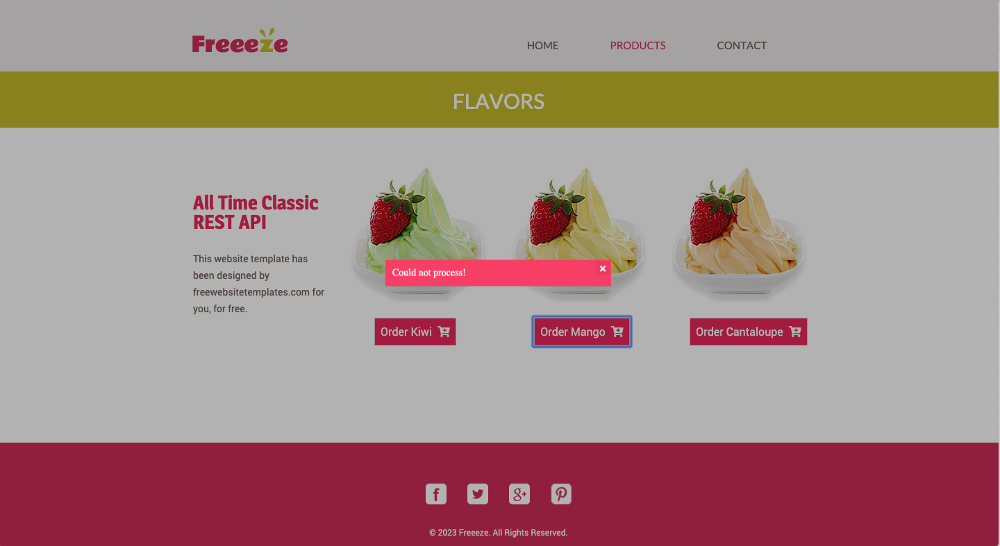

[NOTE]
====
The service was not able to fulfill the order because the inventory service was offline.  Instead, we  had to wait a little time to get the response back because of the set timeout.
====
--

. Dismiss the error dialog and go back to the OpenShift Developer Console link:{openshift-host}/topology/ns/{namespace}[Topology View, window="_blank"]

. Scale back up the service and wait for the pod to come up.
+
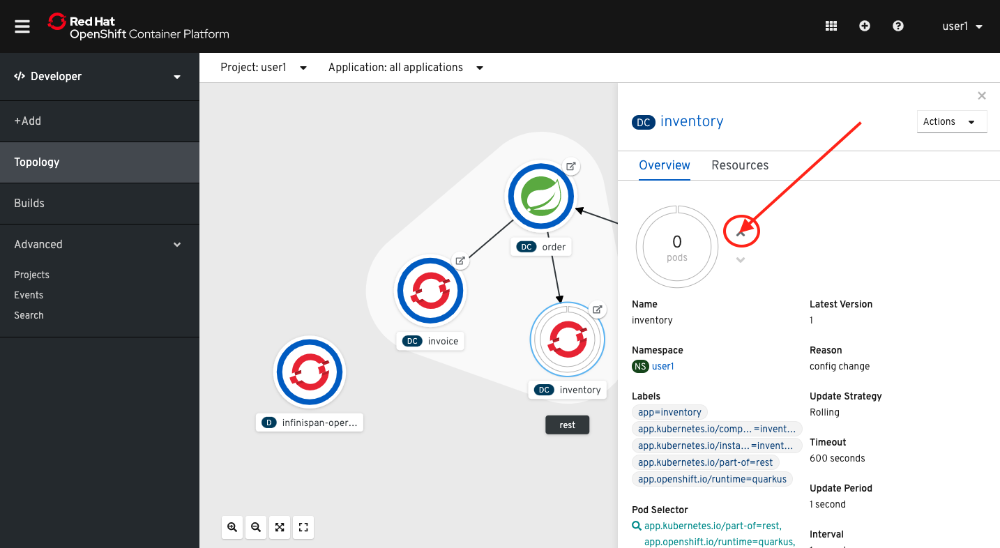

. Go back to the web application page and try *again*.
+
Your order should be back again!

[type=verification]
Were you able to successfully scale-down and scale-up your application?

[type=verificationFail]
Verify that you followed each step in the procedure above. If you are still having issues, contact your administrator.

[time=5]
[id="summary"]
== Summary
In this lab you used Code Ready Workspaces to access a container-native IDE for cloud native application development using Java with Quarkus. You take a first look on how to reuse your Java EE knowledge with a supersonic subatomic Java stack. Finally you were able to deploy your new and legacy applications as containers running on OpenShift using source-to-image (s2i) builds and the OpenShift CLI.

You can now proceed to link:{next-lab-url}[Lab 1].

[time=4]
[id="further-reading"]
== Notes and Further Reading

* https://developers.redhat.com/products/quarkus/overview[Quarkus Overview, window="_blank"]
* https://developers.redhat.com/courses/quarkus[Try Quarkus, window="_blank"]
* https://developers.redhat.com/products/codeready-workspaces/overview[Code Ready Workspaces, window="_blank"]
